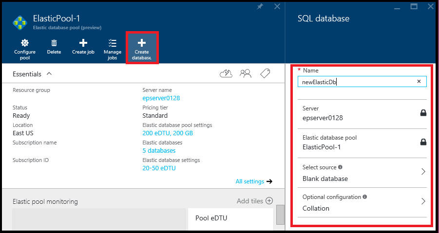

<properties
	pageTitle="Monitor, manage, and size an elastic database pool"
	description="Learn how to use the Azure portal and SQL Database's built-in intelligence to manage, monitor, and right-size a scalable elastic database pool to optimize database performance and manage cost."
	keywords=""
	services="sql-database"
	documentationCenter=""
	authors="sidneyh"
	manager="jhubbard"
	editor="cgronlun"/>

<tags
	ms.service="sql-database"
	ms.devlang="NA"
	ms.date="04/13/2016"
	ms.author="sidneyh"
	ms.workload="data-management"
	ms.topic="article"
	ms.tgt_pltfrm="NA"/>

# Monitor and manage an elastic database pool with the Azure portal

> [AZURE.SELECTOR]
- [Azure portal](sql-database-elastic-pool-manage-portal.md)
- [PowerShell](sql-database-elastic-pool-manage-powershell.md)
- [C#](sql-database-elastic-pool-manage-csharp.md)
- [T-SQL](sql-database-elastic-pool-manage-tsql.md)

This article describes how to use the Azure portal to monitor, manage, and right-size an elastic database pool and the databases in the pool. SQL Database has built-in intelligence that analyzes historical usage telemetry and proactively recommends a pool for databases when it's more cost-effective. You can also add and remove databases before you commit to changes and see the impact on pool performance and storage. 

To work through the steps in this article, you'll need databases and a pool. See [create a pool](sql-database-elastic-pool-create-portal.md) if you already have databases, and the [SQL database tutorial](sql-database-get-started) if you don't. 

## Choose a pool to work with

- In the [Azure portal](https://portal.azure.com) click **Browse**, click **SQL elastic pools**, and then click the pool you want to work with from the list.

## Create a new database in an elastic pool

In the blade for the pool, click **Create database**. In the **SQL database** blade, type a name and set the new database's properties. Then click **OK**.

   

## Move a database into an elastic pool

After you create a pool, you can add databases to the pool or remove them. You can only add databases on the same SQL server.

1. In the blade for the pool, under **Elastic databases** click **Configure pool**.

    ![Click Configure pool][1]

2. In the **Configure pool** blade, click **Add to pool**.

	
3. In the **Add databases** blade, select the database or databases to add to the pool. Then click **Select**.

	

    The **Configure pool** blade now lists the database you just added, with various propertiesand a **Pending** status.

    

3. Click **Save**.

## Move a database out of an elastic pool

1. In the **Configure pool** blade, select the database or databases to remove.

    

2. Click **Remove from pool**.

    

## Monitor resource utilization of a pool
After you select a pool to work with, under **Elastic Pool Monitoring**, a chart and live tiles show you important utilization information for your pool.

**To change the chart type (bar or line), resources shown, or time range:**

- Click **Edit**.

	

- In the **Edit Chart** blade, select the chart type (bar or line), resources, and time range. Click **custom** to set a different time range. Then click **OK**.

	

**To change the live tiles:**

- Click **Add tiles** and then select the tiles you want from the tile gallery that appears on the left.

##Add an alert to a pool resource
You can add rules to resources that send email to people or alert strings to URL endpoints when the resource hits a utilization threshold that you set up.

**To add an alert to any resource:**

1. Click the **Resource utilization** chart to open the **Metric** blade, click **Add alert**, and then fill out the information in the **Add an alert rule** blade (**Resource** is automatically set up to be the pool you're working with).
2. Type a **Name** and **Description** that identifies the alert to you and recipients.
3. Choose a **Metric** that you want to alert from the list.

    The chart dynamically shows resource utilization for that metric to help you choose a threshold.

4. Choose a **Condition** (greater than, less than, etc.) and a **Threshold**.
5. Click **OK**.

##Change eDTU per pool and database eDTU

When you see the resource utilization of a pool, you may discover that the pool needs a different eDTU setting, or individual databases in the pool need different eDTU settings. You can change the setup of the pool at any time to get the best balance of performance and cost. See [When should an elastic database pool be used?](sql-database-elastic-pool-guidance.md) for more information.

**To change the pool eDTU and eDTU per database:**

1. Open the **Configure pool** blade.

    Under **Elastic database pool settings**, use the sliders to change the pool settings.

    

2. With a different setting, and you'll see the estimated monthly cost of the change you want to make, and the chart updates to show the predicted utilization values with the new max eDTU you selected.

    

##Create and manage elastic jobs

Elastic jobs let you run Transact-SQL scripts against any number of databases in the pool. Before you use jobs, install elastic jobs components and provide your credentials. For more information, see [Elastic database jobs overview](sql-database-elastic-jobs-overview.md).

## Additional resources

- [SQL Database elastic pool](sql-database-elastic-pool.md)
- [Create an elastic database pool with the portal](sql-database-elastic-pool-create-csharp.md)
- [Create an elastic database pool with PowerShell](sql-database-elastic-pool-create-powershell.md)
- [Create an elastic database pool with C#](sql-database-elastic-pool-create-csharp.md)
- [Price and performance considerations for elastic database pools](sql-database-elastic-pool-guidance.md)

<!--Image references-->
[1]: ./media/sql-database-elastic-pool-manage-portal/configure-pool.png
