<properties
	pageTitle="Monitor and manage an elastic database pool with the Azure portal | Microsoft Azure"
	description="Learn how to use the Azure portal and SQL Database's built-in intelligence to manage, monitor, and right-size a scalable elastic database pool to optimize database performance and manage cost."
	keywords=""
	services="sql-database"
	documentationCenter=""
	authors="ninarn"
	manager="jhubbard"
	editor="cgronlun"/>

<tags
	ms.service="sql-database"
	ms.devlang="NA"
	ms.date="06/22/2016"
	ms.author="ninarn"
	ms.workload="data-management"
	ms.topic="article"
	ms.tgt_pltfrm="NA"/>

# Monitor and manage an elastic database pool with the Azure portal

> [AZURE.SELECTOR]
- [Azure portal](sql-database-elastic-pool-manage-portal.md)
- [PowerShell](sql-database-elastic-pool-manage-powershell.md)
- [C#](sql-database-elastic-pool-manage-csharp.md)
- [T-SQL](sql-database-elastic-pool-manage-tsql.md)

You can use the Azure portal to monitor and manage an elastic database pool and the databases in the pool. From the portal, you can monitor the utilization of an elastic pool and the databases within that pool. You can also make a set of changes to your elastic pool and submit all changes at the same time. These changes include adding or removing databases, changing your elastic pool settings, or changing your database settings.

The graphic below shows an example elastic pool. The view includes:

*  Charts for monitoring resource usage of both the elastic pool and the databases contained in the pool. 
*  The **Configure** pool button to make changes to the elastic pool. 
*  The **Create database** button which creates a new database and adds it to the current elastic pool.
*  Elastic jobs which help you manage large numbers of databases by running Transact SQL scripts against all databases in a list. 

![Pool view][2]

To work through the steps in this article, you'll need a SQL server in Azure with at least one database and an elastic pool. If you do not have an elastic pool, see [create a pool](sql-database-elastic-pool-create-portal.md); if you don't have a database, see the [SQL database tutorial](sql-database-get-started.md). 

## Elastic pool monitoring

You can go to a particular pool to see its resource utilization. By default, the pool is configured to show storage and eDTU usage for the last hour. The chart can be configured to show different metrics over various time windows.

1. Select a pool to work with.
2. Under **Elastic Pool Monitoring** is a chart  labeled **Resource utilization**. Click the chart.

	![Elastic pool monitoring][3]

	The **Metric** blade will open, showing a detailed view of the specified metrics over the specified time window.   

	![Metric blade][9]

### To customize the chart display

You can edit the chart and the metric blade to display other metrics such as CPU percentage, data IO percentage, and log IO percentage used. 
 
2. On the metric blade, click **Edit**.

	![Click edit][6]

- In the **Edit Chart** blade, select a new time range (past hour, today, or past week), or click **custom** to select any date range in the last two weeks. Select the chart type (bar or line), then select the resources to monitor. 

	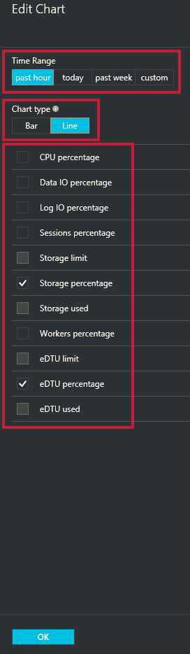

- Then click **OK**.

## Elastic database monitoring

Individual databases can also be monitored for potential trouble. 

1. Under **Elastic Database Monitoring**, there is a chart that displays metrics for five databases. By default, the chart displays the top 5 databases in the pool by average eDTU usage in the past hour. Click the chart.

	![Elastic pool monitoring][4]

2. The **Database Resource Utilization** blade appears. This provides a detailed view of the database usage in the pool. Using the grid in the lower part of the blade, you can select any database(s) in the pool to display its usage in the chart (up to 5 databases). You can also customize the metrics and time window displayed in the chart by clicking **Edit chart**.

	![Database resource utilization blade][8]

### To customize the view

1. In the **Database resource utilization** blade, click **Edit chart**.

	

2. In the **Edit** chart blade, select a new time range (past hour or past 24 hours), or click **custom** to select a different day in the past 2 weeks to display.

	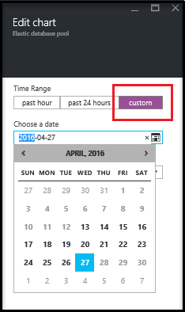

3. Click the **Compare databases by** dropdown to select a different metric to use when comparing databases.

	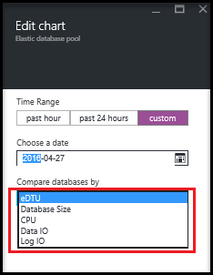

### To select databases to monitor

In the database list in the **Database Resource Utilization** blade, you can find particular databases by looking through the pages in the list or by typing in the name of a database. Use the checkbox to select the database.

![Search for databases to monitor][7]
  

## Add an alert to a pool resource

You can add rules to resources that send email to people or alert strings to URL endpoints when the resource hits a utilization threshold that you set up.

> [AZURE.IMPORTANT]Resource utilization monitoring for Elastic Pools has a lag of at least 20 minutes. Setting alerts of less than 30 minutes for Elastic Pools is not currently supported. Any alerts set for Elastic Pools with a period (parameter called “-WindowSize” in PowerShell API) of less than 30 minutes may not be triggered. Please make sure that any alerts you define for Elastic Pools use a period (WindowSize) of 30 minutes or more.

**To add an alert to any resource:**

1. Click the **Resource utilization** chart to open the **Metric** blade, click **Add alert**, and then fill out the information in the **Add an alert rule** blade (**Resource** is automatically set up to be the pool you're working with).
2. Type a **Name** and **Description** that identifies the alert to you and the recipients.
3. Choose a **Metric** that you want to alert from the list.

    The chart dynamically shows resource utilization for that metric to help you choose a threshold.

4. Choose a **Condition** (greater than, less than, etc.) and a **Threshold**.
5. Click **OK**.

## Move a database into an elastic pool

You can add or remove databases from an existing pool. The databases can be in other pools. However, you can only add databases that are on the same logical server.

1. In the blade for the pool, under **Elastic databases** click **Configure pool**.

    ![Click Configure pool][1]

2. In the **Configure pool** blade, click **Add to pool**.

	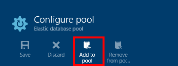

	
3. In the **Add databases** blade, select the database or databases to add to the pool. Then click **Select**.

	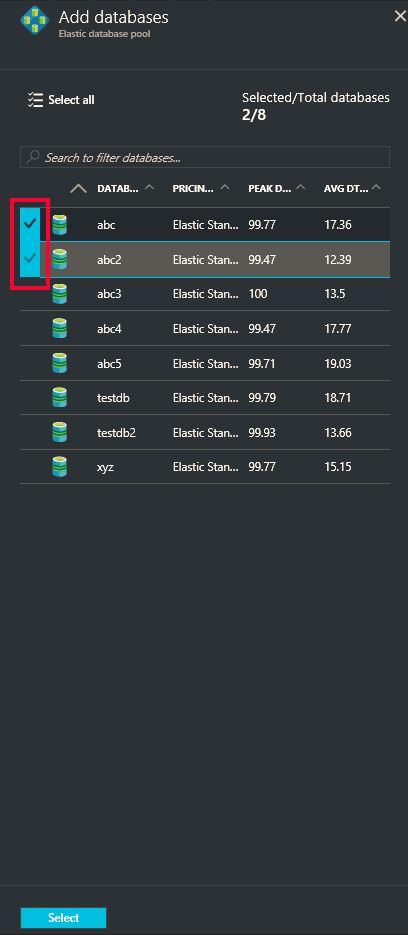

    The **Configure pool** blade now lists the database you selected to be added, with its status set to **Pending**.

    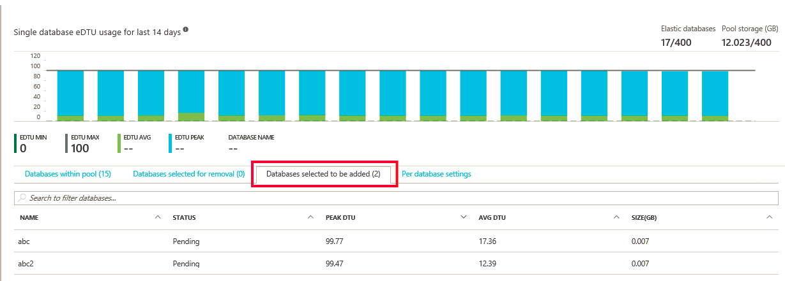

3. In the **Configure pool blade**, click **Save**.

    

## Move a database out of an elastic pool

1. In the **Configure pool** blade, select the database or databases to remove.

    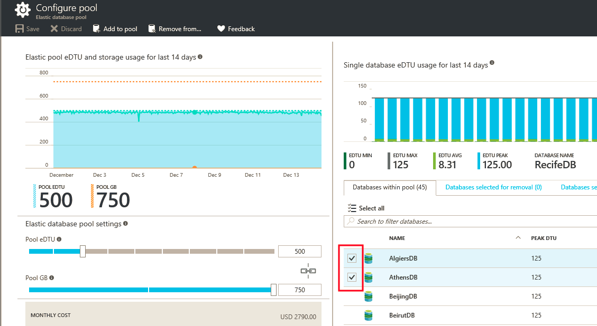

2. Click **Remove from pool**.

    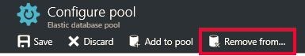

    The **Configure pool** blade now lists the database you selected to be removed with its status set to **Pending**.
    
    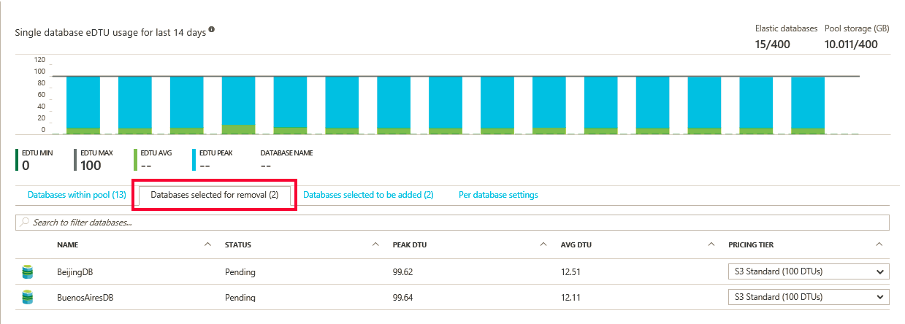

3. In the **Configure pool blade**, click **Save**.

    

## Change performance settings of a pool

As you monitor the resource utilization of a pool, you may discover that some adjustments are needed. Maybe the pool needs a change in the performance or storage limits. Possibly you want to change the database settings in the pool. You can change the setup of the pool at any time to get the best balance of performance and cost. See [When should an elastic database pool be used?](sql-database-elastic-pool-guidance.md) for more information.

**To change the eDTUs or storage limits per pool, and eDTUs per database:**

1. Open the **Configure pool** blade.

    Under **Elastic database pool settings**, use either slider to change the pool settings.

    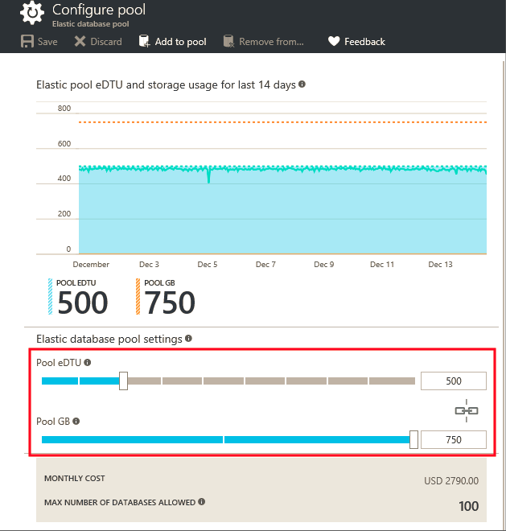

2. When the setting changes, the display shows the estimated monthly cost of the change.

    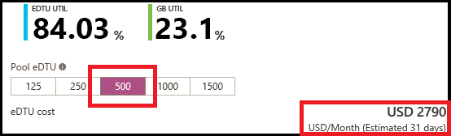

## Create and manage elastic jobs

Elastic jobs let you run Transact-SQL scripts against any number of databases in the pool. You can create new jobs, or manage existing jobs using the portal.

![Create and manage elastic jobs][5]

Before you use jobs, install elastic jobs components and provide your credentials. For more information, see [Elastic database jobs overview](sql-database-elastic-jobs-overview.md).

See [Scaling out with Azure SQL Database](sql-database-elastic-scale-introduction.md): use elastic database tools to scale-out, move data, query, or create transactions.

## Additional resources

- [SQL Database elastic pool](sql-database-elastic-pool.md)
- [Create an elastic database pool with the portal](sql-database-elastic-pool-create-csharp.md)
- [Create an elastic database pool with PowerShell](sql-database-elastic-pool-create-powershell.md)
- [Create an elastic database pool with C#](sql-database-elastic-pool-create-csharp.md)
- [Price and performance considerations for elastic database pools](sql-database-elastic-pool-guidance.md)

<!--Image references-->
[1]: ./media/sql-database-elastic-pool-manage-portal/configure-pool.png
[2]: ./media/sql-database-elastic-pool-manage-portal/basic.png
[3]: ./media/sql-database-elastic-pool-manage-portal/basic-2.png
[4]: ./media/sql-database-elastic-pool-manage-portal/basic-3.png
[5]: ./media/sql-database-elastic-pool-manage-portal/elastic-jobs.png
[6]: ./media/sql-database-elastic-pool-manage-portal/edit-metric.png
[7]: ./media/sql-database-elastic-pool-manage-portal/select-dbs.png
[8]: ./media/sql-database-elastic-pool-manage-portal/db-utilization.png
[9]: ./media/sql-database-elastic-pool-manage-portal/metric.png