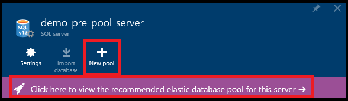
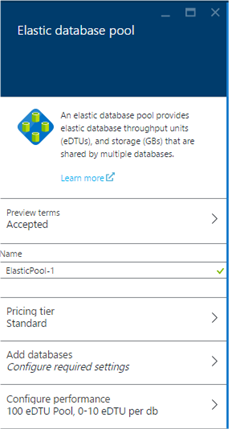
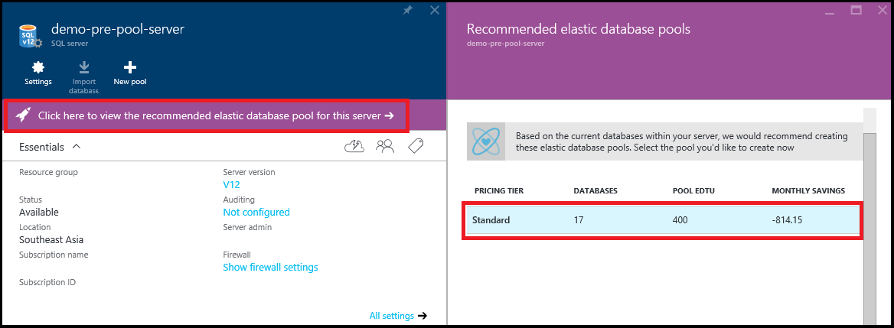
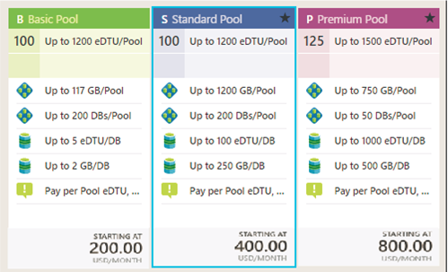
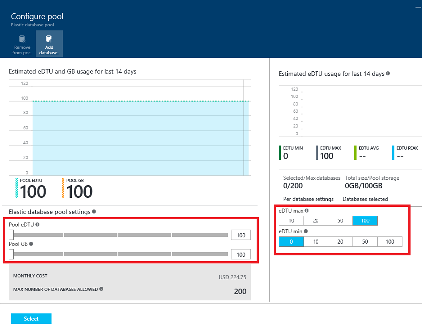
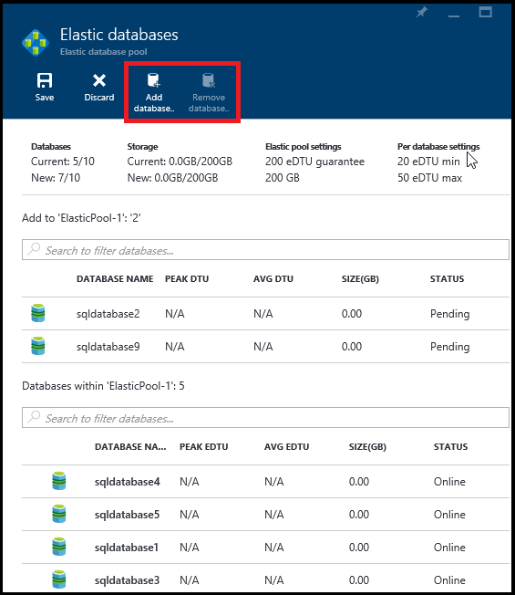
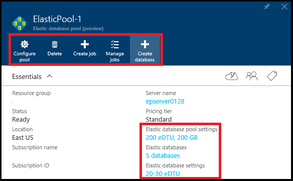

<properties
	pageTitle="Create scalable elastic database pools | Microsoft Azure"
	description="How to add an scalable elastic database pool to your SQL database configuration for easier administration and resource sharing across many databases."
	keywords="scalable database,database configuration"
	services="sql-database"
	documentationCenter=""
	authors="sidneyh"
	manager="jhubbard"
	editor=""/>

<tags
	ms.service="sql-database"
	ms.devlang="NA"
	ms.date="02/12/2016"
	ms.author="sidneyh"
	ms.workload="data-management"
	ms.topic="get-started-article"
	ms.tgt_pltfrm="NA"/>

# Create a scalable elastic database pool for SQL databases in Azure portal

> [AZURE.SELECTOR]
- [Azure portal](sql-database-elastic-pool-portal.md)
- [C#](sql-database-elastic-pool-csharp.md)
- [PowerShell](sql-database-elastic-pool-powershell.md)

This article shows you how to create a scalable [elastic database pool](sql-database-elastic-pool.md) using the Azure portal. A SQL Database configuration with elastic database pools simplifies administration and resource sharing across multiple databases.

> [AZURE.NOTE] Elastic database pools are currently in preview and only available with SQL Database V12 servers. If you have a SQL Database V11 server you can [use PowerShell to upgrade to V12 and create a pool](sql-database-upgrade-server-powershell.md) in one step.

## Prerequisites

* A database on a SQL Database V12 server. If you don't have one, see [Create your first Azure SQL Database](sql-database-get-started.md) to create one in under five minutes. 
* Or if you already have a SQL Database V11 server you can [upgrade to V12 in the portal](sql-database-v12-plan-prepare-upgrade.md) and then come back and follow these directions to create a pool.

## Step 1: create a new pool

Create an elastic database pool by adding a new pool to a server. You can add multiple pools to a server, but you can't add databases from different servers into the same pool.

1. In the [Azure portal](http://portal.azure.com/) click **SQL servers**.
2. Select the server that contains the databases you want to add to the pool.
3. Click **New pool** (or if you see a message saying there is a recommended pool, click it to easily review and create a pool optimized for your server's databases. More details on recommendations are available below.

    

4. On the **Elastic database pool** blade you can leave the default name or type a name for the new pool.

    

### Recommended elastic database pools

Browse to a SQL Database server and you may see a message saying there are recommended elastic database pools for the server (V12 only).

### Why am I getting a recommendation?

The SQL Database service evaluates usage history and recommends one or more elastic database pools when it is more cost effective than using single databases.

Each recommendation is configured with a unique subset of the server's databases that best fit into the pool.

Each pool recommendation contains the following:

- Pricing tier for the pool (Basic, Standard, or Premium).
- Appropriate amount of pool eDTUs.
- The elastic database min/max eDTU settings.
- List of recommended databases.

The service takes the last 30 days of telemetry into account when recommending elastic database pools. For a database to be considered as a candidate for an elastic database pool it must exist for at least 7 days. Databases that are already in an elastic database pool are not considered as candidates for elastic database pool recommendations.

The service evaluates resource needs and cost effectiveness of moving the single databases in each service tier into elastic database pools of the same tier. For example, all Standard databases on a server are assessed for their fit into a Standard Elastic Pool. This means the service does not make cross-tier recommendations such as moving a Standard database into a Premium pool.

### Create a recommended pool

1. Click the message to see a list of the recommended pools.
1. Click a pool to see the detailed recommendation.
2. Review all settings in the recommendation and accept it as is, or edit the recommendation to suit your specific business needs.

## Step 2: choose a pricing tier

The pool's pricing tier determines the features available to the elastic databases in the pool, and the maximum number of eDTUs (eDTU MAX), and storage (GBs) available to each database. For details, see [Service Tiers](sql-database-service-tiers.md#Service-tiers-for-elastic-database-pools).

>[AZURE.NOTE] Currently in the preview, you cannot change the pricing tier of an elastic database pool after it is created. To change the pricing tier for an existing elastic pool create a new elastic pool in the desired pricing tier and migrate the elastic databases to this new pool.

   

### Configure the pool

After setting the pricing tier, click Configure pool where you add databases, set pool eDTUs and storage (pool GBs), and where you set the min and max eDTUs for the elastic databases in the pool.

## Step 3: add databases to the pool

You can add or remove databases to a pool at any time. 

1. During pool creation, click **Add databases** on the **Configure pool** blade.
2. Select the databases you want to add to the pool:

    

    When you select a database to be added to a pool, the following conditions must be met:

    - The pool must have room for the database (cannot already contain the maximum number of databases). More specifically, the pool must have enough available eDTUs to cover the eDTU guarantee per database (for example, if the eDTU guarantee for the group is 400, and the eDTU guarantee for each database is 10, then the maximum number of databases that are allowed in the pool is 40 (400 eDTUs/10 eDTUs guaranteed per DB = 40 Max databases).
    - The current features used by the database must be available in the pool.

### Dynamic recommendations

After adding databases to the pool, recommendations will be dynamically generated based on the historical usage of the databases you have selected. These recommendations will be shown in the eDTU and GB usage chart as well as in a recommendation banner at the top of the **Configure pool** blade. These recommendations are intended to assist you in creating a pool optimized for your specific databases.

 

## Step 4: setting performance characteristics of the pool

You configure the performance of the pool by setting the performance parameters for both the pool and the elastic databases in the pool. Keep in mind that the **Elastic database settings** apply to all databases in the pool.

 

There are three parameters you can set that define the performance for the pool: the eDTU Guarantee for the pool, and the eDTU MIN and eDTU MAX for elastic databases in the pool. The following table describes each, and provides some guidance for how to set them. For specific available value settings , see [elastic database pool reference](sql-database-elastic-pool-reference.md).

| Performance parameter | Description |
| :--- | :--- |
| **POOL eDTU** - eDTU guarantee for the pool | The eDTU guarantee for the pool is the guaranteed number of eDTUs available and shared by all databases in the pool.   The specific size of the eDTU guarantee for a group should be provisioned by considering the historical eDTU utilization of the group.  Alternatively, this size can be set by the desired eDTU guarantee per database and utilization of concurrently active databases. The eDTU guarantee for the pool also correlates to the amount of storage available for the pool, for every eDTU that you allocate to the pool, you get a fixed amount of database storage.   **What should I set the eDTU guarantee of the pool to?**  At minimum, you should set the eDTU guarantee of the pool to ([# of databases] x [average DTU utilization per database]). |
| **eDTU MIN** - eDTU guarantee for each database | The eDTU guarantee per database is the number of eDTUs that a single database in the pool is guaranteed.   **What should I set the eDTU guarantee per database?**   Typically, the eDTU guarantee per database (eDTU MIN) is set to anywhere between 0 and the ([average utilization per database]). The eDTU guarantee per database is a global setting that sets the eDTU guarantee for all databases in the pool. |
| **eDTU MAX** - eDTU cap per database | The eDTU MAX per database is the maximum number of eDTUs that a single database in the pool may use. Set the eDTU cap per database high enough to handle max bursts or spikes that your databases may experience. You can set this cap up to the system limit, which depends on the pricing tier of the pool (1000 eDTUs for Premium). The specific size of this cap should accommodate peak utilization patterns of databases within the group.  Some degree of overcommitting the group is expected since the pool generally assumes hot and cold usage patterns for databases where all databases are not simultaneously peaking.  **What should I set the eDTU cap per database to?**   Set the eDTU MAX or eDTU cap per database, to ([database peak utilization]). For example, suppose the peak utilization per database is 50 DTUs and only 20% of the 100 databases in the group simultaneously spike to the peak.  If the eDTU cap per database is set to 50 eDTUs, then it is reasonable to overcommit the pool by 5x and set the eDTU guarantee for the group (POOL eDTU) to 1,000 eDTUs. Also worth noting, is that the eDTU cap is not a resource guarantee for a database, it is a eDTU ceiling that can be hit if available. |

## Add and remove databases to and from a pool

After the pool is created, you can add or remove existing databases in and out of the pool by adding or removing databases on the **Elastic databases** page (browse to your pool and click the **Elastic databases** link in **Essentials**).

- Click **Add databases** to open the list of databases you can add to the pool.

    -or-

- Select the databases you want to remove from the pool and click **Remove databases**.

## Create a new database in a pool

Create a new database in a pool by browsing to the desired pool and clicking **Create database**.

The SQL database is already configured for the correct server and pool so enter a name and select your database options, then click **OK** to create the new database:

   

## Monitor and manage an elastic database pool

After creating an elastic database pool, you can monitor and manage the pool in the portal by browsing to the list of existing pools and selecting the desired pool.

After creating a pool, you can:

- Select **Configure pool** to change the pool eDTU and eDTU per database settings.
- Select **Create job** and manage the databases in the pool by creating elastic jobs. Elastic jobs let you run Transact-SQL scripts against any number of databases in the pool. For more information, see [Elastic database jobs overview](sql-database-elastic-jobs-overview.md).
- Select **Manage jobs** to administer existing elastic jobs.
- Click **Create database** to create a new database in the pool.
- Click the pool settings link to adjust pool eDTUs and GB per pool
- Click the databases link to add or remove databases to the pool.
- Click the database settings link to adjust the min and max eDTUs for the elastic databases in the pool. 

When you select an existing pool you can see resource utilization of the pool. Click the **Resource Utilization** chart to open the **Metric** blade where you can customize the chart and setup alerts.

![Monitor elastic pool][4]
![resource utilization][6]

Click **Edit chart** to add parameters so you can easily view telemetry data for the pool.

![edit chart][7]

## Next steps
After creating an elastic database pool, you can manage the databases in the pool by creating elastic jobs. Elastic jobs facilitate running Transact-SQL scripts against any number of databases in the pool. For more information, see [Elastic database jobs overview](sql-database-elastic-jobs-overview.md).

## Additional resources

- [SQL Database elastic pool](sql-database-elastic-pool.md)
- [Create a SQL Database elastic pool with PowerShell](sql-database-elastic-pool-powershell.md)
- [Create and manage SQL Database with C#](sql-database-client-library.md)
- [Elastic database reference](sql-database-elastic-pool-reference.md)

<!--Image references-->
[4]: ./media/sql-database-elastic-pool-portal/monitor-elastic-pool.png
[6]: ./media/sql-database-elastic-pool-portal/metric.png
[7]: ./media/sql-database-elastic-pool-portal/edit-chart.png
[10]: ./media/sql-database-elastic-pool-portal/star.png

