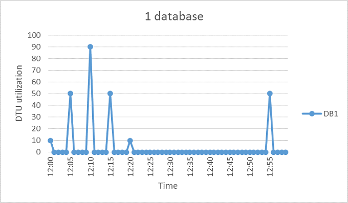
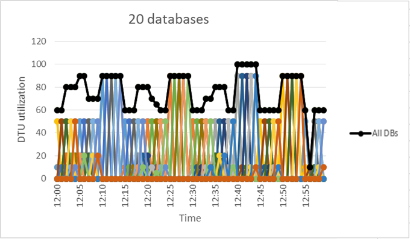

# Elastic pools help you manage and scale multiple SQL databases

SQL Database elastic pools are a simple, cost-effective solution for managing and scaling multiple databases that have varying and unpredictable usage demands. The databases in an elastic pool are on a single Azure SQL Database server and share a set number of resources ([elastic Database Transaction Units](sql-database-what-is-a-dtu.md) (eDTUs)) at a set price. Elastic pools in Azure SQL Database enable SaaS developers to optimize the price performance for a group of databases within a prescribed budget while delivering performance elasticity for each database.   

> [!NOTE]
> Elastic pools are generally available (GA) in all Azure regions except West India where it is currently in preview.  GA of elastic pools in this region will occur as soon as possible.
>

## Overview of elastic pools 

SaaS developers build applications on top of large scale data-tiers consisting of multiple databases. A common application pattern is to provision a single database for each customer. But different customers often have varying and unpredictable usage patterns, and it is difficult to predict the resource requirements of each individual database user. Traditionally, you had two options: 

- Over-provision resources based on peak usage and over pay, or
- Under-provision to save cost, at the expense of performance and customer satisfaction during peaks. 

Elastic pools solve this problem by ensuring that databases get the performance resources they need when they need it. They provide a simple resource allocation mechanism within a predictable budget. To learn more about design patterns for SaaS applications using elastic pools, see [Design Patterns for Multi-tenant SaaS Applications with Azure SQL Database](sql-database-design-patterns-multi-tenancy-saas-applications.md).

> [!VIDEO https://channel9.msdn.com/Blogs/Azure/Elastic-databases-helps-SaaS-developers-tame-explosive-growth/player]
>

Elastic pools enable the developer to purchase [elastic Database Transaction Units](sql-database-what-is-a-dtu.md) (eDTUs) for a pool shared by multiple databases to accommodate unpredictable periods of usage by individual databases. The eDTU requirement for a pool is determined by the aggregate utilization of its databases. The number of eDTUs available to the pool is controlled by the developer budget. The developer simply adds databases to the pool, sets the minimum and maximum eDTUs for the databases, and then sets the eDTU of the pool based on their budget. A developer can use pools to seamlessly grow their service from a lean startup to a mature business at ever-increasing scale.

Within the pool, individual databases are given the flexibility to auto-scale within set parameters. Under heavy load, a database can consume more eDTUs to meet demand. Databases under light loads consume less, and databases under no load consume no eDTUs. Provisioning resources for the entire pool rather than for single databases simplifies your management tasks. Plus you have a predictable budget for the pool. Additional eDTUs can be added to an existing pool with no database downtime, except that the databases may need to be moved to provide the additional compute resources for the new eDTU reservation. Similarly, if extra eDTUs are no longer needed they can be removed from an existing pool at any point in time. And you can add or subtract databases to the pool. If a database is predictably under-utilizing resources, move it out.

You can create and manage an elastic pool using the [Azure portal](sql-database-elastic-pool-manage-portal.md), [PowerShell](sql-database-elastic-pool-manage-powershell.md), [Transact-SQL](sql-database-elastic-pool-manage-tsql.md), [C#](sql-database-elastic-pool-manage-csharp.md), and the REST API. 

## When to consider a pool
Pools are well suited for a large number of databases with specific utilization patterns. For a given database, this pattern is characterized by low average utilization with relatively infrequent utilization spikes.

The more databases you can add to a pool the greater your savings become. Depending on your application utilization pattern, it is possible to see savings with as few as two S3 databases.  

The following sections help you understand how to assess if your specific collection of databases can benefit from being in a pool. The examples use Standard pools but the same principles also apply to Basic and Premium pools.

### Assessing database utilization patterns
The following figure shows an example of a database that spends much time idle, but also periodically spikes with activity. This is a utilization pattern that is suited for a pool:

   

For the five-minute period illustrated, DB1 peaks up to 90 DTUs, but its overall average usage is less than five DTUs. An S3 performance level is required to run this workload in a single database, but this leaves most of the resources unused during periods of low activity.

A pool allows these unused DTUs to be shared across multiple databases, and so reduces the DTUs needed and overall cost.

Building on the previous example, suppose there are additional databases with similar utilization patterns as DB1. In the next two figures below, the utilization of four databases and 20 databases are layered onto the same graph to illustrate the non-overlapping nature of their utilization over time:

   

  

The aggregate DTU utilization across all 20 databases is illustrated by the black line in the preceding figure. This shows that the aggregate DTU utilization never exceeds 100 DTUs, and indicates that the 20 databases can share 100 eDTUs over this time period. This results in a 20x reduction in DTUs and a 13x price reduction compared to placing each of the databases in S3 performance levels for single databases.

This example is ideal for the following reasons:

* There are large differences between peak utilization and average utilization per database.  
* The peak utilization for each database occurs at different points in time.
* eDTUs are shared between many databases.

The price of a pool is a function of the pool eDTUs. While the eDTU unit price for a pool is 1.5x greater than the DTU unit price for a single database, **pool eDTUs can be shared by many databases and fewer total eDTUs are needed**. These distinctions in pricing and eDTU sharing are the basis of the price savings potential that pools can provide.  

The following rules of thumb related to database count and database utilization help to ensure that a pool delivers reduced cost compared to using performance levels for single databases.

### Minimum number of databases
If the sum of the DTUs of performance levels for single databases is more than 1.5x the eDTUs needed for the pool, then an elastic pool is more cost effective. For available sizes, see [eDTU and storage limits for elastic pools and elastic databases](sql-database-elastic-pool.md#edtu-and-storage-limits-for-elastic-pools).

***Example*** 
At least two S3 databases or at least 15 S0 databases are needed for a 100 eDTU pool to be more cost-effective than using performance levels for single databases.

### Maximum number of concurrently peaking databases
By sharing eDTUs, not all databases in a pool can simultaneously use eDTUs up to the limit available when using performance levels for single databases. The fewer databases that concurrently peak, the lower the pool eDTU can be set and the more cost-effective the pool becomes. In general, not more than 2/3 (or 67%) of the databases in the pool should simultaneously peak to their eDTU limit.

***Example*** 
To reduce costs for three S3 databases in a 200 eDTU pool, at most two of these databases can simultaneously peak in their utilization. Otherwise, if more than two of these four S3 databases simultaneously peak, the pool would have to be sized to more than 200 eDTUs. If the pool is resized to more than 200 eDTUs, more S3 databases would need to be added to the pool to keep costs lower than performance levels for single databases.

Note this example does not consider utilization of other databases in the pool. If all databases have some utilization at any given point in time, then less than 2/3 (or 67%) of the databases can peak simultaneously.

### DTU utilization per database
A large difference between the peak and average utilization of a database indicates prolonged periods of low utilization and short periods of high utilization. This utilization pattern is ideal for sharing resources across databases. A database should be considered for a pool when its peak utilization is about 1.5 times greater than its average utilization.

***Example*** 
An S3 database that peaks to 100 DTUs and on average uses 67 DTUs or less is a good candidate for sharing eDTUs in a pool. Alternatively, an S1 database that peaks to 20 DTUs and on average uses 13 DTUs or less is a good candidate for a pool.

## Sizing an elastic pool
The best size for a pool depends on the aggregate eDTUs and storage resources needed for all databases in the pool. This involves determining the larger of the following:

* Maximum DTUs utilized by all databases in the pool.
* Maximum storage bytes utilized by all databases in the pool.

For available sizes, see [eDTU and storage limits for elastic pools and elastic databases](sql-database-elastic-pool.md#edtu-and-storage-limits-for-elastic-pools).

SQL Database automatically evaluates the historical resource usage of databases in an existing SQL Database server and recommends the appropriate pool configuration in the Azure portal. In addition to the recommendations, a built-in experience estimates the eDTU usage for a custom group of databases on the server. This enables you to do a "what-if" analysis by interactively adding databases to the pool and removing them to get resource usage analysis and sizing advice before committing your changes. For a how-to, see [Monitor, manage, and size an elastic pool](sql-database-elastic-pool-manage-portal.md).

In cases where you can't use tooling, the following step-by-step can help you estimate whether a pool is more cost-effective than single databases:

1. Estimate the eDTUs needed for the pool as follows:

   MAX(<*Total number of DBs* X *average DTU utilization per DB*>, 
   <*Number of concurrently peaking DBs* X *Peak DTU utilization per DB*)
2. Estimate the storage space needed for the pool by adding the number of bytes needed for all the databases in the pool. Then determine the eDTU pool size that provides this amount of storage. For pool storage limits based on eDTU pool size, see [eDTU and storage limits for elastic pools and elastic databases](sql-database-elastic-pool.md#edtu-and-storage-limits-for-elastic-pools).
3. Take the larger of the eDTU estimates from Step 1 and Step 2.
4. See the [SQL Database pricing page](https://azure.microsoft.com/pricing/details/sql-database/) and find the smallest eDTU pool size that is greater than the estimate from Step 3.
5. Compare the pool price from Step 5 to the price of using the appropriate performance levels for single databases.

## eDTU and storage limits for elastic pools

The following tables describe the resource limits of elastic pools.  Note that the resource limits of individual databases in elastic pools are generally the same as for single databases outside of pools based on DTUs and the service tier.  For example, the max concurrent workers for an S2 database is 120 workers.  So, the max concurrent workers for a database in a Standard pool is also 120 workers if the max DTU per database in the pool is 50 DTUs (which is equivalent to S2).

[!INCLUDE [SQL DB service tiers table for elastic pools](../../includes/sql-database-service-tiers-table-elastic-pools.md)]

If all DTUs of an elastic pool are used, then each database in the pool receives an equal amount of resources to process queries.  The SQL Database service provides resource sharing fairness between databases by ensuring equal slices of compute time. Elastic pool resource sharing fairness is in addition to any amount of resource otherwise guaranteed to each database when the DTU min per database is set to a non-zero value.

## Database properties for pooled databases

The following table describes the properties for pooled databases.

| Property | Description |
|:--- |:--- |
| Max eDTUs per database |The maximum number of eDTUs that any database in the pool may use, if available based on utilization by other databases in the pool.  Max eDTU per database is not a resource guarantee for a database.  This setting is a global setting that applies to all databases in the pool. Set max eDTUs per database high enough to handle peaks in database utilization. Some degree of overcommitting is expected since the pool generally assumes hot and cold usage patterns for databases where all databases are not simultaneously peaking. For example, suppose the peak utilization per database is 20 eDTUs and only 20% of the 100 databases in the pool are peak at the same time.  If the eDTU max per database is set to 20 eDTUs, then it is reasonable to overcommit the pool by 5 times, and set the eDTUs per pool to 400. |
| Min eDTUs per database |The minimum number of eDTUs that any database in the pool is guaranteed.  This setting is a global setting that applies to all databases in the pool. The min eDTU per database may be set to 0, and is also the default value. This property is set to anywhere between 0 and the average eDTU utilization per database. The product of the number of databases in the pool and the min eDTUs per database cannot exceed the eDTUs per pool.  For example, if a pool has 20 databases and the eDTU min per database set to 10 eDTUs, then the eDTUs per pool must be at least as large as 200 eDTUs. |
| Max data storage per database |The maximum storage for a database in a pool. Pooled databases share pool storage, so database storage is limited to the smaller of remaining pool storage and max storage per database. Max storage per database refers to the maximum size of the data files and does not include the space used by log files. |
|||

## Elastic jobs
With a pool, management tasks are simplified by running scripts in **[elastic jobs](sql-database-elastic-jobs-overview.md)**. An elastic job eliminates most of tedium associated with large numbers of databases. To begin, see [Getting started with Elastic jobs](sql-database-elastic-jobs-getting-started.md).

For more information about other database tools for working with multiple databases, see [Scaling out with Azure SQL Database](sql-database-elastic-scale-introduction.md).

## Business continuity features for databases in a pool
Pooled databases generally support the same [business continuity features](sql-database-business-continuity.md) that are available to single databases.

### Point in time restore
Point-in-time-restore uses automatic database backups to recover a database in a pool to a specific point in time. See [Point-In-Time Restore](sql-database-recovery-using-backups.md#point-in-time-restore)

### Geo-restore
Geo-restore provides the default recovery option when a database is unavailable because of an incident in the region where the database is hosted. See [Restore an Azure SQL Database or failover to a secondary](sql-database-disaster-recovery.md)

### Active geo-replication
For applications that have more aggressive recovery requirements than geo-restore can offer, configure [active geo-replication](sql-database-geo-replication-overview.md).

## Next steps

* You can create and manage an elastic pool using the [Azure portal](sql-database-elastic-pool-manage-portal.md), [PowerShell](sql-database-elastic-pool-manage-powershell.md), [Transact-SQL](sql-database-elastic-pool-manage-tsql.md), [C#](sql-database-elastic-pool-manage-csharp.md), and the REST API.
* For a video, see [Microsoft Virtual Academy video course on Azure SQL Database elastic capabilities](https://mva.microsoft.com/training-courses/elastic-database-capabilities-with-azure-sql-db-16554)
* To learn more about design patterns for SaaS applications using elastic pools, see [Design Patterns for Multi-tenant SaaS Applications with Azure SQL Database](sql-database-design-patterns-multi-tenancy-saas-applications.md).
