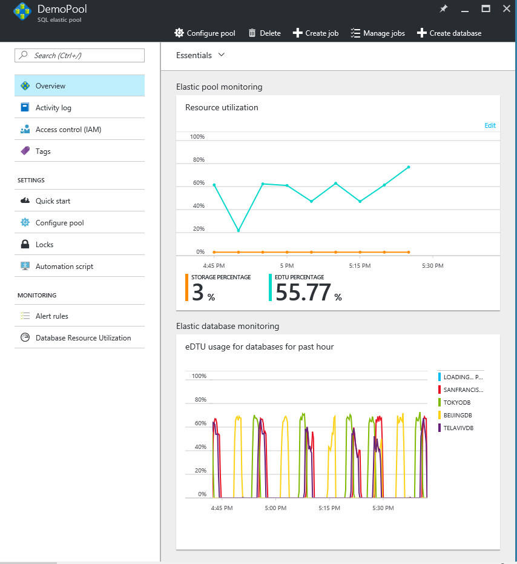
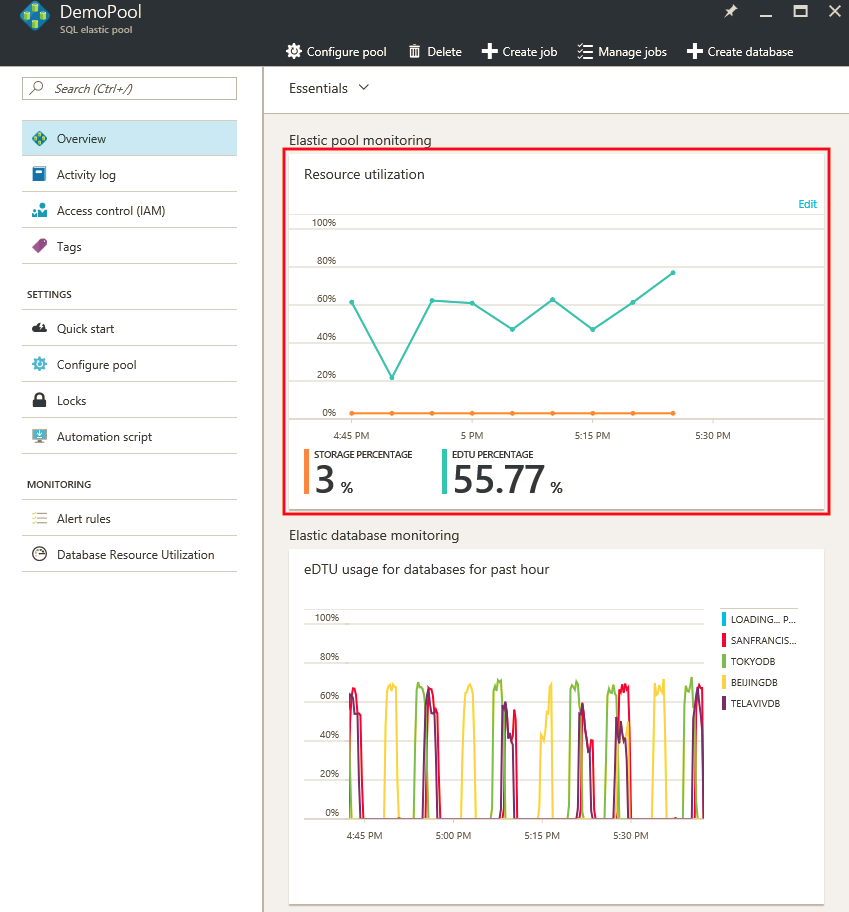
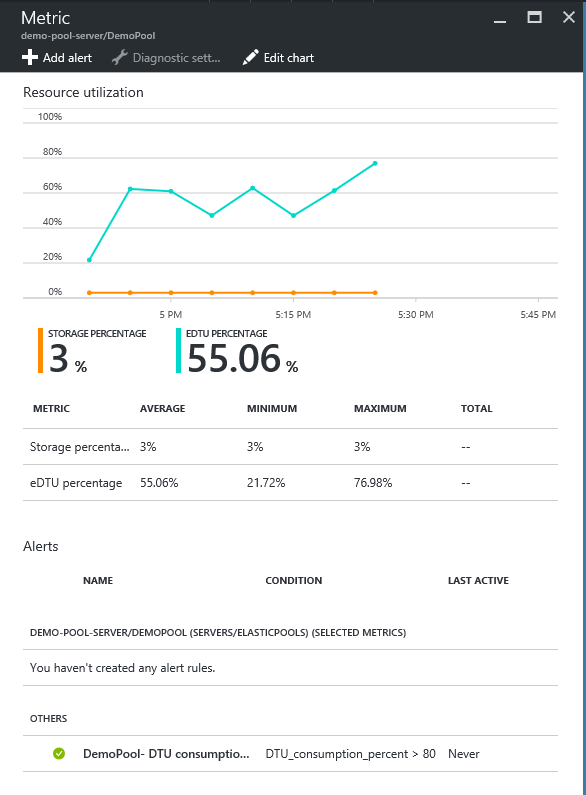
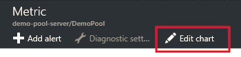
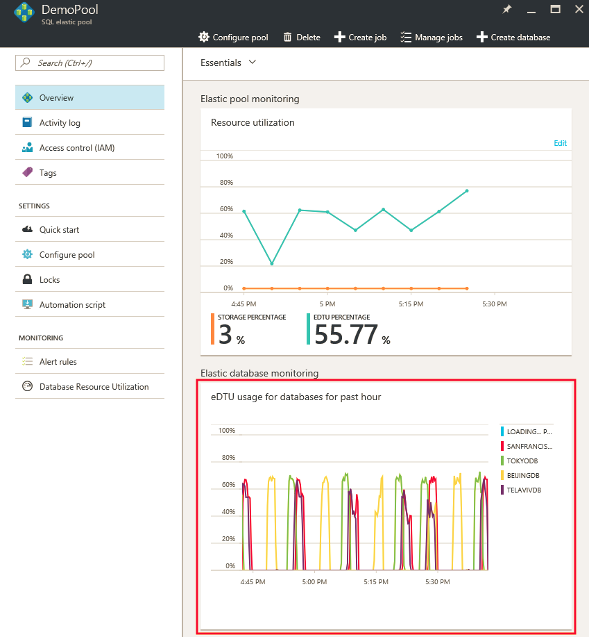
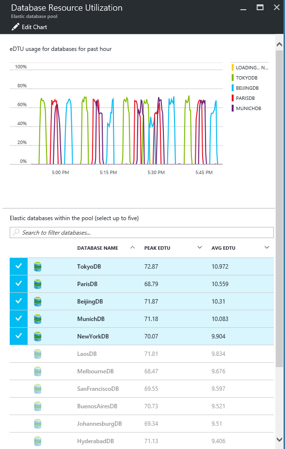
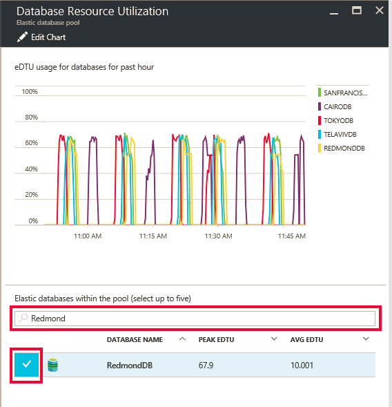

# Elastic pools help you manage and scale multiple Azure SQL databases

SQL Database elastic pools are a simple, cost-effective solution for managing and scaling multiple databases that have varying and unpredictable usage demands. The databases in an elastic pool are on a single Azure SQL Database server and share a set number of resources ([elastic Database Transaction Units](sql-database-what-is-a-dtu.md) (eDTUs)) at a set price. Elastic pools in Azure SQL Database enable SaaS developers to optimize the price performance for a group of databases within a prescribed budget while delivering performance elasticity for each database. 

> [!NOTE]
> Elastic pools are generally available (GA) in all Azure regions except West India where it is currently in preview. GA of elastic pools in this region will occur as soon as possible.
>

## What are SQL elastic pools? 

SaaS developers build applications on top of large scale data-tiers consisting of multiple databases. A common application pattern is to provision a single database for each customer. But different customers often have varying and unpredictable usage patterns, and it is difficult to predict the resource requirements of each individual database user. Traditionally, you had two options: 

- Over-provision resources based on peak usage and over pay, or
- Under-provision to save cost, at the expense of performance and customer satisfaction during peaks. 

Elastic pools solve this problem by ensuring that databases get the performance resources they need when they need it. They provide a simple resource allocation mechanism within a predictable budget. To learn more about design patterns for SaaS applications using elastic pools, see [Design Patterns for Multi-tenant SaaS Applications with Azure SQL Database](sql-database-design-patterns-multi-tenancy-saas-applications.md).

> [!VIDEO https://channel9.msdn.com/Blogs/Azure/Elastic-databases-helps-SaaS-developers-tame-explosive-growth/player]
>

Elastic pools enable the developer to purchase [elastic Database Transaction Units](sql-database-what-is-a-dtu.md) (eDTUs) for a pool shared by multiple databases to accommodate unpredictable periods of usage by individual databases. The eDTU requirement for a pool is determined by the aggregate utilization of its databases. The number of eDTUs available to the pool is controlled by the developer budget. The developer simply adds databases to the pool, sets the minimum and maximum eDTUs for the databases, and then sets the eDTU of the pool based on their budget. A developer can use pools to seamlessly grow their service from a lean startup to a mature business at ever-increasing scale.

Within the pool, individual databases are given the flexibility to auto-scale within set parameters. Under heavy load, a database can consume more eDTUs to meet demand. Databases under light loads consume less, and databases under no load consume no eDTUs. Provisioning resources for the entire pool rather than for single databases simplifies your management tasks. Plus you have a predictable budget for the pool. Additional eDTUs can be added to an existing pool with no database downtime, except that the databases may need to be moved to provide the additional compute resources for the new eDTU reservation. Similarly, if extra eDTUs are no longer needed they can be removed from an existing pool at any point in time. And you can add or subtract databases to the pool. If a database is predictably under-utilizing resources, move it out.

## When should you consider a SQL Database elastic pool?

Pools are well suited for a large number of databases with specific utilization patterns. For a given database, this pattern is characterized by low average utilization with relatively infrequent utilization spikes.

The more databases you can add to a pool the greater your savings become. Depending on your application utilization pattern, it is possible to see savings with as few as two S3 databases. 

The following sections help you understand how to assess if your specific collection of databases can benefit from being in a pool. The examples use Standard pools but the same principles also apply to Basic and Premium pools.

### Assessing database utilization patterns

The following figure shows an example of a database that spends much time idle, but also periodically spikes with activity. This is a utilization pattern that is suited for a pool:

   

For the five-minute period illustrated, DB1 peaks up to 90 DTUs, but its overall average usage is less than five DTUs. An S3 performance level is required to run this workload in a single database, but this leaves most of the resources unused during periods of low activity.

A pool allows these unused DTUs to be shared across multiple databases, and so reduces the DTUs needed and overall cost.

Building on the previous example, suppose there are additional databases with similar utilization patterns as DB1. In the next two figures below, the utilization of four databases and 20 databases are layered onto the same graph to illustrate the non-overlapping nature of their utilization over time:

   

   

The aggregate DTU utilization across all 20 databases is illustrated by the black line in the preceding figure. This shows that the aggregate DTU utilization never exceeds 100 DTUs, and indicates that the 20 databases can share 100 eDTUs over this time period. This results in a 20x reduction in DTUs and a 13x price reduction compared to placing each of the databases in S3 performance levels for single databases.

This example is ideal for the following reasons:

* There are large differences between peak utilization and average utilization per database. 
* The peak utilization for each database occurs at different points in time.
* eDTUs are shared between many databases.

The price of a pool is a function of the pool eDTUs. While the eDTU unit price for a pool is 1.5x greater than the DTU unit price for a single database, **pool eDTUs can be shared by many databases and fewer total eDTUs are needed**. These distinctions in pricing and eDTU sharing are the basis of the price savings potential that pools can provide. 

The following rules of thumb related to database count and database utilization help to ensure that a pool delivers reduced cost compared to using performance levels for single databases.

### Minimum number of databases

If the sum of the DTUs of performance levels for single databases is more than 1.5x the eDTUs needed for the pool, then an elastic pool is more cost effective. For available sizes, see [eDTU and storage limits for elastic pools and elastic databases](sql-database-resource-limits.md#elastic-pool-storage-sizes-and-performance-levels).

***Example*** 
At least two S3 databases or at least 15 S0 databases are needed for a 100 eDTU pool to be more cost-effective than using performance levels for single databases.

### Maximum number of concurrently peaking databases

By sharing eDTUs, not all databases in a pool can simultaneously use eDTUs up to the limit available when using performance levels for single databases. The fewer databases that concurrently peak, the lower the pool eDTU can be set and the more cost-effective the pool becomes. In general, not more than 2/3 (or 67%) of the databases in the pool should simultaneously peak to their eDTU limit.

***Example*** 
To reduce costs for three S3 databases in a 200 eDTU pool, at most two of these databases can simultaneously peak in their utilization. Otherwise, if more than two of these four S3 databases simultaneously peak, the pool would have to be sized to more than 200 eDTUs. If the pool is resized to more than 200 eDTUs, more S3 databases would need to be added to the pool to keep costs lower than performance levels for single databases.

Note this example does not consider utilization of other databases in the pool. If all databases have some utilization at any given point in time, then less than 2/3 (or 67%) of the databases can peak simultaneously.

### DTU utilization per database
A large difference between the peak and average utilization of a database indicates prolonged periods of low utilization and short periods of high utilization. This utilization pattern is ideal for sharing resources across databases. A database should be considered for a pool when its peak utilization is about 1.5 times greater than its average utilization.

***Example*** 
An S3 database that peaks to 100 DTUs and on average uses 67 DTUs or less is a good candidate for sharing eDTUs in a pool. Alternatively, an S1 database that peaks to 20 DTUs and on average uses 13 DTUs or less is a good candidate for a pool.

## How do I choose the correct pool size?

The best size for a pool depends on the aggregate eDTUs and storage resources needed for all databases in the pool. This involves determining the larger of the following:

* Maximum DTUs utilized by all databases in the pool.
* Maximum storage bytes utilized by all databases in the pool.

For available sizes, see [eDTU and storage limits for elastic pools and elastic databases](sql-database-resource-limits.md#elastic-pool-storage-sizes-and-performance-levels).

SQL Database automatically evaluates the historical resource usage of databases in an existing SQL Database server and recommends the appropriate pool configuration in the Azure portal. In addition to the recommendations, a built-in experience estimates the eDTU usage for a custom group of databases on the server. This enables you to do a "what-if" analysis by interactively adding databases to the pool and removing them to get resource usage analysis and sizing advice before committing your changes. For a how-to, see [Monitor, manage, and size an elastic pool](sql-database-elastic-pool-manage-portal.md).

In cases where you can't use tooling, the following step-by-step can help you estimate whether a pool is more cost-effective than single databases:

1. Estimate the eDTUs needed for the pool as follows:

   MAX(<*Total number of DBs* X *average DTU utilization per DB*>, 
   <*Number of concurrently peaking DBs* X *Peak DTU utilization per DB*)
2. Estimate the storage space needed for the pool by adding the number of bytes needed for all the databases in the pool. Then determine the eDTU pool size that provides this amount of storage. For pool storage limits based on eDTU pool size, see [eDTU and storage limits for elastic pools and elastic databases](sql-database-resource-limits.md#elastic-pool-storage-sizes-and-performance-levels).
3. Take the larger of the eDTU estimates from Step 1 and Step 2.
4. See the [SQL Database pricing page](https://azure.microsoft.com/pricing/details/sql-database/) and find the smallest eDTU pool size that is greater than the estimate from Step 3.
5. Compare the pool price from Step 5 to the price of using the appropriate performance levels for single databases.

## Using other SQL Database features with elastic pools

### Elastic jobs and elastic pools

With a pool, management tasks are simplified by running scripts in **[elastic jobs](sql-database-elastic-jobs-overview.md)**. An elastic job eliminates most of tedium associated with large numbers of databases. To begin, see [Getting started with Elastic jobs](sql-database-elastic-jobs-getting-started.md).

For more information about other database tools for working with multiple databases, see [Scaling out with Azure SQL Database](sql-database-elastic-scale-introduction.md).

### Business continuity options for databases in an elastic pool
Pooled databases generally support the same [business continuity features](sql-database-business-continuity.md) that are available to single databases.

- **Point-in-time restore**: Point-in-time restore uses automatic database backups to recover a database in a pool to a specific point in time. See [Point-In-Time Restore](sql-database-recovery-using-backups.md#point-in-time-restore)

- **Geo-restore**: Geo-restore provides the default recovery option when a database is unavailable because of an incident in the region where the database is hosted. See [Restore an Azure SQL Database or failover to a secondary](sql-database-disaster-recovery.md)

- **Active geo-replication**: For applications that have more aggressive recovery requirements than geo-restore can offer, configure [active geo-replication](sql-database-geo-replication-overview.md).

## Manage elastic pools and databases using the Azure portal

### Creating a new SQL Database elastic pool using the Azure portal

There are two ways you can create an elastic pool in the Azure portal. You can do it from scratch if you know the pool setup you want, or start with a recommendation from the service. SQL Database has built-in intelligence that recommends an elastic pool setup if it's more cost-efficient for you based on the past usage telemetry for your databases. 

Creating an elastic pool from an existing server page in the portal is the easiest way to move existing databases into an elastic pool. You can also create an elastic pool by searching **SQL elastic pool** in the **Marketplace** or clicking **+Add** on the SQL elastic pools page. You are able to specify a new or existing server through this pool provisioning workflow.

> [!NOTE]
> You can create multiple pools on a server, but you can't add databases from different servers into the same pool.
> 

The pool's pricing tier determines the features available to the elastics in the pool, and the maximum number of eDTUs (eDTU MAX), and storage (GBs) available to each database. For details, see [Resource limits for elastic pools](sql-database-resource-limits.md#elastic-pool-storage-sizes-and-performance-levels).

To change the pricing tier for the pool, click **Pricing tier**, click the pricing tier you want, and then click **Select**.

> [!IMPORTANT]
> After you choose the pricing tier and commit your changes by clicking **OK** in the last step, you won't be able to change the pricing tier of the pool. To change the pricing tier for an existing elastic pool, create an elastic pool in the desired pricing tier and migrate the databases to this new pool.
>

If the databases you're working with have enough historical usage telemetry, the **Estimated eDTU and GB usage** graph and the **Actual eDTU usage** bar chart update to help you make configuration decisions. Also, the service may give you a recommendation message to help you right-size the pool.

The SQL Database service evaluates usage history and recommends one or more pools when it is more cost-effective than using single databases. Each recommendation is configured with a unique subset of the server's databases that best fit the pool.

 

The pool recommendation comprises:

- A pricing tier for the pool (Basic, Standard, Premium, or Premium RS)
- Appropriate **POOL eDTUs** (also called Max eDTUs per pool)
- The **eDTU MAX** and **eDTU Min** per database
- The list of recommended databases for the pool

> [!IMPORTANT]
> The service takes the last 30 days of telemetry into account when recommending pools. For a database to be considered as a candidate for an elastic pool, it must exist for at least 7 days. Databases that are already in an elastic pool are not considered as candidates for elastic pool recommendations.
>

The service evaluates resource needs and cost effectiveness of moving the single databases in each service tier into pools of the same tier. For example, all Standard databases on a server are assessed for their fit into a Standard Elastic Pool. This means the service does not make cross-tier recommendations such as moving a Standard database into a Premium pool.

After adding databases to the pool, recommendations are dynamically generated based on the historical usage of the databases you have selected. These recommendations are shown in the eDTU and GB usage chart and in a recommendation banner at the top of the **Configure pool** page. These recommendations are intended to assist you in creating an elastic pool optimized for your specific databases.

### Manage and monitor an elastic pool

In the Azure portal, you can monitor the utilization of an elastic pool and the databases within that pool. You can also make a set of changes to your elastic pool and submit all changes at the same time. These changes include adding or removing databases, changing your elastic pool settings, or changing your database settings.

The following graphic shows an example elastic pool. The view includes:

* Charts for monitoring resource usage of both the elastic pool and the databases contained in the pool.
* The **Configure** pool button to make changes to the elastic pool.
* The **Create database** button that creates a database and adds it to the current elastic pool.
* Elastic jobs that help you manage large numbers of databases by running Transact SQL scripts against all databases in a list.

You can go to a particular pool to see its resource utilization. By default, the pool is configured to show storage and eDTU usage for the last hour. The chart can be configured to show different metrics over various time windows. Click the **Resource utilization** chart under **Elastic pool monitoring** to show a detailed view of the specified metrics over the specified time window.

### To customize the chart display

You can edit the chart and the metric page to display other metrics such as CPU percentage, data IO percentage, and log IO percentage used.

On the **Edit Chart** form, you can select a time range (past hour, today, or past week), or click **custom** to select any date range in the last two weeks. You can choose between a bar or a line chart, and then select the resources to monitor.

> [!Note]
> Only metrics with the same unit of measure can be displayed in the chart at the same time. For example, if you select "eDTU percentage" then you can only select other metrics with percentage as the unit of measure.
>

### Manage and monitor databases in an elastic pool

Individual databases can also be monitored for potential trouble. Under **Elastic Database Monitoring**, there is a chart that displays metrics for five databases. By default, the chart displays the top 5 databases in the pool by average eDTU usage in the past hour. 

Click the **eDTU usage for databases for the past hour** under **Elastic database monitoring**. This opens **Database Resource Utilization** and provides a detailed view of the database usage in the pool. Using the grid in the lower part of the page, you can select any databases in the pool to display its usage in the chart (up to 5 databases). You can also customize the metrics and time window displayed in the chart by clicking **Edit chart**.

### To customize the view

You can edit the chart to select a time range (past hour or past 24 hours), or click **custom** to select a different day in the past 2 weeks to display.

You can also click the **Compare databases by** dropdown to select a different metric to use when comparing databases.

### To select databases to monitor

In the database list on the **Database Resource Utilization** page, you can find particular databases by looking through the pages in the list or by typing in the name of a database. Use the checkbox to select the database.

### Add an alert to an elastic pool resource

You can add rules to an elastic pool that send email to people or alert strings to URL endpoints when the elastic pool hits a utilization threshold that you set up.

**To add an alert to any resource:**

1. Click the **Resource utilization** chart to open the **Metric** page, click **Add alert**, and then fill out the information in the **Add an alert rule** page (**Resource** is automatically set up to be the pool you're working with).
2. Type a **Name** and **Description** that identifies the alert to you and the recipients.
3. Choose a **Metric** that you want to alert from the list.

   The chart dynamically shows resource utilization for that metric to help you choose a threshold.

4. Choose a **Condition** (greater than, less than, etc.) and a **Threshold**.
5. Choose a **Period** of time that the metric rule must be satisfied before the alert triggers.
6. Click **OK**.

For more information, see [create SQL Database alerts in Azure portal](sql-database-insights-alerts-portal.md).

### Move a database into an elastic pool

You can add or remove databases from an existing pool. The databases can be in other pools. However, you can only add databases that are on the same logical server.

 

### Move a database out of an elastic pool

### Change performance settings of an elastic pool

As you monitor the resource utilization of an elastic pool, you may discover that some adjustments are needed. Maybe the pool needs a change in the performance or storage limits. Possibly you want to change the database settings in the pool. You can change the setup of the pool at any time to get the best balance of performance and cost. See [When should an elastic pool be used?](sql-database-elastic-pool.md) for more information.

To change the eDTUs or storage limits per pool, and eDTUs per database:

## Manage elastic pools and databases using PowerShell

To create and manage SQL Database elastic pools with Azure PowerShell, use the following PowerShell cmdlets. If you need to install or upgrade PowerShell, see [Install Azure PowerShell module](/powershell/azure/install-azurerm-ps). To create and manage databases, servers, and firewall rules, see [Create and manage Azure SQL Database servers and databases using PowerShell](sql-database-servers-databases.md#manage-azure-sql-servers-databases-and-firewalls-using-powershell). 

> [!TIP]
> For PowerShell example scripts, see [Create elastic pools and move databases between pools and out of a pool using PowerShell](scripts/sql-database-move-database-between-pools-powershell.md) and [Use PowerShell to monitor and scale a SQL elastic pool in Azure SQL Database](scripts/sql-database-monitor-and-scale-pool-powershell.md).
>

| Cmdlet | Description |
| --- | --- |
|[New-​Azure​Rm​Sql​Elastic​Pool](/powershell/module/azurerm.sql/new-azurermsqlelasticpool)|Creates an elastic database pool on a logical SQL server.|
|[Get-​Azure​Rm​Sql​Elastic​Pool](/powershell/module/azurerm.sql/get-azurermsqlelasticpool)|Gets elastic pools and their property values on a logical SQL server.|
|[Set-​Azure​Rm​Sql​Elastic​Pool](/powershell/module/azurerm.sql/set-azurermsqlelasticpool)|Modifies properties of an elastic database pool on a logical SQL server. For example, use the **StorageMB** property to modify the max storage of an elastic pool.|
|[Remove-​Azure​Rm​Sql​Elastic​Pool](/powershell/module/azurerm.sql/remove-azurermsqlelasticpool)|Deletes an elastic database pool on a logical SQL server.|
|[Get-​Azure​Rm​Sql​Elastic​Pool​Activity](/powershell/module/azurerm.sql/get-azurermsqlelasticpoolactivity)|Gets the status of operations on an elastic pool on a logical SQL server.|
|[New-AzureRmSqlDatabase](/powershell/module/azurerm.sql/new-azurermsqldatabase)|Creates a new database in an existing pool or as a single database. |
|[Get-AzureRmSqlDatabase](/powershell/module/azurerm.sql/get-azurermsqldatabase)|Gets one or more databases.|
|[Set-​Azure​Rm​Sql​Database](/powershell/module/azurerm.sql/set-azurermsqldatabase)|Sets properties for a database, or moves an existing database into, out of, or between elastic pools.|
|[Remove-​Azure​Rm​Sql​Database](/powershell/module/azurerm.sql/remove-azurermsqldatabase)|Removes a database.|

> [!TIP]
> Creation of many databases in an elastic pool can take time when done using the portal or PowerShell cmdlets that create only a single database at a time. To automate creation into an elastic pool, see [CreateOrUpdateElasticPoolAndPopulate](https://gist.github.com/billgib/d80c7687b17355d3c2ec8042323819ae).
>

## Manage elastic pools and databases using the Azure CLI

To create and manage SQL Database elastic pools with the [Azure CLI](/cli/azure/overview), use the following [Azure CLI SQL Database](/cli/azure/sql/db) commands. Use the [Cloud Shell](/azure/cloud-shell/overview) to run the CLI in your browser, or [install](/cli/azure/install-azure-cli) it on macOS, Linux, or Windows. 

> [!TIP]
> For Azure CLI example scripts, see [Use CLI to move an Azure SQL database in a SQL elastic pool](scripts/sql-database-move-database-between-pools-cli.md) and [Use Azure CLI to scale a SQL elastic pool in Azure SQL Database](scripts/sql-database-scale-pool-cli.md).
>

| Cmdlet | Description |
| --- | --- |
|[az sql elastic-pool create](/cli/azure/sql/elastic-pool#create)|Creates an elastic pool.|
|[az sql elastic-pool list](/cli/azure/sql/elastic-pool#list)|Returns a list of elastic pools in a server.|
|[az sql elastic-pool list-dbs](/cli/azure/sql/elastic-pool#list-dbs)|Returns a list of databases in an elastic pool.|
|[az sql elastic-pool list-editions](/cli/azure/sql/elastic-pool#list-editions)|Also includes available pool DTU settings, storage limits, and per database settings. In order to reduce verbosity, additional storage limits and per database settings are hidden by default.|
|[az sql elastic-pool update](/cli/azure/sql/elastic-pool#update)|Updates an elastic pool.|
|[az sql elastic-pool delete](/cli/azure/sql/elastic-pool#delete)|Deletes the elastic pool.|

## Manage databases within elastic pools using Transact-SQL

To create and move databases within existing elastic pools or to return information about an SQL Database elastic pool with Transact-SQL, use the following T-SQL commands. You can issue these commands using the Azure portal, [SQL Server Management Studio](/sql/ssms/use-sql-server-management-studio), [Visual Studio Code](https://code.visualstudio.com/docs), or any other program that can connect to an Azure SQL Database server and pass Transact-SQL commands. To create and manage databases, servers, and firewall rules, see [Create and manage Azure SQL Database servers and databases using Transact-SQL](sql-database-servers-databases.md#manage-azure-sql-servers-databases-and-firewalls-using-transact-sql).

> [!IMPORTANT]
> You cannot create, update, or delete an Azure SQL Database elastic pool using Transact-SQL. You can add or remove databases from an elastic pool, and you can use DMVs to return information about existing elastic pools.
>

| Command | Description |
| --- | --- |
|[CREATE DATABASE (Azure SQL Database)](/sql/t-sql/statements/create-database-azure-sql-database)|Creates a new database in an existing pool or as a single database. You must be connected to the master database to create a new database.|
| [ALTER DATABASE (Azure SQL Database)](/sql/t-sql/statements/alter-database-azure-sql-database) |Move a database into, out of, or between elastic pools.|
|[DROP DATABASE (Transact-SQL)](/sql/t-sql/statements/drop-database-transact-sql)|Deletes a database.|
|[sys.elastic_pool_resource_stats (Azure SQL Database)](/sql/relational-databases/system-catalog-views/sys-elastic-pool-resource-stats-azure-sql-database)|Returns resource usage statistics for all the elastic database pools in a logical server. For each elastic database pool, there is one row for each 15 second reporting window (four rows per minute). This includes CPU, IO, Log, storage consumption and concurrent request/session utilization by all databases in the pool.|
|[sys.database_service_objectives (Azure SQL Database)](/sql/relational-databases/system-catalog-views/sys-database-service-objectives-azure-sql-database)|Returns the edition (service tier), service objective (pricing tier), and elastic pool name, if any, for an Azure SQL database or an Azure SQL Data Warehouse. If logged on to the master database in an Azure SQL Database server, returns information on all databases. For Azure SQL Data Warehouse, you must be connected to the master database.|

## Manage elastic pools and databases using the REST API

To create and manage SQL Database elastic pools use these REST API requests.

| Command | Description |
| --- | --- |
|[Elastic Pools - Create Or Update](/rest/api/sql/elasticpools/createorupdate)|Creates a new elastic pool or updates an existing elastic pool.|
|[Elastic Pools - Delete](/rest/api/sql/elasticpools/delete)|Deletes the elastic pool.|
|[Elastic Pools - Get](/rest/api/sql/elasticpools/get)|Gets an elastic pool.|
|[Elastic Pools - List By Server](/rest/api/sql/elasticpools/listbyserver)|Returns a list of elastic pools in a server.|
|[Elastic Pools - Update](/rest/api/sql/elasticpools/update)|Updates an existing elastic pool.|
|[Recommended Elastic Pools - Get](/rest/api/sql/recommendedelasticpools/get)|Gets a recommented elastic pool.|
|[Recommended Elastic Pools - List By Server](/rest/api/sql/recommendedelasticpools/listbyserver)|Returns recommended elastic pools.|
|[Recommended Elastic Pools - List Metrics](/rest/api/sql/recommendedelasticpools/listmetrics)|Returns recommented elastic pool metrics.|
|[Elastic Pool Activities](/rest/api/sql/elasticpoolactivities)|Returns elastic pool activities.|
|[Elastic Pool Database Activities](/rest/api/sql/elasticpooldatabaseactivities)|Returns activity on databases inside of an elastic pool.|
|[Databases - Create Or Update](/rest/api/sql/databases/createorupdate)|Creates a new database or updates an existing database.|
|[Databases - Get](/rest/api/sql/databases/get)|Gets a database.|
|[Databases - Get By Elastic Pool](/rest/api/sql/databases/getbyelasticpool)|Gets a database inside of an elastic pool.|
|[Databases - Get By Recommended Elastic Pool](/rest/api/sql/databases/getbyrecommendedelasticpool)|Gets a database inside of a recommented elastic pool.|
|[Databases - List By Elastic Pool](/rest/api/sql/databases/listbyelasticpool)|Returns a list of databases in an elastic pool.|
|[Databases - List By Recommended Elastic Pool](/rest/api/sql/databases/listbyrecommendedelasticpool)|Returns a list of databases inside a recommented elastic pool.|
|[Databases - List By Server](/rest/api/sql/databases/listbyserver)|Returns a list of databases in a server.|
|[Databases - Update](/api/sql/databases/update)|Updates an existing database.|

## Next steps

* For a video, see [Microsoft Virtual Academy video course on Azure SQL Database elastic capabilities](https://mva.microsoft.com/training-courses/elastic-database-capabilities-with-azure-sql-db-16554)
* To learn more about design patterns for SaaS applications using elastic pools, see [Design Patterns for Multi-tenant SaaS Applications with Azure SQL Database](sql-database-design-patterns-multi-tenancy-saas-applications.md).
* For a SaaS tutorial using elastic pools, see [Introduction to the Wingtip SaaS application](sql-database-wtp-overview.md).
