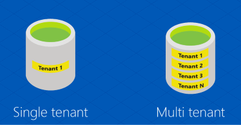
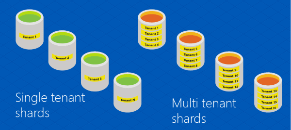

<properties 
    pageTitle="Elastic Database tools glossary | Microsoft Azure" 
    description="Explanation of terms used for elastic database tools" 
    services="sql-database" 
    documentationCenter="" 
    manager="jhubbard" 
    authors="ddove" 
    editor=""/>

<tags 
    ms.service="sql-database" 
    ms.workload="sql-database" 
    ms.tgt_pltfrm="na" 
    ms.devlang="na" 
    ms.topic="article" 
    ms.date="05/27/2016" 
    ms.author="ddove"/>

# Elastic Database tools glossary
The following terms are defined for the [Elastic Database tools](sql-database-elastic-scale-introduction.md), a feature of Azure SQL Database. The tools are used to manage [shard maps](sql-database-elastic-scale-shard-map-management.md), and include the [client library](sql-database-elastic-database-client-library.md), the [split-merge tool](sql-database-elastic-scale-overview-split-and-merge.md), [elastic pools](sql-database-elastic-pool.md), and [queries](sql-database-elastic-query-overview.md). 

These terms are used in [Adding a shard using Elastic Database tools](sql-database-elastic-scale-add-a-shard.md) and [Using the RecoveryManager class to fix shard map problems](sql-database-elastic-database-recovery-manager.md).

![Elastic Scale terms][1]

**Database**: An Azure SQL database. 

**Data dependent routing**: The functionality that enables an application to connect to a shard given a specific sharding key. See [Data dependent routing](sql-database-elastic-scale-data-dependent-routing.md). Compare to **[Multi-Shard Query](sql-database-elastic-scale-multishard-querying.md)**.

**Global shard map**: The map between sharding keys and their respective shards within a **shard set**. The global shard map is stored in the **shard map manager**. Compare to **local shard map**.

**List shard map**: A shard map in which sharding keys are mapped individually. Compare to **Range Shard Map**.   

**Local shard map**: Stored on a shard, the local shard map contains mappings for the shardlets that reside on the shard.

**Multi-shard query**: The ability to issue a query against multiple shards; results sets are returned using UNION ALL semantics (also known as “fan-out query”). Compare to **data dependent routing**.

**Multi-tenant** and **Single-tenant**: This shows a single-tenant database and a multi-tenant database:

Here is a representation of **sharded** single and multi-tenant databases. 

**Range shard map**: A shard map in which the shard distribution strategy is based on multiple ranges of contiguous values. 

**Reference tables**: Tables that are not sharded but are replicated across shards. For example, zip codes can be stored in a reference table. 

**Shard**: An Azure SQL database that stores data from a sharded data set. 

**Shard elasticity**: The ability to perform both **horizontal scaling** and **vertical scaling**.

**Sharded tables**: Tables that are sharded, i.e., whose data is distributed across shards based on their sharding key values. 

**Sharding key**: A column value that determines how data is distributed across shards. The value type can be one of the following: **int**, **bigint**, **varbinary**, or **uniqueidentifier**. 

**Shard set**: The collection of shards that are attributed to the same shard map in the shard map manager.  

**Shardlet**: All of the data associated with a single value of a sharding key on a shard. A shardlet is the smallest unit of data movement possible when redistributing sharded tables. 

**Shard map**: The set of mappings between sharding keys and their respective shards.

**Shard map manager**: A management object and data store that contains the shard map(s), shard locations, and mappings for one or more shard sets.

![Mappings][2]

##Verbs

**Horizontal scaling**: The act of scaling out (or in) a collection of shards by adding or removing shards to a shard map, as shown below.

![Horizontal and vertical scaling][3]

**Merge**: The act of moving shardlets from two shards to one shard and updating the shard map accordingly.

**Shardlet move**: The act of moving a single shardlet to a different shard. 

**Shard**: The act of horizontally partitioning identically structured data across multiple databases based on a sharding key.

**Split**: The act of moving several shardlets from one shard to another (typically new) shard. A sharding key is provided by the user as the split point.

**Vertical Scaling**: The act of scaling up (or down) the performance level of an individual shard. For example, changing a shard from Standard to Premium (which results in more computing resources). 

[AZURE.INCLUDE [elastic-scale-include](../../includes/elastic-scale-include.md)]  

<!--Image references-->
[1]: ./media/sql-database-elastic-scale-glossary/glossary.png
[2]: ./media/sql-database-elastic-scale-glossary/mappings.png
[3]: ./media/sql-database-elastic-scale-glossary/h_versus_vert.png
 