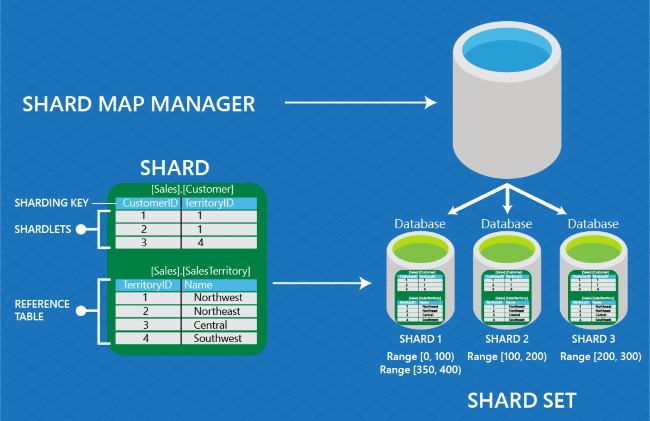

<properties 
	pageTitle="Shard map management | Microsoft Azure" 
	description="How to use the ShardMapManager, elastic database client library" 
	services="sql-database" 
	documentationCenter="" 
	manager="jhubbard" 
	authors="ddove" 
	editor=""/>

<tags 
	ms.service="sql-database" 
	ms.workload="sql-database" 
	ms.tgt_pltfrm="na" 
	ms.devlang="na" 
	ms.topic="article" 
	ms.date="05/25/2016" 
	ms.author="ddove"/>

# Scale out databases with the shard map manager

To easily scale out databases on SQL Azure, use a shard map manager. The shard map manager is a special database that maintains global mapping information about all shards (databases) in a shard set. The metadata allows an application to connect to the correct database based upon the value of the **sharding key**. In addition, every shard in the set contains maps that track the local shard data (known as **shardlets**). 

Understanding how these maps are constructed is essential to shard map management. This is done using the [ShardMapManager class](https://msdn.microsoft.com/library/azure/microsoft.azure.sqldatabase.elasticscale.shardmanagement.shardmapmanager.aspx), found in the [Elastic Database client library](sql-database-elastic-database-client-library.md) to manage shard maps.  

## Shard maps and shard mappings

For each shard, you must select the type of shard map to create. The choice depends on the database architecture: 

1. Single tenant per database  
2. Multiple tenants per database (two types):
	3. List mapping
	4. Range mapping
 
For a single-tenant model, create a **list mapping** shard map. The single-tenant model assigns one database per tenant. This is an effective model for SaaS developers as it simplifies management.

![List mapping][1]

The multi-tenant model assigns several tenants to a single database (and you can distribute groups of tenants across multiple databases). Use this model when you expect each tenant to have small data needs. In this model, we assign a range of tenants to a database using **range mapping**. 
 

![Range mapping][2]

Or you can implement a multi-tenant database model using a *list mapping* to assign multiple tenants to a single database. For example, DB1 is used to store information about tenant id 1 and 5, and DB2 stores data for tenant 7 and tenant 10. 

![Muliple tenants on single DB][3] 
 
### Supported .Net types for sharding keys

Elastic Scale support the following .Net Framework types as sharding keys:

* integer
* long
* guid
* byte[]  
* datetime
* timespan
* datetimeoffset

### List and range shard maps
Shard maps can be constructed using **lists of individual sharding key values**, or they can be constructed using **ranges of sharding key values**. 

###List shard maps
**Shards** contain **shardlets** and the mapping of shardlets to shards is maintained by a shard map. A **list shard map** is an association between the individual key values that identify the shardlets and the databases that serve as shards.  **List mappings** are explicit and different key values can be mapped to the same database. For example, key 1 maps to Database A, and key values 3 and 6 both reference Database B.

| Key | Shard Location |
|-----|----------------|
| 1   | Database_A     |
| 3   | Database_B     |
| 4   | Database_C     |
| 6	  | Database_B     |
| ... | ...            |
 

### Range shard maps 
In a **range shard map**, the key range is described by a pair **[Low Value, High Value)** where the *Low Value* is the minimum key in the range, and the *High Value* is the first value higher than the range. 

For example, **[0, 100)** includes all integers greater than or equal 0 and less than 100. Note that multiple ranges can point to the same database, and disjoint ranges are supported (e.g., [100,200) and [400,600) both point to Database C in the example below.)

| Key       | Shard Location |
|-----------|----------------|
| [1,50)    | Database_A     |
| [50,100)  | Database_B     |
| [100,200) | Database_C     |
| [400,600) | Database_C     |
| ...       | ...            

Each of the tables shown above is a conceptual example of a **ShardMap** object. Each row is a simplified example of an individual **PointMapping** (for the list shard map) or **RangeMapping** (for the range shard map) object.

## Shard map manager 

In the client library, the shard map  manager is a collection of shard maps. The data managed by a **ShardMapManager** instance is kept in three places: 

1. **Global Shard Map (GSM)**: You specify a database to serve as the repository for all of its shard maps and mappings. Special tables and stored procedures are automatically created to manage the information. This is typically a small database and lightly accessed, and it should not be used for other needs of the application. The tables are in a special schema named **__ShardManagement**. 

2. **Local Shard Map (LSM)**: Every database that you specify to be a shard is modified to contain several small tables and special stored procedures that contain and manage shard map information specific to that shard. This information is redundant with the information in the GSM, and it allows the application to validate cached shard map information without placing any load on the GSM; the application uses the LSM to determine if a cached mapping is still valid. The tables corresponding to the LSM on each shard are also in the schema **__ShardManagement**.

3. **Application cache**: Each application instance accessing a **ShardMapManager** object maintains a local in-memory cache of its mappings. It stores routing information that has recently been retrieved. 

## Constructing a ShardMapManager

A **ShardMapManager** object is constructed using a [factory](https://msdn.microsoft.com/library/azure/microsoft.azure.sqldatabase.elasticscale.shardmanagement.shardmapmanagerfactory.aspx) pattern. The **[ShardMapManagerFactory.GetSqlShardMapManager](https://msdn.microsoft.com/library/azure/microsoft.azure.sqldatabase.elasticscale.shardmanagement.shardmapmanagerfactory.getsqlshardmapmanager.aspx)** method takes credentials (including the server name and database name holding the GSM) in the form of a **ConnectionString** and returns an instance of a **ShardMapManager**.  

**Please Note:** The **ShardMapManager** should be instantiated only once per app domain, within the initialization code for an application. Creation of additional instances of ShardMapManager in the same appdomain, will result in increased memory and CPU utilization of the application. A **ShardMapManager** can contain any number of shard maps. While a single shard map may be sufficient for many applications, there are times when different sets of databases are used for different schema or for unique purposes; in those cases multiple shard maps may be preferable. 

In this code, an application tries to open an existing **ShardMapManager** with the [TryGetSqlShardMapManager method](https://msdn.microsoft.com/library/azure/microsoft.azure.sqldatabase.elasticscale.shardmanagement.shardmapmanagerfactory.trygetsqlshardmapmanager.aspx).  If objects representing a Global **ShardMapManager** (GSM) do not yet exist inside the database, the client library creates them there using the [CreateSqlShardMapManager method](https://msdn.microsoft.com/library/azure/microsoft.azure.sqldatabase.elasticscale.shardmanagement.shardmapmanagerfactory.createsqlshardmapmanager.aspx).

    // Try to get a reference to the Shard Map Manager 
 	// via the Shard Map Manager database.  
    // If it doesn't already exist, then create it. 
    ShardMapManager shardMapManager; 
    bool shardMapManagerExists = ShardMapManagerFactory.TryGetSqlShardMapManager(
                                        connectionString, 
                                        ShardMapManagerLoadPolicy.Lazy, 
                                        out shardMapManager); 

    if (shardMapManagerExists) 
     { 
        Console.WriteLine("Shard Map Manager already exists");
    } 
    else
    {
        // Create the Shard Map Manager. 
        ShardMapManagerFactory.CreateSqlShardMapManager(connectionString);
        Console.WriteLine("Created SqlShardMapManager"); 

        shardMapManager = ShardMapManagerFactory.GetSqlShardMapManager(
            connectionString, 
            ShardMapManagerLoadPolicy.Lazy);

        // The connectionString contains server name, database name, and admin credentials 
        // for privileges on both the GSM and the shards themselves.
    } 
 
As an alternative, you can use Powershell to create a new Shard Map Manager. An example is available [here](https://gallery.technet.microsoft.com/scriptcenter/Azure-SQL-DB-Elastic-731883db).

## Get a RangeShardMap or ListShardMap

After creating a shard map manager, you can get the [RangeShardMap](https://msdn.microsoft.com/library/azure/dn807318.aspx) or [ListShardMap](https://msdn.microsoft.com/library/azure/dn807370.aspx) using the [TryGetRangeShardMap](https://msdn.microsoft.com/library/azure/microsoft.azure.sqldatabase.elasticscale.shardmanagement.shardmapmanager.trygetrangeshardmap.aspx), the [TryGetListShardMap](https://msdn.microsoft.com/library/azure/microsoft.azure.sqldatabase.elasticscale.shardmanagement.shardmapmanager.trygetlistshardmap.aspx), or the [GetShardMap](https://msdn.microsoft.com/library/azure/microsoft.azure.sqldatabase.elasticscale.shardmanagement.shardmapmanager.getshardmap.aspx) method.

	/// 

    /// Creates a new Range Shard Map with the specified name, or gets the Range Shard Map if it already exists.
    /// 

    public static RangeShardMap<T> CreateOrGetRangeShardMap<T>(ShardMapManager shardMapManager, string shardMapName)
    {
        // Try to get a reference to the Shard Map.
        RangeShardMap<T> shardMap;
        bool shardMapExists = shardMapManager.TryGetRangeShardMap(shardMapName, out shardMap);

        if (shardMapExists)
        {
            ConsoleUtils.WriteInfo("Shard Map {0} already exists", shardMap.Name);
        }
        else
        {
            // The Shard Map does not exist, so create it
            shardMap = shardMapManager.CreateRangeShardMap<T>(shardMapName);
            ConsoleUtils.WriteInfo("Created Shard Map {0}", shardMap.Name);
        }

        return shardMap;
    } 

### Shard map administration credentials

Applications that administer and manipulate shard maps are different from those that use the shard maps to route connections. 

To administer shard maps (add or change shards, shard maps, shard mappings, etc.) you must instantiate the **ShardMapManager** using **credentials that have read/write privileges on both the GSM database and on each database that serves as a shard**. The credentials must allow for writes against the tables in both the GSM and LSM as shard map information is entered or changed, as well as for creating LSM tables on new shards.  

See [Credentials used to access the Elastic Database client library](sql-database-elastic-scale-manage-credentials.md).

### Only metadata affected 

Methods used for populating or changing the **ShardMapManager** data do not alter the user data stored in the shards themselves. For example, methods such as **CreateShard**, **DeleteShard**, **UpdateMapping**, etc. affect the shard map metadata only. They do not remove, add, or alter user data contained in the shards. Instead, these methods are designed to be used in conjunction with separate operations you perform to create or remove actual databases, or that move rows from one shard to another to rebalance a sharded environment.  (The **split-merge** tool included with elastic database tools makes use of these APIs along with orchestrating actual data movement between shards.) See [Scaling using the Elastic Database split-merge tool](sql-database-elastic-scale-overview-split-and-merge.md).

## Populating a shard map example
 
An example sequence of operations to populate a specific shard map is shown below. The code performs these steps: 

1. A new shard map is created within a shard map manager. 
2. The metadata for two different shards is added to the shard map. 
3. A variety of key range mappings are added, and the overall contents of the shard map are displayed. 

The code is written so that the method can be rerun if an error occurs. Each request tests whether a shard or mapping already exists, before attempting to create it. The code assumes that databases named **sample_shard_0**, **sample_shard_1** and **sample_shard_2** have already been created in the server referenced by string **shardServer**. 

    public void CreatePopulatedRangeMap(ShardMapManager smm, string mapName) 
        {            
            RangeShardMap<long> sm = null; 

            // check if shardmap exists and if not, create it 
            if (!smm.TryGetRangeShardMap(mapName, out sm)) 
            { 
                sm = smm.CreateRangeShardMap<long>(mapName); 
            } 

            Shard shard0 = null, shard1=null; 
            // Check if shard exists and if not, 
            // create it (Idempotent / tolerant of re-execute) 
            if (!sm.TryGetShard(new ShardLocation(
	                                 shardServer, 
	                                 "sample_shard_0"), 
	                                 out shard0)) 
            { 
                Shard0 = sm.CreateShard(new ShardLocation(
	                                        shardServer, 
	                                        "sample_shard_0")); 
            } 

            if (!sm.TryGetShard(new ShardLocation(
	                                shardServer, 
	                                "sample_shard_1"), 
	                                out shard1)) 
            { 
                Shard1 = sm.CreateShard(new ShardLocation(
	                                         shardServer, 
	                                        "sample_shard_1"));  
            } 

            RangeMapping<long> rmpg=null; 

            // Check if mapping exists and if not,
            // create it (Idempotent / tolerant of re-execute) 
            if (!sm.TryGetMappingForKey(0, out rmpg)) 
            { 
                sm.CreateRangeMapping(
	                      new RangeMappingCreationInfo<long>
	                      (new Range<long>(0, 50), 
	                      shard0, 
	                      MappingStatus.Online)); 
            } 

            if (!sm.TryGetMappingForKey(50, out rmpg)) 
            { 
                sm.CreateRangeMapping(
	                     new RangeMappingCreationInfo<long> 
                         (new Range<long>(50, 100), 
	                     shard1, 
	                     MappingStatus.Online)); 
            } 

            if (!sm.TryGetMappingForKey(100, out rmpg)) 
            { 
                sm.CreateRangeMapping(
	                     new RangeMappingCreationInfo<long>
                         (new Range<long>(100, 150), 
	                     shard0, 
	                     MappingStatus.Online)); 
            } 

            if (!sm.TryGetMappingForKey(150, out rmpg)) 
            { 
                sm.CreateRangeMapping(
	                     new RangeMappingCreationInfo<long> 
                         (new Range<long>(150, 200), 
	                     shard1, 
	                     MappingStatus.Online)); 
            } 

            if (!sm.TryGetMappingForKey(200, out rmpg)) 
            { 
               sm.CreateRangeMapping(
	                     new RangeMappingCreationInfo<long> 
                         (new Range<long>(200, 300), 
	                     shard0, 
	                     MappingStatus.Online)); 
            } 

            // List the shards and mappings 
            foreach (Shard s in sm.GetShards()
                         .OrderBy(s => s.Location.DataSource)
                         .ThenBy(s => s.Location.Database))
            { 
               Console.WriteLine("shard: "+ s.Location); 
            } 

            foreach (RangeMapping<long> rm in sm.GetMappings()) 
            { 
                Console.WriteLine("range: [" + rm.Value.Low.ToString() + ":" 
                        + rm.Value.High.ToString()+ ")  ==>" +rm.Shard.Location); 
            } 
        } 
 
As an alternative you can use PowerShell scripts to achieve the same result. Some of the sample PowerShell examples are available [here](https://gallery.technet.microsoft.com/scriptcenter/Azure-SQL-DB-Elastic-731883db).     

Once shard maps have been populated, data access applications can be created or adapted to work with the maps. Populating or manipulating the maps need not occur again until **map layout** needs to change.  

## Data dependent routing 

The shard map manager will be most used in applications that require database connections to perform the app-specific data operations. Those connections must be associated with the correct database. This is known as **Data Dependent Routing**. For these applications, instantiate a shard map manager object from the factory using credentials that have read-only access on the GSM database. Individual requests for later connections supply credentials necessary for connecting to the appropriate shard database.

Note that these applications (using **ShardMapManager** opened with read-only credentials) cannot make changes to the maps or mappings. For those needs, create administrative-specific applications or PowerShell scripts that supply higher-privileged credentials as discussed earlier. See [Credentials used to access the Elastic Database client library](sql-database-elastic-scale-manage-credentials.md).

For more details, see [Data dependent routing](sql-database-elastic-scale-data-dependent-routing.md). 

## Modifying a shard map 

A shard map can be changed in different ways. All of the following methods modify the metadata describing the shards and their mappings, but they do not physically modify data within the shards, nor do they create or delete the actual databases.  Some of the operations on the shard map described below may need to be coordinated with administrative actions that physically move data or that add and remove databases serving as shards.

These methods work together as the building blocks available for modifying the overall distribution of data in your sharded database environment.  

* To add or remove shards: use **[CreateShard](https://msdn.microsoft.com/library/azure/microsoft.azure.sqldatabase.elasticscale.shardmanagement.shardmap.createshard.aspx)** and **[DeleteShard](https://msdn.microsoft.com/library/azure/microsoft.azure.sqldatabase.elasticscale.shardmanagement.shardmap.deleteshard.aspx)** of the [Shardmap class](https://msdn.microsoft.com/library/azure/microsoft.azure.sqldatabase.elasticscale.shardmanagement.shardmap.aspx). 
    
    The server and database representing the target shard must already exist for these operations to execute. These methods do not have any impact on the databases themselves, only on metadata in the shard map.

* To create or remove points or ranges that are mapped to the shards: use **[CreateRangeMapping](https://msdn.microsoft.com/library/azure/dn841993.aspx)**, **[DeleteMapping](https://msdn.microsoft.com/library/azure/dn824200.aspx)** of the [RangeShardMapping class](https://msdn.microsoft.com/library/azure/dn807318.aspx), and **[CreatePointMapping](https://msdn.microsoft.com/library/azure/dn807218.aspx)** of the [ListShardMap](https://msdn.microsoft.com/library/azure/dn842123.aspx)
    
    Many different points or ranges can be mapped to the same shard. These methods only affect metadata – they do not affect any data that may already be present in shards. If data needs to be removed from the database in order to be consistent with **DeleteMapping** operations, you will need to perform those operations separately but in conjunction with using these methods.  

* To split existing ranges into two, or merge adjacent ranges into one: use **[SplitMapping](https://msdn.microsoft.com/library/azure/dn824205.aspx)** and **[MergeMappings](https://msdn.microsoft.com/library/azure/dn824201.aspx)**.  

    Note that split and merge operations **do not change the shard to which key values are mapped**. A split breaks an existing range into two parts, but leaves both as mapped to the same shard. A merge operates on two adjacent ranges that are already mapped to the same shard, coalescing them into a single range.  The movement of points or ranges themselves between shards needs to be coordinated by using **UpdateMapping** in conjunction with actual data movement.  You can use the **Split/Merge** service that is part of elastic database tools to coordinate shard map changes with data movement, when movement is needed. 

* To re-map (or move) individual points or ranges to different shards: use **[UpdateMapping](https://msdn.microsoft.com/library/azure/dn824207.aspx)**.  

    Since data may need to be moved from one shard to another in order to be consistent with **UpdateMapping** operations, you will need to perform that movement separately but in conjunction with using these methods.

* To take mappings online and offline: use **[MarkMappingOffline](https://msdn.microsoft.com/library/azure/dn824202.aspx)** and **[MarkMappingOnline](https://msdn.microsoft.com/library/azure/dn807225.aspx)** to control the online state of a mapping. 

    Certain operations on shard mappings are only allowed when a mapping is in an “offline” state, including **UpdateMapping** and **DeleteMapping**. When a mapping is offline, a data-dependent request based on a key included in that mapping will return an error. In addition, when a range is first taken offline, all connections to the affected shard are automatically killed in order to prevent inconsistent or incomplete results for queries directed against ranges being changed. 

Mappings are immutable objects in .Net.  All of the methods above that change mappings also invalidate any references to them in your code. To make it easier to perform sequences of operations that change a mapping’s state, all of the methods that change a mapping return a new mapping reference, so operations can be chained. For example, to delete an existing mapping in shardmap sm that contains the key 25, you can execute the following: 

        sm.DeleteMapping(sm.MarkMappingOffline(sm.GetMappingForKey(25)));

## Adding a shard 

Applications often need to simply add new shards to handle data that is expected from new keys or key ranges, for a shard map that already exists. For example, an application sharded by Tenant ID may need to provision a new shard for a new tenant, or data sharded monthly may need a new shard provisioned before the start of each new month. 

If the new range of key values is not already part of an existing mapping and no data movement is necessary, it is very simple to add the new shard and associate the new key or range to that shard. For details on adding new shards, see [Adding a new shard](sql-database-elastic-scale-add-a-shard.md).

For scenarios that require data movement, however, the split-merge tool is needed to orchestrate the data movement between shards in combination with the necessary shard map updates. For details on using the split-merge yool, see [Overview of split-merge](sql-database-elastic-scale-overview-split-and-merge.md) 

[AZURE.INCLUDE [elastic-scale-include](../../includes/elastic-scale-include.md)]
 
<!--Image references-->
[1]: ./media/sql-database-elastic-scale-shard-map-management/listmapping.png
[2]: ./media/sql-database-elastic-scale-shard-map-management/rangemapping.png
[3]: ./media/sql-database-elastic-scale-shard-map-management/multipleonsingledb.png