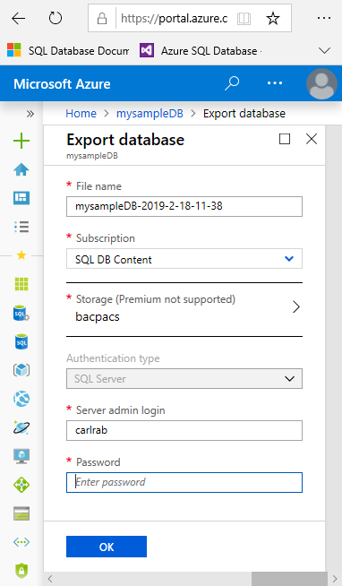

# Export an Azure SQL database to a BACPAC file

When you need to export a database for archiving or for moving to another platform, you can export the database schema and data to a [BACPAC](https://msdn.microsoft.com/library/ee210546.aspx#Anchor_4) file. A BACPAC file is a ZIP file with an extension of BACPAC containing the metadata and data from a SQL Server database. A BACPAC file can be stored in Azure Blob storage or in local storage in an on-premises location and later imported back into Azure SQL Database or into a SQL Server on-premises installation.

## Considerations when exporting an Azure SQL database

- For an export to be transactionally consistent, you must ensure either that no write activity is occurring during the export, or that you are exporting from a [transactionally consistent copy](sql-database-copy.md) of your Azure SQL database.
- If you are exporting to blob storage, the maximum size of a BACPAC file is 200 GB. To archive a larger BACPAC file, export to local storage.
- Exporting a BACPAC file to Azure premium storage using the methods discussed in this article is not supported.
- Storage behind a firewall is currently not supported.
- If the export operation from Azure SQL Database exceeds 20 hours, it may be canceled. To increase performance during export, you can:

  - Temporarily increase your compute size.
  - Cease all read and write activity during the export.
  - Use a [clustered index](https://msdn.microsoft.com/library/ms190457.aspx) with non-null values on all large tables. Without clustered indexes, an export may fail if it takes longer than 6-12 hours. This is because the export service needs to complete a table scan to try to export entire table. A good way to determine if your tables are optimized for export is to run **DBCC SHOW_STATISTICS** and make sure that the *RANGE_HI_KEY* is not null and its value has good distribution. For details, see [DBCC SHOW_STATISTICS](https://msdn.microsoft.com/library/ms174384.aspx).

> [!NOTE]
> BACPACs are not intended to be used for backup and restore operations. Azure SQL Database automatically creates backups for every user database. For details, see [business continuity overview](sql-database-business-continuity.md) and [SQL Database backups](sql-database-automated-backups.md).

## Export to a BACPAC file using the Azure portal

> [!NOTE]
> [A managed instance](sql-database-managed-instance.md) does not currently support exporting a database to a BACPAC file using the Azure portal. To export a managed instance into a BACPAC file, use SQL Server Management Studio or SQLPackage.

1. To export a database using the [Azure portal](https://portal.azure.com), open the page for your database and click **Export** on the toolbar.

   

2. Specify the BACPAC filename, select an existing Azure storage account and container for the export, and then provide the appropriate credentials for access to the source database.

    

3. Click **OK**.

4. To monitor the progress of the export operation, open the page for the SQL Database server containing the database being exported. Under to **Settings** and then click **Import/Export history**.

   

## Export to a BACPAC file using the SQLPackage utility

To export a SQL database using the [SqlPackage](https://docs.microsoft.com/sql/tools/sqlpackage) command-line utility, see [Export parameters and properties](https://docs.microsoft.com/sql/tools/sqlpackage#export-parameters-and-properties). The SQLPackage utility ships with the latest versions of [SQL Server Management Studio](https://msdn.microsoft.com/library/mt238290.aspx) and [SQL Server Data Tools for Visual Studio](https://msdn.microsoft.com/library/mt204009.aspx), or you can download the latest version of [SqlPackage](https://www.microsoft.com/download/details.aspx?id=53876) directly from the Microsoft download center.

We recommend the use of the SQLPackage utility for scale and performance in most production environments. For a SQL Server Customer Advisory Team blog about migrating using BACPAC files, see [Migrating from SQL Server to Azure SQL Database using BACPAC Files](https://blogs.msdn.microsoft.com/sqlcat/20../../migrating-from-sql-server-to-azure-sql-database-using-bacpac-files/).

This example shows how to export a database using SqlPackage.exe with Active Directory Universal Authentication:

```cmd
SqlPackage.exe /a:Export /tf:testExport.bacpac /scs:"Data Source=apptestserver.database.windows.net;Initial Catalog=MyDB;" /ua:True /tid:"apptest.onmicrosoft.com"
```

## Export to a BACPAC file using SQL Server Management Studio (SSMS)

The newest versions of SQL Server Management Studio provides a wizard to export an Azure SQL database to a BACPAC file. See the [Export a Data-tier Application](https://docs.microsoft.com/sql/relational-databases/data-tier-applications/export-a-data-tier-application).

## Export to a BACPAC file using PowerShell

> [!NOTE]
> [A managed instance](sql-database-managed-instance.md) does not currently support exporting a database to a BACPAC file using Azure PowerShell. To export a managed instance into a BACPAC file, use SQL Server Management Studio or SQLPackage.

Use the [New-AzSqlDatabaseExport](/powershell/module/az.sql/new-azsqldatabaseexport) cmdlet to submit an export database request to the Azure SQL Database service. Depending on the size of your database, the export operation may take some time to complete.

```powershell
$exportRequest = New-AzSqlDatabaseExport -ResourceGroupName $ResourceGroupName -ServerName $ServerName `
  -DatabaseName $DatabaseName -StorageKeytype $StorageKeytype -StorageKey $StorageKey -StorageUri $BacpacUri `
  -AdministratorLogin $creds.UserName -AdministratorLoginPassword $creds.Password
```

To check the status of the export request, use the [Get-AzSqlDatabaseImportExportStatus](/powershell/module/az.sql/get-azsqldatabaseimportexportstatus) cmdlet. Running this immediately after the request usually returns **Status: InProgress**. When you see **Status: Succeeded** the export is complete.

```powershell
$exportStatus = Get-AzSqlDatabaseImportExportStatus -OperationStatusLink $exportRequest.OperationStatusLink
[Console]::Write("Exporting")
while ($exportStatus.Status -eq "InProgress")
{
    Start-Sleep -s 10
    $exportStatus = Get-AzSqlDatabaseImportExportStatus -OperationStatusLink $exportRequest.OperationStatusLink
    [Console]::Write(".")
}
[Console]::WriteLine("")
$exportStatus
```

## Next steps

- To learn about long-term backup retention of a single databases and pooled databases as an alternative to exported a database for archive purposes, see [Long-term backup retention](sql-database-long-term-retention.md). You can use SQL Agent jobs to schedule [copy-only database backups](https://docs.microsoft.com/sql/relational-databases/backup-restore/copy-only-backups-sql-server) as an alternative to long-term backup retention.
- For a SQL Server Customer Advisory Team blog about migrating using BACPAC files, see [Migrating from SQL Server to Azure SQL Database using BACPAC Files](https://blogs.msdn.microsoft.com/sqlcat/2016/10/20/migrating-from-sql-server-to-azure-sql-database-using-bacpac-files/).
- To learn about importing a BACPAC to a SQL Server database, see [Import a BACPAC to a SQL Server database](https://msdn.microsoft.com/library/hh710052.aspx).
- To learn about exporting a BACPAC from a SQL Server database, see [Export a Data-tier Application](https://docs.microsoft.com/sql/relational-databases/data-tier-applications/export-a-data-tier-application)
- To learn about using the Data Migration Service to migrate a database, see [Migrate SQL Server to Azure SQL Database offline using DMS](../dms/tutorial-sql-server-to-azure-sql.md).
- If you are exporting from SQL Server as a prelude to migration to Azure SQL Database, see [Migrate a SQL Server database to Azure SQL Database](sql-database-single-database-migrate.md).
- To learn how to manage and share storage keys and shared access signatures securely, see [Azure Storage Security Guide](https://docs.microsoft.com/azure/storage/common/storage-security-guide).
