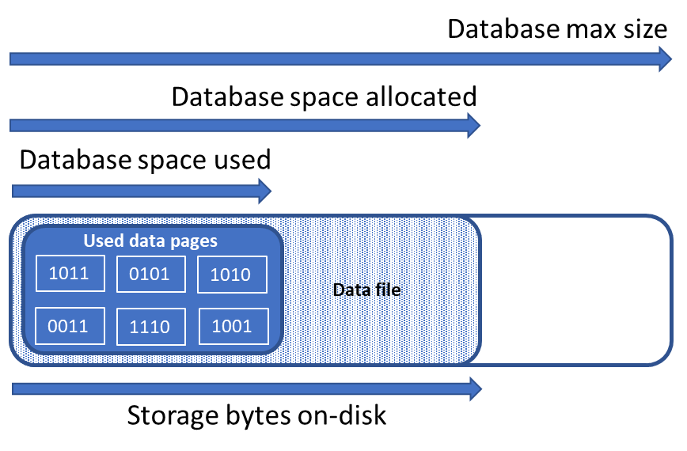

# Manage file space for single and pooled databases in Azure SQL Database

This article describes different types of storage space for single and pooled databases in Azure SQL Database, and steps that can be taken when the file space allocated for databases and elastic pools needs to be explicitly managed.

> [!NOTE]
> This article does not apply to the managed instance deployment option in Azure SQL Database.

## Overview

[!INCLUDE [updated-for-az](../../includes/updated-for-az.md)]
> [!IMPORTANT]
> The PowerShell Azure Resource Manager module is still supported by Azure SQL Database, but all future development is for the Az.Sql module. For these cmdlets, see [AzureRM.Sql](https://docs.microsoft.com/powershell/module/AzureRM.Sql/). The arguments for the commands in the Az module and in the AzureRm modules are substantially identical.

With single and pooled databases in Azure SQL Database, there are workload patterns where the allocation of underlying data files for databases can become larger than the amount of used data pages. This condition can occur when space used increases and data is subsequently deleted. The reason is because file space allocated is not automatically reclaimed when data is deleted.

Monitoring file space usage and shrinking data files may be necessary in the following scenarios:

- Allow data growth in an elastic pool when the file space allocated for its databases reaches the pool max size.
- Allow decreasing the max size of a single database or elastic pool.
- Allow changing a single database or elastic pool to a different service tier or performance tier with a lower max size.

### Monitoring file space usage

Most storage space metrics displayed in the Azure portal and the following APIs only measure the size of used data pages:

- Azure Resource Manager based metrics APIs including PowerShell [get-metrics](https://docs.microsoft.com/powershell/module/az.monitor/get-azmetric)
- T-SQL: [sys.dm_db_resource_stats](https://docs.microsoft.com/sql/relational-databases/system-dynamic-management-views/sys-dm-db-resource-stats-azure-sql-database)

However, the following APIs also measure the size of space allocated for databases and elastic pools:

- T-SQL:  [sys.resource_stats](https://docs.microsoft.com/sql/relational-databases/system-catalog-views/sys-resource-stats-azure-sql-database)
- T-SQL: [sys.elastic_pool_resource_stats](https://docs.microsoft.com/sql/relational-databases/system-catalog-views/sys-elastic-pool-resource-stats-azure-sql-database)

### Shrinking data files

The SQL Database service does not automatically shrink data files to reclaim unused allocated space due to the potential impact to database performance.  However, customers may shrink data files via self-service at a time of their choosing by following the steps described in [reclaim unused allocated space](#reclaim-unused-allocated-space).

> [!NOTE]
> Unlike data files, the SQL Database service automatically shrinks log files since that operation does not impact database performance. 

## Understanding types of storage space for a database

Understanding the following storage space quantities are important for managing the file space of a database.

|Database quantity|Definition|Comments|
|---|---|---|
|**Data space used**|The amount of space used to store database data in 8 KB pages.|Generally, space used increases (decreases) on inserts (deletes). In some cases, the space used does not change on inserts or deletes depending on the amount and pattern of data involved in the operation and any fragmentation. For example, deleting one row from every data page does not necessarily decrease the space used.|
|**Data space allocated**|The amount of formatted file space made available for storing database data.|The amount of space allocated grows automatically, but never decreases after deletes. This behavior ensures that future inserts are faster since space does not need to be reformatted.|
|**Data space allocated but unused**|The difference between the amount of data space allocated and data space used.|This quantity represents the maximum amount of free space that can be reclaimed by shrinking database data files.|
|**Data max size**|The maximum amount of space that can be used for storing database data.|The amount of data space allocated cannot grow beyond the data max size.|
||||

The following diagram illustrates the relationship between the different types of storage space for a database.



## Query a single database for storage space information

The following queries can be used to determine storage space quantities for a single database.  

### Database data space used

Modify the following query to return the amount of database data space used.  Units of the query result are in MB.

```sql
-- Connect to master
-- Database data space used in MB
SELECT TOP 1 storage_in_megabytes AS DatabaseDataSpaceUsedInMB
FROM sys.resource_stats
WHERE database_name = 'db1'
ORDER BY end_time DESC
```

### Database data space allocated and unused allocated space

Use the following query to return the amount of database data space allocated and the amount of unused space allocated.  Units of the query result are in MB.

```sql
-- Connect to database
-- Database data space allocated in MB and database data space allocated unused in MB
SELECT SUM(size/128.0) AS DatabaseDataSpaceAllocatedInMB, 
SUM(size/128.0 - CAST(FILEPROPERTY(name, 'SpaceUsed') AS int)/128.0) AS DatabaseDataSpaceAllocatedUnusedInMB 
FROM sys.database_files
GROUP BY type_desc
HAVING type_desc = 'ROWS'
```
 
### Database data max size

Modify the following query to return the database data max size.  Units of the query result are in bytes.

```sql
-- Connect to database
-- Database data max size in bytes
SELECT DATABASEPROPERTYEX('db1', 'MaxSizeInBytes') AS DatabaseDataMaxSizeInBytes
```

## Understanding types of storage space for an elastic pool

Understanding the following storage space quantities are important for managing the file space of an elastic pool.

|Elastic pool quantity|Definition|Comments|
|---|---|---|
|**Data space used**|The summation of data space used by all databases in the elastic pool.||
|**Data space allocated**|The summation of data space allocated by all databases in the elastic pool.||
|**Data space allocated but unused**|The difference between the amount of data space allocated and data space used by all databases in the elastic pool.|This quantity represents the maximum amount of space allocated for the elastic pool that can be reclaimed by shrinking database data files.|
|**Data max size**|The maximum amount of data space that can be used by the elastic pool for all of its databases.|The space allocated for the elastic pool should not exceed the elastic pool max size.  If this condition occurs, then space allocated that is unused can be reclaimed by shrinking database data files.|
||||

## Query an elastic pool for storage space information

The following queries can be used to determine storage space quantities for an elastic pool.  

### Elastic pool data space used

Modify the following query to return the amount of elastic pool data space used.  Units of the query result are in MB.

```sql
-- Connect to master
-- Elastic pool data space used in MB  
SELECT TOP 1 avg_storage_percent / 100.0 * elastic_pool_storage_limit_mb AS ElasticPoolDataSpaceUsedInMB
FROM sys.elastic_pool_resource_stats
WHERE elastic_pool_name = 'ep1'
ORDER BY end_time DESC
```

### Elastic pool data space allocated and unused allocated space

Modify the following PowerShell script to return a table listing the space allocated and unused allocated space for each database in an elastic pool. The table orders databases from those databases with the greatest amount of unused allocated space to the least amount of unused allocated space.  Units of the query result are in MB.  

The query results for determining the space allocated for each database in the pool can be added together to determine the total space allocated for the elastic pool. The elastic pool space allocated should not exceed the elastic pool max size.  

The PowerShell script requires SQL Server PowerShell module – see [Download PowerShell module](https://docs.microsoft.com/sql/powershell/download-sql-server-ps-module) to install.

```powershell
# Resource group name
$resourceGroupName = "rg1" 
# Server name
$serverName = "ls2" 
# Elastic pool name
$poolName = "ep1"
# User name for server
$userName = "name"
# Password for server
$password = "password"

# Get list of databases in elastic pool
$databasesInPool = Get-AzSqlElasticPoolDatabase `
    -ResourceGroupName $resourceGroupName `
    -ServerName $serverName `
    -ElasticPoolName $poolName
$databaseStorageMetrics = @()

# For each database in the elastic pool,
# get its space allocated in MB and space allocated unused in MB.
  
foreach ($database in $databasesInPool)
{
    $sqlCommand = "SELECT DB_NAME() as DatabaseName, `
    SUM(size/128.0) AS DatabaseDataSpaceAllocatedInMB, `
    SUM(size/128.0 - CAST(FILEPROPERTY(name, 'SpaceUsed') AS int)/128.0) AS DatabaseDataSpaceAllocatedUnusedInMB `
    FROM sys.database_files `
    GROUP BY type_desc `
    HAVING type_desc = 'ROWS'"
    $serverFqdn = "tcp:" + $serverName + ".database.windows.net,1433"
    $databaseStorageMetrics = $databaseStorageMetrics + 
        (Invoke-Sqlcmd -ServerInstance $serverFqdn `
        -Database $database.DatabaseName `
        -Username $userName `
        -Password $password `
        -Query $sqlCommand)
}
# Display databases in descending order of space allocated unused
Write-Output "`n" "ElasticPoolName: $poolName"
Write-Output $databaseStorageMetrics | Sort `
    -Property DatabaseDataSpaceAllocatedUnusedInMB `
    -Descending | Format-Table
```

The following screenshot is an example of the output of the script:


### Elastic pool data max size

Modify the following T-SQL query to return the elastic pool data max size.  Units of the query result are in MB.

```sql
-- Connect to master
-- Elastic pools max size in MB
SELECT TOP 1 elastic_pool_storage_limit_mb AS ElasticPoolMaxSizeInMB
FROM sys.elastic_pool_resource_stats
WHERE elastic_pool_name = 'ep1'
ORDER BY end_time DESC
```

## Reclaim unused allocated space

> [!NOTE]
> This command can impact database performance while it is running, and if possible should be run during periods of low usage.

### DBCC shrink

Once databases have been identified for reclaiming unused allocated space, modify the name of the database in the following command to shrink the data files for each database.

```sql
-- Shrink database data space allocated.
DBCC SHRINKDATABASE (N'db1')
```

This command can impact database performance while it is running, and if possible should be run during periods of low usage.  

For more information about this command, see [SHRINKDATABASE](https://docs.microsoft.com/sql/t-sql/database-console-commands/dbcc-shrinkdatabase-transact-sql). 

### Auto-shrink

Alternatively, auto shrink can be enabled for a database.  Auto shrink reduces file management complexity and is less impactful to database performance than `SHRINKDATABASE` or `SHRINKFILE`.  Auto shrink can be particularly helpful for managing elastic pools with many databases.  However, auto shrink can be less effective in reclaiming file space than `SHRINKDATABASE` and `SHRINKFILE`.
To enable auto shrink, modify the name of the database in the following command.


```sql
-- Enable auto-shrink for the database.
ALTER DATABASE [db1] SET AUTO_SHRINK ON
```

For more information about this command, see [DATABASE SET](https://docs.microsoft.com/sql/t-sql/statements/alter-database-transact-sql-set-options?view=azuresqldb-current) options. 

### Rebuild indexes

After database data files are shrunk, indexes may become fragmented and lose their performance optimization effectiveness. If performance degradation occurs, then consider rebuilding database indexes. For more information on fragmentation and rebuilding indexes, see [Reorganize and Rebuild Indexes](https://docs.microsoft.com/sql/relational-databases/indexes/reorganize-and-rebuild-indexes).

## Next steps

- For information about database max sizes, see:
  - [Azure SQL Database vCore-based purchasing model limits for a single database](sql-database-vcore-resource-limits-single-databases.md)
  - [Resource limits for single databases using the DTU-based purchasing model](sql-database-dtu-resource-limits-single-databases.md)
  - [Azure SQL Database vCore-based purchasing model limits for elastic pools](sql-database-vcore-resource-limits-elastic-pools.md)
  - [Resources limits for elastic pools using the DTU-based purchasing model](sql-database-dtu-resource-limits-elastic-pools.md)
- For more information about the `SHRINKDATABASE` command, see [SHRINKDATABASE](https://docs.microsoft.com/sql/t-sql/database-console-commands/dbcc-shrinkdatabase-transact-sql). 
- For more information on fragmentation and rebuilding indexes, see [Reorganize and Rebuild Indexes](https://docs.microsoft.com/sql/relational-databases/indexes/reorganize-and-rebuild-indexes).
