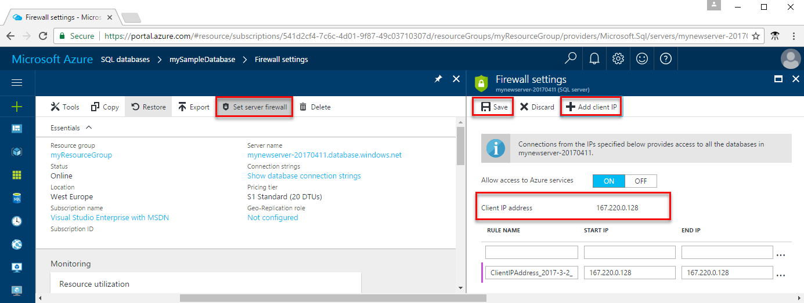
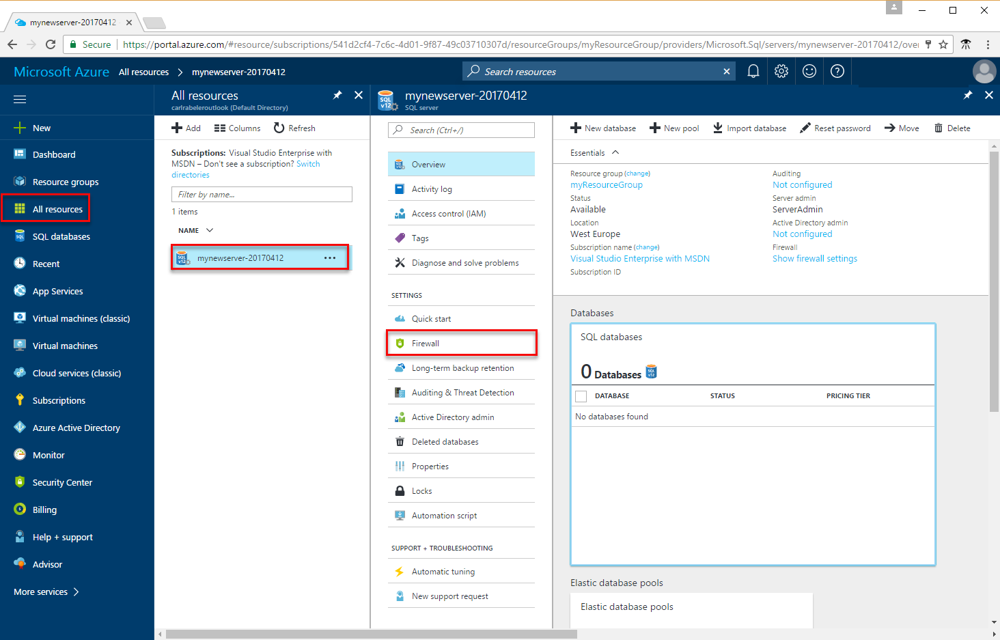
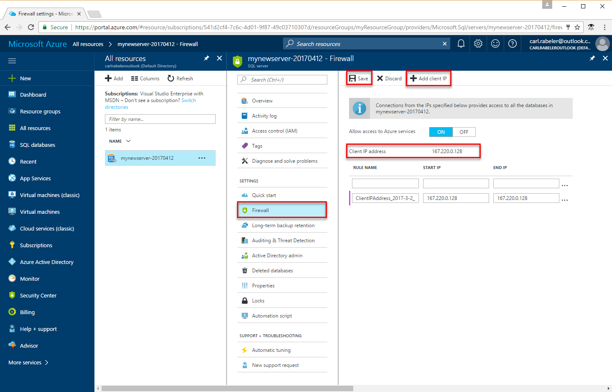

# Azure SQL Database server-level and database-level firewall rules 

Microsoft Azure SQL Database provides a relational database service for Azure and other Internet-based applications. To help protect your data, firewalls prevent all access to your database server until you specify which computers have permission. The firewall grants access to databases based on the originating IP address of each request.

## Overview

Initially, all Transact-SQL access to your Azure SQL server is blocked by the firewall. To begin using your Azure SQL server, you must specify one or more server-level firewall rules that enable access to your Azure SQL server. Use the firewall rules to specify which IP address ranges from the Internet are allowed, and whether Azure applications can attempt to connect to your Azure SQL server.

To selectively grant access to just one of the databases in your Azure SQL server, you must create a database-level rule for the required database. Specify an IP address range for the database firewall rule that is beyond the IP address range specified in the server-level firewall rule, and ensure that the IP address of the client falls in the range specified in the database-level rule.

Connection attempts from the Internet and Azure must first pass through the firewall before they can reach your Azure SQL server or SQL Database, as shown in the following diagram:

   ![Diagram describing firewall configuration.][1]

* **Server-level firewall rules:** These rules enable clients to access your entire Azure SQL server, that is, all the databases within the same logical server. These rules are stored in the **master** database. Server-level firewall rules can be configured by using the portal or by using Transact-SQL statements. To create server-level firewall rules using the Azure portal or PowerShell, you must be the subscription owner or a subscription contributor. To create a server-level firewall rule using Transact-SQL, you must connect to the SQL Database instance as the server-level principal login or the Azure Active Directory administrator (which means that a server-level firewall rule must first be created by a user with Azure-level permissions).
* **Database-level firewall rules:** These rules enable clients to access certain (secure) databases within the same logical server. You can create these rules for each database (including the **master** database0) and they are stored in the individual databases. Database-level firewall rules can only be configured by using Transact-SQL statements and only after you have configured the first server-level firewall. If you specify an IP address range in the database-level firewall rule that is outside the range specified in the server-level firewall rule, only those clients that have IP addresses in the database-level range can access the database. You can have a maximum of 128 database-level firewall rules for a database. Database-level firewall rules for master and user databases can only be created and managed through Transact-SQL. For more information on configuring database-level firewall rules, see the example later in this article and see [sp_set_database_firewall_rule (Azure SQL Databases)](https://msdn.microsoft.com/library/dn270010.aspx).

**Recommendation:** Microsoft recommends using database-level firewall rules whenever possible to enhance security and to make your database more portable. Use server-level firewall rules for administrators and when you have many databases that have the same access requirements and you don't want to spend time configuring each database individually.

> [!Note]
> For information about portable databases in the context of business continuity, see [Authentication requirements for disaster recovery](sql-database-geo-replication-security-config.md).
>

### Connecting from the Internet

When a computer attempts to connect to your database server from the Internet, the firewall first checks the originating IP address of the request against the database-level firewall rules, for the database that the connection is requesting:

* If the IP address of the request is within one of the ranges specified in the database-level firewall rules, the connection is granted to the SQL Database that contains the rule.
* If the IP address of the request is not within one of the ranges specified in the database-level firewall rule, the server-level firewall rules are checked. If the IP address of the request is within one of the ranges specified in the server-level firewall rules, the connection is granted. Server-level firewall rules apply to all SQL databases on the Azure SQL server.  
* If the IP address of the request is not within the ranges specified in any of the database-level or server-level firewall rules, the connection request fails.

> [!NOTE]
> To access Azure SQL Database from your local computer, ensure the firewall on your network and local computer allows outgoing communication on TCP port 1433.
> 

### Connecting from Azure
To allow applications from Azure to connect to your Azure SQL server, Azure connections must be enabled. When an application from Azure attempts to connect to your database server, the firewall verifies that Azure connections are allowed. A firewall setting with starting and ending address equal to 0.0.0.0 indicates these connections are allowed. If the connection attempt is not allowed, the request does not reach the Azure SQL Database server.

> [!IMPORTANT]
> This option configures the firewall to allow all connections from Azure including connections from the subscriptions of other customers. When selecting this option, make sure your login and user permissions limit access to only authorized users.
> 

## Creating and managing firewall rules
The first server-level firewall setting can be created using the [Azure portal](https://portal.azure.com/) or programmatically using [Azure PowerShell](https://msdn.microsoft.com/library/azure/dn546724.aspx), [Azure CLI](/cli/azure/sql/server/firewall-rule#create), or the [REST API](https://msdn.microsoft.com/library/azure/dn505712.aspx). Subsequent server-level firewall rules can be created and managed using these methods, and through Transact-SQL. 

> [!IMPORTANT]
> Database-level firewall rules can only be created and managed using Transact-SQL. 
>

To improve performance, server-level firewall rules are temporarily cached at the database level. To refresh the cache, see [DBCC FLUSHAUTHCACHE](https://msdn.microsoft.com/library/mt627793.aspx). 

> [!TIP]
> You can use [SQL Database Auditing](sql-database-auditing.md) to audit server-level and database-level firewall changes.
>

### Azure portal

To set a server-level firewall rule in the Azure portal, you can either go to the Overview page for your Azure SQL database or the Overview page for your Azure Database logical server.

> [!TIP]
> For a tutorial, see [Create a DB using the Azure portal](sql-database-get-started-portal.md).
>

**From database overview page**

1. To set a server-level firewall rule from the database overview page, click **Set server firewall** on the toolbar as shown in the following image: The **Firewall settings** page for the SQL Database server opens.

       

2. Click **Add client IP** on the toolbar to add the IP address of the computer you are currently using and then click **Save**. A server-level firewall rule is created for your current IP address.

       

**From server overview page**

The overview page for your server opens, showing you the fully qualified server name (such as **mynewserver20170403.database.windows.net**) and provides options for further configuration.

1. To set a server-level rule from server overview page, click **Firewall** in the left-hand menu under Settings as showed in the following image: 

     

2. Click **Add client IP** on the toolbar to add the IP address of the computer you are currently using and then click **Save**. A server-level firewall rule is created for your current IP address.

     

### Transact-SQL
| Catalog View or Stored Procedure | Level | Description |
| --- | --- | --- |
| [sys.firewall_rules](https://msdn.microsoft.com/library/dn269980.aspx) |Server |Displays the current server-level firewall rules |
| [sp_set_firewall_rule](https://msdn.microsoft.com/library/dn270017.aspx) |Server |Creates or updates server-level firewall rules |
| [sp_delete_firewall_rule](https://msdn.microsoft.com/library/dn270024.aspx) |Server |Removes server-level firewall rules |
| [sys.database_firewall_rules](https://msdn.microsoft.com/library/dn269982.aspx) |Database |Displays the current database-level firewall rules |
| [sp_set_database_firewall_rule](https://msdn.microsoft.com/library/dn270010.aspx) |Database |Creates or updates the database-level firewall rules |
| [sp_delete_database_firewall_rule](https://msdn.microsoft.com/library/dn270030.aspx) |Databases |Removes database-level firewall rules |


The following examples review the existing rules, enable a range of IP addresses on the server Contoso, and deletes a firewall rule:
   
```sql
SELECT * FROM sys.firewall_rules ORDER BY name;
```
  
Next, add a firewall rule.
   
```sql
EXECUTE sp_set_firewall_rule @name = N'ContosoFirewallRule',
   @start_ip_address = '192.168.1.1', @end_ip_address = '192.168.1.10'
```

To delete a server-level firewall rule, execute the sp_delete_firewall_rule stored procedure. The following example deletes the rule named ContosoFirewallRule:
   
```sql
EXECUTE sp_delete_firewall_rule @name = N'ContosoFirewallRule'
```   

### Azure PowerShell
| Cmdlet | Level | Description |
| --- | --- | --- |
| [Get-AzureSqlDatabaseServerFirewallRule](https://msdn.microsoft.com/library/azure/dn546731.aspx) |Server |Returns the current server-level firewall rules |
| [New-AzureSqlDatabaseServerFirewallRule](https://msdn.microsoft.com/library/azure/dn546724.aspx) |Server |Creates a new server-level firewall rule |
| [Set-AzureSqlDatabaseServerFirewallRule](https://msdn.microsoft.com/library/azure/dn546739.aspx) |Server |Updates the properties of an existing server-level firewall rule |
| [Remove-AzureSqlDatabaseServerFirewallRule](https://msdn.microsoft.com/library/azure/dn546727.aspx) |Server |Removes server-level firewall rules |


The following example sets a server-level firewall rule using PowerShell:

```powershell
New-AzureRmSqlServerFirewallRule -ResourceGroupName "myResourceGroup" `
    -ServerName $servername `
    -FirewallRuleName "AllowSome" -StartIpAddress "0.0.0.0" -EndIpAddress "0.0.0.0"
```

> [!TIP]
> For PowerShell examples in the context of a quick start, see [Create DB - PowerShell](sql-database-get-started-powershell.md) and [Create a single database and configure a firewall rule using PowerShell](scripts/sql-database-create-and-configure-database-powershell.md)
>

### Azure CLI
| Cmdlet | Level | Description |
| --- | --- | --- |
| [az sql server firewall create](/cli/azure/sql/server/firewall-rule#create) | Creates a firewall rule to allow access to all SQL Databases on the server from the entered IP address range.|
| [az sql server firewall delete](/cli/azure/sql/server/firewall-rule#delete)| Deletes a firewall rule.|
| [az sql server firewall list](/cli/azure/sql/server/firewall-rule#list)| Lists the firewall rules.|
| [az sql server firewall rule show](/cli/azure/sql/server/firewall-rule#show)| Shows the details of a firewall rule.|
| [ax sql server firewall rule update](/cli/azure/sql/server/firewall-rule#update)| Updates a firewall rule.

The following example sets a server-level firewall rule using the Azure CLI: 

```azurecli-interactive
az sql server firewall-rule create --resource-group myResourceGroup --server $servername \
	-n AllowYourIp --start-ip-address 0.0.0.0 --end-ip-address 0.0.0.0
```

> [!TIP]
> For an Azure CLI example in the context of a quick start, see [Create DDB - Azure CLI](sql-database-get-started-cli.md) and [Create a single database and configure a firewall rule using the Azure CLI](scripts/sql-database-create-and-configure-database-cli.md)
>

### REST API
| API | Level | Description |
| --- | --- | --- |
| [List Firewall Rules](https://msdn.microsoft.com/library/azure/dn505715.aspx) |Server |Displays the current server-level firewall rules |
| [Create Firewall Rule](https://msdn.microsoft.com/library/azure/dn505712.aspx) |Server |Creates or updates server-level firewall rules |
| [Set Firewall Rule](https://msdn.microsoft.com/library/azure/dn505707.aspx) |Server |Updates the properties of an existing server-level firewall rule |
| [Delete Firewall Rule](https://msdn.microsoft.com/library/azure/dn505706.aspx) |Server |Removes server-level firewall rules |

## Server-level firewall rule versus a database-level firewall rule
Q. Should users of one database be fully isolated from another database?   
  If yes, grant access using database-level firewall rules. This avoids using server-level firewall rules, which permit access through the firewall to all databases, reducing the depth of your defenses.   
 
Q. Do users at the IP address’s need access to all databases?   
  Use server-level firewall rules to reduce the number of times you must configure firewall rules.   

Q. Does the person or team configuring the firewall rules only have access through the Azure portal, PowerShell, or the REST API?   
  You must use server-level firewall rules. Database-level firewall rules can only be configured using Transact-SQL.  

Q. Is the person or team configuring the firewall rules prohibited from having high-level permission at the database level?   
  Use server-level firewall rules. Configuring database-level firewall rules using Transact-SQL, requires at least `CONTROL DATABASE` permission at the database level.  

Q. Is the person or team configuring or auditing the firewall rules, centrally managing firewall rules for many (perhaps 100s) of databases?   
  This selection depends upon your needs and environment. Server-level firewall rules might be easier to configure, but scripting can configure rules at the database-level. And even if you use server-level firewall rules, you might need to audit the database-firewall rules, to see if users with `CONTROL` permission on the database have created database-level firewall rules.   

Q. Can I use a mix of both server-level and database-level firewall rules?   
  Yes. Some users, such as administrators might need server-level firewall rules. Other users, such as users of a database application, might need database-level firewall rules.   

## Troubleshooting the database firewall
Consider the following points when access to the Microsoft Azure SQL Database service does not behave as you expect:

* **Local firewall configuration:** Before your computer can access Azure SQL Database, you may need to create a firewall exception on your computer for TCP port 1433. If you are making connections inside the Azure cloud boundary, you may have to open additional ports. For more information, see the **SQL Database: Outside vs inside** section of [Ports beyond 1433 for ADO.NET 4.5 and SQL Database](sql-database-develop-direct-route-ports-adonet-v12.md).
* **Network address translation (NAT):** Due to NAT, the IP address used by your computer to connect to Azure SQL Database may be different than the IP address shown in your computer IP configuration settings. To view the IP address your computer is using to connect to Azure, log in to the portal and navigate to the **Configure** tab on the server that hosts your database. Under the **Allowed IP Addresses** section, the **Current Client IP Address** is displayed. Click **Add** to the **Allowed IP Addresses** to allow this computer to access the server.
* **Changes to the allow list have not taken effect yet:** There may be as much as a five-minute delay for changes to the Azure SQL Database firewall configuration to take effect.
* **The login is not authorized or an incorrect password was used:** If a login does not have permissions on the Azure SQL Database server or the password used is incorrect, the connection to the Azure SQL Database server is denied. Creating a firewall setting only provides clients with an opportunity to attempt connecting to your server; each client must provide the necessary security credentials. For more information about preparing logins, see Managing Databases, Logins, and Users in Azure SQL Database.
* **Dynamic IP address:** If you have an Internet connection with dynamic IP addressing and you are having trouble getting through the firewall, you could try one of the following solutions:
  
  * Ask your Internet Service Provider (ISP) for the IP address range assigned to your client computers that access the Azure SQL Database server, and then add the IP address range as a firewall rule.
  * Get static IP addressing instead for your client computers, and then add the IP addresses as firewall rules.

## Next steps

- For a quick start on creating a database and a server-level firewall rule, see [Create an Azure SQL database](sql-database-get-started-portal.md).
- For help in connecting to an Azure SQL database from open source or third-party applications, see [Client quick-start code samples to SQL Database](https://msdn.microsoft.com/library/azure/ee336282.aspx).
- For information on additional ports that you may need to open, see the **SQL Database: Outside vs inside** section of [Ports beyond 1433 for ADO.NET 4.5 and SQL Database](sql-database-develop-direct-route-ports-adonet-v12.md)
- For an overview of Azure SQL Database security, see [Securing your database](sql-database-security-overview.md)

<!--Image references-->
[1]: ./media/sql-database-firewall-configure/sqldb-firewall-1.png
