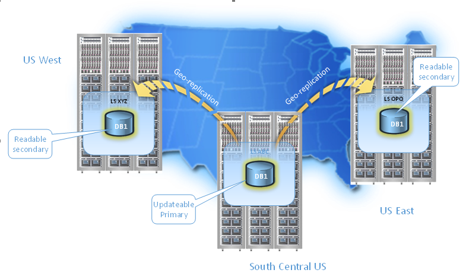

# Overview: Active geo-replication and auto-failover groups

Active geo-replication is Azure SQL Database feature that allows you to create readable replicas of your database in the same or different data center (region).

Active geo-replication is designed as a business continuity solution that allows the application to perform quick disaster recovery in case of a data center scale outage. If geo-replication is enabled, the application can initiate failover to a secondary database in a different Azure region. Up to four secondaries are supported in the same or different regions, and the secondaries can also be used for read-only access queries. The failover must be initiated manually by the application or the user. After failover, the new primary has a different connection end point.

> [!NOTE]
> Active geo-replication is available for all databases in all service tiers in all regions.
> Active Geo-replication is not available in Managed Instance.

Auto-failover groups is an extension of active geo-replication. It is designed to manage the failover of multiple geo-replicated databases simultaneously using an application initiated failover or by delegating failover to be done by the SQL Database service based on a user defined criteria. The latter allows you to automatically recover multiple related databases in a secondary region after a catastrophic failure or other unplanned event that results in full or partial loss of the SQL Database service’s availability in the primary region. Additionally, you can use the readable secondary databases to offload read-only query workloads. Because auto-failover groups involve multiple databases, these databases must be configured on the primary server. Both primary and secondary servers for the databases in the failover group must be in the same subscription. Auto-failover groups support replication of all databases in the group to only one secondary server in a different region.

> [!NOTE]
> Use active geo-replication if multiple secondaries are required.

If you are using active geo-replication and for any reason your primary database fails, or simply needs to be taken offline, you can initiate failover to any of your secondary databases. When failover is activated to one of the secondary databases, all other secondaries are automatically linked to the new primary. If you are using auto-failover groups to manage database recovery and any outage that impacts one or several of the databases in the group results in automatic failover. You can configure the auto-failover policy that best meets your application needs, or you can opt out and use manual activation. In addition, auto-failover groups provide read-write and read-only listener end-points that remain unchanged during failovers. Whether you use manual or automatic failover activation, failover switches all secondary databases in the group to primary. After the database failover is completed, the DNS record is automatically updated to redirect the end-points to the new region.

You can manage replication and failover of an individual database or a set of databases on a server or in an elastic pool using active geo-replication. You can do that using:

- The [Azure portal](sql-database-geo-replication-portal.md)
- [PowerShell: Single database](scripts/sql-database-setup-geodr-and-failover-database-powershell.md)
- [PowerShell: Elastic pool](scripts/sql-database-setup-geodr-and-failover-pool-powershell.md)
- [PowerShell: Failover Group](scripts/sql-database-setup-geodr-failover-database-failover-group-powershell.md)
- [Transact-SQL: Single database or elastic pool](/sql/t-sql/statements/alter-database-azure-sql-database)
- [REST API: Single database](https://docs.microsoft.com/rest/api/sql/replicationlinks)
- [REST API: Failover group](https://docs.microsoft.com/rest/api/sql/failovergroups).

After failover, ensure the authentication requirements for your server and database are configured on the new primary. For details, see [SQL Database security after disaster recovery](sql-database-geo-replication-security-config.md). This applies both to active geo-replication and auto-failover groups.

Active geo-replication leverages the [Always On](https://docs.microsoft.com/sql/database-engine/availability-groups/windows/overview-of-always-on-availability-groups-sql-server) technology of SQL Server to asynchronously replicate committed transactions on the primary database to a secondary database using snapshot isolation. Auto-failover groups provide the group semantics on top of active geo-replication but the same asynchronous replication mechanism is used. While at any given point, the secondary database might be slightly behind the primary database, the secondary data is guaranteed to never have partial transactions. Cross-region redundancy enables applications to quickly recover from a permanent loss of an entire datacenter or parts of a datacenter caused by natural disasters, catastrophic human errors, or malicious acts. The specific RPO data can be found at [Overview of Business Continuity](sql-database-business-continuity.md).

The following figure shows an example of active geo-replication configured with a primary in the North Central US region and secondary in the South Central US region.

Because the secondary databases are readable, they can be used to offload read-only workloads such as reporting jobs. If you are using active geo-replication, it is possible to create the secondary database in the same region with the primary, but it does not increase the application's resilience to catastrophic failures. If you are using auto-failover groups, your secondary database is always created in a different region.

In addition to disaster recovery active geo-replication can be used in the following scenarios:

- **Database migration**: You can use active geo-replication to migrate a database from one server to another online with minimum downtime.
- **Application upgrades**: You can create an extra secondary as a fail back copy during application upgrades.

To achieve real business continuity, adding database redundancy between datacenters is only part of the solution. Recovering an application (service) end-to-end after a catastrophic failure requires recovery of all components that constitute the service and any dependent services. Examples of these components include the client software (for example, a browser with a custom JavaScript), web front ends, storage, and DNS. It is critical that all components are resilient to the same failures and become available within the recovery time objective (RTO) of your application. Therefore, you need to identify all dependent services and understand the guarantees and capabilities they provide. Then, you must take adequate steps to ensure that your service functions during the failover of the services on which it depends. For more information about designing solutions for disaster recovery, see [Designing Cloud Solutions for Disaster Recovery Using active geo-replication](sql-database-designing-cloud-solutions-for-disaster-recovery.md).

## Active geo-replication capabilities

The active geo-replication feature provides the following essential capabilities:

- **Automatic Asynchronous Replication**

 You can only create a secondary database by adding to an existing database. The secondary can be created in any Azure SQL Database server. Once created, the secondary database is populated with the data copied from the primary database. This process is known as seeding. After secondary database has been created and seeded, updates to the primary database are asynchronously replicated to the secondary database automatically. Asynchronous replication means that transactions are committed on the primary database before they are replicated to the secondary database.

- **Readable secondary databases**

  An application can access a secondary database for read-only operations using the same or different security principals used for accessing the primary database. The secondary databases operate in snapshot isolation mode to ensure replication of the updates of the primary (log replay) is not delayed by queries executed on the secondary.

  > [!NOTE]
  > The log replay is delayed on the secondary database if there are schema updates on the Primary. The latter requires a schema lock on the secondary database.

- **Multiple readable secondaries**

  Two or more secondary databases increase redundancy and level of protection for the primary database and application. If multiple secondary databases exist, the application remains protected even if one of the secondary databases fails. If there is only one secondary database, and it fails, the application is exposed to higher risk until a new secondary database is created.

  > [!NOTE]
  > If you are using active geo-replication to build a globally distributed application and need to provide read-only access to data in more than four regions, you can create secondary of a secondary (a process known as chaining). This way you can achieve virtually unlimited scale of database replication. In addition, chaining reduces the overhead of replication from the primary database. The trade-off is the increased replication lag on the leaf-most secondary databases.

- **Support of elastic pool databases**

  Each replica can separately participate in an Elastic Pool or not be in any elastic pool at all. The pool choice for each replica is separate and does not depend upon the configuration of any other replica (whether Primary or Secondary). Each Elastic Pool is contained within a single region, therefore multiple replicas in the same topology can never share an Elastic Pool.

- **Configurable compute size of the secondary database**

  Both primary and secondary databases are required to have the same service tier. It is also strongly recommended that secondary database is created with the same compute size (DTUs or vCores) as the primary. A secondary with lower compute size is at risk of an increased replication lag, potential unavailability of the secondary, and consequently at risk of substantial data loss after a failover. As a result, the published RPO = 5 sec cannot be guaranteed. The other risk is that after failover the application’s performance will be impacted due to insufficient compute capacity of the new primary until it is upgraded to a higher compute size. The time of the upgrade depends on the database  size. In addition, currently such upgrade requires that both primary and secondary databases are online and, therefore, cannot be completed until the outage is mitigated. If you decide to create the secondary with lower compute size, the log IO percentage chart on Azure portal provides a good way to estimate the minimal compute size of the secondary that is required to sustain the replication load. For example, if your Primary database is P6 (1000 DTU) and its log IO percent is 50% the secondary needs to be at least P4 (500 DTU). You can also retrieve the log IO data using [sys.resource_stats](/sql/relational-databases/system-catalog-views/sys-resource-stats-azure-sql-database) or [sys.dm_db_resource_stats](/sql/relational-databases/system-dynamic-management-views/sys-dm-db-resource-stats-azure-sql-database) database views.  For more information on the SQL Database compute sizes, see [What are SQL Database Service Tiers](sql-database-service-tiers.md).

- **User-controlled failover and failback**

  A secondary database can explicitly be switched to the primary role at any time by the application or the user. During a real outage the “unplanned” option should be used, which immediately promotes a secondary to be the primary. When the failed primary recovers and is available again, the system automatically marks the recovered primary as a secondary and bring it up-to-date with the new primary. Due to the asynchronous nature of replication, a small amount of data can be lost during unplanned failovers if a primary fails before it replicates the most recent changes to the secondary. When a primary with multiple secondaries fails over, the system automatically reconfigures the replication relationships and links the remaining secondaries to the newly promoted primary without requiring any user intervention. After the outage that caused the failover is mitigated, it may be desirable to return the application to the primary region. To do that, the failover command should be invoked with the “planned” option.

- **Keeping credentials and firewall rules in sync**

  We recommend using [database firewall rules](sql-database-firewall-configure.md) for geo-replicated databases so these rules can be replicated with the database to ensure all secondary databases have the same firewall rules as the primary. This approach eliminates the need for customers to manually configure and maintain firewall rules on servers hosting both the primary and secondary databases. Similarly, using [contained database users](sql-database-manage-logins.md) for data access ensures both primary and secondary databases always have the same user credentials so during a failover, there is no disruptions due to mismatches with logins and passwords. With the addition of [Azure Active Directory](../active-directory/fundamentals/active-directory-whatis.md), customers can manage user access to both primary and secondary databases and eliminating the need for managing credentials in databases altogether.

## Auto-failover group capabilities

Auto-failover groups feature provides a powerful abstraction of active geo-replication by supporting group level replication and automatic failover. In addition, it removes the necessity to change the SQL connection string after failover by providing the additional listener end-points.

> [!NOTE]
> Auto-failover is not available in Managed Instance.
>  

- **Failover group**

  One or many failover groups can be created between two servers in different regions (primary and secondary servers). Each group can include one or several databases that are recovered as a unit in case all or some primary databases become unavailable due to an outage in the primary region.  

- **Primary server**

  A server that hosts the primary databases in the failover group.

- **Secondary server**

  A server that hosts the secondary databases in the failover group. The secondary server cannot be in the same region as the primary server.

- **Adding databases to failover group**

  You can put several databases within a server or within an elastic pool into the same failover group. If you add a single database to the group, it automatically creates a secondary database using the same edition and compute size. If the primary database is in an elastic pool, the secondary is automatically created in the elastic pool with the same name. If you add a database that already has a secondary database in the secondary server, that geo-replication is inherited by the group.

  > [!NOTE]
  > When adding a database that already has a secondary database in a server that is not part of the failover group, a new secondary is created in the secondary server.

- **Failover group read-write listener**

  A DNS CNAME record formed as **&lt;failover-group-name&gt;.database.windows.net** that points to the current primary server URL. It allows the read-write SQL applications to transparently reconnect to the primary database when the primary changes after failover.

- **Failover group read-only listener**

  A DNS CNAME record formed as **&lt;failover-group-name&gt;.secondary.database.windows.net** that points to the secondary server’s URL. It allows the read-only SQL applications to transparently connect to the secondary database using the specified load-balancing rules.

- **Automatic failover policy**

  By default, the failover group is configured with an automatic failover policy. The system triggers failover after the failure is detected and the grace period has expired. The system must verify that the outage cannot be mitigated by the built-in high availability infrastructure of the SQL Database service due the scale of the impact. If you want to control the failover workflow from the application, you can turn off automatic failover.

- **Read-only failover policy**

  By default, the failover of the read-only listener is disabled. It ensures that the performance of the primary is not impacted when the secondary is offline. However, it also means the read-only sessions will not be able to connect until the secondary is recovered. If you cannot tolerate downtime for the readonly sessions and are OK to temporarily use the primary for both read-only and read-write traffic at the expense of the potential performance degradation of the primary, you can enable failover for the read-only listener. In that case the read-only traffic will be automatically redirected to the primary server if the secondary server is not available.  

- **Manual failover**

  You can initiate failover manually at any time regardless of the automatic failover configuration. If automatic failover policy is not configured, manual failover is required to recover databases in the failover group. You can initiate forced or friendly failover (with full data synchronization). The latter could be used to relocate the active server to the primary region. When failover is completed, the DNS records are automatically updated to ensure connectivity to the correct server.

- **Grace period with data loss**

  Because the primary and secondary databases are synchronized using asynchronous replication, the failover may result in data loss. You can customize the automatic failover policy to reflect your application’s tolerance to data loss. By configuring **GracePeriodWithDataLossHours**, you can control how long the system waits before initiating the failover that is likely to result data loss.

  > [!NOTE]
  > When system detects that the databases in the group are still online (for example, the outage only impacted the service control plane), it immediately activates the failover with full data synchronization (friendly failover) regardless of the value set by **GracePeriodWithDataLossHours**. This behavior ensures that there is no data loss during the recovery. The grace period takes effect only when a friendly failover is not possible. If the outage is mitigated before the grace period expires, the failover is not activated.

- **Multiple failover groups**

  You can configure multiple failover groups for the same pair of servers to control the scale of failovers. Each group fails over independently. If your multi-tenant application uses elastic pools, you can use this capability to mix primary and secondary databases in each pool. This way you can reduce the impact of an outage to only half of the tenants.

## Best practices of using failover groups for business continuity

When designing a service with business continuity in mind, you should follow these guidelines:

- **Use one or several failover groups to manage failover of multiple databases**

  One or many failover groups can be created between two servers in different regions (primary and secondary servers). Each group can include one or several databases that are recovered as a unit in case all or some primary databases become unavailable due to an outage in the primary region. The failover group creates geo-secondary database with the same service objective as the primary. If you add an existing geo-replication relationship to the failover group, make sure the geo-secondary is configured with the same service tier and compute size as the primary.

- **Use read-write listener for OLTP workload**

  When performing OLTP operations, use **&lt;failover-group-name&gt;.database.windows.net** as the server URL and the connections are automatically directed to the primary. This URL does not change after the failover. Note the failover involves updating the DNS record so the client connections are redirected to the new primary only after the client DNS cache is refreshed.

- **Use read-only listener for read-only workload**

  If you have a logically isolated read-only workload that is tolerant to certain staleness of data, you can use the secondary database in the application. For read-only sessions, use **&lt;failover-group-name&gt;.secondary.database.windows.net** as the server URL and the connection is automatically directed to the secondary. It is also recommended that you indicate in connection string read intent by using **ApplicationIntent=ReadOnly**.

- **Be prepared for perf degradation**

  SQL failover decision is independent from the rest of the application or other services used. The application may be “mixed” with some components in one region and some in another. To avoid the degradation, ensure the redundant application deployment in the DR region and follow the guidelines in this article. Note the application in the DR region does not have to use a different connection string.  

- **Prepare for data loss**

  If an outage is detected, SQL automatically triggers read-write failover if there is zero data loss to the best of our knowledge. Otherwise, it waits for the period you specified by **GracePeriodWithDataLossHours**. If you specified **GracePeriodWithDataLossHours**, be prepared for data loss. In general, during outages, Azure favors availability. If you cannot afford data loss, make sure to set **GracePeriodWithDataLossHours** to a sufficiently large number, such as 24 hours.

> [!IMPORTANT]
> Elastic pools with 800 or fewer DTUs and more than 250 databases using geo-replication may encounter issues including longer planned failovers and degraded performance.  These issues are more likely to occur for write intensive workloads, when geo-replication endpoints are widely separated by geography, or when multiple secondary endpoints are used for each database.  Symptoms of these issues are indicated when the geo-replication lag increases over time.  This lag can be monitored using [sys.dm_geo_replication_link_status](/sql/relational-databases/system-dynamic-management-views/sys-dm-geo-replication-link-status-azure-sql-database).  If these issues occur, then mitigations include increasing the number of pool DTUs, or reducing the number of geo-replicated databases in the same pool.

## Failover groups and network security

For some applications the security rules require that the network access to the data tier is restricted to a specific component or components such as a VM, web service etc. This requirement presents some challenges for business continuity design and the use of the failover groups. You should consider the following options when implementing such restricted access.

### Using failover groups and virtual network rules

If you are using [Virtual Network service endpoints and rules](sql-database-vnet-service-endpoint-rule-overview.md) to restrict access to your SQL database, be aware that Each Virtual Network service endpoint applies to only one Azure region. The endpoint does not enable other regions to accept communication from the subnet. Therefore, only the client applications deployed in the same region can connect to the primary database. Since the failover results in the SQL client sessions being rerouted to a server in a different (secondary) region, these sessions will fail if originated from a client outside of that region. For that reason, the automatic failover policy cannot be enabled if the participating servers are included in the Virtual Network rules. To support manual failover, follow these steps:

1. Provision the redundant copies of the front end components of your application (web service, virtual machines etc.) in the secondary region
2. Configure the [virtual network rules](sql-database-vnet-service-endpoint-rule-overview.md) individually for primary and secondary server
3. Enable the [front-end failover using a Traffic manager configuration](sql-database-designing-cloud-solutions-for-disaster-recovery.md#scenario-1-using-two-azure-regions-for-business-continuity-with-minimal-downtime)
4. Initiate manual failover when the outage is detected

This option is optimized for the applications that require consistent latency between the front-end and the data tier and supports recovery when either front end, data tier or both are impacted by the outage.

> [!NOTE]
> If you are using the **read-only listener** to load-balance a read-only workload, make sure that this workload is executed in a VM or other resorce in the secondary region so it can connect to the secondary database.

### Using failover groups and SQL database firewall rules

If your business continuity plan requires failover using groups with automatic failover, you can restrict access to your SQL database using the traditional firewall rules.  To support automatic failover, follow these steps:

1. [Create a public IP](../virtual-network/virtual-network-public-ip-address.md#create-a-public-ip-address)
2. [Create a public load balancer](../load-balancer/quickstart-create-basic-load-balancer-portal.md#create-a-basic-load-balancer) and assign the public IP to it.
3. [Create a virtual network and the virtual machines](../load-balancer/quickstart-create-basic-load-balancer-portal.md#create-back-end-servers) for your front-end components
4. [Create network security group](../virtual-network/security-overview.md) and configure inbound connections.
5. Ensure that the outbound connections are open to Azure SQL database by using ‘Sql’ [service tag](../virtual-network/security-overview.md#service-tags).
6. Create a [SQL database firewall rule](sql-database-firewall-configure.md) to allow inbound traffic from the public IP address you create in step 1.

For more information about on how to configure outbound access and what IP to use in the firewall rules, see [Load balancer outbound connections](../load-balancer/load-balancer-outbound-connections.md).

The above configuration will ensure that the automatic failover will not block connections from the front-end components and assumes that the application can tolerate the longer latency between the front end and the data tier.

> [!IMPORTANT]
> To guarantee business continuity for regional outages you must ensure geographic redundancy for both front-end components and the databases.

## Upgrading or downgrading a primary database

You can upgrade or downgrade a primary database to a different compute size (within the same service tier) without disconnecting any secondary databases. When upgrading, we recommend that you upgrade the secondary database first, and then upgrade the primary. When downgrading, reverse the order: downgrade the primary first, and then downgrade the secondary. When you upgrade or downgrade the database to a different service tier, this recommendation is enforced.

> [!NOTE]
> If you created secondary database as part of the failover group configuration it is not recommended to downgrade the secondary database. This is to ensure your data tier has sufficient capacity to process your regular workload after failover is activated.

## Preventing the loss of critical data

Due to the high latency of wide area networks, continuous copy uses an asynchronous replication mechanism. Asynchronous replication makes some data loss unavoidable if a failure occurs. However, some applications may require no data loss. To protect these critical updates, an application developer can call the [sp_wait_for_database_copy_sync](/sql/relational-databases/system-stored-procedures/active-geo-replication-sp-wait-for-database-copy-sync) system procedure immediately after committing the transaction. Calling **sp_wait_for_database_copy_sync** blocks the calling thread until the last committed transaction has been transmitted to the secondary database. However, it does not wait for the transmitted transactions to be replayed and committed on the secondary. **sp_wait_for_database_copy_sync** is scoped to a specific continuous copy link. Any user with the connection rights to the primary database can call this procedure.

> [!NOTE]
> **sp_wait_for_database_copy_sync** prevents data loss after failover, but does not guarantee full synchronization for read access. The delay caused by a **sp_wait_for_database_copy_sync** procedure call can be significant and depends on the size of the transaction log at the time of the call.

## Programmatically managing failover groups and active geo-replication

As discussed previously, auto-failover groups and active geo-replication can also be managed programmatically using Azure PowerShell and the REST API. The following tables describe the set of commands available. Active geo-replication includes a set of Azure Resource Manager APIs for management, including the [Azure SQL Database REST API](https://docs.microsoft.com/rest/api/sql/) and [Azure PowerShell cmdlets](https://docs.microsoft.com/powershell/azure/overview). These APIs require the use of resource groups and support role-based security (RBAC). For more information on how to implement access roles, see [Azure Role-Based Access Control](../role-based-access-control/overview.md).

### Manage SQL database failover using Transact-SQL

| Command | Description |
| --- | --- |
| [ALTER DATABASE (Azure SQL Database)](/sql/t-sql/statements/alter-database-azure-sql-database) |Use ADD SECONDARY ON SERVER argument to create a secondary database for an existing database and starts data replication |
| [ALTER DATABASE (Azure SQL Database)](/sql/t-sql/statements/alter-database-azure-sql-database) |Use FAILOVER or FORCE_FAILOVER_ALLOW_DATA_LOSS to switch a secondary database to be primary to initiate failover |
| [ALTER DATABASE (Azure SQL Database)](/sql/t-sql/statements/alter-database-azure-sql-database) |Use REMOVE SECONDARY ON SERVER to terminate a data replication between a SQL Database and the specified secondary database. |
| [sys.geo_replication_links (Azure SQL Database)](/sql/relational-databases/system-dynamic-management-views/sys-geo-replication-links-azure-sql-database) |Returns information about all existing replication links for each database on the Azure SQL Database logical server. |
| [sys.dm_geo_replication_link_status (Azure SQL Database)](/sql/relational-databases/system-dynamic-management-views/sys-dm-geo-replication-link-status-azure-sql-database) |Gets the last replication time, last replication lag, and other information about the replication link for a given SQL database. |
| [sys.dm_operation_status (Azure SQL Database)](/sql/relational-databases/system-dynamic-management-views/sys-dm-operation-status-azure-sql-database) |Shows the status for all database operations including the status of the replication links. |
| [sp_wait_for_database_copy_sync (Azure SQL Database)](/sql/relational-databases/system-stored-procedures/active-geo-replication-sp-wait-for-database-copy-sync) |causes the application to wait until all committed transactions are replicated and acknowledged by the active secondary database. |
|  | |

### Manage SQL database failover using PowerShell

| Cmdlet | Description |
| --- | --- |
| [Get-AzureRmSqlDatabase](/powershell/module/azurerm.sql/get-azurermsqldatabase) |Gets one or more databases. |
| [New-AzureRmSqlDatabaseSecondary](/powershell/module/azurerm.sql/new-azurermsqldatabasesecondary) |Creates a secondary database for an existing database and starts data replication. |
| [Set-AzureRmSqlDatabaseSecondary](/powershell/module/azurerm.sql/set-azurermsqldatabasesecondary) |Switches a secondary database to be primary to initiate failover. |
| [Remove-AzureRmSqlDatabaseSecondary](/powershell/module/azurerm.sql/remove-azurermsqldatabasesecondary) |Terminates data replication between a SQL Database and the specified secondary database. |
| [Get-AzureRmSqlDatabaseReplicationLink](/powershell/module/azurerm.sql/get-azurermsqldatabasereplicationlink) |Gets the geo-replication links between an Azure SQL Database and a resource group or SQL Server. |
| [New-AzureRmSqlDatabaseFailoverGroup](/powershell/module/azurerm.sql/set-azurermsqldatabasefailovergroup) |This command creates a failover group and registers it on both primary and secondary servers|
| [Remove-AzureRmSqlDatabaseFailoverGroup](/powershell/module/azurerm.sql/remove-azurermsqldatabasefailovergroup) | Removes the failover group from the server and deletes all secondary databases included the group |
| [Get-AzureRmSqlDatabaseFailoverGroup](/powershell/module/azurerm.sql/get-azurermsqldatabasefailovergroup) | Retrieves the failover group configuration |
| [Set-AzureRmSqlDatabaseFailoverGroup](/powershell/module/azurerm.sql/set-azurermsqldatabasefailovergroup) |Modifies the configuration of the failover group |
| [Switch-AzureRMSqlDatabaseFailoverGroup](/powershell/module/azurerm.sql/switch-azurermsqldatabasefailovergroup) | Triggers failover of the failover group to the secondary server |
|  | |

> [!IMPORTANT]
> For sample scripts, see [Configure and failover a single database using active geo-replication](scripts/sql-database-setup-geodr-and-failover-database-powershell.md), [Configure and failover a pooled database using active geo-replication](scripts/sql-database-setup-geodr-and-failover-pool-powershell.md), and [Configure and failover a failover group for a single database](scripts/sql-database-setup-geodr-failover-database-failover-group-powershell.md).
>

### Manage SQL database failover using the REST API

| API | Description |
| --- | --- |
| [Create or Update Database (createMode=Restore)](https://docs.microsoft.com/rest/api/sql/databases/databases_createorupdate) |Creates, updates, or restores a primary or a secondary database. |
| [Get Create or Update Database Status](https://docs.microsoft.com/rest/api/sql/databases/databases_createorupdate) |Returns the status during a create operation. |
| [Set Secondary Database as Primary (Planned Failover)](https://docs.microsoft.com/rest/api/sql/replicationlinks/replicationlinks_failover) |Sets which replica database is primary by failing over from the current primary replica database. |
| [Set Secondary Database as Primary (Unplanned Failover)](https://docs.microsoft.com/rest/api/sql/replicationlinks/replicationlinks_failoverallowdataloss) |Sets which replica database is primary by failing over from the current primary replica database. This operation might result in data loss. |
| [Get Replication Link](https://docs.microsoft.com/rest/api/sql/replicationlinks/replicationlinks_get) |Gets a specific replication link for a given SQL database in a geo-replication partnership. It retrieves the information visible in the sys.geo_replication_links catalog view. |
| [Replication Links - List By Database](https://docs.microsoft.com/rest/api/sql/replicationlinks/replicationlinks_listbydatabase) | Gets all replication links for a given SQL database in a geo-replication partnership. It retrieves the information visible in the sys.geo_replication_links catalog view. |
| [Delete Replication Link](https://docs.microsoft.com/rest/api/sql/replicationlinks/replicationlinks_delete) | Deletes a database replication link. Cannot be done during failover. |
| [Create or Update Failover Group](https://docs.microsoft.com/rest/api/sql/failovergroups/failovergroups_createorupdate) | Creates or updates a failover group |
| [Delete Failover Group](https://docs.microsoft.com/rest/api/sql/failovergroups/failovergroups_delete) | Removes the failover group from the server |
| [Failover (Planned)](https://docs.microsoft.com/rest/api/sql/failovergroups/failovergroups_failover) | Fails over from the current primary server to this server. |
| [Force Failover Allow Data Loss](https://docs.microsoft.com/rest/api/sql/failovergroups/failovergroups_forcefailoverallowdataloss) |ails over from the current primary server to this server. This operation might result in data loss. |
| [Get Failover Group](https://docs.microsoft.com/rest/api/sql/failovergroups/failovergroups_get) | Gets a failover group. |
| [List Failover Groups By Server](https://docs.microsoft.com/rest/api/sql/failovergroups/failovergroups_listbyserver) | Lists the failover groups in a server. |
| [Update Failover Group](https://docs.microsoft.com/rest/api/sql/failovergroups/failovergroups_update) | Updates a failover group. |
|  | |

## Next steps

- For sample scripts, see:
  - [Configure and failover a single database using active geo-replication](scripts/sql-database-setup-geodr-and-failover-database-powershell.md)
  - [Configure and failover a pooled database using active geo-replication](scripts/sql-database-setup-geodr-and-failover-pool-powershell.md)
  - [Configure and failover a failover group for a single database](scripts/sql-database-setup-geodr-failover-database-failover-group-powershell.md)
- For a business continuity overview and scenarios, see [Business continuity overview](sql-database-business-continuity.md)
- To learn about Azure SQL Database automated backups, see [SQL Database automated backups](sql-database-automated-backups.md).
- To learn about using automated backups for recovery, see [Restore a database from the service-initiated backups](sql-database-recovery-using-backups.md).
- To learn about authentication requirements for a new primary server and database, see [SQL Database security after disaster recovery](sql-database-geo-replication-security-config.md).
