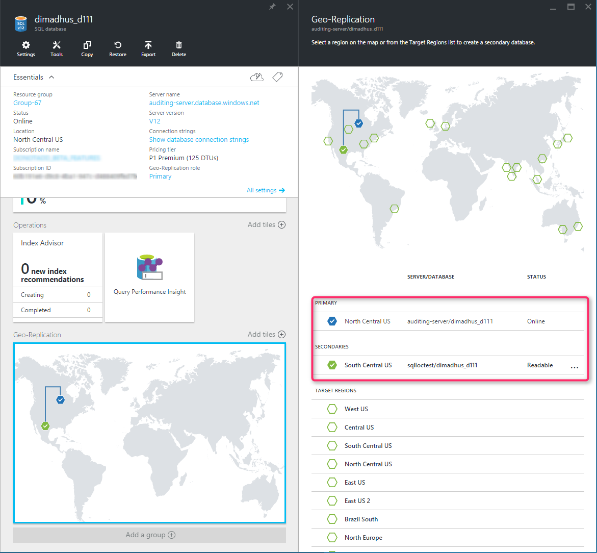

<properties
	pageTitle="Active Geo-Replication for Azure SQL Database"
	description="Active Geo-Replication enables you to setup 4 replicas of your database in any of the Azure datacenters."
	services="sql-database"
	documentationCenter="na"
	authors="stevestein"
	manager="jhubbard"
	editor="monicar" />

<tags
	ms.service="sql-database"
	ms.devlang="na"
	ms.topic="article"
	ms.tgt_pltfrm="na"
   ms.workload="NA"
	ms.date="07/14/2016"
	ms.author="sstein" />

# Overview: SQL Database Active Geo-Replication

Active Geo-Replication enables you to configure up to 4 readable secondary databases in the same or different data center locations (regions). Secondary databases are available for querying and for failover in the case of a data center outage or the inability to connect to the primary database.

>[AZURE.NOTE] Active Geo-Replication (readable secondaries) is now available for all databases in all service tiers. In April 2017, the non-readable secondary type will be retired and existing non-readable databases will automatically be upgraded to readable secondaries.

 You can configure Active Geo-Replication using the [Azure Portal](sql-database-geo-replication-portal.md), [PowerShell](sql-database-geo-replication-powershell.md), [Transact-SQL](sql-database-geo-replication-transact-sql.md), or the [REST API - Create or Update Database](https://msdn.microsoft.com/library/azure/mt163685.aspx).

> [AZURE.SELECTOR]
- [Configure: Azure Portal](sql-database-geo-replication-portal.md)
- [Configure: PowerShell](sql-database-geo-replication-powershell.md)
- [Configure: T-SQL](sql-database-geo-replication-transact-sql.md)

If for any reason your primary database fails, or simply needs to be taken offline, you can *failover* to any of your secondary databases. When failover is activated to one of the secondary databases, all other secondaries are automatically linked to the new primary.

You can failover to a secondary using the [Azure portal](sql-database-geo-replication-failover-portal.md), [PowerShell](sql-database-geo-replication-failover-powershell.md), [Transact-SQL](sql-database-geo-replication-failover-transact-sql.md), the [REST API - Planned Failover](https://msdn.microsoft.com/ibrary/azure/mt575007.aspx), or [REST API - Unplanned Failover](https://msdn.microsoft.com/library/azure/mt582027.aspx).

> [AZURE.SELECTOR]
- [Failover: Azure portal](sql-database-geo-replication-failover-portal.md)
- [Failover: PowerShell](sql-database-geo-replication-failover-powershell.md)
- [Failover: T-SQL](sql-database-geo-replication-failover-transact-sql.md)

The Active Geo-Replication feature implements a mechanism to provide database redundancy within the same Microsoft Azure region or in different regions (geo-redundancy). Active Geo-Replication asynchronously replicates committed transactions from a database to up to four copies of the database on different servers, using read committed snapshot isolation (RCSI) for isolation. When Active Geo-Replication is configured a secondary database is created on the specified server. The original database becomes the primary database. The primary database asynchronously replicates committed transactions to each of the secondary databases. While at any given point, the secondary database might be slightly behind the primary database, the secondary data is guaranteed to always be transactionally consistent with changes committed to the primary database.

One of the primary benefits of Active Geo-Replication is that it provides a database-level disaster recovery solution with very low recovery time. When you place the secondary database on a server in a different region you add maximum resilience to your application. The cross-region redundancy enables applications to recover from a permanent loss of an entire datacenter or parts of a datacenter caused by natural disasters, catastrophic human errors, or malicious acts. The following figure shows an example of Active Geo-Replication configured on a Premium database with a primary in the North Central US region and secondary in the South Central US region.

Another key benefit is that the secondary databases are readable and can be used to offload read-only workloads such as reporting jobs. If you only intend to use the secondary database for load-balancing, you can create it in the same region as the primary. This however will not increase the application's resilience to catastrophic failures.  

Other scenarios where Active Geo-Replication can be used include:

- **Database migration**: You can use Active Geo-Replication to migrate a database from one server to another online with minimum downtime.
- **Application upgrades**: You can create an extra secondary as a fail back copy during application upgrades.

To achieve real business continuity, adding database redundancy between datacenters is only part of the solution. Recovering an application (service) end-to-end after a catastrophic failure requires recovery of all components that constitute the service and any dependent services. Examples of these components include the client software (for example, a browser with a custom JavaScript), web front ends, storage, and DNS. It is critical that all components are resilient to the same failures and become available within the recovery time objective (RTO) of your application. Therefore, you need to identify all dependent services and understand the guarantees and capabilities they provide. Then, you must take adequate steps to ensure that your service functions during the failover of the services on which it depends. For more information about designing solutions for disaster recovery, see [Designing Cloud Solutions for Disaster Recovery Using Active Geo-Replication](sql-database-designing-cloud-solutions-for-disaster-recovery.md).

## Active Geo-Replication capabilities
The Active Geo-Replication feature provides the following essential capabilities:

- **Automatic Asynchronous Replication**: You can only create a secondary database by adding to an existing database. The secondary can only be created in a different Azure SQL Database server. Once created the secondary database is populated with the data copied from the primary database. This process is known as seeding. After secondary database has been created and seeded, updates to the primary database are asynchronously replicated to the secondary database automatically. This means that transactions are committed on the primary database before they are replicated to the secondary database. SQL Database guarantees that once seeding is completed the secondary database remains transactionally consistent at all times. 

- **Multiple secondary databases**: Two or more secondary databases increase redundancy and level of protection for the primary database and application. If multiple secondary databases exist, the application will remain protected even if one of the secondary databases fails. If there is only one secondary database, and it fails, the application is exposed to higher risk until a new secondary database is created.

- **Readable secondary databases**: An application can access a secondary database for read-only operations using the same or different security principals used for accessing the primary database. The secondary databases operate in snapshot isolation mode to ensure replication of the updates of the primary (log replay) is not delayed by queries executed on the secondary.

>[AZURE.NOTE] The log replay will be delayed on the secondary if there are schema updates that it is receiving from the Primary as it requires a schema lock on the secondary database.

- **Active geo-replication of elastic pool databases**: Active Geo-Replication can be configured for any database in any elastic database pool. The secondary database can be in another elastic database pool. For regular databases, the secondary can be an elastic database pool and vice versa as long as the service tiers are the same. 

- **Configurable performance level of the secondary database**: A secondary database can be created with lower performance level than the primary. Both primary and secondary databases are required to have the same service tier. This option is not recommended for applications with high database write activity as it may result in increased replication lag and therefore, has high risk of substantial data loss after failover. In addition, after failover the application’s performance will be impacted until the new primary is upgraded to a higher performance level. The log IO percentage chart on Azure Portal provides a good way to estimate the minimal performance level of the secondary that will be required to sustain the replication load. For example, if your Primary database is P6 (1000 DTU) and its log IO percent is 50% the secondary needs to be at least P4 (500 DTU). You can also retrieve the log IO data using [sys.resource_stats](https://msdn.microsoft.com/library/dn269979.aspx) or [sys.dm_db_resource_stats]( https://msdn.microsoft.com/library/dn800981.aspx) database views.  For more information on the SQL Database performance levels, see [SQL Database options and performance](sql-database-service-tiers.md). 

- **User-controlled failover and failback**: A secondary database can be switched to the primary role at any time via an explicit action by the application or the user. During a real outage the “unplanned” option should be used, which will immediately promote a secondary to primary. When the failed primary recovers and is available again, the system will automatically mark it as a secondary and bring it up-to-date with the new primary. Due to the asynchronous nature of replication a small amount of data can be lost during unplanned failovers if a primary fails before it replicates the most recent changes to the secondary. When a primary with multiple secondaries fails over the system will automatically reconfigure the replication relationships and link the remaining secondaries to the newly promoted primary without requiring any user intervention. After the outage that caused the failover is mitigated it may be desirable to return the application to the primary region. To do that the failover command should be invoked with the “planned” option. 

- **Keeping credentials and firewall rules in sync**: We recommend the use of [database firewall rules](sql-database-firewall-configure.md) for geo-replicated databases so that these rules can be replicated with the database to ensure all secondary databases have the same firewall configuration as the primary. This eliminates the need for customers to manually configure and maintain firewall rules on servers hosting both the primary and secondary databases. Similarly, using [contained database users](sql-database-manage-logins.md) for data access ensures both primary and secondary databases always have the same user credentials so that in case of failovers there will be no disruptions due to mismatch in logins and passwords. With the addition of [Azure Active Directory](../active-directory/active-directory-whatis.md) customers can manage user access to both primary and secondary databases and eliminating the need for managing credentials in databases all together.

## Preventing the loss of critical data
Due to the high latency of wide area networks, continuous copy uses an asynchronous replication mechanism. This makes some data loss unavoidable if a failure occurs. However, some applications may require no data loss. To protect these critical updates, an application developer can call the [sp_wait_for_database_copy_sync](https://msdn.microsoft.com/library/dn467644.aspx) system procedure immediately after committing the transaction. Calling **sp_wait_for_database_copy_sync** blocks the calling thread until the last committed transaction has been replicated to the secondary database. The procedure will wait until all queued transactions have been acknowledged by the secondary database. **sp_wait_for_database_copy_sync** is scoped to a specific continuous copy link. Any user with the connection rights to the primary database can call this procedure.

>[AZURE.NOTE] The delay caused by a **sp_wait_for_database_copy_sync** procedure call might be significant. The delay depends on the size of the transaction log length at the moment and will not return until the entire log is replicated. Avoid calling this procedure unless absolutely necessary.

## Programmatically managing Active Geo-Replication

As discussed above, in addiition to the Azure portal, Active Geo-Replication can be managed programmically using Azure PowerShell and the REST API. The tables below describe the set of commands available.

- **Azure Resource Manager API and role-based security**: Active Geo-Replication includes a set of [Azure Resource Manager (ARM) APIs]( https://msdn.microsoft.com/library/azure/mt163571.aspx) for management, including [ARM-based PowerShell cmdlets](sql-database-geo-replication-powershell.md). These APIs require the use of resource groups and support role based security (RBAC). For more information on how to implement access roles see [Azure Role-Based Access Control](../active-directory/role-based-access-control-configure.md).

>[AZURE.NOTE] Many new features of Active Geo-Replication are only supported using [Azure Resource Manager (ARM)](../resource-group-overview.md) based [Azure SQL REST API](https://msdn.microsoft.com/library/azure/mt163571.aspx) and [Azure SQL Database PowerShell cmdlets](https://msdn.microsoft.com/library/azure/mt574084.aspx). The existing [Azure SQL Service Management (classic) REST API](https://msdn.microsoft.com/library/azure/dn505719.aspx) and [Azure SQL Database (classic) cmdlets](https://msdn.microsoft.com/library/azure/dn546723.aspx) are supported for backward compatibility so using the ARM based APIs are recommended. 

### Transact-SQL

|Command|Description|
|-------|-----------|
|[ALTER DATABASE (Azure SQL Database)](https://msdn.microsoft.com/library/mt574871.aspx)|Use ADD SECONDARY ON SERVER argument to create a secondary database for an existing database and starts data replication|
|[ALTER DATABASE (Azure SQL Database)](https://msdn.microsoft.com/library/mt574871.aspx)|Use FAILOVER or FORCE_FAILOVER_ALLOW_DATA_LOSS to switch a secondary database to be primary in order to initiate failover
|[ALTER DATABASE (Azure SQL Database)](https://msdn.microsoft.com/library/mt574871.aspx)|Use REMOVE SECONDARY ON SERVER to terminate a data replication between a SQL Database and the specified secondary database.|
|[sys.geo_replication_links (Azure SQL Database)](https://msdn.microsoft.com/library/mt575501.aspx)|Returns information about all exiting replication links for each database on the Azure SQL Database logical server.|
|[sys.dm_geo_replication_link_status (Azure SQL Database)](https://msdn.microsoft.com/library/mt575504.aspx)|Gets the last replication time, last replication lag and other information about the replication link for a given SQL database.|
|[sys.dm_operation_status (Azure SQL Database)](https://msdn.microsoft.com/library/dn270022.aspx)|Shows the status for all database operations including the status of the replication links.|
|[sp_wait_for_database_copy_sync (Azure SQL Database)](https://msdn.microsoft.com/library/dn467644.aspx)|causes the application to wait until all committed transactions are replicated and acknowledged by the active secondary database.|
||||

### PowerShell

|Cmdlet|Description|
|------|-----------|
|[Get-AzureRmSqlDatabase](https://msdn.microsoft.com/en-us/library/azure/mt603648.aspx)|Gets one or more databases.|
|[New-AzureRmSqlDatabaseSecondary](https://msdn.microsoft.com/library/mt603689.aspx)|Creates a secondary database for an existing database and starts data replication.|
|[Set-AzureRmSqlDatabaseSecondary](https://msdn.microsoft.com/en-us/library/mt619393.aspx)|Switches a secondary database to be primary in order to initiate failover.|
|[Remove-AzureRmSqlDatabaseSecondary](https://msdn.microsoft.com/en-us/library/mt603457.aspx)|Terminates data replication between a SQL Database and the specified secondary database.|
|[Get-AzureRmSqlDatabaseReplicationLink](https://msdn.microsoft.com/library/mt619330.aspx)|Gets the geo-replication links between an Azure SQL Database and a resource group or SQL Server.|
||||

### REST API

|API|Description|
|---|-----------|
|[Create or Update Database (createMode=Restore)](https://msdn.microsoft.com/library/azure/mt163685.aspx)|Creates, updates, or restores a primary or a secondary database.|
|[Get Create or Update Database Status](https://msdn.microsoft.com/library/azure/mt643934.aspx)|Returns the status during a create operation.|
|[Set Secondary Database as Primary (Planned Failover)r](https://msdn.microsoft.com/ibrary/azure/mt575007.aspx)|Promote a secondary database in a Geo-Replication partnership to become the new primary database.|
|[Set Secondary Database as Primary (Unplanned Failover)](https://msdn.microsoft.com/library/azure/mt582027.aspx)|To force a failover to the secondary database and set the secondary as the primary.|
|[Get Replication Links](https://msdn.microsoft.com/library/azure/mt600929.aspx)|Gets all replication links for a given SQL database in a geo-replication partnership. It retrieves the information visible in the sys.geo_replication_links catalog view.|
|[Get Replication Link](https://msdn.microsoft.com/library/azure/mt600778.aspx)|Gets a specific replication link for a given SQL database in a geo-replication partnership. It retrieves the information visible in the sys.geo_replication_links catalog view.|
||||

## Next steps

- For a business continuity overview and scenarios, see [Business continuity overview](sql-database-business-continuity.md)
- To learn about Azure SQL Database automated backups, see [SQL Database automated backups](sql-database-automated-backups.md).
- To learn about using automated backups for recovery, see [restore a database from the service-initiated backups](sql-database-recovery-using-backups.md).
- To learn about using automated backups for archiving, see [database copy](sql-database-copy.md).
