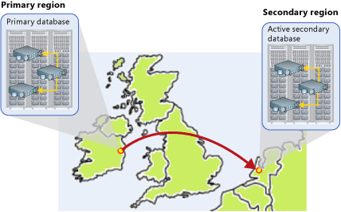

<properties
	pageTitle="Active Geo-Replication for Azure SQL Database"
	description="This topic explains Active Geo-Replication for SQL Database and its uses."
	services="sql-database"
	documentationCenter="na"
	authors="rothja"
	manager="jeffreyg"
	editor="monicar" />

<tags
	ms.service="sql-database"
	ms.devlang="na"
	ms.topic="article"
	ms.tgt_pltfrm="na"
	ms.workload="data-management"
	ms.date="10/21/2015"
	ms.author="jroth" />

# Active Geo-Replication for Azure SQL Database

## Overview
The Active Geo-Replication feature implements a mechanism to provide database redundancy within the same Microsoft Azure region or in different regions (geo-redundancy). Active Geo-Replication asynchronously replicates committed transactions from a database to up to four copies of the database on different servers. The original database becomes the primary database of the continuous copy. Each continuous copy is referred to as an online secondary database. The primary database asynchronously replicates committed transactions to each of the online secondary databases. While at any given point, the online secondary data might be slightly behind the primary database, the online secondary data is guaranteed to always be transactionally consistent with changes committed to the primary database. Active Geo-Replication supports up to four online secondaries, or up to three online secondaries and one offline secondary.

One of the primary benefits of Active Geo-Replication is that it provides a database-level disaster recovery solution. Using Active Geo-Replication, you can configure a user database in the Premium service tier to replicate transactions to databases on different Microsoft Azure SQL Database servers within the same or different regions. Cross-region redundancy enables applications to recover from a permanent loss of a datacenter caused by natural disasters, catastrophic human errors, or malicious acts. 

Another key benefit is that the online secondary databases are readable. Therefore, an online secondary can act as a load balancer for read workloads such as reporting. While you can create an online secondary in a different region for disaster recovery, you could also have an online secondary in the same region on a different server. Both online secondary databases can be used to balance read only workloads serving clients distributed across several regions. 

Other scenarios where Active Geo-Replication can be used include:

- **Database migration**: You can use Active Geo-Replication to migrate a database from one server to another online with minimum downtime.
- **Application upgrades**: You can use the online secondary as a fail back option.

To achieve real business continuity, adding redundancy between datacenters to relational storage is only part of the solution. Recovering an application (service) end-to-end after a disastrous failure requires recovery of all components that constitute the service and any dependent services. Examples of these components include the client software (for example, a browser with a custom JavaScript), web front ends, storage, and DNS. It is critical that all components are resilient to the same failures and become available within the recovery time objective (RTO) of your application. Therefore, you need to identify all dependent services and understand the guarantees and capabilities they provide. Then, you must take adequate steps to ensure that your service functions during the failover of the services on which it depends. For more information about designing solutions for disaster recovery, see [Designing Cloud Solutions for Disaster Recovery Using Active Geo-Replication](sql-database-designing-cloud-solutions-for-disaster-recover.md).

## Active Geo-Replication Capabilities
The Active Geo-Replication feature provides the following essential capabilities:

- **Automatic Asynchronous Replication**: After an online secondary database has been seeded, updates to the primary database are asynchronously copied to the online secondary database automatically. This means that transactions are committed on the primary database before they are copied to the online secondary database. However, after seeding, the online secondary database is transactionally consistent at any given point in time. 
	>[AZURE.NOTE] Asynchronous replication accommodates the latency that typifies wide-area networks by which remote datacenters are connected.

- **Multiple online secondary databases**: Two or more online secondary databases increase redundancy and protection for the primary database and application. If multiple online secondary databases exist, the application will remain protected even if one of the online secondary databases fails. If there is only one online secondary database, and it fails, the application is exposed to higher risk until a new online secondary database is created.

- **Readable online secondary databases**: An application can access an online secondary database for read-only operations using the same security principals used for accessing the primary database. Continuous copy operations on the online secondary database take precedence over application access. Also, if the queries on the online secondary database cause prolonged table locking, transactions could eventually fail on the primary database.

- **User-controlled termination for failover**: Before you can failover an application to an online secondary database, the continuous copy relationship with the primary database must be terminated. Termination of the continuous copy relationship requires an explicit action by the application or an administrative script or manually via the portal. After termination, the online secondary database becomes a stand-alone database. It becomes a read-write database unless the primary database was a read-only database. Two forms of [Termination of a Continuous Copy Relationship](#termination-of-a-continuous-copy-relationship) are described later in this topic.

>[AZURE.NOTE] Active Geo-Replication is only supported for databases in the Premium service tier. This applies for both the primary and the online secondary databases. The online secondary must be configured to have the same or larger performance level as the primary. Changes to performance levels to the primary database are not automatically replicated to the secondaries. Any upgrades should be done on the secondary databases first and finally on the primary. For more information about changing performance levels, see [Changing Performance Levels](sql-database-scale-up.md). There are two main reasons the online secondary should be at least the same size as the primary. The secondary must have enough capacity to process the replicated transactions at the same speed as the primary. If the secondary does not have, at minimum, the same capacity to process the incoming transactions, it could lag behind and eventually impact the availability of the primary. If the secondary does not have the same capacity as the primary, the failover may degrade the application’s performance and availability.

## Continuous Copy Relationship Concepts
Local data redundancy and operational recovery are standard features for Azure SQL Database. Each database possesses one primary and two local replica databases that reside in the same datacenter, providing high availability within that datacenter. This means that the Active Geo-Replication databases also have redundant replicas. Both the primary and online secondary databases have two secondary replicas. However, the primary replica for the secondary database is directly updated by the continuous copy mechanism and cannot accept any application-initiated updates. The following figure illustrates how Active Geo-Replication extends database redundancy across two Azure regions. The region that hosts the primary database is known as the primary region. The region that hosts the online secondary database is known as the secondary region. In this figure, North Europe is the primary region. West Europe is the secondary region.

If the primary database becomes unavailable, terminating the continuous copy relationship for a given online secondary database makes the online secondary database a stand-alone database. The online secondary database inherits the read-only/read-write mode of the primary database which is unchanged by the termination. For example, if the primary database is a read-only database, after termination, the online secondary database becomes a read-only database. At this point, the application can fail over and continue using the online secondary database. To provide resiliency in the event of a catastrophic failure of the datacenter or a prolonged outage in the primary region, at least one online secondary database needs to reside in a different region.

## Creating a Continuous Copy
You can only create a continuous copy of an existing database. Creating a continuous copy of an existing database is useful for adding geo-redundancy. A continuous copy can also be created to copy an existing database to a different Azure SQL Database server. Once created the secondary database is populated with the data copied from the primary database. This process is known as seeding. After seeding is complete each new transaction is replicated after it commits on the primary.

For information about how to create a continuous copy of an existing database, see [How to enable Geo-Replication](sql-database-business-continuity-design.md#how-to-enable-geo-replication).

## Preventing the Loss of Critical Data
Due to the high latency of wide area networks, continuous copy uses an asynchronous replication mechanism. This makes some data loss unavoidable if a failure occurs. However, some applications may require no data loss. To protect these critical updates, an application developer can call the [sp_wait_for_database_copy_sync](https://msdn.microsoft.com/library/dn467644.aspx) system procedure immediately after committing the transaction. Calling **sp_wait_for_database_copy_sync** blocks the calling thread until the last committed transaction has been replicated to the online secondary database. The procedure will wait until all queued transactions have been acknowledged by the online secondary database. **sp_wait_for_database_copy_sync** is scoped to a specific continuous copy link. Any user with the connection rights to the primary database can call this procedure. 

>[AZURE.NOTE] The delay caused by a **sp_wait_for_database_copy_sync** procedure call might be significant. The delay depends on the length of the queue and on the available bandwidth. Avoid calling this procedure unless absolutely necessary.

## Termination of a Continuous Copy Relationship
The continuous copy relationship can be terminated at any time. Terminating a continuous copy relationship does not remove the secondary database. There are two methods of terminating a continuous copy relationship:

- **Planned Termination** is useful for planned operations where data loss is unacceptable. A planned termination can only be performed on the primary database, after the online secondary database has been seeded. In a planned termination, all transactions committed on the primary database are replicated to the online secondary database first, and then the continuous copy relationship is terminated. This prevents loss of data on the secondary database.
- **Unplanned (Forced) Termination** is intended for responding to the loss of either the primary database or one of its online secondary databases. A forced termination can be performed on either the primary database or the secondary database. Every forced termination results in the irreversible loss of the replication relationship between the primary database and the associated online secondary database. Additionally, forced termination causes the loss of any transactions that have not been replicated from the primary database. A forced termination terminates the continuous copy relationship immediately. In-flight transactions are not replicated to the online secondary database. Therefore, a forced termination can result in an irreversible loss of any transactions that have not been replicated from the primary database.

>[AZURE.NOTE] If the primary database has only one continuous copy relationship, after termination, updates to the primary database will no longer be protected.

For more information about how to terminate a continuous copy relationship, see [Recover an Azure SQL Database from an outage](sql-database-disaster-recovery.md).

## Next Steps
For more information on Active Geo-Replication and additional business continuity features of SQL Database, see [Business Continuity Overview](sql-database-business-continuity.md).