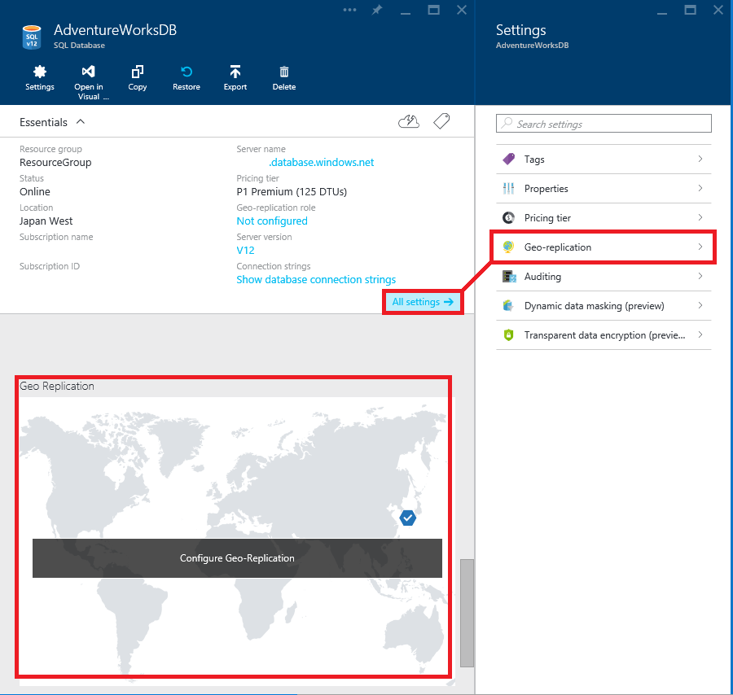
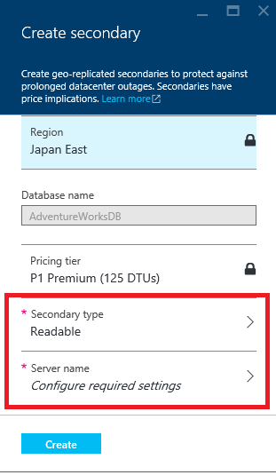
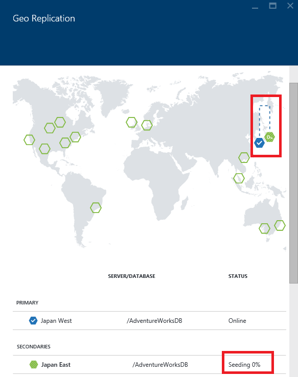
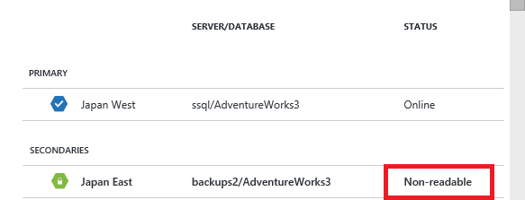
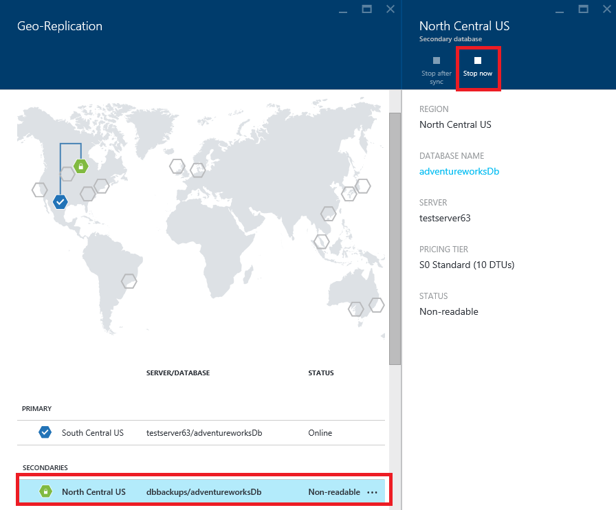

# Configure geo-replication for Azure SQL Database with the Azure portal
> [!div class="op_single_selector"]
> * [Overview](sql-database-geo-replication-overview.md)
> * [Azure portal](sql-database-geo-replication-portal.md)
> * [PowerShell](sql-database-geo-replication-powershell.md)
> * [T-SQL](sql-database-geo-replication-transact-sql.md)
> 
> 

This article shows you how to configure active geo-replication for SQL Database with the [Azure portal](http://portal.azure.com).

To initiate failover with the Azure portal, see [Initiate a planned or unplanned failover for Azure SQL Database with the Azure portal](sql-database-geo-replication-failover-portal.md).

> [!NOTE]
> Active geo-replication (readable secondaries) is now available for all databases in all service tiers. In April 2017, the non-readable secondary type will be retired, and existing non-readable databases will automatically be upgraded to readable secondaries.
> 
> 

To configure geo-replication by using the Azure portal, you need the following resource:

* An Azure SQL database: The primary database that you want to replicate to a different geographical region.

## Add a secondary database
The following steps create a new secondary database in a geo-replication partnership.  

To add a secondary database, you must be the subscription owner or co-owner.

The secondary database has the same name as the primary database and has, by default, the same service level. The secondary database can be a single database or an elastic database. For more information, see [Service tiers](sql-database-service-tiers.md).
After the secondary is created and seeded, data begins replicating from the primary database to the new secondary database.

> [!NOTE]
> If the partner database already exists (for example, as a result of terminating a previous geo-replication relationship) the command fails.
> 
> 

### Add secondary
1. In the [Azure portal](http://portal.azure.com), browse to the database that you want to set up for geo-replication.
2. On the SQL database page, select **Geo-Replication**, and then select the region to create the secondary database. You can select any region other than the region hosting the primary database, but we recommend the [paired region](../best-practices-availability-paired-regions.md).
   
    
3. Select or configure the server and pricing tier for the secondary database.
   
    
4. Optionally, you can add a secondary database to an elastic database pool. To create the secondary database in a pool, click **Elastic database pool** and select a pool on the target server. A pool must already exist on the target server. This workflow does not create a pool.
5. Click **Create** to add the secondary.
6. The secondary database is created and the seeding process begins.
   
    
7. When the seeding process is complete, the secondary database displays its status.
   
    

## Remove secondary database
This operation permanently terminates the replication to the secondary database, and changes the role of the secondary to a regular read-write database. If the connectivity to the secondary database is broken, the command succeeds but the secondary does not become read-write until after connectivity is restored.  

1. In the [Azure portal](http://portal.azure.com), browse to the primary database in the geo-replication partnership.
2. On the SQL database page, select **Geo-Replication**.
3. In the **SECONDARIES** list, select the database you want to remove from the geo-replication partnership.
4. Click **Stop Replication**.
   
    
5. A confirmation window opens. Click **Yes** to remove the database from the geo-replication partnership. (Set it to a read-write database not part of any replication.)

## Next steps
* To learn more about active geo-replication, see [Active Geo-Replication](sql-database-geo-replication-overview.md).
* For a business continuity overview and scenarios, see [Business continuity overview](sql-database-business-continuity.md).

