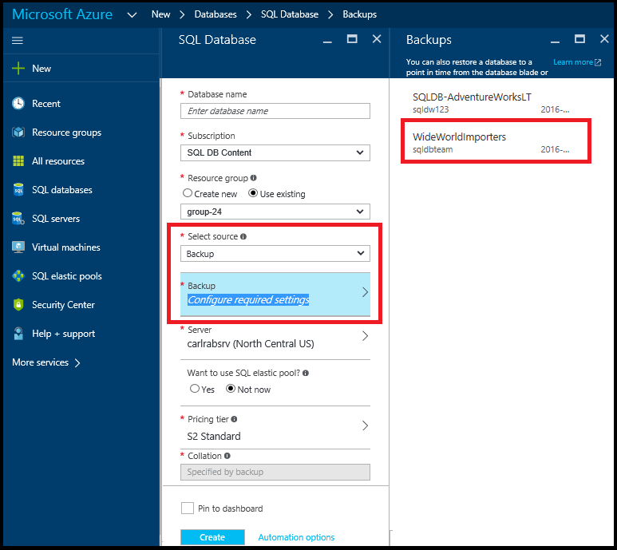

<properties
	pageTitle="Restore an Azure SQL Database from a geo-redundant backup (Azure Portal) | Microsoft Azure"
	description="Geo-Restore an Azure SQL Database from a geo-redundant backup (Azure Portal)."
	services="sql-database"
	documentationCenter=""
	authors="stevestein"
	manager="jhubbard"
	editor=""/>

<tags
	ms.service="sql-database"
	ms.devlang="NA"
	ms.date="06/17/2016"
	ms.author="sstein"
	ms.workload="sqldb-bcdr"
	ms.topic="article"
	ms.tgt_pltfrm="NA"/>

# Geo-Restore an Azure SQL Database from a geo-redundant backup using the Azure Portal

> [AZURE.SELECTOR]
- [Overview](sql-database-recovery-using-backups.md)
- [Geo-Restore: PowerShell](sql-database-geo-restore-powershell.md)

This article shows you how to restore your database into a new server using Geo-Restore using the Azure Portal.

## Select the database to restore

To restore a database in the Azure Portal do the following:

1.	Open the [Azure portal](https://portal.azure.com).
2.  On the left side of the screen select **New** > **Data and Storage** > **SQL Database**.
3.  Select **Backup** as the source and then select the geo-redundant backup you want to recover from.

    

4.  Specify a database name, a server you want to restore the database into and then click Create:

## Next steps

- For a business continuity overview, see [Business continuity overview](sql-database-business-continuity.md)
- To learn about Azure SQL Database automated backups, see [SQL Database automated backups](sql-database-automated-backups.md)
- To learn about business continuity design and recovery scenarios, see [Continuity scenarios](sql-database-business-continuity-scenarios.md)
- To learn about using automated backups for recovery, see [restore a database from the service-initiated backups](sql-database-recovery-using-backups.md)
- To learn about faster recovery options, see [Active-Geo-Replication](sql-database-geo-replication-overview.md)  
- To learn about using automated backups for archiving, see [database copy](sql-database-copy.md)