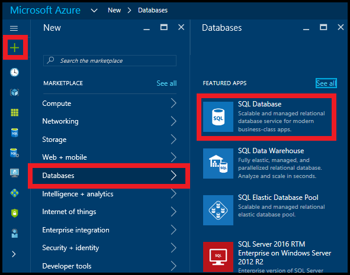

# Restore an Azure SQL database from an automatic backup using the Azure portal
> [!div class="op_single_selector"]
> * [Overview](sql-database-recovery-using-backups.md#geo-restore)
> * [Geo-Restore: PowerShell](sql-database-geo-restore-powershell.md)
> 
> 

This article shows you how to restore your database from an [automatic backup](sql-database-automated-backups.md) into a new server with [Geo-Restore](sql-database-recovery-using-backups.md#geo-restore) using the Azure portal.

## Select a database to restore
To restore a database in the Azure portal, do the following steps:

1. Go to the [Azure portal](https://portal.azure.com).
2. On the left side of the screen select **+New** > **Databases** > **SQL Database**:
   
   
3. Select **Backup** as the source, and then select the backup you want to restore. Specify a database name, a server you want to restore the database into, and then click **Create**:
   
   

Monitor the status of the restore operation by clicking the notification icon in the upper right of the page.

## Next steps
* For a business continuity overview and scenarios, see [Business continuity overview](sql-database-business-continuity.md)
* To learn about Azure SQL Database automated backups, see [SQL Database automated backups](sql-database-automated-backups.md)
* To learn about using automated backups for recovery, see [restore a database from the service-initiated backups](sql-database-recovery-using-backups.md)
* To learn about faster recovery options, see [Active-Geo-Replication](sql-database-geo-replication-overview.md)  
* To learn about using automated backups for archiving, see [database copy](sql-database-copy.md)

