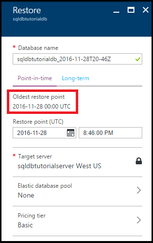
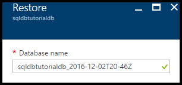
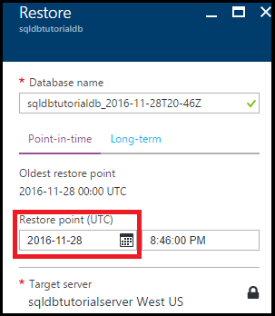
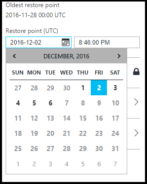
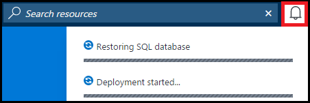
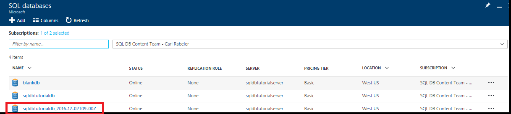
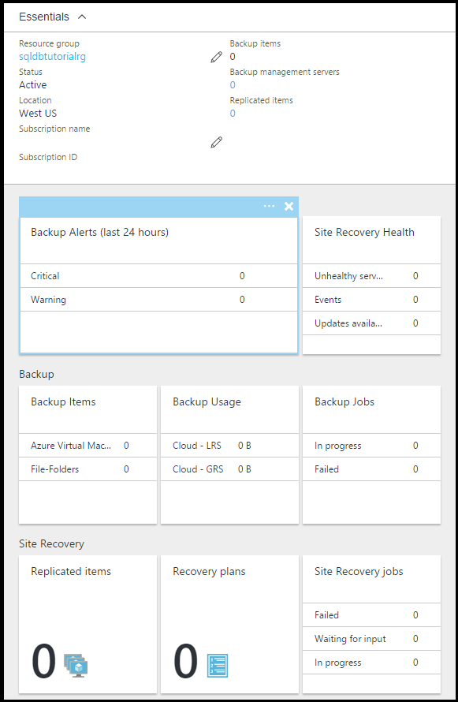

# Tutorial: Back up and restore an Azure SQL Database using the Azure portal
In this tutorial, you learn how to use the Azure portal to:

- View existing backups of a database
- Restore a database to a previous point in time
- Configure long-term retention of a database backup file in the Azure Recovery Services vault
- Restore a database from the Azure Recovery Services vault

**Time estimate**: This tutorial takes approximately 30 minutes to complete (assuming you have already met the prerequisites).

> [!TIP]
> You can perform these same tasks in a getting started tutorial by using [PowerShell](sql-database-get-started-backup-recovery-powershell.md).
>

## Prerequisites

* **An Azure account**. You need an Azure account. You can [open a free Azure account](https://azure.microsoft.com/free/) or [Activate Visual Studio subscriber benefits](https://azure.microsoft.com/pricing/member-offers/msdn-benefits/). 

* **Azure create permissions**. You must be able to connect to the Azure portal using an account that is a member of either the subscription owner or contributor role. For more information on role-based access control (RBAC), see [Getting started with access management in the Azure portal](../active-directory/role-based-access-control-what-is.md).

* **SQL Server Management Studio**. You can download and install the latest version of SQL Server Management Studio (SSMS) at [Download SQL Server Management Studio](https://msdn.microsoft.com/library/mt238290.aspx). Always use the latest version of SSMS when connecting to Azure SQL Database as new capabilities are continually being released.

* **Base server and databases** To install and configure a server and the two databases used in this tutorial, click the **Deploy to Azure** button. Clicking the button opens the **Deploy from a template** blade; create a new resource group, and provide the **Admin Login Password** for the new server that will be created:

   

> [!NOTE]
> This tutorial helps you to learn the content of these learn topics: [SQL Database backups](sql-database-automated-backups.md), [Long-term backup retention](sql-database-long-term-retention.md), and [Recover an Azure SQL database using automated database backups](sql-database-recovery-using-backups.md).
>  

## Sign in to the Azure portal using your Azure account
Using your [existing subscription](https://account.windowsazure.com/Home/Index), follow these steps to connect to the Azure portal.

1. Open your browser of choice and connect to the [Azure portal](https://portal.azure.com/).
2. Sign in to the [Azure portal](https://portal.azure.com/).
3. On the **Sign in** page, provide the credentials for your subscription.
   
   

## View the oldest restore point from the service-generated backups of a database

In this section of the tutorial, you view information about the oldest restore point from the [service-generated automated backups](sql-database-automated-backups.md) of your database. 

1. Open the **SQL database** blade for your database, **sqldbtutorialdb**.

   

2. On the toolbar, click **Restore**.

   

3. On the Restore blade, review the oldest restore point.

   

## Restore a database to a previous point in time

In this section of the tutorial, you restore the database to a new database as of a specific point in time.

1. On the **Restore** blade for the database, review the default name for the new database to which to restore you database to an earlier point in time (the name is the existing database name appended with a timestamp). This name changes to reflect the time you specify in the next few steps.

   

2. Click the **calendar** icon in the **Restore point (UTC)** input box.

   

2. On the calendar, select a date within the retention period

   

3. In the **Restore point (UTC)** input box, specify the time on the selected date to which you wish to restore the data in the database from the automated database backups.

   

   >[!NOTE]
   >Notice that the database name has changed to reflect the date and time that you selected. Notice also that you cannot change the server to which you are restoring to a specific point in time. To restore to a different server, use [Geo-Restore](sql-database-disaster-recovery.md#recover-using-geo-restore). Finally, notice that you can restore into an [elastic pool](sql-database-elastic-jobs-overview.md) or to a different pricing tier. 
   >

4. Click **OK** to restore your database to an earlier point in time to the new database.

5. On the toolbar, click the notification icon to view the status of the restore job.

   

6. When the restore job is completed, open the **SQL databases** blade to view the newly restored database.

   

> [!NOTE]
> From here, you can connect to the restored database using SQL Server Management Studio to perform needed tasks, such as to [extract a bit of data from the restored database to copy into the existing database or to delete the existing database and rename the restored database to the existing database name](sql-database-recovery-using-backups.md#point-in-time-restore).
>

## Configure long-term retention of automated backups in an Azure Recovery Services vault 

In this section of the tutorial, you [configure an Azure Recovery Services vault to retain automated backups](sql-database-long-term-retention.md) for a period longer than the retention period for your service tier. 

> [!TIP]
> To delete backups in long-term backup retention, see [Manage long-term backup retention usihg PowerShell](sql-database-manage-long-term-backup-retention-powershell.md).
>

1. Open the **SQL Server** blade for your server, **sqldbtutorialserver**.

   

2. Click **Long-term backup retention**.

   

3. On the **sqldbtutorial - Long-term backup retention** blade, review and accept the preview terms (unless you have already done so - or this feature is no longer in preview).

   

4. To configure long-term backup retention for the sqldbtutorialdb database, select that database in the grid and then click **Configure** on the toolbar.

   

5. On the **Configure** blade, click **Configure required settings** under **Recovery service vault**.

   

6. On the **Recovery services vault** blade, select an existing vault, if any. Otherwise, if no recovery services vault found for your subscription, click to exit the flow and create a recovery services vault.

   

7. On the **Recovery Services vaults** blade, click **Add**.

   
   
8. On the **Recovery Services vault** blade, provide a valid name for the new Recovery Services vault.

   

9. Select your subscription and resource group, and then select the location for the vault. When done, click **Create**.

   

   > [!IMPORTANT]
   > The vault must be located in the same region as the Azure SQL logical server, and must use the same resource group as the logical server.
   >

10. After the new vault is created, execute the necessary steps to return to the **Recovery services vault** blade.

11. On the **Recovery services vault** blade, click the vault and then click **Select**.

   

12. On the **Configure** blade, provide a valid name for the new retention policy, modify the default retention policy as appropriate, and then click **OK**.

   

13. On the **sqldbtutorial - Long-term backup retention** blade, click **Save** and then click **OK** to apply the long-term backup retention policy to all selected databases.

   

14. Click **Save** to enable long-term backup retention using this new policy to the Azure Recovery Services vault that you configured.

   

15. After long-term backup retention has been enabled, open the **sqldbtutorialvault** blade (go to **All resources** and select it from the list of resources for your subscription).

   

> [!IMPORTANT]
> Once configured, backups show up in the vault within next seven days. Do not continue this tutorial until backups show up in the vault.
>

## View backups in long-term retention

In this section of the tutorial, you view information about your database backups in [long-term backup retention](sql-database-long-term-retention.md). 

1. Open the **sqldbtutorialvault** blade (go to **All resources** and select it from the list of resources for your subscription) to view the amount of storage used by your database backups in the vault.

   

2. Open the **SQL database** blade for your database, **sqldbtutorialdb**.

   

3. On the toolbar, click **Restore**.

   

4. On the Restore blade, click **Long-term**.

5. Under Azure vault backups, click **Select a backup** to view the available database backups in long-term backup retention.

   

## Restore a database from a backup in long-term backup retention

In this section of the tutorial, you restore the database to a new database from a backup in the Azure Recovery Services vault.

1. On the **Azure vault backups** blade, click the backup to restore and then click **Select**.

   

2. In the **Database name** text box, provide the name for the restored database.

   

3. Click **OK** to restore your database from the backup in the vault to the new database.

4. On the toolbar, click the notification icon to view the status of the restore job.

   

5. When the restore job is completed, open the **SQL databases** blade to view the newly restored database.

   

> [!NOTE]
> From here, you can connect to the restored database using SQL Server Management Studio to perform needed tasks, such as to [extract a bit of data from the restored database to copy into the existing database or to delete the existing database and rename the restored database to the existing database name](sql-database-recovery-using-backups.md#point-in-time-restore).
>

## Next steps

- To learn about service-generated automatic backups, see [automatic backups](sql-database-automated-backups.md)
- To learn about long-term backup retention, see [long-term backup retention](sql-database-long-term-retention.md)
- To learn about restoring from backups, see [restore from backup](sql-database-recovery-using-backups.md)
