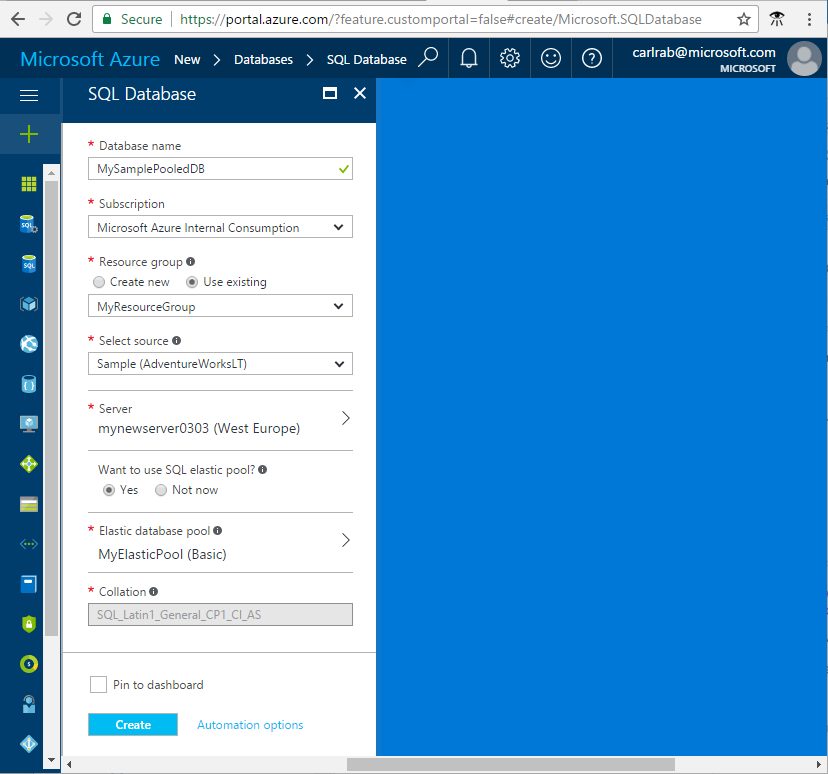
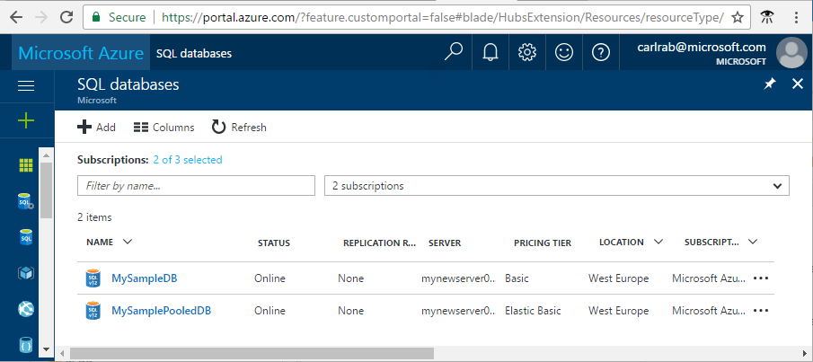
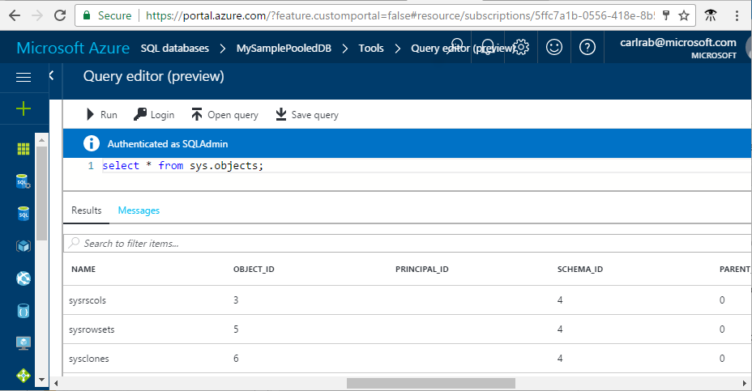

# QuickStart: Create a SQL database in an Azure SQL elastic pool in the Azure portal

Azure SQL databases in an elastic pool can be created in the Azure portal. This quick start details the portal deployment experience.

## Create a database in an elastic pool

Follow these steps to create a database in an elastic pool with sample data in a server and a resource group. 

1. Log in to the [Azure portal](https://portal.azure.com/) and click the **New** button.

2. Select **Databases** from the Marketplace screen, select **SQL databases** from the featured apps screen.

3. Fill out the form with the required information (the server name must be globally unique). Click **Create** when complete:

      

4. After the deployment has started, the Azure portal will return to the Azure dashboard. From here, the deployment status can be monitored. Provisioning takes a few minutes. 

## Create a server-level firewall rule

Follow these steps to create a server-level firewall rule for your IP address to enable external connectivity to the database and to its server. 

1. Once the SQL database deployment has finished, select the **SQL databases** icon on the Azure dashboard and click the new database, such as **MySamplePooledDB**. 

      

2. Click **Set server firewall** on the toolbar for your database to open Firewall settings page for the server on the Azure dashboard for your server. 

3. Click **Add client IP** on the toolbar and then click **Save** to create a firewall rule for your current IP address.

4. Click **OK** and then **close** the firewall blade.

You can now connect to the database and its server using SQL Server Management Studio or another tool of your choice.

## Query the database

Follow these steps to query the database on the Azure dashboard. 

1. Click **Tools** on the toolbar for your database to open the query editor.

2. Click **Query editor (preview)**, click the preview checkbox, and then click **OK**. 

3. Click **Login** and then, when prompted, select **SQL server authentication** and provide the server admin login and password, and click **OK**.

4. After you are authenticated, type a query, such as the following query in the query window, and then click **Run**.

   ```select * from sys.objects;```

5. Review the query results in the **Results** pane.

    

## Troubleshoot connectivity

You receive error messages when the connection to Azure SQL Database fails. The connection problems can be caused by SQL Azure database reconfiguration, firewall settings, connection time-out, or incorrect login information. For a connectivity troubleshooter tool, see [Troubleshooting connectivity issues with Microsoft Azure SQL Database](https://support.microsoft.com/help/10085/troubleshooting-connectivity-issues-with-microsoft-azure-sql-database).

## Clean up resources

The steps in this procedure show how to delete all resources created by this quick start in the Azure portal.

1. On the Azure dashboard, click **Resource groups** and then click **myResourceGroup**. 
2. On the page for your resource group, click **Delete**, type **myResourceGroup** in the text box and then click **Delete**.

## Next steps

- To connect, query and manage your database and its server using SQL Server Management Studio, see [Connect and query with SSMS](sql-database-connect-query-ssms.md).
- To create and query a single database in the Azure portal, see the [Create and query a single database in the Azure portal](sql-database-get-started-elastic-pool.md).
- To connect using Visual Studio, see [Connect and query with Visual Studio](sql-database-connect-query.md)
- For a getting started with SQL Server authentication tutorial, see [SQL authentication and authorization](sql-database-control-access-sql-authentication-get-started.md)
* If you're ready to start coding, choose your programming language at [Connection libraries for SQL Database and SQL Server](sql-database-libraries.md).
* If you want to move your on-premises SQL Server databases to Azure, see [Migrating a database to SQL Database](sql-database-cloud-migrate.md).
* For a technical overview of SQL Database, see [About the SQL Database service](sql-database-technical-overview.md).
