# Create an Azure SQL Database Managed Instance in the Azure portal

This quick start tutorial walks through how to create an Azure SQL Database Managed Instance using the Azure portal.

If you don't have an Azure subscription, create a [free](https://azure.microsoft.com/free/) account before you begin.

## Log in to the Azure portal

Log in to the [Azure portal](https://portal.azure.com/).

## Whitelist your subscription

Managed Instance is being released initially as a limited public preview that requires your subscription to be whitelisted. If your subscription is not already whitelisted, use the following steps to be offered and accept preview terms and send a request for whitelisting.

1. Click **Create a resource** in the upper left-hand corner of the Azure portal.
2. Select **SQL Database Managed Instance** and complete the requested preview information.
<!---will add more when I understand this step as it will appear when public preview goes live --->

## Configure a virtual network (VNET)

Managed Instance requires an [Azure Resource Manager (ARM)](../azure-resource-manager/resource-manager-deployment-model.md) virtual network (VNET). Managed Instance must be provisioned in a dedicated subnet of the provided VNET. The following steps show you how to create a new VNET/subnet. The notes within this section show you how to make sure your existing VNET/sybnet is in a valid state if you wish to use an existing VNET.

1. Click **Create a resource** in the upper left-hand corner of the Azure portal.
2. Locate and then click **Virtual Network**, verify the **Resource Manager** is selected as the deployment mode, and then click **Create**.

   

3. Fill out the virtual network form with the requested information, using the information in the following table and screenshot.

   | Setting| Suggested value | Description |
   | ------ | --------------- | ----------- |
   |**Name**|Any valid name|For valid virtual network names, see [Naming rules and restrictions](https://docs.microsoft.com/azure/architecture/best-practices/naming-conventions).|
   |**Address space**|Any valid address range|The virtual network's address name in CIDR notation.|
   |**Subscription**|Your subscription|For details about your subscriptions, see [Subscriptions](https://account.windowsazure.com/Subscriptions).|
   |**Resource Group**|Any valid resource group (new or existing)|For valid resource group names, see [Naming rules and restrictions](https://docs.microsoft.com/azure/architecture/best-practices/naming-conventions).|
   |**Location**|Any valid location| For information about regions, see [Azure Regions](https://azure.microsoft.com/regions/).|
   |**Subnet name**|Any valid subnet name|or valid virtual network names, see [Naming rules and restrictions](https://docs.microsoft.com/azure/architecture/best-practices/naming-conventions).|
   |**Subnet address range**|Any valid subnet address|The subnet's address range in CIDR notation. It must be contained by the address space of the virtual network|
   |**Service endpoints**|Disabled|Enable one or more service endpoints for this subnet|
   ||||

   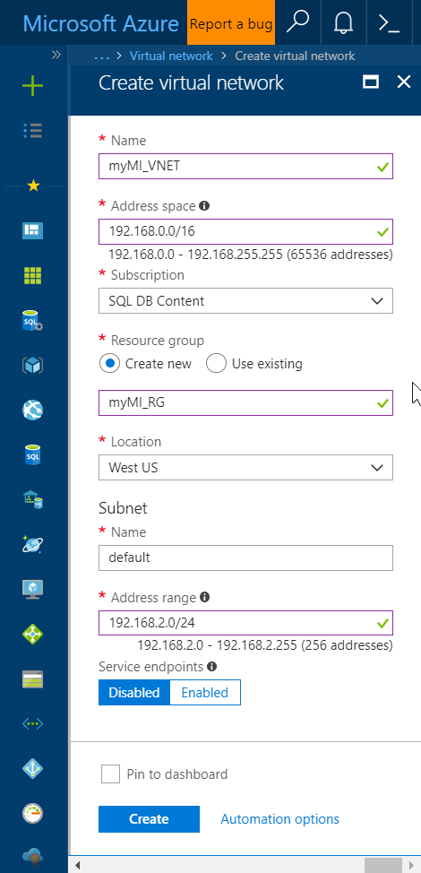

4. Click **Create**.

## Create new route table and set route table on Managed Instance subnet

Currently, Managed Instance does not support effective routes on the subnet where instances are deployed. Routes can be user-defined (UDR) or BGP routes propagated to network interfaces through ExpressRoute or site-to-site VPN connections.

In case when BGP routes are propagated through Express Route or site-to-site VPN connections, you
need to create 0.0.0.0/0 Next Hop Internet route and apply it to the Managed Instance subnet.

1. Click **Create a resource** in the upper left-hand corner of the Azure portal.
2. Locate and then click **Route table**, and then click **Create** on the Route table page. 

   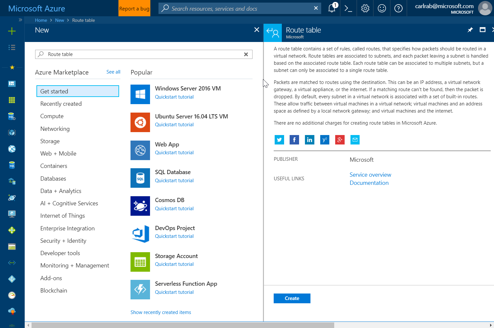

3. Fill out the route table form with the requested information, using the information in the following table and screenshot.

   | Setting| Suggested value | Description |
   | ------ | --------------- | ----------- |
   |**Name**|Any valid name|For valid route table names, see [Naming rules and restrictions](https://docs.microsoft.com/azure/architecture/best-practices/naming-conventions).|
   |**Subscription**|Your subscription|For details about your subscriptions, see [Subscriptions](https://account.windowsazure.com/Subscriptions).|
   |**Resource Group**|Any valid resource group (new or existing)|For valid resource group names, see [Naming rules and restrictions](https://docs.microsoft.com/azure/architecture/best-practices/naming-conventions).|
   |**Location**|Any valid location| For information about regions, see [Azure Regions](https://azure.microsoft.com/regions/).|
   |**Disable BCP route propogation**|Disabled||
   ||||

   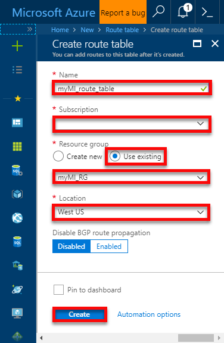

4. Click **Create**.
5. After the route table has been created, open the newly created route table and click **Routes**.

   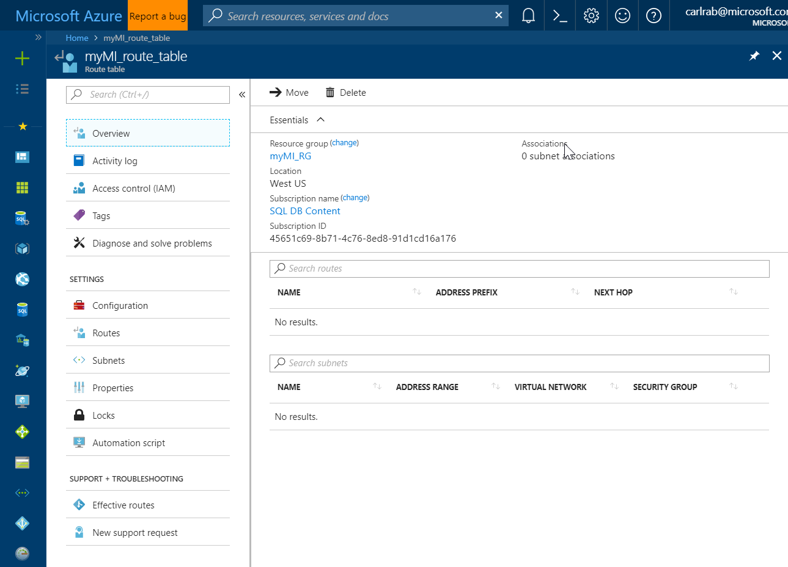

6. Click **Routes** and then click **Add**.

   

7.  Add 0.0.0.0/0 Next Hop Internet route as the **only** route, using the information in the following table and screenshot.

   | Setting| Suggested value | Description |
   | ------ | --------------- | ----------- |
   |**Route name**|Any valid name|For valid route names, see [Naming rules and restrictions](https://docs.microsoft.com/azure/architecture/best-practices/naming-conventions).|
   |**Address prefix**|0.0.0.0|The destination IP address in CIDR notation that this route applies to.|
   |**Next hop type**|Internet|The next hop handles the matching packets for this route|
   |||

   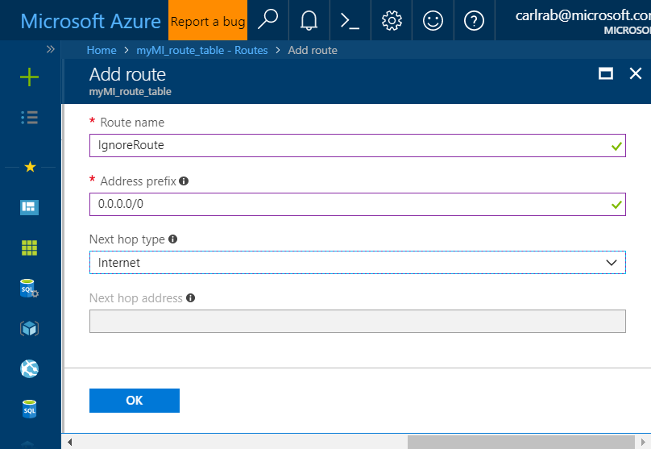

8. Click **OK**.
9. To set this route table on the subnet where Managed Instance is to be deployed, open the virtual network that you created earlier.
10. Click **Subnets** and then click the subnet that you created earlier.

   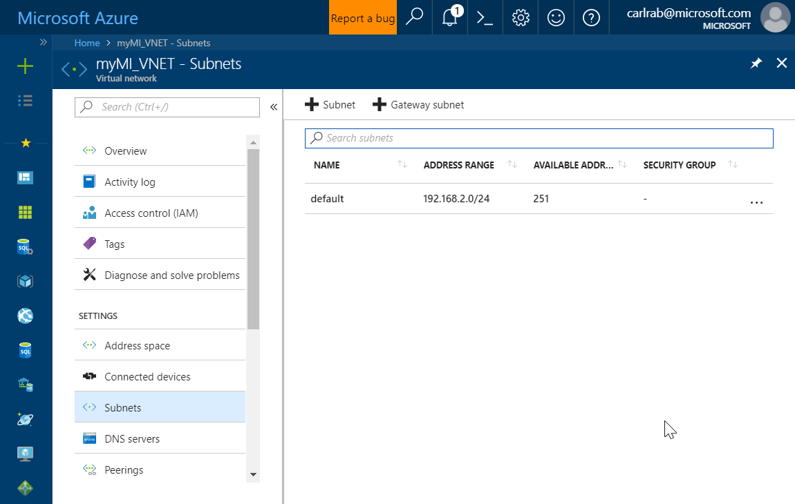

11. Click **Route table** and then select the **myMI_route_table**.

   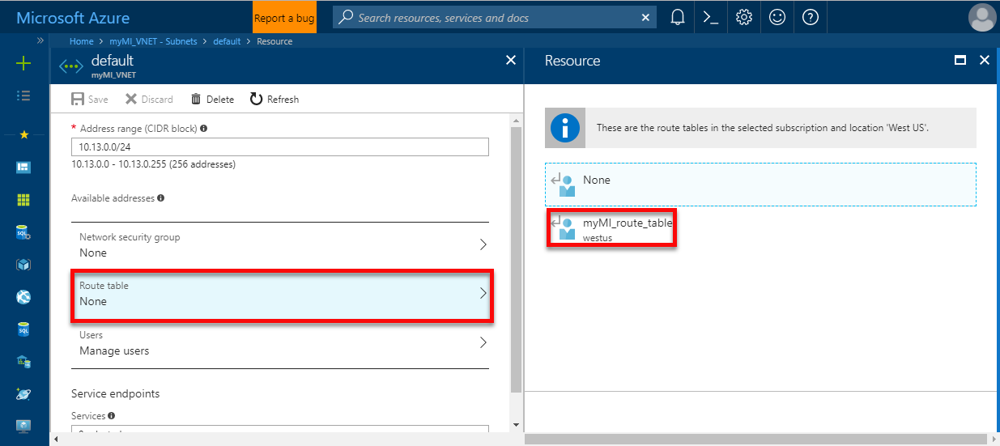

12. Click **Save**

   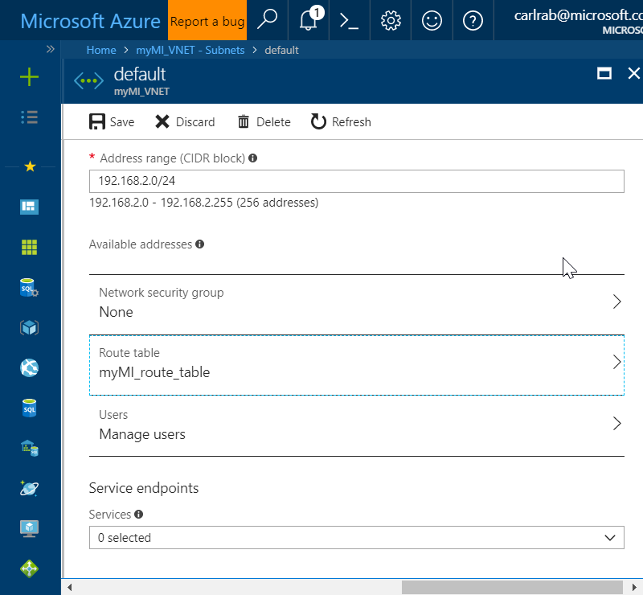

## Create a Managed Instance

## Create a virtual machine in the same VNET but different subnet

Create this virtual machine using the virtual network created earlier. Later in this tutorial, you create a Managed Instance in this same virtual network and connect to it using SQL Server Management Studio.

1. Click **Create a resource** in the upper left-hand corner of the Azure portal.
2. Select **Compute**, and then select **Windows Server 2016 Datacenter**. 
3. Fill out the virtual machine table form with the requested information, using the information in the following table and screenshot.

   | Setting| Suggested value | Description |
   | ------ | --------------- | ----------- |
   |**Name**|Any valid name|For valid virtual machine names, see [Naming rules and restrictions](https://docs.microsoft.com/azure/architecture/best-practices/naming-conventions).|
    **VM disk type**|SSD|SSDs provide the best balance between price and performance.|   
   |**User name**|Any valid user name|For valid user names, see [Naming rules and restrictions](https://docs.microsoft.com/azure/architecture/best-practices/naming-conventions).| 
   |**Password**||Any valid password|The password must be at least 12 characters long and meet the [defined complexity requirements](faq.md#what-are-the-password-requirements-when-creating-a-vm).| 
   |**Subscription**|Your subscription|For details about your subscriptions, see [Subscriptions](https://account.windowsazure.com/Subscriptions).|
   |**Resource Group**|The resource group that you created earlier|For valid resource group names, see [Naming rules and restrictions](https://docs.microsoft.com/azure/architecture/best-practices/naming-conventions).|
   |**Location**|The location that you previously selected|For information about regions, see [Azure Regions](https://azure.microsoft.com/regions/).|
   |**Already have a Windows license**|No|If you own Windows licenses with active Software Assurance (SA), use Azure Hybrid Benefit to save compute cost|
   ||||

   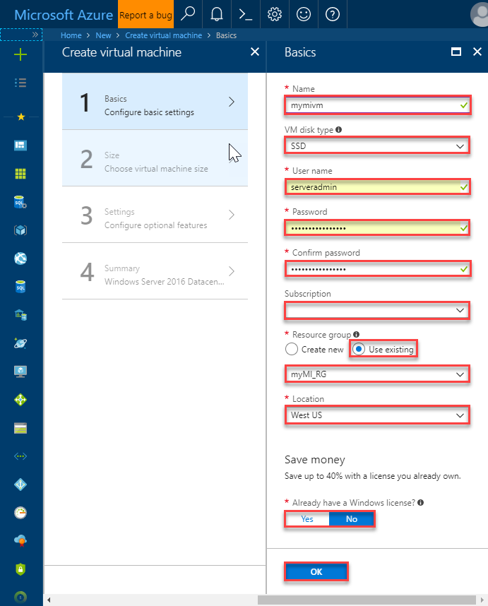

3. Click **OK**.
4. Select a size for the VM. To see more sizes, select **View all** or change the **Supported disk type** filter. 

    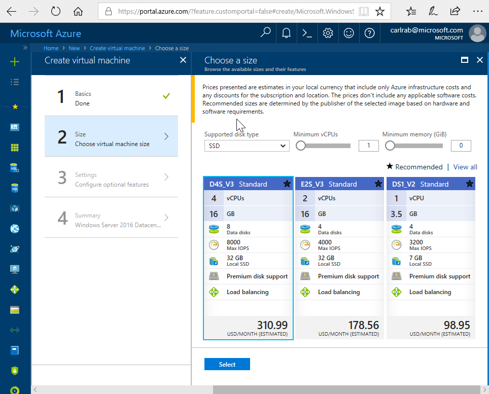  

5. Click **Select**.
6. Under **Settings**, keep the defaults. 

    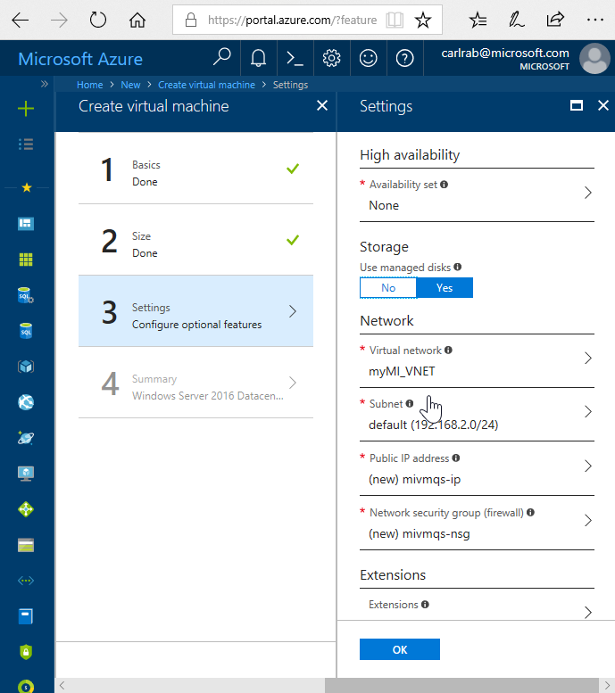  

7. Click **OK**.
8. On the summary page, review the offer detaials and then click **Create** to start the virtual machine deployment.
 
## Connect to virtual machine

Create a remote desktop connection to the virtual machine.

1. After deployment completes, go to the virtual machine resource.

    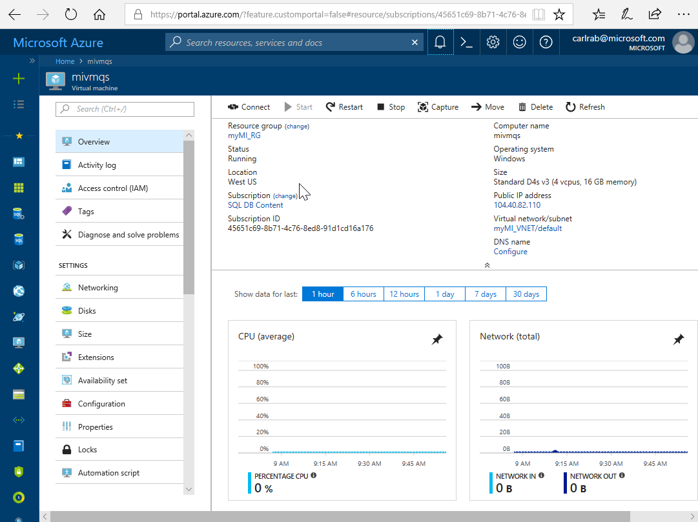  

2. Click the **Connect** button on the virtual machine properties. A Remote Desktop Protocol file (.rdp file) is created and downloaded.
3. To connect to your VM, open the downloaded RDP file. If prompted, click **Connect**. On a Mac, you need an RDP client such as this [Remote Desktop Client](https://itunes.apple.com/us/app/microsoft-remote-desktop/id715768417?mt=12) from the Mac App Store.

4. Enter the user name and password you specified when creating the virtual machine, then click **Ok**.

5. You may receive a certificate warning during the sign-in process. Click **Yes** or **Continue** to proceed with the connection.

## Install SSMS and connect to the Managed Instance

## Download Wide World Importers backup file and restore to Managed Instance.

## Next steps

