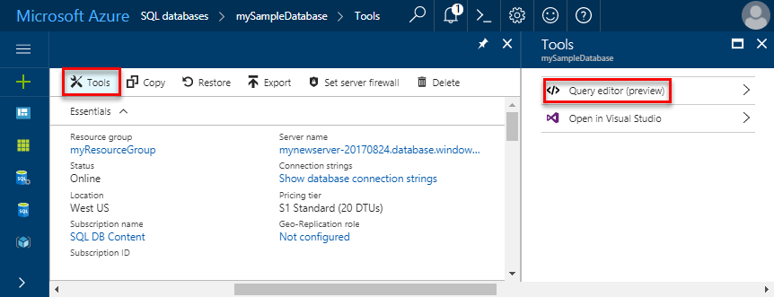
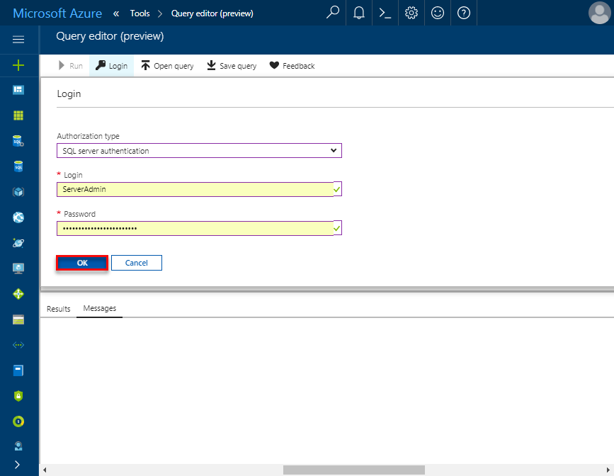

# Create an Azure SQL database in the Azure portal

This quick start tutorial walks through how to create a SQL database in Azure. Azure SQL Database is a “Database-as-a-Service” offering that enables you to run and scale highly available SQL Server databases in the cloud. This quick start shows you how to get started by creating a SQL database using the Azure portal.

If you don't have an Azure subscription, create a [free](https://azure.microsoft.com/free/) account before you begin.

## Log in to the Azure portal

Log in to the [Azure portal](https://portal.azure.com/).

## Create a SQL database

An Azure SQL database is created with a defined set of [compute and storage resources](sql-database-service-tiers.md). The database is created within an [Azure resource group](../azure-resource-manager/resource-group-overview.md) and in an [Azure SQL Database logical server](sql-database-features.md). 

Follow these steps to create a SQL database containing the Adventure Works LT sample data. 

1. Click the **New** button found on the upper left-hand corner of the Azure portal.

2. Select **Databases** from the **New** page, and select **SQL Database** from the **Databases** page.

    

3. Fill out the SQL Database form with the following information, as shown on the preceding image:     
   - Database name: **mySampleDatabase**
   - Resource group: **myResourceGroup**
   - Source source: **Sample (AdventureWorksLT)**

   > [!IMPORTANT]
   > You must select the sample database on this form because it is used in the remainder of this quick start.
   > 

4. Click **Server** and then fill out the **New server form** specifying a globally unique server name, provide a name for the server admin login, and then specify the password of your choice. 

   > [!IMPORTANT]
   > The server admin login and password that you specify here are required to log in to the server and its databases later in this quick start. Remember or record this information for later use. 
   >  

    
5. When you have completed the form, click **Select**.

6. Click **Pricing tier** to specify the service tier and performance level for your new database. Use the slider to select **20 DTUs** and **250** GB of storage. For more information on DTUs, see [What is a DTU?](sql-database-what-is-a-dtu.md).

    

7. After selected the amount of DTUs, click **Apply**.  

8. Now that you have completed the SQL Database form, click **Create** to provision the database. Provisioning takes a few minutes. 

9. On the toolbar, click **Notifications** to monitor the deployment process.

    


## Create a server-level firewall rule

The SQL Database service creates a firewall at the server-level that prevents external applications and tools from connecting to the server or any databases on the server unless a firewall rule is created to open the firewall for specific IP addresses. Follow these steps to create a [SQL Database server-level firewall rule](sql-database-firewall-configure.md) for your client's IP address and enable external connectivity through the SQL Database firewall for your IP address only. 

> [!NOTE]
> SQL Database communicates over port 1433. If you are trying to connect from within a corporate network, outbound traffic over port 1433 may not be allowed by your network's firewall. If so, you will not be able to connect to your Azure SQL Database server unless your IT department opens port 1433.
>

1. After the deployment completes, click **SQL databases** from the left-hand menu and then click **mySampleDatabase** on the SQL databases page. The overview page for your database opens, showing you the fully qualified server name (such as **mynewserver20170411.database.windows.net**) and provides options for further configuration.

   > [!IMPORTANT]
   > You will need this fully qualified server name to connect to your server and its databases in subsequent quick starts.
   > 

       

2. Click **Set server firewall** on the toolbar as shown in the previous image. The **Firewall settings** page for the SQL Database server opens. 

       


3. Click **Add client IP** on the toolbar to add your current IP address to a new firewall rule. A firewall rule can open port 1433 for a single IP address or a range of IP addresses.

4. Click **Save**. A server-level firewall rule is created for your current IP address opening port 1433 on the logical server.

       

4. Click **OK** and then close the **Firewall settings** page.

You can now connect to the SQL Database server and its databases using SQL Server Management Studio or another tool of your choice from this IP address using the server admin account created previously.

> [!IMPORTANT]
> By default, access through the SQL Database firewall is enabled for all Azure services. Click **OFF** on this page to disable for all Azure services.

## Query the SQL database

Now that you have created a sample database in Azure, let’s use the built-in query tool within the Azure portal to confirm that you can connect to the database and query the data. 

1. On the SQL Database page for your database, click **Tools** on the toolbar. The **Tools** page opens.

      

2. Click **Query editor (preview)**, click the **Preview terms** checkbox, and then click **OK**. The Query editor page opens.

3. Click **Login** and then, when prompted, select **SQL server authentication** and then provide the server admin login and password that you created earlier.

     

4. Click **OK** to log in.

5. After you are authenticated, type the following query in the query editor pane.

   ```
   SELECT TOP 20 pc.Name as CategoryName, p.name as ProductName
   FROM SalesLT.ProductCategory pc
   JOIN SalesLT.Product p
   ON pc.productcategoryid = p.productcategoryid;
   ```

6. Click **Run** and then review the query results in the **Results** pane.

    

7. Close the **Query editor** page and the **Tools** page.

## Clean up resources

If you don't need these resources for another quickstart/tutorial (see [Next steps](#next-steps)), you can delete them by doing the following:


1. From the left-hand menu in the Azure portal, click **Resource groups** and then click **myResourceGroup**. 
2. On your resource group page, click **Delete**, type **myResourceGroup** in the text box, and then click **Delete**.

## Next steps

Now that you have a database, you can connect and query using your favorite tools. Learn more by choosing your tool below:

- [SQL Server Management Studio](sql-database-connect-query-ssms.md)
- [Visual Studio Code](sql-database-connect-query-vscode.md)
- [.NET](sql-database-connect-query-dotnet.md)
- [PHP](sql-database-connect-query-php.md)
- [Node.js](sql-database-connect-query-nodejs.md)
- [Java](sql-database-connect-query-java.md)
- [Python](sql-database-connect-query-python.md)
- [Ruby](sql-database-connect-query-ruby.md)
