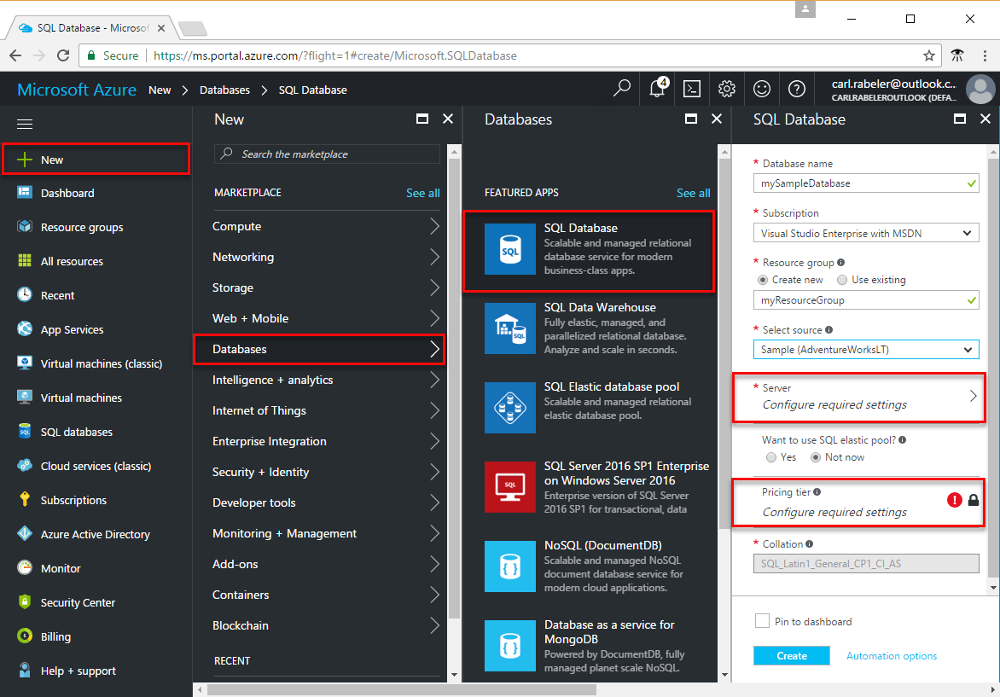
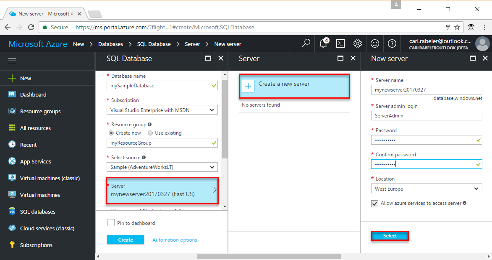
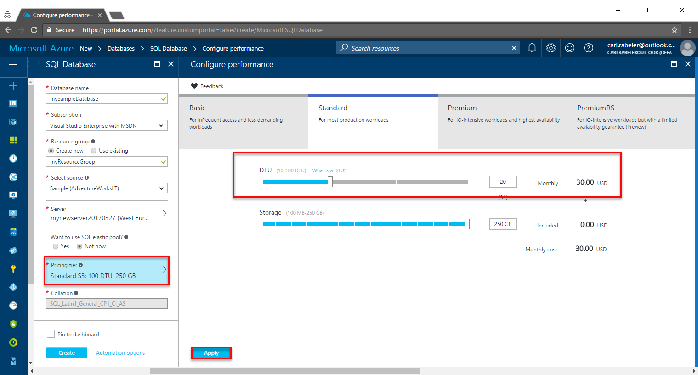
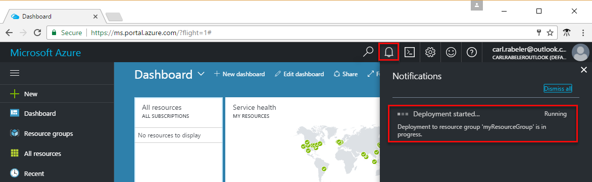
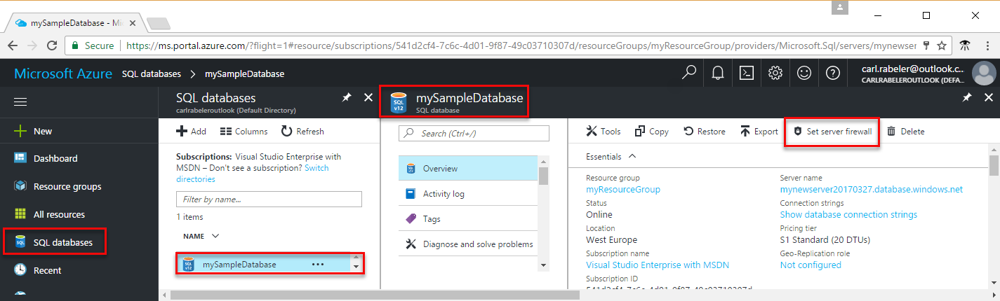
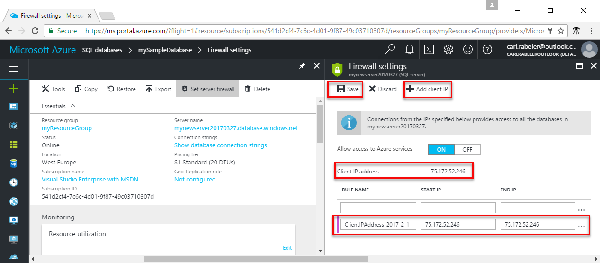
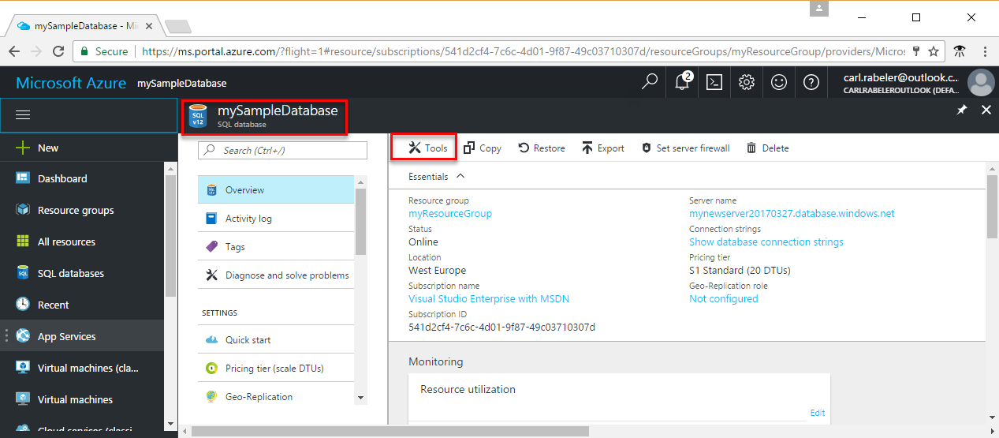

# Create an Azure SQL database in the Azure portal

This quick start tutorial walks through how to create a SQL database in Azure.  Azure SQL Database is a “Database-as-a-Service” offering that enables you to run and scale highly-available SQL Server databases in the cloud.  This quick start shows you how to get started by creating a new SQL database using the Azure portal.

If you don't have an Azure subscription, create a [free](https://azure.microsoft.com/free/) account before you begin.

## Log in to the Azure portal

Log in to the [Azure portal](https://portal.azure.com/).

## Create a SQL database

An Azure SQL database is created with a defined set of [compute and storage resources](sql-database-service-tiers.md). The database is created within an [Azure resource group](../azure-resource-manager/resource-group-overview.md) and in an [Azure SQL Database logical server](sql-database-features.md). 

Follow these steps to create a SQL database containing the Adventure Works LT sample data. 

1. Click the **New** button found on the upper left-hand corner of the Azure portal.

2. Select **Databases** from the **New** page, and select **SQL Database** from the **Databases** page.

    

3. Fill out the SQL Database form with the following information, as shown on the preceding image:     
   - Database name: **mySampleDatabase**
   - Resource group: **myResourceGroup**
   - Source: **Sample (AdventureWorksLT)**

4. Click **Server** to create and configure a new server for your new database. Fill out the **New server form** specifying a globally unique server name, provide a name for the Server admin login, and then specify the password of your choice. 

    
5. Click **Select**.

6. Click **Pricing tier** to specify the service tier and performance level for your new database. For this quick start, select **20 DTUs** and **250** GB of storage

    

7. Click **Apply**.  

8. Click **Create** to provision the database. Provisioning takes a few minutes. 

9. On the toolbar, click **Notifications** to monitor the deployment process.

    


## Create a server-level firewall rule

The SQL Database service creates a firewall at the server-level preventing external applications and tools from connecting to the server or any databases on the server unless a firewall rule is created to open the firewall for specific IP addresses. Follow these steps to create a [SQL Database server-level firewall rule](sql-database-firewall-configure.md) for your client's IP address and enable external connectivity through the SQL Database firewall for your IP address only. 

1. After the deployment completes, click **SQL databases** from the left-hand menu and click your new database, **mySampleDatabase**, on the **SQL databases** page. The overview page for your database opens, showing you the fully qualified server name (such as **mynewserver20170327.database.windows.net**) and provides options for further configuration.

       

2. Click **Set server firewall** on the toolbar as shown in the previous image. The **Firewall settings** page for the SQL Database server opens. 

3. Click **Add client IP** on the toolbar and then click **Save**. A server-level firewall rule is created for your current IP address.

       

4. Click **OK** and then click the **X** to close the **Firewall settings** page.

You can now connect to the database and its server using SQL Server Management Studio or another tool of your choice from this IP address using the Server admin account created previously..

## Query the SQL database

When we created our SQL database, we populated it with the **AdventureWorksLT** sample database (this was one of the options we selected in the Create UI earlier in this quick start). Let’s now use the built-in query tool within the Azure portal to query the data. 

1. On the SQL Database page for your database, click **Tools** on the toolbar. The **Tools** page opens.

      

2. Click **Query editor (preview)**, click the **Preview terms** checkbox, and then click **OK**. The Query editor page opens.

3. Click **Login** and then, when prompted, select **SQL server authentication** and then provide the server admin login and password that you created earlier.

     

4. Click **OK** to log in.

5. After you are authenticated, type the following query in the query editor pane.

   ```
   SELECT TOP 20 pc.Name as CategoryName, p.name as ProductName
   FROM SalesLT.ProductCategory pc
   JOIN SalesLT.Product p
   ON pc.productcategoryid = p.productcategoryid;
   ```

6. Click **Run** and then review the query results in the **Results** pane.

    

7. Click the **X** to close the **Query editor** page and click **X** again to close the **Tools** page.

## Clean up resources

Other quick starts in this collection build upon this quick start. If you plan to continue on to work with subsequent quick starts or with the tutorials, do not clean up the resources created in this quick start. If you do not plan to continue, use the following steps to delete all resources created by this quick start in the Azure portal.

1. From the left-hand menu in the Azure portal, click **Resource groups** and then click **myResourceGroup**. 
2. On your resource group page, click **Delete**, type **myResourceGroup** in the text box, and then click **Delete**.

## Next steps

- To connect and query using SQL Server Management Studio, see [Connect and query with SSMS](sql-database-connect-query-ssms.md)
- To connect using Visual Studio, see [Connect and query with Visual Studio](sql-database-connect-query.md).
- For a technical overview of SQL Database, see [About the SQL Database service](sql-database-technical-overview.md).
