# Set up SQL Data Sync to sync data between Azure SQL Database and SQL Server on-premises

In this tutorial, you learn how to set up Azure SQL Data Sync by creating a hybrid sync group that contains both Azure SQL Database and SQL Server instances. The new sync group is fully configured and synchronizes on the schedule you set.

This tutorial assumes that you have at least some prior experience with SQL Database and with SQL Server.

For an overview of SQL Data Sync, see [Sync data across multiple cloud and on-premises databases with Azure SQL Data Sync](sql-database-sync-data.md).

For complete PowerShell examples that show how to configure SQL Data Sync, see the following articles:

- [Use PowerShell to sync between multiple Azure SQL databases](scripts/sql-database-sync-data-between-sql-databases.md)
- [Use PowerShell to sync between an Azure SQL Database and a SQL Server on-premises database](scripts/sql-database-sync-data-between-azure-onprem.md)

## Step 1 - Create sync group

### Locate the Data Sync settings

1. In your browser, navigate to the Azure portal.

2. In the portal, locate your SQL databases from your Dashboard or from the SQL Databases icon on the toolbar.

    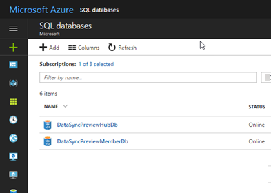

3. On the **SQL databases** page, select the existing SQL database that you want to use as the hub database for Data Sync. The SQL database page opens.

    The hub database is the central endpoint of the sync topology, in which a sync group has multiple database endpoints. All other database endpoints in the same sync group - that is, all member databases - sync with the hub database.

4. On the SQL database page for the selected database, select **Sync to other databases**. The Data Sync page opens.

    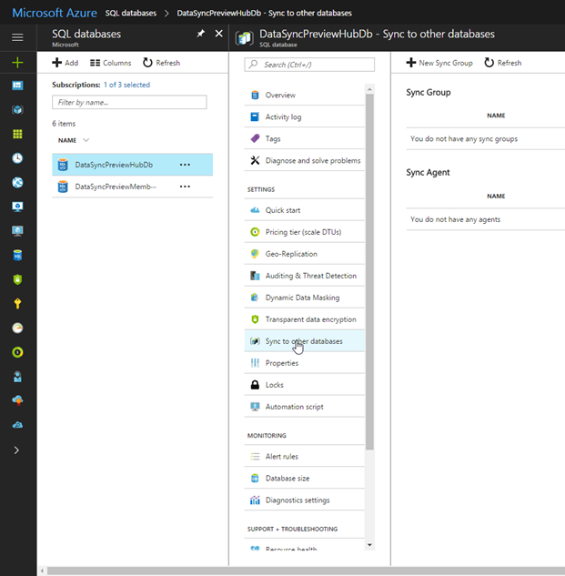

### Create a new Sync Group

1. On the Data Sync page, select **New Sync Group**. The **New sync group** page opens with Step 1, **Create sync group**, highlighted. The **Create Data Sync Group** page also opens.

2. On the **Create Data Sync Group** page, do the following things:

   1. In the **Sync Group Name** field, enter a name for the new sync group.

   2. In the **Sync Metadata Database** section, choose whether to create a new database (recommended) or to use an existing database.

        > [!NOTE]
        > Microsoft recommends that you create a new, empty database to use as the Sync Metadata Database. Data Sync creates tables in this database and runs a frequent workload. This database is automatically shared as the Sync Metadata Database for all of your Sync groups in the selected region. You can't change the Sync Metadata Database or its name without removing all the Sync Groups and Sync Agents in the region.

        If you chose **New database**, select **Create new database.** The **SQL Database** page opens. On the **SQL Database** page, name and configure the new database. Then select **OK**.

        If you chose **Use existing database**, select the database from the list.

   3. In the **Automatic Sync** section, first select **On** or **Off**.

        If you chose **On**, in the **Sync Frequency** section, enter a number and select Seconds, Minutes, Hours, or Days.

        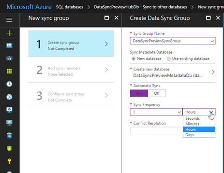

   4. In the **Conflict Resolution** section, select "Hub wins" or "Member wins."

        "Hub wins" means that, when a conflict occurs, the data in the hub database overwrites the conflicting data in the member database. "Member wins" means that, when a conflict occurs, the data in the member database overwrites the conflicting data in the hub database.

       

   5. Select **OK** and wait for the new sync group to be created and deployed.

## Step 2 - Add sync members

After the new sync group is created and deployed, Step 2, **Add sync members**, is highlighted in the **New sync group** page.

In the **Hub Database** section, enter the existing credentials for the SQL Database server on which the hub database is located. Don't enter *new* credentials in this section.

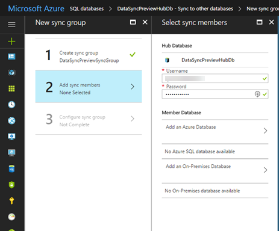

### Add an Azure SQL Database

In the **Member Database** section, optionally add an Azure SQL Database to the sync group by selecting **Add an Azure Database**. The **Configure Azure Database** page opens.

On the **Configure Azure Database** page, do the following things:

1. In the **Sync Member Name** field, provide a name for the new sync member. This name is distinct from the name of the database itself.

2. In the **Subscription** field, select the associated Azure subscription for billing purposes.

3. In the **Azure SQL Server** field, select the existing SQL database server.

4. In the **Azure SQL Database** field, select the existing SQL database.

5. In the **Sync Directions** field, select Bi-directional Sync, To the Hub, or From the Hub.

    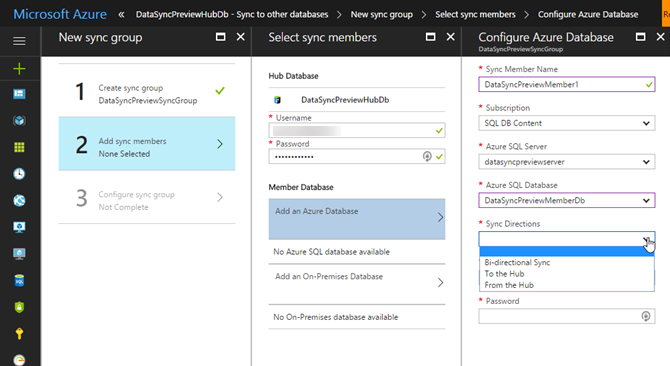

6. In the **Username** and **Password** fields, enter the existing credentials for the SQL Database server on which the member database is located. Don't enter *new* credentials in this section.

7. Select **OK** and wait for the new sync member to be created and deployed.

    

###  Add an on-premises SQL Server database

In the **Member Database** section, optionally add an on-premises SQL Server to the sync group by selecting **Add an On-Premises Database**. The **Configure On-Premises** page opens.

On the **Configure On-Premises** page, do the following things:

1. Select **Choose the Sync Agent Gateway**. The **Select Sync Agent** page opens.

    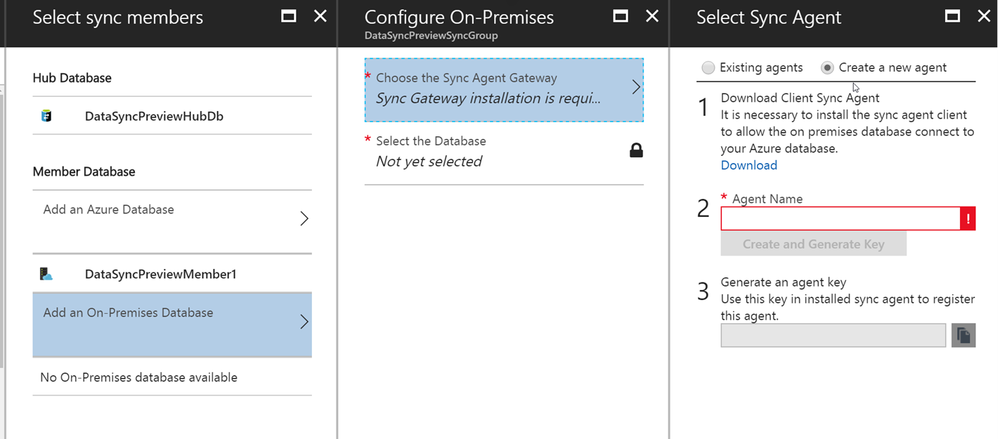

2. On the **Choose the Sync Agent Gateway** page, choose whether to use an existing agent or create a new agent.

    If you chose **Existing agents**, select the existing agent from the list.

    If you chose **Create a new agent**, do the following things:

   1. Download the client sync agent software from the link provided and install it on the computer where the SQL Server is located.

        > [!IMPORTANT]
        > You have to open outbound TCP port 1433 in the firewall to let the client agent communicate with the server.

   2. Enter a name for the agent.

   3. Select **Create and Generate Key**.

   4. Copy the agent key to the clipboard.

        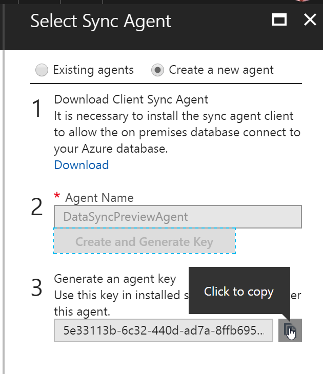

   5. Select **OK** to close the **Select Sync Agent** page.

   6. On the SQL Server computer, locate and run the Client Sync Agent app.

        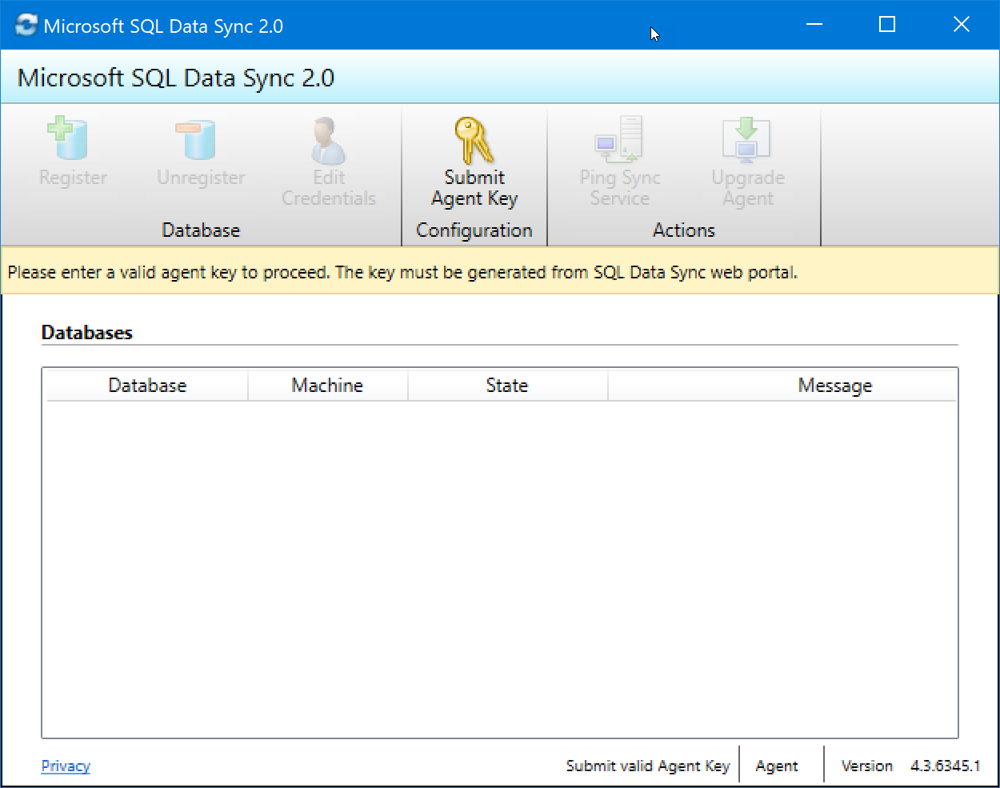

   7. In the sync agent app, select **Submit Agent Key**. The **Sync Metadata Database Configuration** dialog box opens.

   8. In the **Sync Metadata Database Configuration** dialog box, paste in the agent key copied from the Azure portal. Also provide the existing credentials for the Azure SQL Database server on which the metadata database is located. (If you created a new metadata database, this database is on the same server as the hub database.) Select **OK** and wait for the configuration to finish.

        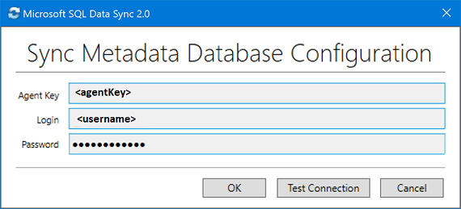

        > [!NOTE]
        > If you get a firewall error at this point, you have to create a firewall rule on Azure to allow incoming traffic from the SQL Server computer. You can create the rule manually in the portal, but you may find it easier to create it in SQL Server Management Studio (SSMS). In SSMS, try to connect to the hub database on Azure. Enter its name as <hub_database_name>.database.windows.net. To configure the Azure firewall rule, follow the steps in the dialog box. Then return to the Client Sync Agent app.

   9. In the Client Sync Agent app, click **Register** to register a SQL Server database with the agent. The **SQL Server Configuration** dialog box opens.

        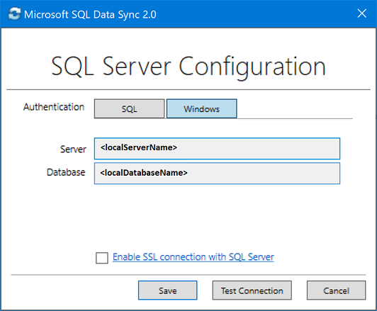

   10. In the **SQL Server Configuration** dialog box, choose whether to connect by using SQL Server authentication or Windows authentication. If you chose SQL Server authentication, enter the existing credentials. Provide the SQL Server name and the name of the database that you want to sync. Select **Test connection** to test your settings. Then select **Save**. The registered database appears in the list.

        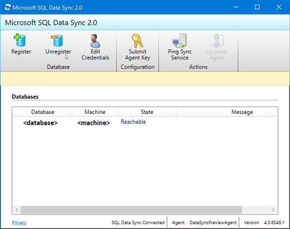

   11. You can now close the Client Sync Agent app.

   12. In the portal, on the **Configure On-Premises** page, select **Select the Database.** The **Select Database** page opens.

   13. On the **Select Database** page, in the **Sync Member Name** field, provide a name for the new sync member. This name is distinct from the name of the database itself. Select the database from the list. In the **Sync Directions** field, select Bi-directional Sync, To the Hub, or From the Hub.

        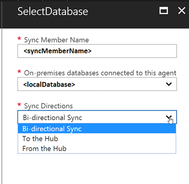

   14. Select **OK** to close the **Select Database** page. Then select **OK** to close the **Configure On-Premises** page and wait for the new sync member to be created and deployed. Finally, click **OK** to close the **Select sync members** page.

        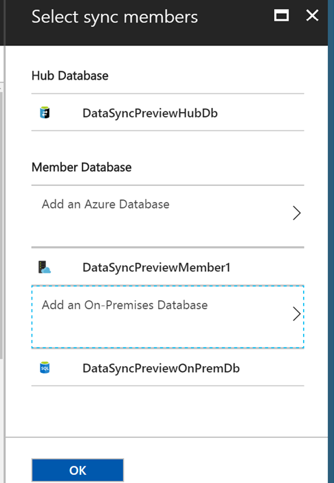

3. To connect to SQL Data Sync and the local agent, add your user name to the role `DataSync_Executor`. Data Sync creates this role on the SQL Server instance.

## Step 3 - Configure sync group

After the new sync group members are created and deployed, Step 3, **Configure sync group**, is highlighted in the **New sync group** page.

1. On the **Tables** page, select a database from the list of sync group members, and then select **Refresh schema**.

2. From the list of available tables, select the tables that you want to sync.

    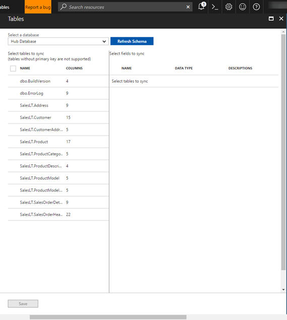

3. By default, all columns in the table are selected. If you don't want to sync all the columns, disable the checkbox for the columns that you don't want to sync. Be sure to leave the primary key column selected.

    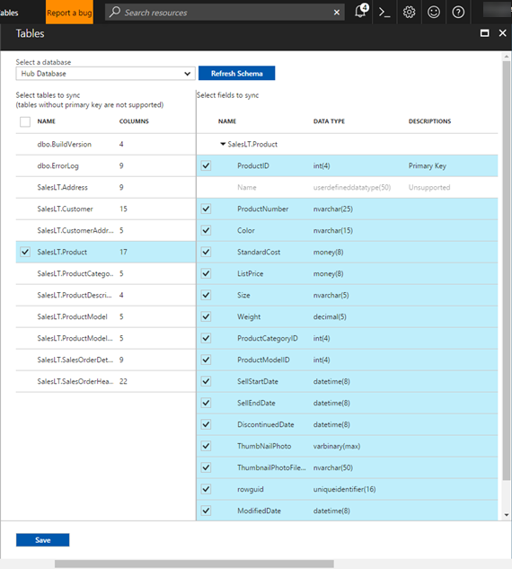

4. Finally, select **Save**.

## FAQ about setup and configuration

### How frequently can Data Sync synchronize my data

The minimum frequency is every five minutes.

### Does SQL Data Sync fully create and provision tables

If the sync schema tables are not already created in the destination database, SQL Data Sync creates them with the columns that you selected. However, this behavior does not result in a full fidelity schema, for the following reasons:

- Only the columns that you selected are created in the destination table. If some columns in the source tables are not part of the sync group, those columns are not provisioned in the destination tables.
- Indexes are created only for the selected columns. If the source table index has columns that are not part of the sync group, those indexes are not provisioned in the destination tables.
- Indexes on XML type columns are not provisioned.
- CHECK constraints are not provisioned.
- Existing triggers on the source tables are not provisioned.
- Views and stored procedures are not created on the destination database.

Because of these limitations, we recommend the following things:

- For production environments, provision the full-fidelity schema yourself.
- For trying out the service, the auto-provisioning feature of SQL Data Sync works well.

### Why do I see tables that I did not create

Data Sync creates side tables in your database for change tracking. Don't delete them or Data Sync stops working.

### Is my data convergent after a sync

Not necessarily. In a sync group with a hub and three spokes (A, B, and C), the synchronizations are Hub to A, Hub to B, and Hub to C. If a change is made to database A *after* the Hub to A sync, that change is not written to either database B or database C until the next sync task.

### How do I get schema changes into a sync group

You have to make and propagate all schema changes manually.

1. Replicate the schema changes manually to the hub and to all sync members.
2. Update the sync schema.

**Adding new tables and columns**.

New tables and columns don't impact the current sync. Data Sync ignores the new tables and columns until you add them to the sync schema. When you add new database objects, this is the best sequence to follow:

1. Add the new tables or columns to the hub and to all sync members.
2. Add the new tables or columns to the sync schema.
3. Start to insert values into the new tables and columns.

**Changing the data type of a column**.

When you change the data type of an existing column, Data Sync continues to work as long as the new values fit the original data type defined in the sync schema. For example, if you change the type in the source database from **int** to **bigint**, Data Sync continues to work until you insert a value that's too large for the **int** data type. To complete the change, replicate the schema change manually to the hub and to all sync members, and then update the sync schema.

### How can I export and import a database with Data Sync

After you export a database as a `.bacpac` file and import the file to create a new database, you have to do the following two things to use Data Sync in the new database:

1. Clean up the Data Sync objects and side tables on the **new database** by using [this script](https://github.com/vitomaz-msft/DataSyncMetadataCleanup/blob/master/Data%20Sync%20complete%20cleanup.sql). This script deletes all of the required Data Sync objects from the database.
2. Recreate the sync group with the new database. If you no longer need the old sync group, delete it.

## FAQ about the client agent

### Why do I need a client agent

The SQL Data Sync service communicates with SQL Server databases via the client agent. This security feature prevents direct communication with databases behind a firewall. When the SQL Data Sync service communicates with the agent, it does so using encrypted connections and a unique token or *agent key*. The SQL Server databases authenticate the agent using the connection string and agent key. This design provides a high level of security for your data.

### How many instances of the local agent UI can be run

Only one instance of the UI can be run.

### How can I change my service account

After you install a client agent, the only way to change the service account is to uninstall it and install a new client agent with the new service account.

### How do I change my agent key

An agent key can only be used once by an agent. It cannot be reused when you remove then reinstall a new agent, nor can it be used by multiple agents. If you need to create a new key for an existing agent, you must be sure that the same key is recorded with the client agent and with the SQL Data Sync service.

### How do I retire a client agent

To immediately invalidate or retire an agent, regenerate its key in the portal but do not submit it in the Agent UI. Regenerating a key invalidates the previous key irrespective if the corresponding agent is online or offline.

### How do I move a client agent to another computer

If you want to run the local agent from a different computer than it is currently on, do the following things:

1. Install the agent on desired computer.
2. Log in to the SQL Data Sync portal and regenerate an agent key for the new agent.
3. Use the new agent's UI to submit the new agent key.
4. Wait while the client agent downloads the list of on-premises databases that were registered earlier.
5. Provide database credentials for all databases that display as unreachable. These databases must be reachable from the new computer on which the agent is installed.

## Next steps

Congratulations. You have created a sync group that includes both a SQL Database instance and a SQL Server database.

For more info about SQL Data Sync, see:

- [Sync data across multiple cloud and on-premises databases with Azure SQL Data Sync](sql-database-sync-data.md)
- [Best practices for Azure SQL Data Sync](sql-database-best-practices-data-sync.md)
- [Monitor Azure SQL Data Sync with Log Analytics](sql-database-sync-monitor-oms.md)
- [Troubleshoot issues with Azure SQL Data Sync](sql-database-troubleshoot-data-sync.md)

- Complete PowerShell examples that show how to configure SQL Data Sync:
  - [Use PowerShell to sync between multiple Azure SQL databases](scripts/sql-database-sync-data-between-sql-databases.md)
  - [Use PowerShell to sync between an Azure SQL Database and a SQL Server on-premises database](scripts/sql-database-sync-data-between-azure-onprem.md)

- [Download the SQL Data Sync REST API documentation](https://github.com/Microsoft/sql-server-samples/raw/master/samples/features/sql-data-sync/Data_Sync_Preview_REST_API.pdf?raw=true)

For more info about SQL Database, see:

- [SQL Database Overview](sql-database-technical-overview.md)
- [Database Lifecycle Management](https://msdn.microsoft.com/library/jj907294.aspx)
