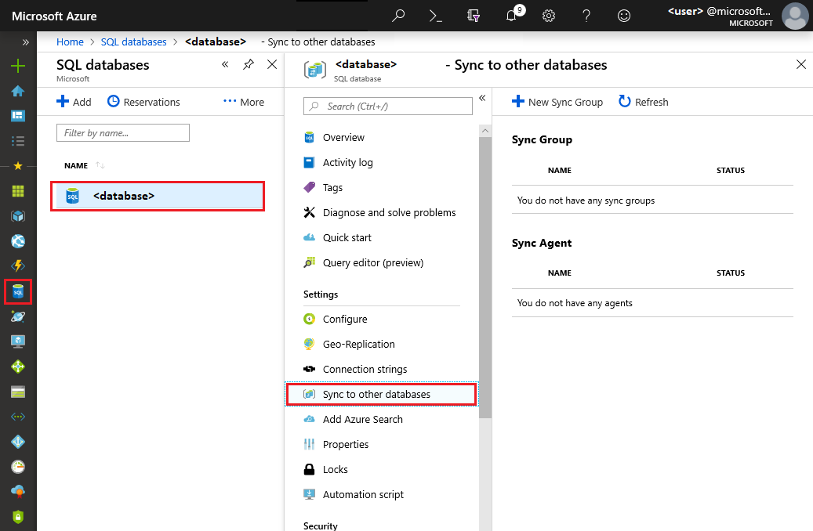
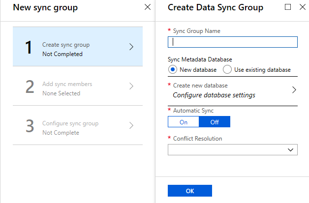
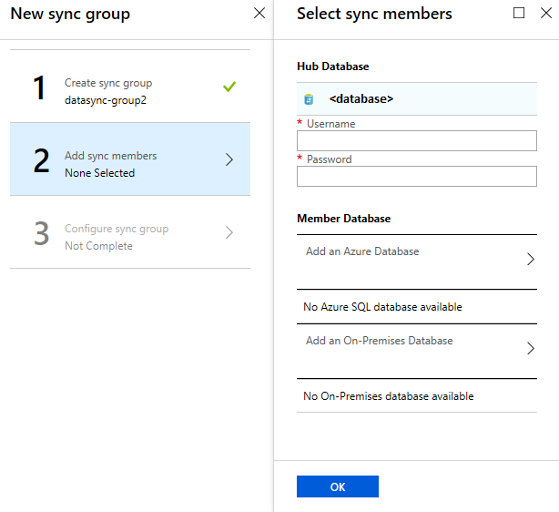
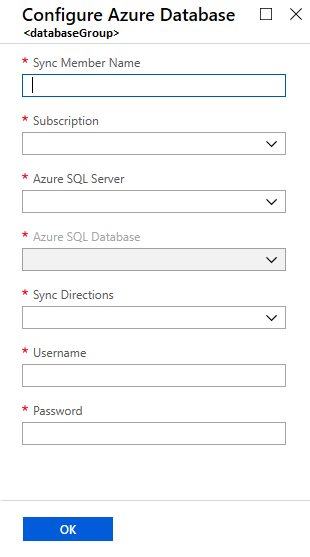
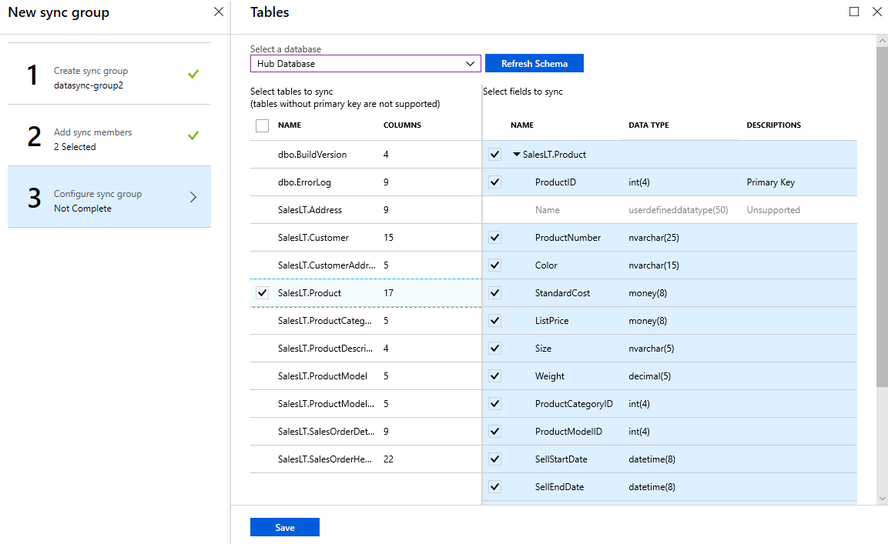
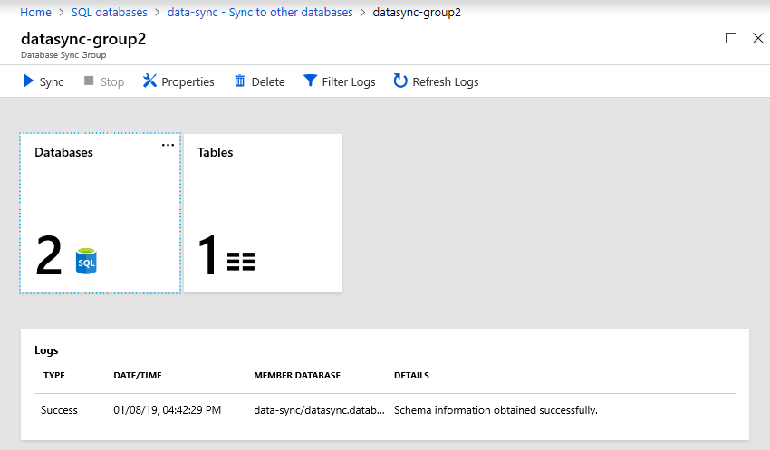

# Tutorial: Set up SQL Data Sync to sync data between Azure SQL Database and SQL Server on-premises

In this tutorial, you learn how to set up Azure SQL Data Sync by creating a sync group that contains both Azure SQL Database and SQL Server instances. The new sync group is fully configured and synchronizes on the schedule you set.

This tutorial assumes that you have at least some prior experience with SQL Database and with SQL Server.

For an overview of SQL Data Sync, see [Sync data across cloud and on-premises databases with Azure SQL Data Sync](sql-database-sync-data.md).

For PowerShell examples on how to configure SQL Data Sync, see the following articles:

- [Use PowerShell to sync between Azure SQL databases](scripts/sql-database-sync-data-between-sql-databases.md)
- [Use PowerShell to sync between an Azure SQL Database and a SQL Server on-premises database](scripts/sql-database-sync-data-between-azure-onprem.md)

> [!IMPORTANT]
> Azure SQL Data Sync does **not** support Azure SQL Database Managed Instance at this time.

## Create sync group

1. In your browser, navigate to the Azure portal. Locate your SQL database from your dashboard or from the **SQL databases** icon on the toolbar.

1. On the **SQL databases** page, select the existing SQL database that you want to use as the hub database for Data Sync.

    > [!NOTE]
    > The hub database is the central endpoint of the sync topology, in which a sync group has multiple database endpoints. All other database endpoints in the same sync group - that is, all member databases - sync with the hub database.

1. On the **SQL database** page for the selected database, select **Sync to other databases**.

    

1. On the **Sync to other databases** page, select **New Sync Group**. The **New sync group** page opens with **Step 1, Create sync group** highlighted.

1. On the **Create Data Sync Group** page, change the following settings:

   | Setting      | Description |
   | ------------ | ------------------------------------------------- |
   | **Sync Group Name** | Enter a name for the new sync group. This name is distinct from the name of the database itself. |
   | **Sync Metadata Database** | Choose whether to create a database (recommended) or to use an existing database. If you choose **New database**, select **Create new database.** Then on the **SQL Database** page, name and configure the new database. Then select **OK**. If you choose **Use existing database**, select the database from the list. |
   | **Automatic Sync** | Select **On** or **Off**. If you choose **On**, in the **Sync Frequency** section, enter a number and select **Seconds**, **Minutes**, **Hours**, or **Days**. |
   | **Conflict Resolution** | Select **Hub win** or **Member win**. **Hub win** means when a conflict occurs, the data in the hub database overwrites the conflicting data in the member database. **Member win** means when a conflict occurs, the data in the member database overwrites the conflicting data in the hub database. |

    > [!NOTE]
    > Microsoft recommends that you create a new, empty database to use as the Sync Metadata Database. Data Sync creates tables in this database and runs a frequent workload. This database is automatically shared as the Sync Metadata Database for all of your Sync groups in the selected region. You can't change the Sync Metadata Database or its name without removing all the Sync Groups and Sync Agents in the region.

    

1. Select **OK** and wait for the new sync group to be created and deployed.

## Add sync members

After the new sync group is created and deployed, **Step 2, Add sync members**, is highlighted in the **New sync group** page.

In the **Hub Database** section, enter the existing credentials for the SQL Database server on which the hub database is located. Don't enter *new* credentials in this section.

To add an Azure SQL Database:

1. In the **Member Database** section, optionally add an Azure SQL Database to the sync group by selecting **Add an Azure Database**. The **Configure Azure Database** page opens.

1. On the **Configure Azure Database** page, change the following settings:

   | Setting      | Description |
   | ------------ | ------------------------------------------------- |
   | **Sync Member Name** | Provide a name for the new sync member. This name is distinct from the name of the database itself. |
   | **Subscription** | Select the associated Azure subscription for billing purposes. |
   | **Azure SQL Server** | Select the existing SQL database server. |
   | **Azure SQL Database** | Select the existing SQL database. |
   | **Sync Directions** | Select **Bi-directional Sync**, **To the Hub**, or **From the Hub**. |
   | **Username** and **Password** | Enter the existing credentials for the SQL Database server on which the member database is located. Don't enter *new* credentials in this section. |

    

1. Select **OK** and wait for the new sync member to be created and deployed.

To add an on-premises SQL Server database:

In the **Member Database** section, optionally add an on-premises SQL Server to the sync group by selecting **Add an On-Premises Database**. The **Configure On-Premises** page opens where you can do the following things:

1. Select **Choose the Sync Agent Gateway**. The **Select Sync Agent** page opens.

1. On the **Choose the Sync Agent** page, choose whether to use an existing agent or create an agent.

    If you choose **Existing agents**, select the existing agent from the list.

    If you choose **Create a new agent**, do the following things:

   1. Download the client sync agent software from the link provided and install it on the computer where the SQL Server is located. You can also download the data sync agent directly from [SQL Azure Data Sync Agent](https://www.microsoft.com/download/details.aspx?id=27693).

        > [!IMPORTANT]
        > You have to open outbound TCP port 1433 in the firewall to let the client agent communicate with the server.

   1. Enter a name for the agent.

   1. Select **Create and Generate Key** and copy the agent key to the clipboard.

   1. Select **OK** to close the **Select Sync Agent** page.

      

   1. On the SQL Server computer, locate and run the Client Sync Agent app.

        

      1. In the sync agent app, select **Submit Agent Key**. The **Sync Metadata Database Configuration** dialog box opens.

      1. In the **Sync Metadata Database Configuration** dialog box, paste in the agent key copied from the Azure portal. Also provide the existing credentials for the Azure SQL Database server on which the metadata database is located. (If you created a metadata database, this database is on the same server as the hub database.) Select **OK** and wait for the configuration to finish.

        

        > [!NOTE]
        > If you get a firewall error at this point, you have to create a firewall rule on Azure to allow incoming traffic from the SQL Server computer. You can create the rule manually in the portal, but you may find it easier to create it in SQL Server Management Studio (SSMS). In SSMS, try to connect to the hub database on Azure. Enter its name as <hub_database_name>.database.windows.net. To configure the Azure firewall rule, follow the steps in the dialog box. Then return to the Client Sync Agent app.

      1. Select **Register** to register a SQL Server database with the agent. The **SQL Server Configuration** dialog box opens.

        

      1. In the **SQL Server Configuration** dialog box, choose whether to connect by using SQL Server authentication or Windows authentication. If you choose SQL Server authentication, enter the existing credentials. Provide the SQL Server name and the name of the database that you want to sync. Select **Test connection** to test your settings. Then select **Save**. The registered database appears in the list.

        

      1. Close the Client Sync Agent app.

   1. In the portal, on the **Configure On-Premises** page, select **Select the Database**.

   1. On the **Select Database** page, in the **Sync Member Name** field, provide a name for the new sync member. This name is distinct from the name of the database itself. Select the database from the list. In the **Sync Directions** field, select **Bi-directional Sync**, **To the Hub**, or **From the Hub**.

        

   1. Select **OK** to close the **Select Database** page. Then select **OK** to close the **Configure On-Premises** page and wait for the new sync member to be created and deployed. Finally, select **OK** to close the **Select sync members** page.

> [!NOTE]
> To connect to SQL Data Sync and the local agent, add your user name to the role `DataSync_Executor`. Data Sync creates this role on the SQL Server instance.

## Configure sync group

After the new sync group members are created and deployed, **Step 3, Configure sync group**, is highlighted in the **New sync group** page.

1. On the **Tables** page, select a database from the list of sync group members, and then select **Refresh schema**.

1. From the list of available tables, select the tables that you want to sync. By default, all columns in the table are selected. If you don't want to sync all the columns, disable the checkbox for the columns that you don't want to sync. Be sure to leave the primary key column selected.

1. Select **Save**.

1. By default, the databases aren't synced. To run a manual sync, navigate to your SQL database in the Azure portal and select **Sync to other databases**. Next, select the sync group and the **Data Sync** page opens. Select **Sync**.

    

## FAQ setup and configuration

**How frequently can Data Sync synchronize my data?**

The minimal duration between triggering synchronizations is five minutes.

**Does SQL Data Sync fully create tables?**

If the sync schema tables aren't already created in the destination database, SQL Data Sync creates them with the columns you selected. However, this behavior doesn't result in a full fidelity schema for the following reasons:

- Only columns you select are created in the destination table. Columns not selected aren't created in the destination tables.
- Indexes are created only for the selected columns. For columns not selected, those indexes aren't created in the destination tables.
- Indexes on XML type columns aren't created.
- `CHECK` constraints aren't created.
- Existing triggers on the source tables aren't created.
- Views and stored procedures aren't created on the destination database.

Because of these limitations, we recommend the following things:

- For production environments, create the full-fidelity schema yourself.
- When trying out the service, use the auto-provisioning feature.

**Why do I see tables that I didn't create?**

Data Sync creates additional tables in your database for change tracking. Don't delete them or Data Sync stops working.

**Is my data convergent after a sync?**

Not necessarily. In a sync group with a hub and three spokes (A, B, and C), the synchronizations are Hub to A, Hub to B, and Hub to C. If a change is made to database A *after* the Hub to A sync, that change isn't written to either database B or database C until the next sync task.

**How do I get schema changes into a sync group?**

You have to make and propagate all schema changes manually.

1. Replicate the schema changes manually to the hub and to all sync members.
1. Update the sync schema.

For adding new tables and columns:

New tables and columns don't impact the current sync. Data Sync ignores the new tables and columns until you add them to the sync schema. When you add new database objects, follow this sequence:

1. Add new tables or columns to the hub and to all sync members.
1. Add new tables or columns to the sync schema.
1. Begin inserting values into the new tables and columns.

For changing the data type of a column:

When you change the data type of an existing column, Data Sync continues to work as long as the new values fit the original data type defined in the sync schema. For example, if you change the type in the source database from **int** to **bigint**, Data Sync continues to work until you insert a value too large for the **int** data type. To complete the change, replicate the schema change manually to the hub and to all sync members, then update the sync schema.

**How can I export and import a database with Data Sync?**

After you export a database as a *.bacpac* file and import the file to create a database, do the following to use Data Sync in the new database:

1. Clean up the Data Sync objects and additional tables on the new database by using [this script](https://github.com/vitomaz-msft/DataSyncMetadataCleanup/blob/master/Data%20Sync%20complete%20cleanup.sql). The script deletes all the required Data Sync objects from the database.
1. Recreate the sync group with the new database. If you no longer need the old sync group, delete it.

## FAQ client agent

For frequently asked questions about the client agent, see [Agent FAQ](sql-database-data-sync-agent.md#agent-faq).

## Next steps

Congratulations. You've created a sync group that includes both a SQL Database instance and a SQL Server database.

For more info about SQL Data Sync, see:

- [Data Sync Agent for Azure SQL Data Sync](sql-database-data-sync-agent.md)
- [Best practices for Azure SQL Data Sync](sql-database-best-practices-data-sync.md)
- [Monitor SQL Data Sync with Log Analytics](sql-database-sync-monitor-oms.md)
- [Troubleshoot issues with Azure SQL Data Sync](sql-database-troubleshoot-data-sync.md)
- Update the sync schema with [Transact-SQL](sql-database-update-sync-schema.md) or [PowerShell](scripts/sql-database-sync-update-schema.md)

For more info about SQL Database, see:

- [SQL Database Overview](sql-database-technical-overview.md)
- [Database Lifecycle Management](https://msdn.microsoft.com/library/jj907294.aspx)
