<properties
	pageTitle="SQL Database tutorial: Create a SQL database | Microsoft Azure"
	description="Learn how to set up a SQL Database logical server, server firewall rule, SQL database, and sample data. Also, learn how to connect with client tools, configure users, and set up a database firewall rule."
	keywords="sql database tutorial, create a sql database"
	services="sql-database"
	documentationCenter=""
	authors="CarlRabeler"
	manager="jhubbard"
	editor=""/>

<tags
	ms.service="sql-database"
	ms.workload="data-management"
	ms.tgt_pltfrm="na"
	ms.devlang="na"
	ms.topic="hero-article"
	ms.date="09/07/2016"
	ms.author="carlrab"/>

# SQL Database tutorial: Create a SQL database in minutes by using the Azure portal

> [AZURE.SELECTOR]
- [Azure portal](sql-database-get-started.md)
- [C#](sql-database-get-started-csharp.md)
- [PowerShell](sql-database-get-started-powershell.md)

In this tutorial, you learn how to use the Azure portal to:

- Create an Azure SQL database with sample data.
- Create a server-level firewall rule for a single IP address or for a range of IP addresses.

You can perform these same tasks by using either [C#](sql-database-get-started-csharp.md) or [PowerShell](sql-database-get-started-powershell.md).

[AZURE.INCLUDE [Login](../../includes/azure-getting-started-portal-login.md)]

## Create your first Azure SQL database 

1. If you're not currently connected, connect to the [Azure portal](http://portal.azure.com).
2. Click **New**, click **Data + Storage**, and then locate **SQL Database**.

    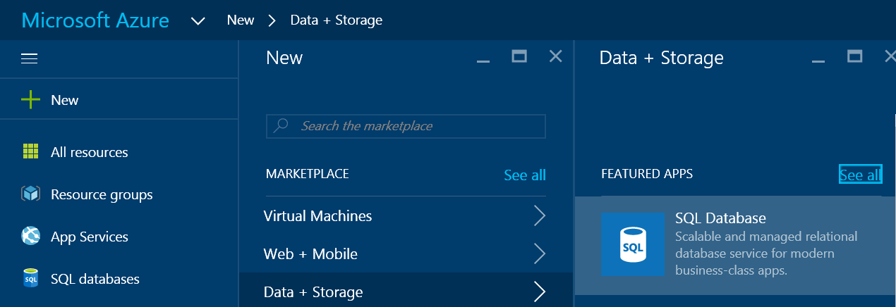

3. Click **SQL Database** to open the SQL Database blade. The content on this blade varies depending on the number of your subscriptions and your existing objects (such as existing servers).

    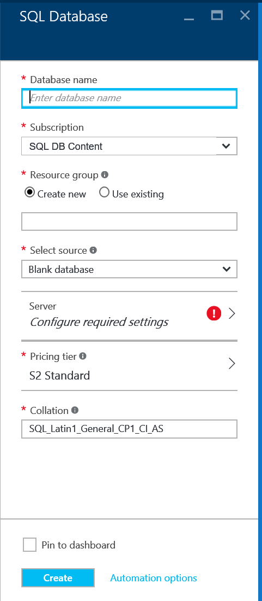

4. In the **Database name** text box, provide a name for your first database - such as "my-database". A green check mark indicates that you have provided a valid name.

    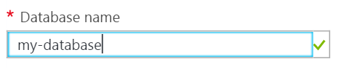

5. If you have multiple subscriptions, select a subscription.
6. Under **Resource group**, click **Create new** and provide a name for your first resource group - such as "my-resource-group". A green check mark indicates that you have provided a valid name.

    

7. Under **Select source**, click **Sample** and then under **Select sample** click **AdventureWorksLT [V12]**.

    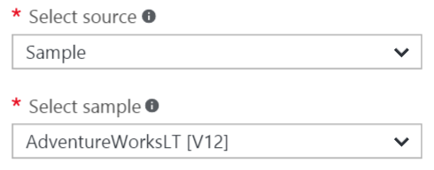

8. Under **Server**, click **Configure required settings**.

    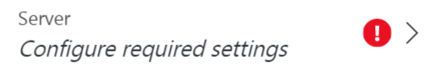

9. On the Server blade, click **Create a new server**. An Azure SQL database is created within a server object, which can be either a new server or an existing server.

    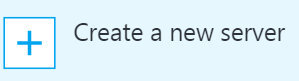

10. Review the **New server** blade to understand the information you need to provide for your new server.

    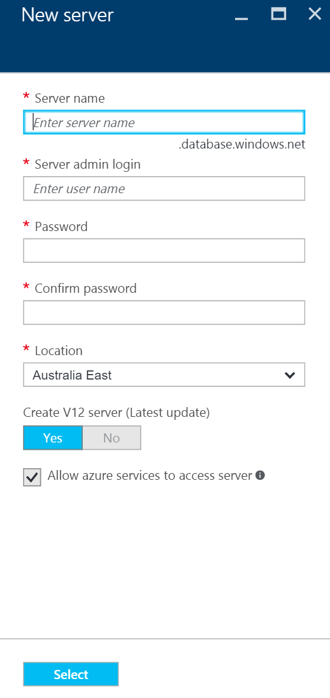

11. In the **Server name** text box, provide a name for your first server - such as "my-new-server-object". A green check mark indicates that you have provided a valid name.

    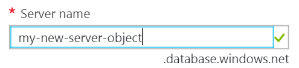
 
12. Under **Server admin login**, provide a user name for the administrator login for this server - such as "my-admin-account". This login is known as the server principal login. A green check mark indicates that you have provided a valid name.

    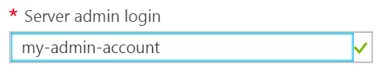

13. Under **Password** and **Confirm password**, provide a password for the server principal login account - such as "p@ssw0rd1". A green check mark indicates that you have provided a valid password.

    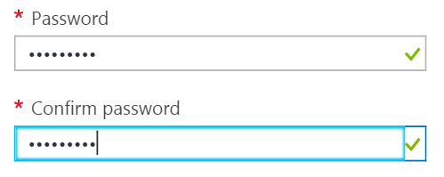
 
14. Under **Location**, select a data center appropriate to your location - such as "Australia East".

    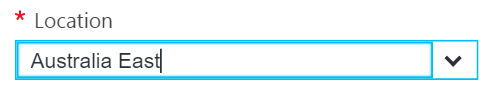

15. Under **Create V12 server (Latest update), notice that you only have the option to create a current version of Azure SQL server.

    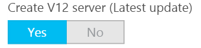

16. Notice that, by default, the checkbox for **Allow azure services to access server** is selected and cannot be changed here. This is an advanced option. You can change this setting in the server firewall settings for this server object, although for most scenarios this is not necessary.

    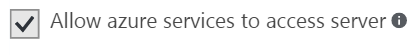

17. On the New server blade, review your selections and then click **Select** to select this new server for your new database.

    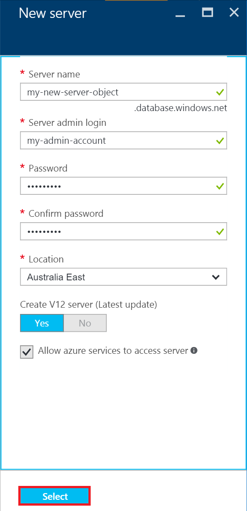

18. On the SQL Database blade, under **Pricing tier**, click **S2 Standard** and then click **Basic** to choose the least expensive pricing tier for your first database. You can always change the pricing tier later.

    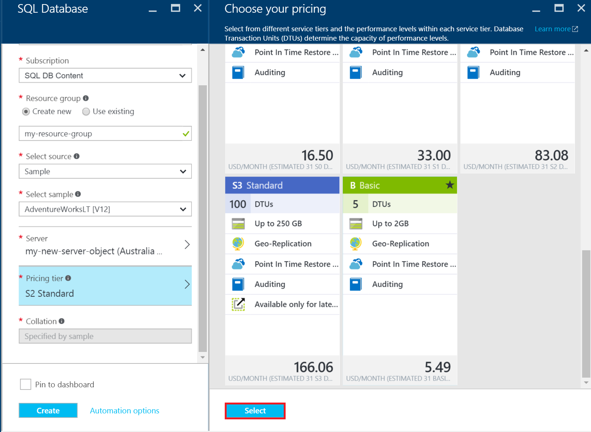

19. On the SQL Database blade, review your selections and then click **Create** to create your first server and database. The values that you provided are validated and deployment starts.

    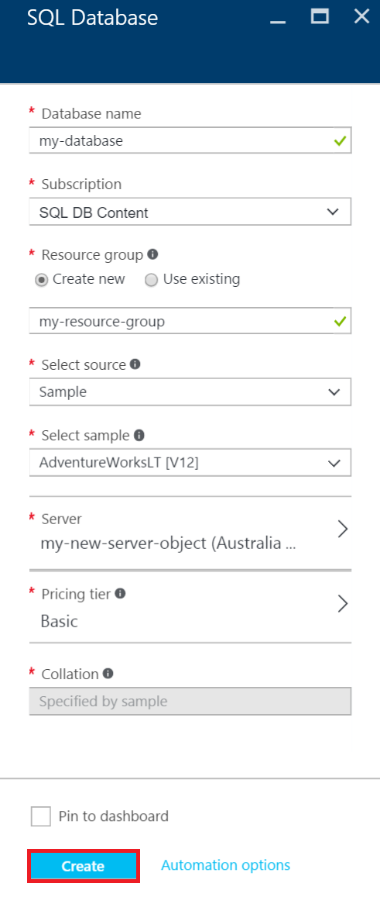

20. On the portal toolbar, click the **Notifications** items to check the status of your deployment.

    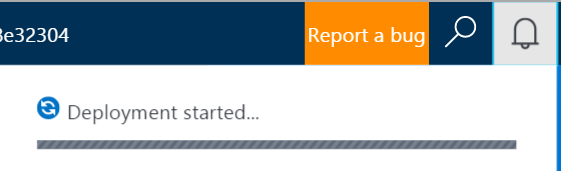

>[AZURE.IMPORTANT]When deployment completes, your new Azure SQL server and database are created in Azure. You will not be able to connect to your new server or database using SQL Server tools until you create a server firewall rule to open the SQL Database firewall to connections from outside of Azure.

[AZURE.INCLUDE [Create server firewall rule](../../includes/sql-database-create-new-server-firewall-portal.md)]

## Next steps
Now that you've completed this SQL Database tutorial and created a database with some sample data, you're ready to explore by using your favorite tools.

- If you're familiar with Transact-SQL and SQL Server Management Studio (SSMS), learn how to [Connect and query a SQL database with SSMS](sql-database-connect-query-ssms.md).

- If you know Excel, learn how to [Connect to a SQL database in Azure with Excel](sql-database-connect-excel.md).

- If you're ready to start coding, choose your programming language at [Connection libraries for SQL Database and SQL Server](sql-database-libraries.md).

- If you want to move your on-premises SQL Server databases to Azure, see [Migrating a database to SQL Database](sql-database-cloud-migrate.md) to learn more.

- If you want to load some data into a new table from a CSV file by using the BCP command-line tool, see [Loading data into SQL Database from a CSV file using BCP](sql-database-load-from-csv-with-bcp.md).

- If you want to start exploring Azure SQL Database security, see [Getting started with security](sql-database-get-started-security.md)

## Additional resources

[What is SQL Database?](sql-database-technical-overview.md)
