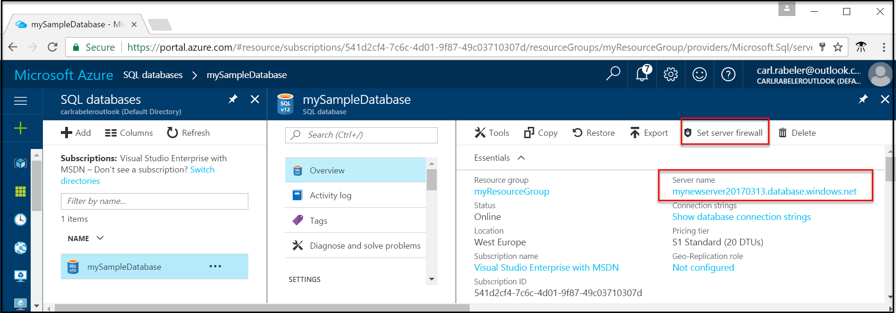

# Create and query a single Azure SQL database in the Azure portal

Azure SQL databases can be created through the Azure portal. This method provides a browser-based user interface for creating and configuring Azure SQL databases and all related Azure resources.

## Log in to the Azure portal

Log in to the [Azure portal](https://portal.azure.com/).

## Create a SQL database

An Azure SQL database is created within an Azure resource group, on a logical server, and with a defined set of compute and storage resources. Follow these steps to create a SQL database containing the Adventure Works LT sample data. 

1. Click the **New** button found on the upper left-hand corner of the Azure portal.

2. Select **Databases** from the **New** blade, and select **SQL Database** from the **Databases** blade.

3. Fill out the SQL Database form with the required information: 
   - Database name: Provide a database name
   - Subscription: Select your subscription
   - Resource group: Select new or existing
   - Source: Select **Sample (AdventureWOrksLT)**
   - Server: Create a new server (the **Server** name must be globally unique)
   - Elastic pool: Select **Not now** for this quick start
   - Pricing tier: Select **20 DTUs** and **250** GB of storage
   - Collation: You cannot change this value when importing the sample database 
   - Pin to dashboard: Select this checkbox

      

4. Click **Create** when complete. Provisioning takes a few minutes.
5. Once the SQL database deployment has finished, select the **SQL databases** on the dashboard or by selecting **SQL Databases** from the left-hand menu, and click your new database on the **SQL databases** page. An overview page for your database opens, showing you the fully qualified server name (such as **mynewserver20170313.database.windows.net**) and provides options for further configuration.

       

## Create a server-level firewall rule

The SQL Database service creates a firewall preventing external applications and tools from connecting to your new server and database. Follow these steps to create a SQL Database server-level firewall rule for your IP address to enable external connectivity through the SQL Database firewall. 

1. Click **Set server firewall** on the toolbar for your database. The **Firewall settings** page for the SQL Database server opens. 

       

2. Click **Add client IP** on the toolbar and then click **Save**. A server-level firewall rule is created for your current IP address.

3. Click **OK** and then click the **X** to close the Firewall settings page.

You can now connect to the database and its server using SQL Server Management Studio or another tool of your choice.

## Query the SQL database

Follow these steps to query the database using the query editor in the Azure portal. 

1. On the SQL Databse page for your database, click **Tools** on the toolbar. The **Query editor** preview page opens.

      

2. Click **Query editor (preview)**, click the **Preview terms** checkbox, and then click **OK**. The query editor opens.

3. Click **Login** and then, when prompted, select **SQL server authentication** and then provide the server admin login and password.
4. Click **OK** to log in.

5. After you are authenticated, type a query of your choice in the query window, such as the following query:

   ```
   SELECT pc.Name as CategoryName, p.name as ProductName
   FROM SalesLT.ProductCategory pc
   JOIN SalesLT.Product p
   ON pc.productcategoryid = p.productcategoryid;
   ```

6. Click **Run** and then review the query results in the **Results** pane.

    

7. Click the **X** to close the Query editor page.

## Clean up resources

You can choose to save the resources created in this quick start for later tutorials. Or, you can use the following steps to delete all resources created by this quick start in the Azure portal.

1. From the left-hand menu in the Azure portal, click **Resource groups** and then click **myResourceGroup**. 
2. On your resource group page, click **Delete**, type **myResourceGroup** in the text box, and then click **Delete**.

## Next steps

- To connect and query using SQL Server Management Studio, see [Connect and query with SSMS](sql-database-connect-query-ssms.md)
- To connect using Visual Studio, see [Connect and query with Visual Studio](sql-database-connect-query.md).
- For a technical overview of SQL Database, see [About the SQL Database service](sql-database-technical-overview.md).
