# Create, connect to, and query your first Azure SQL databases in the Azure portal and using SSMS

In this tutorial, you learn how to create, connect to, and query Azure SQL databases in the Azure portal and using SQL Server Management Studio. After you complete this tutorial, you will:

* Have created a resource group containing a logical server, a server-level firewall rule, and two databases.
* Know how to view server and database properties in the Azure portal and using SQL Server Management Studio.
* Know how to query a database in the Azure portal and using SQL Server Management Studio.

**Time estimate**: This tutorial takes approximately 30 minutes (assuming you already meet the prerequisites).

> [!TIP]
> You can also learn how to create, connect to, and query an Azure SQL database using either [PowerShell](sql-database-get-started-powershell.md) or [C#](sql-database-get-started-csharp.md).
>

> [!NOTE]
> This tutorial helps you to learn the content of these learn topics: [SQL Database server overview](sql-database-server-overview.md), [SQL database overview](sql-database-overview.md), and [Overview of Azure SQL Database firewall rules](sql-database-firewall-configure.md). For an overview of the SQL Database service, see [What is SQL Database?](sql-database-technical-overview.md).
>  

## Prerequisites

* **An Azure account**. You can [open a free Azure account](https://azure.microsoft.com/free/) or [Activate Visual Studio subscriber benefits](https://azure.microsoft.com/pricing/member-offers/msdn-benefits/). 

* **Azure create permissions**. You must be able to connect to the Azure portal with an account that is a member of either the subscription owner or contributor role. For more information on role-based access control (RBAC), see [Getting started with access management in the Azure portal](../active-directory/role-based-access-control-what-is.md).

* **SQL Server Management Studio**. You can download and install the latest version of SQL Server Management Studio (SSMS) at [Download SQL Server Management Studio](https://msdn.microsoft.com/library/mt238290.aspx). Always use the latest version of SSMS when connecting to Azure SQL Database as new capabilities are continually being released.

### Sign in to the Azure portal

The steps in this procedure show you how to connect to the Azure portal using  your [Azure account](https://account.windowsazure.com/Home/Index).

1. Open your browser of choice and connect to the [Azure portal](https://portal.azure.com/).
2. Sign in to the [Azure portal](https://portal.azure.com/).
3. On the **Sign in** page, provide the credentials for your subscription.
   
   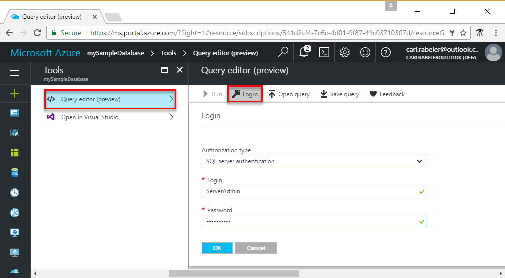


<a name="create-logical-server-bk"></a>

## Create a new logical SQL server

The steps in this procedure show you how to create a logical server in the Azure portal in the region of your choice. A logical server is the object in which you create your SQL databases and the object in which you create firewall rules to permit users to connect through the Azure SQL Database firewall. 

1. Click **New**, type **sql server**, and then click **ENTER**.

    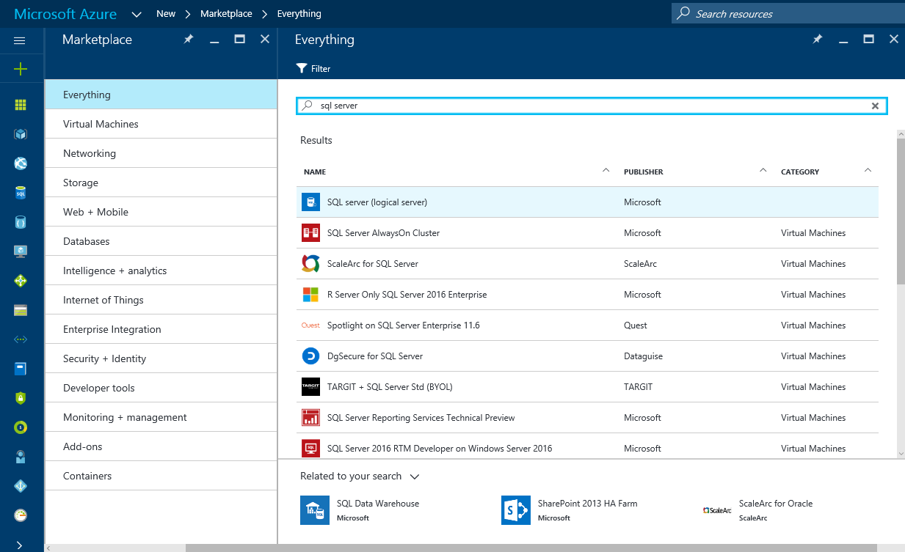
2. Click **SQL server (logical server)**.
   
    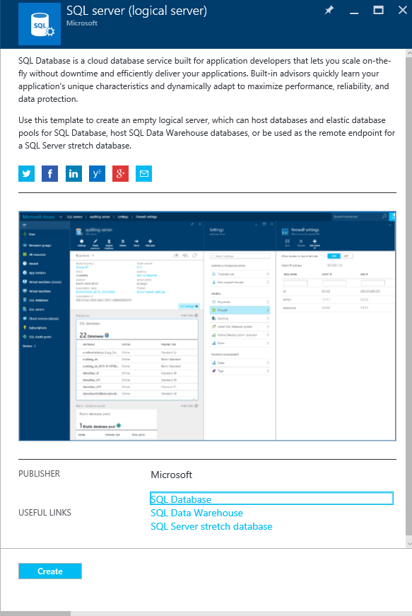
3. Click **Create** to open the new SQL Server (logical server) only blade.

    
3. In the **Server name** text box, provide a valid name for the new logical server. A green check mark indicates that you have provided a valid name.
    
    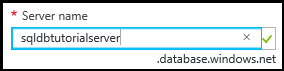

    > [!IMPORTANT]
    > The fully qualified name for your new server must be globally unique and is in the form of: **<your_server_name>.database.windows.net**. You use this fully qualified server name later in this tutorial to connect to your server and your databases.
    >
    
4. In the **Server admin login** text box, provide a user name for the SQL authentication login for this server. This login is referred to as the server principal login. A green check mark indicates that you have provided a valid name.
    
    
5. In the **Password** and **Confirm password** text boxes, provide a password for the server principal login account. A green check mark indicates that you have provided a valid password.
    
    
6. In the **Subscription** drop-down box, select a subscription in which you have permission to create objects.

    
7. Under **Resource group** text box, select **Create new** and then provide a valid name for the new resource group. A green check mark indicates that you have provided a valid name.

    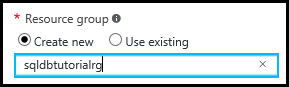

8. In the **Location** text box, select a data center in which to create your logical server.
    
    
    
    > [!TIP]
    > The checkbox for **Allow azure services to access server** cannot be changed on this blade. You can change this setting on the server firewall blade. For more information, see [Get started with security](sql-database-control-access-sql-authentication-get-started.md).
    >
    
9. Select the **Pin to dashboard** checkbox.

10. Click **Create** to deploy this script to Azure to create your logical server.

    

11. After your server has been created, review the properties of your server that are displayed by default. 

    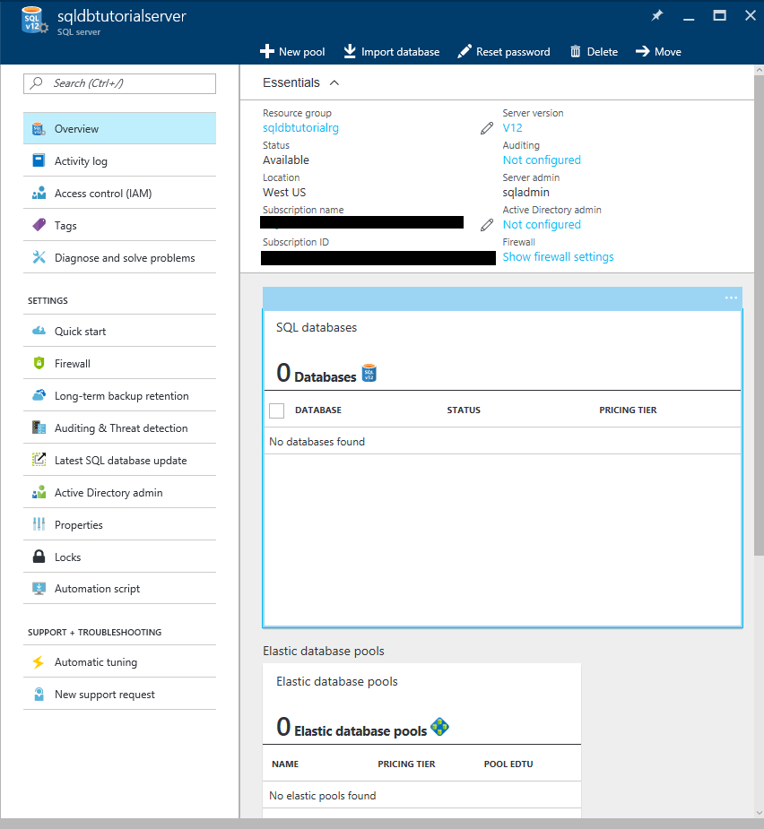
12. Click **Properties** to view additional properties of your logical SQL server.

    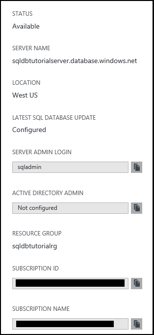
13. Copy the fully qualified server name to your clipboard for use a bit later in this tutorial.

    

## Create a server-level firewall rule

The steps in this procedure show you how to create a server-level firewall rule in the Azure portal. By default, an Azure SQL Database firewall prevents external connectivity to your logical server and its databases. To enable you to connect to your server, you need to create a firewall rule for the IP address of the computer from which you connect in the next procedure. For more information, see [Overview of Azure SQL Database firewall rules](sql-database-firewall-configure.md).

1. On the SQL server blade, click **Firewall** to open the Firewall blade for your server. Notice that the IP address is displayed for your client computer.

    

2. Click **Add client IP** on the toolbar to create a firewall rule for your current IP address.

    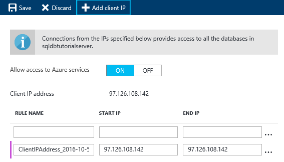

    > [!NOTE]
    > You can create a firewall rule for a single IP address or an entire range of addresses. Opening the firewall enables SQL administrators and users to log in to any database on the server for which they have valid credentials.
    >

4. Click **Save** on the toolbar to save this server-level firewall rule and then click **OK** to close the Success dialog box.

    

## Connect to the server with SSMS

The steps in this procedure show you how to connect to your SQL logical server using SQL Server Management Studio. SSMS is the primary tool that DBA's use to manage SQL servers and databases.

1. Open SQL Server Management Studio (type **Microsoft SQL Server Management Studio** in the Windows search box and click **Enter** to open SSMS).

    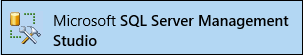
3. In the **Connect to Server** dialog box, enter your fully qualified server name from the previous procedure, select SQL Server Authentication, and then provide the login and password that you specified during provisioning of your server.

    
4. Click **Connect** to initiate the connection and open Object Explorer in SSMS.

    
5. In Object Explorer, expand **Databases**, expand **System Databases**, expand **master** to view objects in the master database.

    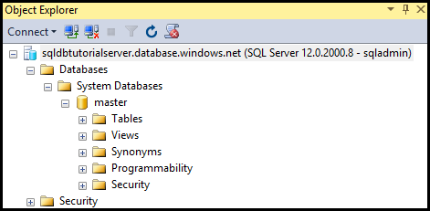
6. Right-click **master** and then click **New Query**.

    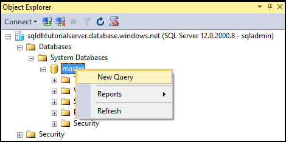

8. In the query window, type the following query:

   ```select * from sys.objects```

9.  On toolbar, click **Execute** to return a list of all system objects in the master database.

    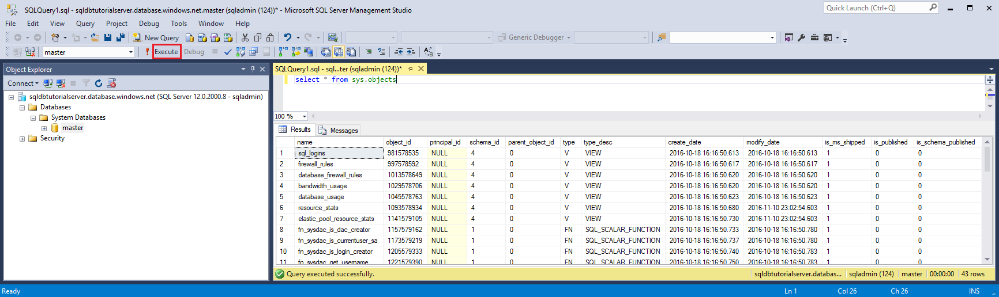

    > [!NOTE]
    > To get started with SQL security, see [Get Started with SQL authentication](sql-database-control-access-sql-authentication-get-started.md)
    >

## Create a database with sample data

The steps in this procedure show you how to create a database with sample data in the Azure portal associated with the logical server that you previously created. 

1. In Azure portal, click **SQL databases** in the default blade.

    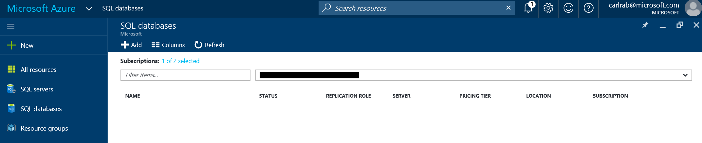
2. On the SQL databases blade, click **Add**. 

    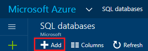

    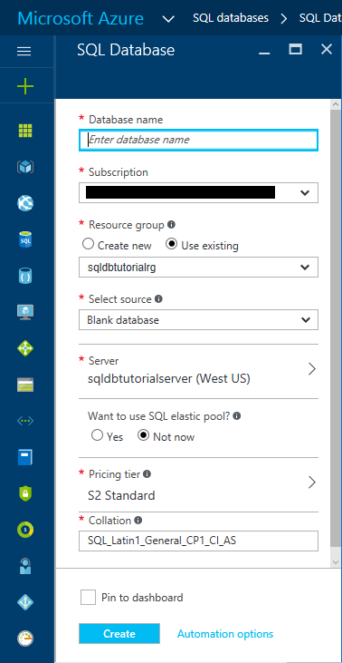
3. In the **Database name** text box, provide a valid database name.

    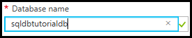
4. Under **Select source**, select **Sample (AdventureWorksLT)**.
   
    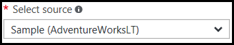
5. Under **Server**, verify that your server is selected. Notice also that when adding a database to a server, it can be added as a single database (this is the default) or added to an elastic pool. For more information on elastic pools, see [Elastic pools](sql-database-elastic-pool.md).

6. Under **Pricing tier**, change the pricing tier to **Basic** and click **Select**. You can increase the pricing tier later if desired, but for learning purposes, we recommend you use the lowest cost tier.

    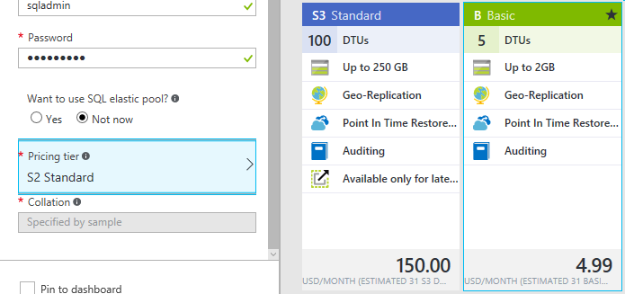
7. Select **Pin to dashboard** checkbox and then click **Create**.

    

8. After your database has been created, view its properties in the Azure portal. Subsequent tutorials help you understand the options available to you on this blade. 

    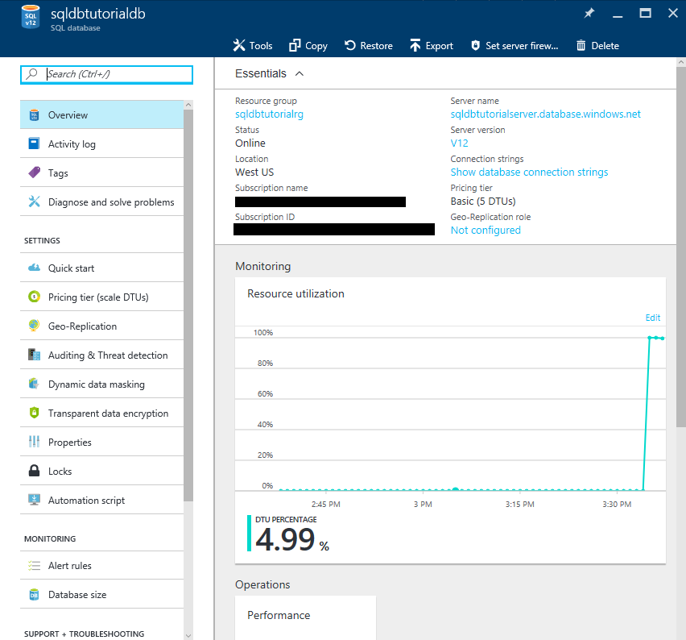

## Query the database in the Azure portal

The steps in this procedure show you how to query the database directly in the Azure portal. 

1. On the SQL databases blade, click **Tools** on the toolbar.

    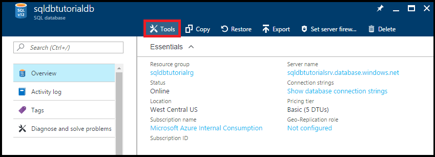
2. On the Tools blade, click **Query editor (preview)**.

    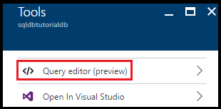
3. Click the checkbox to acknowledge that the query editor is a preview feature and then click **OK**.
4. On the **Query editor** blade, click **Login**.

    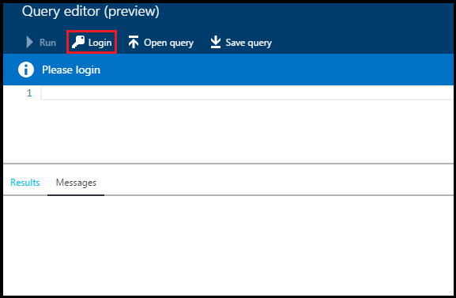
5. Review the Authorization type and Login, then provide the password for this login. 

    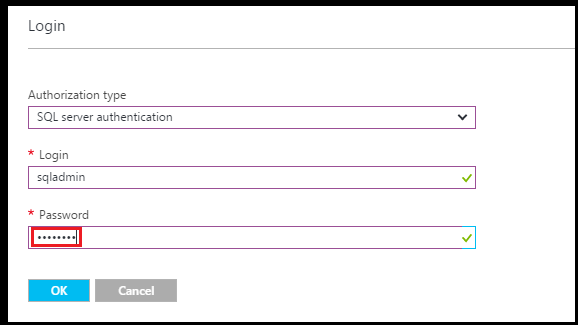
6. Click **OK** to attempt to login.
7. After you are authenticated, type the following query in the query window, and then click **Run**.

   ```select * from sys.objects```

    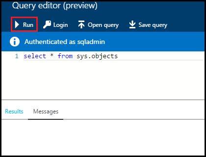

8. Review the query results in the **Results** pane.

    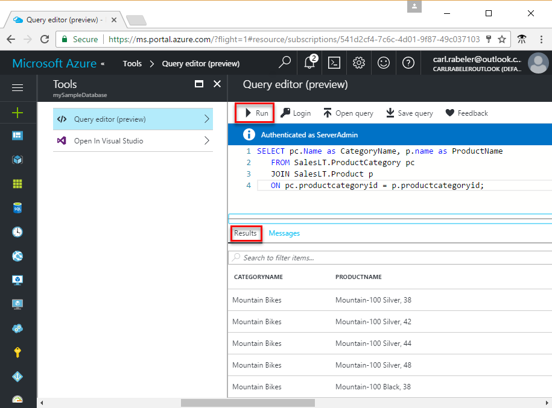

## Query the database with SSMS

The steps in this procedure show you how to connect to the database using SQL Server Management Studio and then query the sample data to view the objects in the database.

1. Switch to SQL Server Management Studio and, in Object Explorer, click **Databases** and then click **Refresh** on the toolbar to view the sample database.

    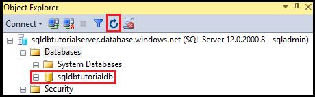
2. In Object Explorer, expand your new database to view its objects.

    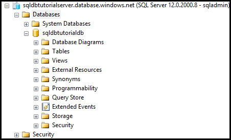
3. Right-click your sample database and then click **New Query**.

    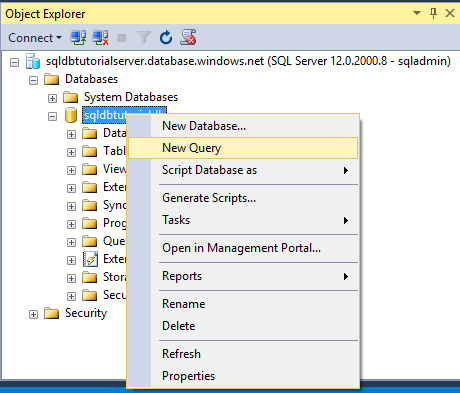
4. In the query window, type the following query:

   ```select * from sys.objects```
   
9.  On toolbar, click **Execute** to return a list of all system objects in the sample database.

    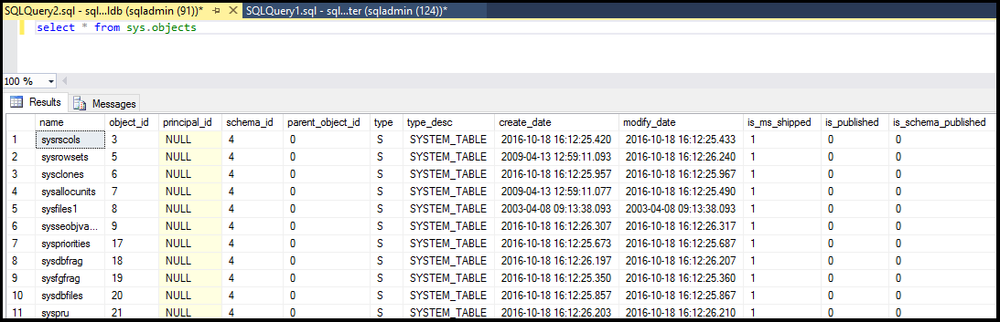

## Create a blank database with SSMS

The steps in this procedure show you how to create a new database using SQL Server Management Studio.

1. In Object Explorer, right-click **Databases** and then click **New database**.

    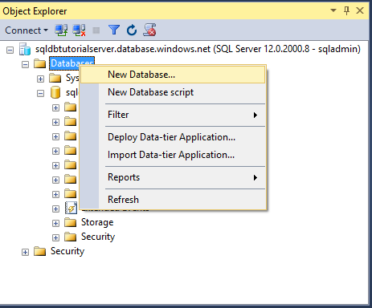

2. In the **New Database** dialog box, provide a database name in the Database name text box. 

    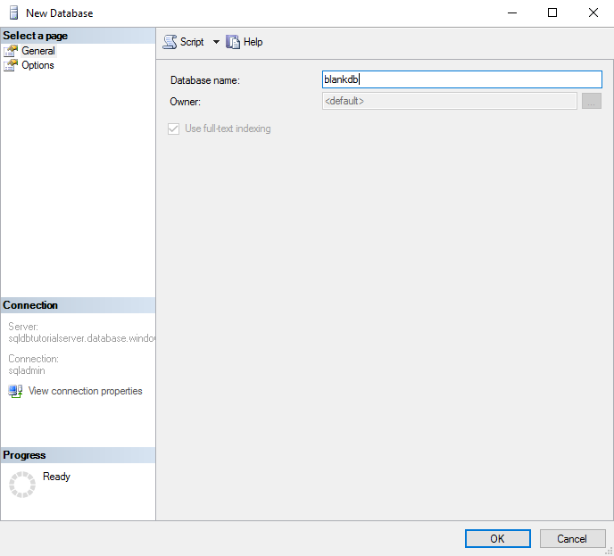

3. In the New Database dialog box, click **Options** and then change the Edition to **Basic**.

    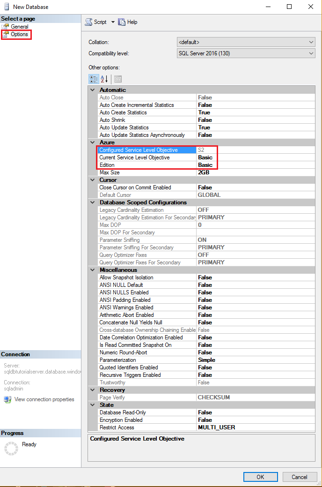

    > [!TIP]
    > Review the other options in this dialog box that you can modify for an Azure SQL Database. For more information on these options, see [Create Database](https://msdn.microsoft.com/library/dn268335.aspx).
    >

4. Click **OK** to create the blank database.
5. When complete, refresh the Database node in Object Explorer to view the newly created blank database. 

    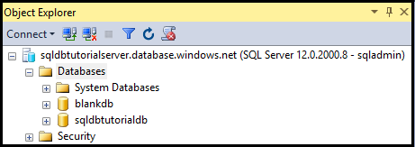

## Troubleshoot connectivity

You receive error messages when the connection to Azure SQL Database fails. The connection problems can be caused by SQL Azure database reconfiguration, firewall settings, connection time-out, or incorrect login information. For a connectivity troubleshooter tool, see [Troubleshooting connectivity issues with Microsoft Azure SQL Database](https://support.microsoft.com/help/10085/troubleshooting-connectivity-issues-with-microsoft-azure-sql-database).

## Delete a single database in the Azure portal

The steps in this procedure show you how to delete a single database with the Azure portal.

1. On the SQL databases blade in the Azure portal, click the database that you want to delete. 
2.  for your SQL database, click **Delete**.

    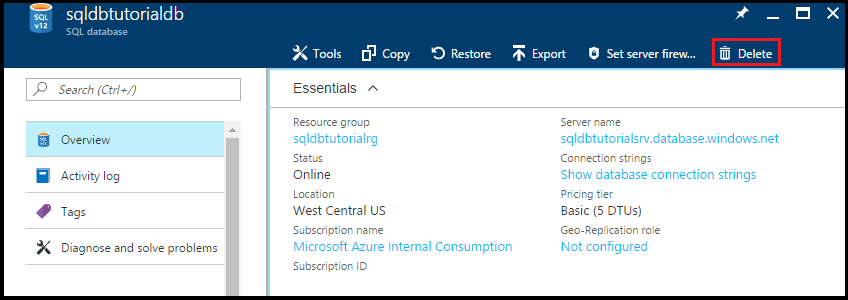
2. Click **Yes** to confirm that you want to delete this database permanently.

    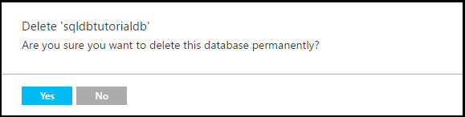

> [!TIP]
> During the retention period for your database, you can restore it from the service-initiated automatic backups (provided you do not delete the server itself). For Basic edition databases, you can restore them within seven days. For all other editions, you can restore them within 35 days. If you do delete the server itself, you cannot recover the server or any of its deleted databases. For more information about database backups, see [Learn about SQL Database backups](sql-database-automated-backups.md) and for information about restoring a database from backups, see [Database recovery](sql-database-recovery-using-backups.md). For a how-to article on restoring a deleted database, see [Restore a deleted Azure SQL database - Azure portal](sql-database-restore-deleted-database-portal.md).
>


## Next steps
Now that you've completed this tutorial, there are number of additional tutorials that you may wish to explore that build what you have learned in this tutorial. 

- For a getting started with SQL Server authentication tutorial, see [SQL authentication and authorization](sql-database-control-access-sql-authentication-get-started.md)
- For a getting started with Azure Active Directory authentication tutorial, see [AAD authentication and authorization](sql-database-control-access-aad-authentication-get-started.md)
* If you want to query the sample database in the Azure portal, see [Public preview: Interactive query experience for SQL databases](https://azure.microsoft.com/updates/azure-sql-database-public-preview-t-sql-editor/)
* If you know Excel, learn how to [Connect to a SQL database in Azure with Excel](sql-database-connect-excel.md).
* If you're ready to start coding, choose your programming language at [Connection libraries for SQL Database and SQL Server](sql-database-libraries.md).
* If you want to move your on-premises SQL Server databases to Azure, see [Migrating a database to SQL Database](sql-database-cloud-migrate.md).
* If you want to load some data into a new table from a CSV file with the BCP command-line tool, see [Loading data into SQL Database from a CSV file with BCP](sql-database-load-from-csv-with-bcp.md).
* If you want to start creating tables and other objects, see the "To create a table" topic in [Creating a table](https://msdn.microsoft.com/library/ms365315.aspx).

## Additional resources

- For a technical overview, see [What is SQL Database?](sql-database-technical-overview.md)
- For pricing information, see [Azure SQL Database pricing](https://azure.microsoft.com/pricing/details/sql-database/).

