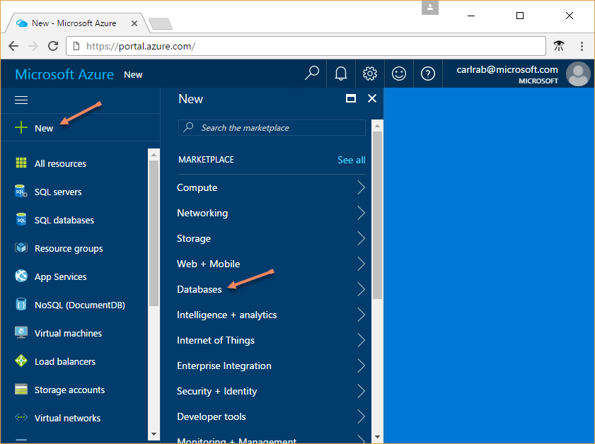
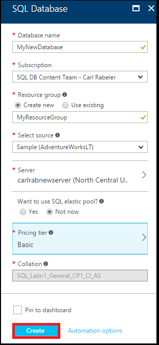
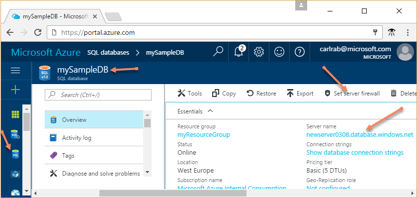

# Create and query a single Azure SQL database in the Azure portal

Azure SQL databases can be created through the Azure portal. This quick start details the portal deployment experience.

## Create a SQL database

Follow these steps to create a SQL database with sample data in a SQL Database logical server and Azure resource group. 

1. Log in to the [Azure portal](https://portal.azure.com/).
2. Click the **New** button.

      

3. Select **Databases** from the Marketplace screen, select **SQL Database** from the featured apps page.

4. Fill out the form with the required information (the **Server** name must be globally unique). 

      

5. Click **Create** when complete. Provisioning takes a few minutes.
6. Once the SQL database deployment has finished, select the **SQL databases** icon in the left-hand section of the Azure dashboard and click your new database on the **SQL databases** page. This opens the Azure dashboard page for your database, showing you the fully qualified server name (such as **mynewserver0308.database.windows.net**) and provides options for further configuration.

       

## Create a server-level firewall rule

Follow these steps to create a SQL Database server-level firewall rule for your IP address to enable external connectivity through the SQL Database firewall. 

1. Click **Set server firewall** on the toolbar for your database. This opens the **Firewall settings** page for the SQL Database server. 

2. Click **Add client IP** on the toolbar and then click **Save**. This creates a server-level firewall rule for your current IP address.

3. Click **OK** and then click the **X** to close the Firewall settings page. This returns you to the SQL database page for the next step.

You can now connect to the database and its server using SQL Server Management Studio or another tool of your choice.

## Query the SQL database

Follow these steps to query the database on the Azure dashboard. 

1. Click **Tools** on the toolbar for your database. This opens the **Query editor** page.

2. Click **Query editor (preview)**, click the preview checkbox, and then click **OK**. 

3. Click **Login** and then, when prompted, select **SQL server authentication** and then provide the server admin login and password.
4. Click **OK** tp log in.

5. After you are authenticated, type a query of your choice in the query window, such as the following query:

   ```
   SELECT * FROM sys.objects;
   ```

6. Click **Run** and then review the query results in the **Results** pane.

    

7. Click the **X** to close the Query editor page. This returns you to the SQL database page.

## Clean up resources

The steps in this procedure show how to delete all resources created by this quick start in the Azure portal.

1. On the Azure dashboard, click **Resource groups** and then click **myResourceGroup**. 
2. On the page for your resource group, click **Delete**, type **myResourceGroup** in the text box and then click **Delete**.

## Next steps

- To connect and query using SQL Server Management Studio, see [Connect and query with SSMS](sql-database-connect-query-ssms.md)
- To connect using Visual Studio, see [Connect and query with Visual Studio](sql-database-connect-query.md).
- To create a single database with Azure PowerShell, see [Create a single database using PowerShell](sql-database-get-started-powershell.md).
- To create a single database Azure CLI, see [Create a single database using CLI](sql-database-get-started-cli.md).
- For a getting started with SQL Server authentication tutorial, see [SQL authentication and authorization](sql-database-control-access-sql-authentication-get-started.md).
- If you're ready to start coding, choose your programming language at [Connection libraries for SQL Database and SQL Server](sql-database-libraries.md).
- If you want to move your on-premises SQL Server databases to Azure, see [Migrating a database to SQL Database](sql-database-cloud-migrate.md).
- For a technical overview of SQL Database, see [About the SQL Database service](sql-database-technical-overview.md).