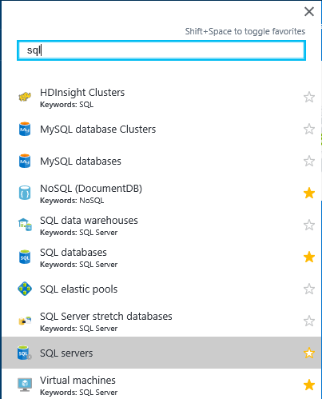
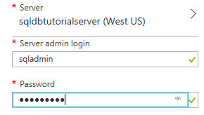
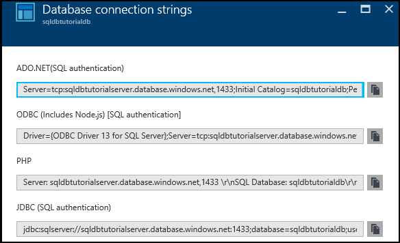
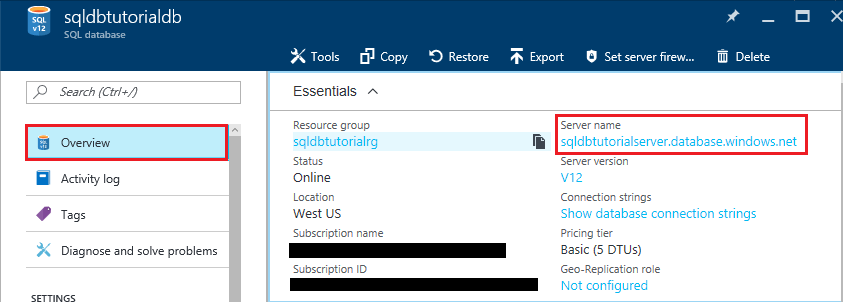
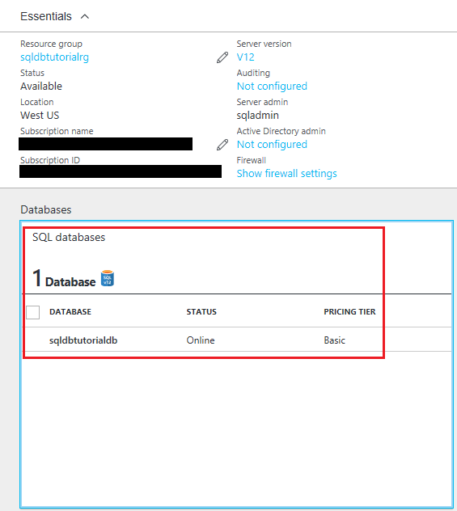
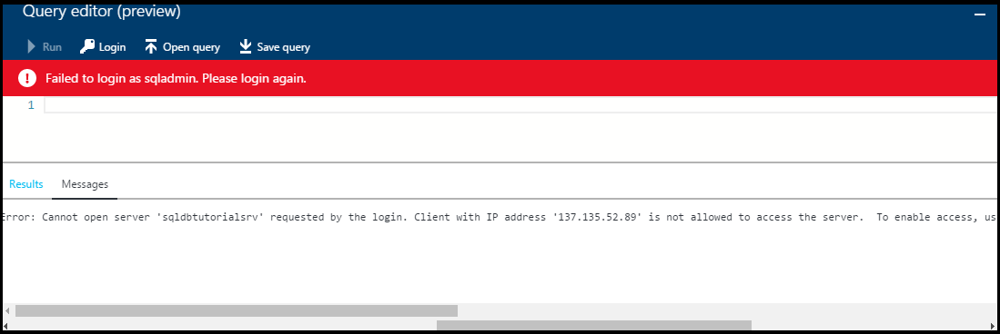

# Quick start tutorial: Your first Azure SQL database

In this quick start tutorial, you learn how to:

* [Create a new logical server](sql-database-get-started.md#create-a-new-logical-sql-server) 
* [View the logical server properties](sql-database-get-started.md#view-the-logical-server-properties) 
* [Create a server-level firewall rule](sql-database-get-started.md#create-a-server-level-firewall-rule) 
* [Connect to the server with SSMS](sql-database-get-started.md#connect-to-the-server-with-ssms) 
* [Create a database with sample data](sql-database-get-started.md#create-a-database-with-sample-data) 
* [View the database properties](sql-database-get-started.md#view-the-database-properties) 
* [Query the database in the Azure portal](sql-database-get-started.md#query-the-database-in-the-azure-portal) 
* [Connect and query the database with SSMS](sql-database-get-started.md#connect-and-query-the-database-with-ssms) 
* [Create a blank database with SSMS](sql-database-get-started.md#create-a-blank-database-with-ssms) 
* [Troubleshoot connectivity](sql-database-get-started.md#troubleshoot-connectivity) 
* [Delete a database](sql-database-get-started.md#delete-a-single-database) 


In this quick start tutorial, you create a sample database and a blank database running in an Azure resource group and attached to a logical server. You also create two server-level firewall rules configured to enable the server-level principal to log in to the server from two specified IP addresses. Finally, you learn how to query a database in the Azure portal and to connect and query using SQL Server Management Studio. 

**Time estimate**: This tutorial takes approximately 30 minutes (assuming you already meet the prerequisites).

> [!TIP]
> You can perform these same tasks with either [C#](sql-database-get-started-csharp.md) or [PowerShell](sql-database-get-started-powershell.md).
>

## Prerequisites

* You need an Azure account. You can [open a free Azure account](/pricing/free-trial/?WT.mc_id=A261C142F) or [Activate Visual Studio subscriber benefits](/pricing/member-offers/msdn-benefits-details/?WT.mc_id=A261C142F). 

* You must be able to connect to the Azure portal with an account that is a member of either the subscription owner or contributor role. For more information on role-based access control (RBAC), see [Getting started with access management in the Azure portal](../active-directory/role-based-access-control-what-is.md).

> [!NOTE]
> This quick start tutorial helps you to learn the content of these learn topics: [SQL Database server overview](sql-database-server-overview.md), [SQL database overview](sql-database-overview.md), and [Overview of Azure SQL Database firewall rules](sql-database-firewall-configure.md).
>  


### Sign in to the Azure portal with your Azure account
with your [Aure account](https://account.windowsazure.com/Home/Index), follow these steps to connect to the Azure portal.

1. Open your browser of choice and connect to the [Azure portal](https://portal.azure.com/).
2. Sign in to the [Azure portal](https://portal.azure.com/).
3. On the **Sign in** page, provide the credentials for your subscription.
   
   


<a name="create-logical-server-bk"></a>

## Create a new logical SQL server

Follow the steps in this procedure to create a new logical server with the Azure portal in the region of your choice.

1. Click **New**, type **sql server**, and then click **ENTER**.

    
2. Click **SQL server (logical server)**.
   
    
3. Click **Create** to open the new SQL Server (logical server) blade.

    
3. In the Server name text box, provide a valid name for the new logical server. A green check mark indicates that you have provided a valid name.
    
    

    > [!IMPORTANT]
    > The fully qualified name for your new server is in the form of: <your_server_name>.database.windows.net.
    >
    
4. In the Server admin login text box, provide a user name for the SQL authentication login for this server. This login is known as the server principal login. A green check mark indicates that you have provided a valid name.
    
    
5. In the **Password** and **Confirm password** text boxes, provide a password for the server principal login account. A green check mark indicates that you have provided a valid password.
    
    
6. Select a subscription in which you have permission to create objects.

    
7. In the Resource group text box, select **Create new** and then, in the resource group text box, provide a valid name for the new resource group (you can also use an existing resource group if you have already created one for yourself). A green check mark indicates that you have provided a valid name.

    

8. In the **Location** text box, select a data center appropriate to your location - such as "Australia East".
    
    
    
    > [!TIP]
    > The checkbox for **Allow azure services to access server** cannot be changed on this blade. You can change this setting on the server firewall blade. For more information, see [Get started with security](sql-database-control-access-sql-authentication-get-started.md).
    >
    
9. Click **Create**.

    

## View the logical server properties

Follow the steps in this procedure to view the server properties with the Azure portal. You need the fully qualified server name to connect to this server in a subsequent procedure. 

1. In the Azure portal, click **More services**.

    
2. In the Filter text box, type **SQL** and then click the star for SQL servers to specify SQL servers as a favorite within Azure. 

    
3. In the default blade, click **SQL servers** to open the list of SQL servers in your Azure subscription. 

    

4. Click your new SQL server to view its properties in the Azure portal. Subsequent tutorials help you understand the options available to you on this blade.

    
5. Under Settings, click **Properties** to view various properties of the logical SQL server.

    
6. Copy the fully qualified server name to your clipboard for use a bit later in this tutorial.

    

## Create a server-level firewall rule

Follow the steps in this procedure to create a new server-level firewall rule with the Azure portal to enable you to connect to your server with SQL Server Management Studio in the next procedure.

1. On the SQL server blade, under Settings, click **Firewall** to open the Firewall blade for the SQL server.

    

2. Click **Add client IP** on the toolbar.

    

    > [!NOTE]
    > You can open the SQL Database firewall on the server to a single IP address or an entire range of addresses. Opening the firewall enables SQL administrators and users to login to any database on the server to which they have valid credentials.
    >

4. Click **Save** on the toolbar to save this server-level firewall rule and then click **OK**.

    

## Connect to the server with SSMS

Follow the steps in this procedure to connect to the SQL logical server with SQL Server Management Studio.

1. If you have not already done so, download and install the latest version of SSMS at [Download SQL Server Management Studio](https://msdn.microsoft.com/library/mt238290.aspx). To stay up-to-date, the latest version of SSMS prompts you when there is a new version available to download.

2. After installing, type **Microsoft SQL Server Management Studio** in the Windows search box and click **Enter** to open SSMS:

    
3. In the Connect to Server dialog box, enter the necessary information to connect to your SQL server with SQL Server Authentication.

    
4. Click **Connect**.

    
5. In Object Explorer, expand **Databases**, expand **System Databases**, expand **master** to view objects in the master database.

    
6. Right-click **master** and then click **New Query**.

    

8. In the query window, type the following query:

   ```select * from sys.objects```

9.  On toolbar, click **Execute** to return a list of all system objects in the master database.

    

    > [!NOTE]
    > To explore SQL security, see [Get Started with SQL security](sql-database-control-access-sql-authentication-get-started.md)
    >

## Create a database with sample data

Follow the steps in this procedure to create a database with sample data with the Azure portal. You create this database attached to the logical server that you previously created. If the Basic service tier is not available in the region in which you created your server, delete your server and recreate it in another region. For deletion steps, see the last procedure in this tutorial.

1. In Azure portal, click **SQL databases** in the default blade.

    
2. On the SQL databases blade, click **Add**.

    
3. On the SQL Database blade, review the information completed for you.

    
4. Provide a valid database name.

    
5. Under Select source, click **Sample** and then underSelect sample, click **AdventureWorksLT [V12]**.
   
    
6. Under Server, provide the server admin login user name and password.

    

    > [!NOTE]
    > When adding a database to a server, it can be added as a single database (this is the default) or added to an elastic pool. For more information on elastic pools, see [Elastic pools](sql-database-elastic-pool.md).
    >

7. Under Pricing tier, change the pricing tier to **Basic** (you can increase the pricing tier later if desired, but for learning purposes, we recommend you use the lowest cost tier).

    
8. Click **Create**.

    

## View the database properties

Follow the steps in this procedure to query the database with the Azure portal.

1. On the SQL databases blade, click your new database to view its properties in the Azure portal. Subsequent tutorials help you understand the options available to you on this blade. 

    
2. Click **Properties** to view additional information about your database.

    

3. Click **Show database connection strings**.

    
4. Click **Overview** and then click your server name in the Essentials pane.
    
    
5. In the Essentials pane for your server, see your newly added database.

    

## Query the database in the Azure portal

Follow the steps in this procedure to query the database with the query editor in the Azure portal. The query shows the objects in the database.

1. On the SQL databases blade, click **Tools** on the toolbar.

    
2. On the Tools blade, click **Query editor (preview)**.

    
3. Click the checkbox to acknowledge that the query editor is a preview feature and then click **OK**.
4. On the **Query editor** blade, click **Login**.

    
5. Review the Authorization type and Login, then provide the password for this login. 

    
6. Click **OK** to attempt to login.
7. When you receive a login error stating that your client does not permission to log in due to the absence of firewall rule for your client's IP address, copy your client's IP address in the error window and, on the SQL server blade for this database, create a server-level firewall rule.

    
8. Repeat the previous 6 steps to log in to your database.
9. After you are authenticated, in the query window, type the following query:

   ```select * from sys.objects```

    
10.  Click **Run**.
11. Review the query results in the**Results** pane.

    

## Connect and query the database with SSMS

Follow the steps in this procedure to connect to the database with SQL Server Management Studio and then query the sample data to view the objects in the database.

1. Switch to SQL Server Management Studio and, in Object Explorer, click **Databases** and then click **Refresh** on the toolbar to view the sample database.

    
2. In Object Explorer, expand your new database to view its objects.

    
3. Right-click your sample database and then click **New Query**.

    
4. In the query window, type the following query:

   ```select * from sys.objects```
   
9.  On toolbar, click **Execute** to return a list of all system objects in the sample database.

    

## Create a blank database with SSMS

Follow the steps in this procedure to create a new database on the logical server with SQL Server Management Studio.

1. In Object Explorer, right-click **Databases** and then click **New database**.

    

    > [!NOTE]
    > You can also have SSMS create a create database script for you to create a new database with Transact-SQL.
    >

2. In the New Database dialog box, provide a database name in the Database name text box. 

    

3. In the New Database dialog box, click **Options** and then change the Edition to **Basic**.

    

    > [!TIP]
    > Review the other options in this dialog box that you can modify for an Azure SQL Database. For more information on these options, see [Create Database](https://msdn.microsoft.com/library/dn268335.aspx).
    >

4. Click **OK** to create the blank database.
5. When complete, refresh the Database node in Object Explorer to view the newly created blank database. 

    

## Troubleshoot connectivity

> [!IMPORTANT]
> If you have connectivity issues, see [Connectivity issues](sql-database-troubleshoot-common-connection-issues.md).
> 

## Delete a single database

Follow the steps in this procedure to delete a single database with the Azure portal.

1. On the blade in the Azure portal for your SQL database, click **Delete**.

    
2. Click **Yes** to confirm that you want to delete this database permanently.

    

> [!TIP]
> During the retention period for your database, you can restore it from the service-initiated automatic backups. For Basic edition databases, you can restore them within seven days. However, do not delete a server. If you do so, you cannot recover the server or any of its deleted databases. For more information about database backups, see [Learn about SQL Database backups](sql-database-automated-backups.md) and for information about restoring a database from backups, see [Database recovery](sql-database-recovery-using-backups.md). For a how-to article on restoring a deleted database, see [Restore a deleted Azure SQL database - Azure portal](sql-database-restore-deleted-database-portal.md).
>


## Next steps
Now that you've completed this tutorial, there are number of additional tutorials that you may wish to explore that build what you have learned in this tutorial. 

- For a getting started with SQL Server authentication tutorial, see [SQL authentication and authorization](sql-database-control-access-sql-authentication-get-started.md)
- For a getting started with Azure Active Directory authentication tutorial, see [AAD authentication and authorization](sql-database-control-access-aad-authentication-get-started.md)
* If you want to query the sample database in the Azure portal, see [Public preview: Interactive query experience for SQL databases](https://azure.microsoft.com/en-us/updates/azure-sql-database-public-preview-t-sql-editor/)
* If you know Excel, learn how to [Connect to a SQL database in Azure with Excel](sql-database-connect-excel.md).
* If you're ready to start coding, choose your programming language at [Connection libraries for SQL Database and SQL Server](sql-database-libraries.md).
* If you want to move your on-premises SQL Server databases to Azure, see [Migrating a database to SQL Database](sql-database-cloud-migrate.md).
* If you want to load some data into a new table from a CSV file with the BCP command-line tool, see [Loading data into SQL Database from a CSV file with BCP](sql-database-load-from-csv-with-bcp.md).
* If you want to start creating tables and other objects, see the "To create a table" topic in [Creating a table](https://msdn.microsoft.com/library/ms365315.aspx).

## Additional resources

- For a technical overview see [What is SQL Database?](sql-database-technical-overview.md)
- For pricing information, see [Azure SQL Database pricing](https://azure.microsoft.com/pricing/details/sql-database/).

