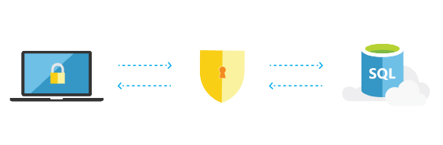

<properties
   pageTitle="Azure SQL Database Secures and Protects"
   description="Learn how SQL Database helps secure and protect"
   keywords=""
   services="sql-database"
   documentationCenter=""
   authors="carlrabeler"
   manager="jhubbard"
   editor=""/>

<tags
   ms.service="sql-database"
   ms.devlang="NA"
   ms.topic="article"
   ms.tgt_pltfrm="NA"
   ms.workload="data-management"
   ms.date="06/23/2016"
   ms.author="carlrab"/>
   
# Azure SQL Database Secures and Protects

## Keep your app’s data safe and secure

Azure SQL Database supports millions of mission-critical databases in the cloud&mdash;where they all benefit from high availability, security, compliance, and high performance. From the smallest startup to the largest enterprise, data security is increasingly top of mind for all businesses, and SQL Database supports everyone.

## We’ve got your back

You can only hope you don't need to access yesterday's backups or recover from a disaster. But if you find yourself in this situation, SQL Database is there to help. With 99.99% availability, automatic backups, Point-in-Time Restore, built-in Geo-Replication, and failover options, you'll rest easy knowing your app is safe and sound.

[Read the documentation](sql-database-business-continuity.md)

## The largest compliance portfolio

SQL Database has the largest compliance portfolio in the industry. So if you need HIPPA compliance or FERPA or even Singapore MTCS Level 3 don't worry&mdash;we got you covered.  

[Read the documentation](https://www.microsoft.com/TrustCenter/Compliance/default.aspx)

## Layers of protection

SQL Database provides multiple layers of data protection. Your data is protected by encrypting data while at rest, in motion or in use, authenticating only authorized users against the database or application, and limiting user access to the appropriate subset of the data. Additionally, SQL Database provides continuous monitoring and auditing of activities to help detect potential threats and provide a record of critical events in case of a breach. These features are balanced by the ability to quickly implement features and mitigate security risk without compromising developer productivity or a customer’s experience.

[Read the documentation](http://go.microsoft.com/fwlink/?LinkID=787593)

Go to the homepage to see what else SQL Database has to offer.
[Check it out](https://azure.microsoft.com/services/sql-database/) 

## Next steps

Get a [free Azure subscription](https://azure.microsoft.com/get-started/) and [create your first Azure SQL Database](sql-database-get-started.md).

## Additional resources

Explore all the [capabilities of SQL Database](https://azure.microsoft.com/services/sql-database/).
 
Review the [technical overview of SQL Database](sql-database-technical-overview.md).  

