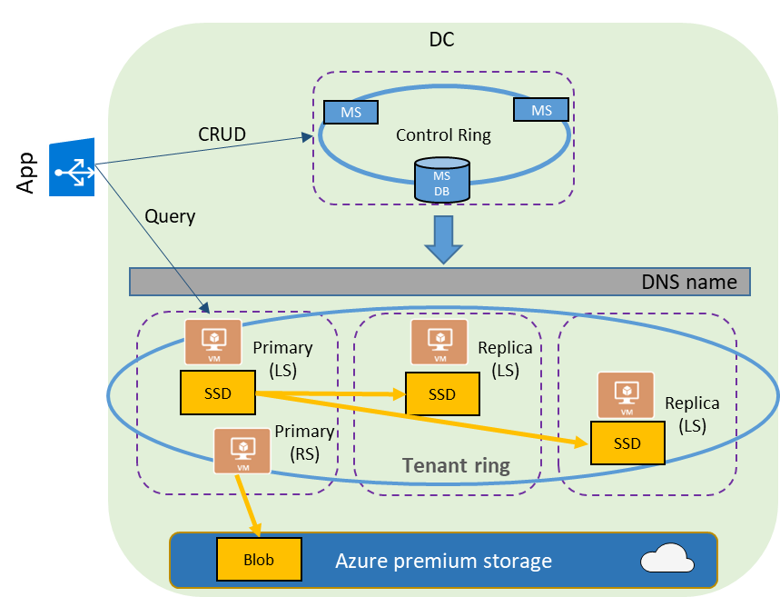

# High-availability and Azure SQL Database
Since the inception of the Azure SQL Database PaaS offering, Microsoft has made the promise to our customers that High Availability (HA) is built in to the service and the customers are not be required to operate, add special logic to, or make decisions around HA. Microsoft offers customers an SLA and maintain full control over the HA system configuration and operation. The HA SLA applies to a SQL database in a region and does not provide protection in cases of a total region failure that are due to factors outside our reasonable control (for example, natural disaster, war, acts of terrorism, riots, government action, or a network or device failure external to our data centers, including at customer site or between customer site and our data center).

To simplify the problem space of HA, Microsoft uses the following assumptions:
1.	Hardware and software failures are inevitable
2.	Operational staff make mistakes that lead to failures
3.	Planned servicing operations cause outages 

While such individual events are infrequent, at cloud scale, they every week if not every day. 

## Fault-tolerant SQL databases
Customers are most interested in the resiliency of their own databases and are less interested in the resiliency of the SQL Database service as a whole. 99.99% uptime for a service is meaningless if “my database” is part of the 0.01% of databases that are down. Each and every database needs to be fault-tolerant and fault mitigation should never result in the loss of a committed transaction. 

For data, SQL Database uses both local storage (LS) based on direct attached disks/VHDs and remote storage (RS) based on Azure Premium Storage page blobs. 
- Local storage is used in the Premium databases and pools, which are designed for OLTP applications with high IOPS requirements. 
- Remote storage is used for Basic and Standard service tiers, designed for small, cold, or large databases that require storage and compute power to scale independently. They use a single page blob for database and log files, and built-in storage replication and failover mechanisms.

In both cases, the replication, failure detection, and failover mechanisms of SQL Database are fully automated and operate without human intervention. This architecture is designed to ensure that committed data is never lost and that data durability takes precedence over all else.

Key benefits:
- Customers get the full benefit of replicated databases without having to configure or maintain complicated hardware, software, operating system, or virtualization environments.
- Full ACID properties of relational databases are maintained by the system.
- Failovers are fully automated without loss of any committed data.
- Routing of connections to the primary replica is dynamically managed by the service with no application logic required.
- The high level of automated redundancy is provided at no extra charge.

> [!NOTE]
> The described high availability architecture is subject to change without notice. 

## Data redundancy

The high availability solution in SQL Database is based on [AlwaysON](/sql/database-engine/availability-groups/windows/always-on-availability-groups-sql-server) technology from SQL Server and makes it work for both LS and RS databases with minimal differences. In LS configuration, AlwaysON is used for persistence while in RS is it used for availability (low RTO). 

### Local storage

In the LS case, each database is brought online by the management service (MS) within the control ring One primary replica and at least two secondary replicas (quorum-set) are located within a tenant ring that spans three independent physical subsystems within the same datacenter. All reads and writes are sent to the primary replica and the writes are asynchronously replicated to the secondary replicas. SQL Database uses a quorum-based commit scheme where data is written to the primary and at least one secondary replica before the transaction commits.

The [Service Fabric](/azure/service-fabric/service-fabric-overview.md) failover system automatically rebuilds replicas as nodes fail and maintains quorum-set membership as nodes depart and join the system. Planned maintenance is carefully coordinated to prevent the quorum-set going down below a minimum replica count (generally 2). This model works well for Premium databases, but it requires redundancy of both compute and storage components, and results in a higher cost.

## Remote storage

For remote storage configurations (Basic and Standard tiers), exactly one copy of the database is maintained in remote blob storage, leveraging the storage systems capabilities for durability, redundancy, and bit-rot detection. 

The high availability architecture is illustrated by following diagram:
 

## Failure Detection & Recovery 
A large-scale distributed system needs a highly reliable failure detection system that can detect failures reliably, quickly, and as close as possible to the customer. For SQL Database, this system is based on Azure Service Fabric. 

Because all reads and writes take place on the primary replica first, it is immediately evident if and when the primary replica has failed and work cannot continue. This process of promoting a secondary replica to the status of primary has recovery time objective (RTO)=30 sec and recovery point objective (RPO)=0. To mitigate the impact of the 30 sec RTO, the best practice is to try to reconnect several times with a smaller wait time for connection failure attempts.

When a secondary replica fails, the database is down to a minimal quorum-set, with no spares. Service fabric initiates the reconfiguration process similar to the process that follows failure of the primary replica, so after a short wait to determine whether the failure is permanent, another secondary replica is created. In cases of temporary out-of-service state, such as an operating system failure or an upgrade, a new replica is not built immediately to allow the failed node to restart instead. 

For the remote storage configurations, SQL Database uses AlwaysON functionality to failover databases during the upgrades. To do that, a new SQL instance is spun off in advance as part of the planned upgrade event, and it attaches and recovers the database file from remote storage. In case of process crashes or other unplanned events, Windows Fabric manages the instance availability and, as a last step of recovery, attaches the remote database file.

## Availability Zones
By default, the quorum-set replicas for the local storage configurations are created in the same datacenter. With the introduction of [Azure Availability Zones](/azure/availability-zones/az-overview.md), Microsoft added the ability to place the different replicas in the quorum-sets to different availability zones in the same region. To eliminate a single point of failure, the control ring is also duplicated across multiple zones as three gateway rings (GW). The routing to a specific gateway ring is controlled by [Azure Traffic Manager](/traffic-manager/traffic-manager-overview.md) (ATM). Because the zone redundant configuration does not create additional database redundancy, the use of Availability Zones in the Premium service tier is available at no extra cost. By selecting a zone redundant database, you can make your Premium databases resilient to a much larger set of failures, including catastrophic datacenter outages, without any changes of the application logic. You can also convert any existing Premium database or pool to the zone redundant configuration.

Because the zone redundant quorum-set has replicas in different datacenters with some distance between them, the increased network latency may increase the commit time and thus impact the performance of some OLTP workloads. You can always return to the single-zone configuration by disabling the zone redundancy setting. This process is a size of data operation and is similar to the regular service level objective (SLO) update. At the end of the process, the database or pool is migrated from a zone redundant ring to a single zone ring or vice versa.

> [!NOTE]
> In public preview of Availability Zones, only LS configurations (the Premium databases and pools) are supported.

The zone redundant version of the high availability architecture is illustrated by the following diagram:
 

## Conclusion
Azure SQL DB is deeply integrated with the Azure platform and is highly dependent on Service Fabric for failure detection and recovery, on Azure Storage Blobs for data protection and Availability Zones for higher fault tolerance. At the same time, Azure SQL database uses the AlwaysOn technology from SQL Server box product for replication and failover. The combination of these technologies enables the applications to fully realize the benefits of a mixed storage model and support the most demanding SLAs. 

## Next steps

- Learn about [Azure Availability Zones](/azure/availability-zones/az-overview.md)
- Learn about [Service Fabric](/azure/service-fabric/service-fabric-overview.md)
- Learn about [Azure Traffic Manager](/traffic-manager/traffic-manager-overview.md) 
