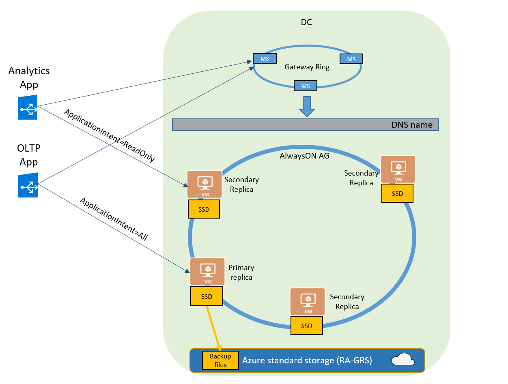
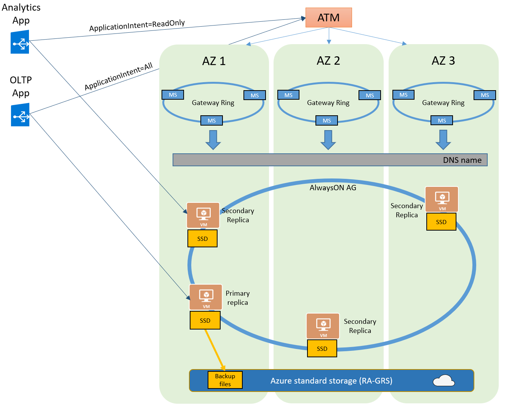

# High-availability and Azure SQL Database

Azure SQL Database is a highly available database Platform as a Service. It guarantees that your database is up and running 99.99% of time, without worrying about maintenance and downtimes. Azure automatically handles patching, backups, replication, underlying hardware failures, software or network failures, deploying bug fixes, database upgrades, and other maintenance tasks. When the underlying SQL instance is patched or fails over, the downtime is generally not noticeable if you [employ retry logic](sql-database-develop-overview.md#resiliency) in your app. Azure SQL Database can quickly recover even in the most critical circumstances ensuring that your data is always available.

The high availability architecture of Azure SQL Database is designed to ensure that committed data is never lost and that maintenance operations are performed without affecting workload. There are no maintenance windows or downtimes that should require you to stop the workload while the database is upgraded or maintained. The built-in high availability guarantees that database will never be a single point of failure in your software architecture with 99.99% availability SLA.

There are two high-availability architectural models that are used in Azure SQL Database:

- Standard availability model that is based on a separation of compute and storage.  It relies on high availability and reliability of the remote storage tier. This architecture targets budget oriented business applications that can tolerate some performance degradation during maintenance activities.
- Premium availability model that is based on a cluster of database engine processes. It relies on a fact that there is always a quorum of available database engine nodes. This architecture targets mission critical applications with high IO performance, high transaction rate and guarantees minimal performance impact on your workload during maintenance activities.

Azure SQL Database runs on the latest stable version of SQL Server Database Engine and Windows OS, and most of the users would not notice that the upgrades are performed continuously.

## Basic, Standard, and General Purpose service tiers

These service tiers leverage the standard availability architecture. The following figure shows four different nodes with the separated compute and storage layers.

The standard availability model includes two layers:

- A stateless compute layer that runs the `sqlserver.exe` process and contains only transient and cached data (for example – plan cache, buffer pool, column store pool). This stateless node is operated by Azure Service Fabric that initializes `sqlserver.exe`, controls health of the node, and performs failover to another node if necessary.
- A stateful data layer with the database files (.mdf/.ldf) that are stored in Azure Blob storage. Azure blob storage has built-in data availability/redundancy that ensures that every record in the log file or page in the data file will be preserved even if SQL Server process crashes.

Whenever the database engine or the operating system is upgraded, some part of the underlying infrastructure fails, or if a critical issue is detected in Sql Server process, Azure Service Fabric will move the stateless SQL Server process to another stateless compute node with sufficient free capacity. Data in Azure Blob storage is not affected by the move, and the data/log files are attached to the newly initialized SQL Server process. This process guarantees 99.99% availability, but a heavy workload may experience some performance degradation during the transition due to the fact the new SQL Server instance starts with cold cache.

## Premium and Business Critical service tiers

Premium and Business Critical service tiers leverage the Premium availability model, which integrates compute resources (SQL Server Database Engine process) and storage (locally attached SSD) on a single node. High availability is achieved by replicating both compute and storage to additional nodes creating a 3 to 4-node cluster. 

The underlying database files (.mdf/.ldf) are placed on the attached SSD storage to provide a very low latency IO to your workload. High availability is implemented using a technology similar to SQL Server [Always On Availability Groups](https://docs.microsoft.com/sql/database-engine/availability-groups/windows/overview-of-always-on-availability-groups-sql-server). The cluster (availability group) includes a sinlge primary replica (SQL Server process) that is accessible for read-write customer workload, and up to three secondary replicas containing copies of data (compute and storage). The primary node constantly pushes the changes to secondary nodes in order and ensures that the data is synchronized to at least one secondary replicas before committing each transaction. Thsi process guarantees that if the primary node crashes for any reason, there is always a fully synchronized node to fail over to. The failover is initiated by the Azure Service Fabric. Once a secondary replica becomes the new primary node another  secondary replica is created to ensure the cluster has enough nodes (quorum). Once the failover is completed, the SQL connections are automatically redirected to the new primary node.

As an extra benefit, the premium avalability model includes the ability of redcirecting the read-only SQL connections to one of the secondary repolicas. This feature is called [Read Scale-Out](sql-database-read-scale-out.md). It provides 100% additional capacity to off-load the read-only operations, such as analytical workloads, from the primary replica for no extra charge.

## Zone redundant configuration

By default, the quorum-set replicas for the local storage configurations are created in the same datacenter. With the introduction of [Azure Availability Zones](../availability-zones/az-overview.md), you have the ability to place the different replicas in the quorum-sets to different availability zones in the same region. To eliminate a single point of failure, the control ring is also duplicated across multiple zones as three gateway rings (GW). The routing to a specific gateway ring is controlled by [Azure Traffic Manager](../traffic-manager/traffic-manager-overview.md) (ATM). Because the zone redundant configuration does not create additional database redundancy, the use of Availability Zones  in the Premium or Business Critical service tiers is available at no extra cost. By selecting a zone redundant database, you can make your Premium or Business Critical databases resilient to a much larger set of failures, including catastrophic datacenter outages, without any changes of the application logic. You can also convert any existing Premium or Business Critical databases or pools to the zone redundant configuration.

Because the zone redundant quorum-set has replicas in different datacenters with some distance between them, the increased network latency may increase the commit time and thus impact the performance of some OLTP workloads. You can always return to the single-zone configuration by disabling the zone redundancy setting. This process is a size of data operation and is similar to the regular service tier update. At the end of the process, the database or pool is migrated from a zone redundant ring to a single zone ring or vice versa.

> [!IMPORTANT]
> Zone redundant databases and elastic pools are currently only supported in the Premium service tier. By default, backups and audit records are stored in RA-GRS storage and therefore may not be automatically available in case of a zone-wide outage. 

The zone redundant version of the high availability architecture is illustrated by the following diagram:

## Accelerated Database Recovery (ADR)

[Accelerated Database Recovery (ADR)](sql-database-accelerated-database-recovery.md) is a new SQL database engine feature that greatly improves database availability, especially in the presence of long running transactions, by redesigning the SQL database engine recovery process. ADR is currently available for single databases, elastic pools, and Azure SQL Data Warehouse.

## Conclusion

Azure SQL Database is deeply integrated with the Azure platform and is highly dependent on Service Fabric for failure detection and recovery, on Azure Blob storage for data protection and Availability Zones for higher fault tolerance. At the same time, Azure SQL database fully leverages the Always On Availability Group technology from SQL Server box product for replication and failover. The combination of these technologies enables the applications to fully realize the benefits of a mixed storage model and support the most demanding SLAs.

## Next steps

- Learn about [Azure Availability Zones](../availability-zones/az-overview.md)
- Learn about [Service Fabric](../service-fabric/service-fabric-overview.md)
- Learn about [Azure Traffic Manager](../traffic-manager/traffic-manager-overview.md)
- For more options for high availability and disaster recovery, see [Business Continuity](sql-database-business-continuity.md)
