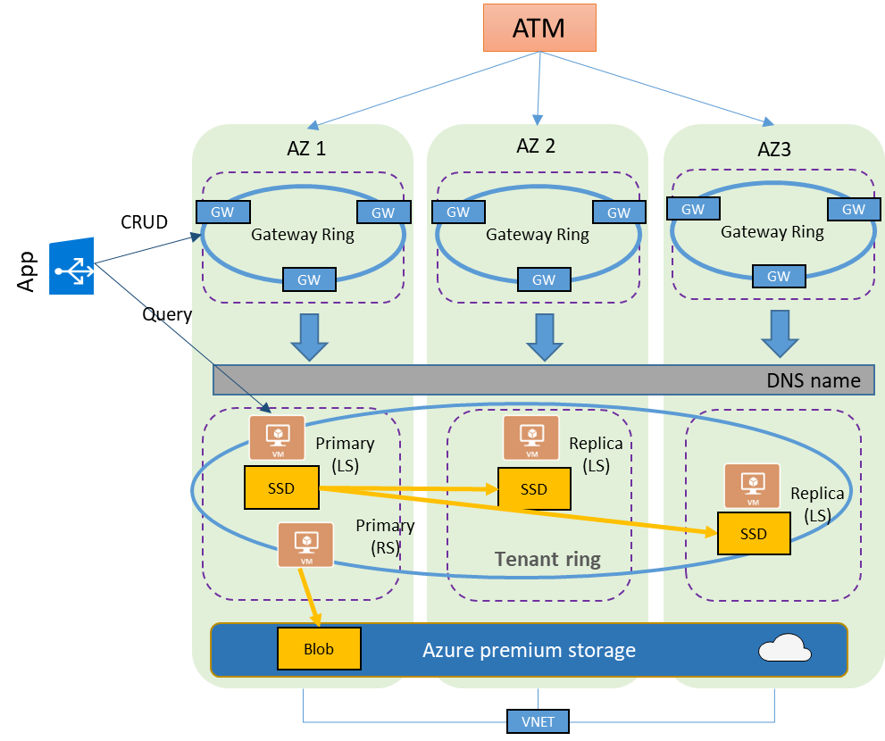

# High-availability and Azure SQL Database

Azure SQL Database is highly available database Platform as a Service that guarantees that your database is up and running 99.99% of time, without worrying about maintenance and downtimes. This is a fully managed SQL Server Database Engine process hosted in the Azure cloud that ensures that your SQL Server database is always upgraded/patched without affecting your workload. When an instance is patched or fails over, the downtime is generally not noticeable if you [employ retry logic](sql-database-develop-overview.md#resiliency) in your app. If the time to complete a failover is longer than 60 seconds, you should open a support case. Azure SQL Database can quickly recover even in the most critical circumstances ensuring that your data is always available.

Azure platform fully manages every Azure SQL Database and guarantees no data loss and a high percentage of data availability. Azure automatically handles patching, backups, replication, failure detection, underlying potential hardware, software or network failures, deploying bug fixes, failovers, database upgrades, and other maintenance tasks. SQL Server engineers have implemented the best-known practices, ensuring that all the maintenance operations are completed in less than 0.01% time of your database life. This architecture is designed to ensure that committed data is never lost and that maintenance operations are performed without affecting workload. There are no maintenance windows or downtimes that should require you to stop the workload while the database is upgraded or maintained. Built-in high availability in Azure SQL Database guarantees that database will never be single point of failure in your software architecture.

Azure SQL Database is based on SQL Server Database Engine architecture that is adjusted for the cloud environment in order to ensure 99.99% availability even in the cases of infrastructure failures. There are two high-availability architectural models that are used in Azure SQL Database (both of them ensuring 99.99% availability):

- Standard/general purpose service tier model that is based on a separation of compute and storage. This architectural model relies on high availability and reliability of storage tier, but it might have some potential performance degradation during maintenance activities.
- Premium/business critical service tier model that is based on a cluster of database engine processes. This architectural model relies on a fact that there is always a quorum of available database engine nodes and has minimal performance impact on your workload even during maintenance activities.

Azure upgrades and patches underlying operating system, drivers, and SQL Server Database Engine transparently with the minimal down-time for end users. Azure SQL Database runs on the latest stable version of SQL Server Database Engine and Windows OS, and most of the users would not notice that the upgrades are performed continuously.

## Basic, Standard, and General Purpose service tier availability

Standard availability refers to 99.99% SLA that is applied in Basic, Standard, and General Purpose service tiers. High availability in this architectural model is achieved by separation of compute and storage layers and the replication of data in the storage tier.

The following figure shows four nodes in standard architectural model with the separated compute and storage layers.

In the standard availability model there are two layers:

- A stateless compute layer that is running the `sqlserver.exe` process and contains only transient and cached data (for example – plan cache, buffer pool, column store pool). This stateless SQL Server node is operated by Azure Service Fabric that initializes process, controls health of the node, and performs failover to another place if necessary.
- A stateful data layer with database files (.mdf/.ldf) that are stored in Azure Premium Storage. Azure Storage guarantees that there will be no data loss of any record that is placed in any database file. Azure Storage has built-in data availability/redundancy that ensures that every record in log file or page in data file will be preserved even if SQL Server process crashes.

Whenever database engine or operating system is upgraded, some part of underlying infrastructure fails, or if some critical issue is detected in Sql Server process, Azure Service Fabric will move the stateless SQL Server process to another stateless compute node. There is a set of spare nodes that is waiting to run new compute service in case of failover in order to minimize failover time. Data in Azure Storage layer is not affected, and data/log files are attached to newly initialized SQL Server process. This process guarantees 99.99% availability, but it might have some performance impacts on heavy workload that is running due to transition time and the fact the new SQL Server node starts with cold cache.

## Premium and Business Critical service tier availability

Premium availability is enabled in Premium and Business Critical service tiers of Azure SQL Database and it is designed for intensive workloads that cannot tolerate any performance impact due to the ongoing maintenance operations.

In the premium model, Azure SQL database integrates compute and storage on the single node. High availability in this architectural model is achieved by replication of compute (SQL Server Database Engine process) and storage (locally attached SSD) deployed in 4-node cluster, using technology similar to SQL Server [Always On Availability Groups](https://docs.microsoft.com/sql/database-engine/availability-groups/windows/overview-of-always-on-availability-groups-sql-server).

Both the SQL database engine process and underlying mdf/ldf files are placed on the same node with locally attached SSD storage providing low latency to your workload. High availability is implemented using technology similar to SQL Server [Always On Availability Groups](https://docs.microsoft.com/sql/database-engine/availability-groups/windows/overview-of-always-on-availability-groups-sql-server). Every database is a cluster of database nodes with one primary database that is accessible for customer workload, and a three secondary processes containing copies of data. The primary node constantly pushes the changes to secondary nodes in order to ensure that the data is available on secondary replicas if the primary node crashes for any reason. Failover is handled by the SQL Server Database Engine – one secondary replica becomes the primary node and a new secondary replica is created to ensure enough nodes in the cluster. The workload is automatically redirected to the new primary node.

In addition, Business Critical cluster has built-in [Read Scale-Out](sql-database-read-scale-out.md) capability that provides free-of charge built-in read-only node that can be used to run read-only queries (for example reports) that should not affect performance of your primary workload.

## Zone redundant configuration

By default, the quorum-set replicas for the local storage configurations are created in the same datacenter. With the introduction of [Azure Availability Zones](../availability-zones/az-overview.md), you have the ability to place the different replicas in the quorum-sets to different availability zones in the same region. To eliminate a single point of failure, the control ring is also duplicated across multiple zones as three gateway rings (GW). The routing to a specific gateway ring is controlled by [Azure Traffic Manager](../traffic-manager/traffic-manager-overview.md) (ATM). Because the zone redundant configuration does not create additional database redundancy, the use of Availability Zones  in the Premium or Business Critical service tiers is available at no extra cost. By selecting a zone redundant database, you can make your Premium or Business Critical databases resilient to a much larger set of failures, including catastrophic datacenter outages, without any changes of the application logic. You can also convert any existing Premium or Business Critical databases or pools to the zone redundant configuration.

Because the zone redundant quorum-set has replicas in different datacenters with some distance between them, the increased network latency may increase the commit time and thus impact the performance of some OLTP workloads. You can always return to the single-zone configuration by disabling the zone redundancy setting. This process is a size of data operation and is similar to the regular service tier update. At the end of the process, the database or pool is migrated from a zone redundant ring to a single zone ring or vice versa.

> [!IMPORTANT]
> Zone redundant databases and elastic pools are currently only supported in the Premium service tier. By default, backups and audit records are stored in RA-GRS storage and therefore may not be automatically available in case of a zone-wide outage. 

The zone redundant version of the high availability architecture is illustrated by the following diagram:

## Accelerated Database Recovery (ADR)

[Accelerated Database Recovery (ADR)](sql-database-accelerated-database-recovery.md) is a new SQL database engine feature that greatly improves database availability, especially in the presence of long running transactions, by redesigning the SQL database engine recovery process. ADR is currently available for single databases, elastic pools, and Azure SQL Data Warehouse.

## Conclusion

Azure SQL Database is deeply integrated with the Azure platform and is highly dependent on Service Fabric for failure detection and recovery, on Azure Storage Blobs for data protection and Availability Zones for higher fault tolerance. At the same time, Azure SQL database fully leverages the Always On Availability Group technology from SQL Server box product for replication and failover. The combination of these technologies enables the applications to fully realize the benefits of a mixed storage model and support the most demanding SLAs.

## Next steps

- Learn about [Azure Availability Zones](../availability-zones/az-overview.md)
- Learn about [Service Fabric](../service-fabric/service-fabric-overview.md)
- Learn about [Azure Traffic Manager](../traffic-manager/traffic-manager-overview.md)
- For more options for high availability and disaster recovery, see [Business Continuity](sql-database-business-continuity.md)
