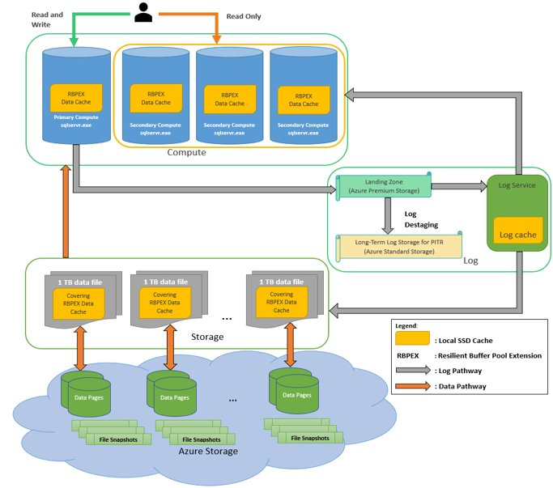

# What is the Hyperscale service tier (preview) in Azure SQL Database?

The Hyperscale service tier in Azure SQL Database is the newest service tier in the vCore-based purchasing model. This service tier is a highly scalable storage and compute performance tier that leverages the Azure architecture to scale out the storage and compute resources for an Azure SQL Database substantially beyond the limits available for the General Purpose and Business Critical service tiers.

## What are the capabilities of the Hyperscale service tier

The Hyperscale service tier in Azure SQL Database provides the following additional capabilities:

- Support for up to a 100 TB of database size 
- Faster large database backups (based on file snapshots)
- Faster database restores (based on file snapshots) 
- Higher overall performance due to higher log throughput and faster transaction commit times regardless of data volumes 
- Rapid scale out - you can provision one or more read-only nodes for offloading your read workload and for use as hot-standbys
- Rapid Scale up - you can, in constant time, scale up your compute resources to accommodate heavy workloads as and when needed, and then scale the compute resources back down when not needed. 

The Hyperscale service tier removes many of the practical limits traditionally seen in cloud databases. Where most other databases are limited by the resources available in a single node, databases in the Hyperscale service tier have no such limits. With its flexible storage architecture, you can scale out the storage capacity as needed. In fact, Hyperscale databases aren’t created with a defined max size. A Hyperscale database grows as needed - and you are billed only for the capacity you use. For read-intensive workloads, the Hyperscale service tier provides rapid scale-out by provisioning additional read replicas as needed for offloading read workloads. 

Additionally, the time required to create database backups or to scale up or down is no longer tied to the volume of data in the database. Hyperscale databases can be backed up virtually instantaneously. You can also scale a database in the tens of terabytes up or down in minutes. This capability frees you from concerns about being boxed in by your initial configuration choices. 

For more information about the compute sizes for the Hyperscale service tier, see [Choosing a vCore service tier, compute, memory, storage, and IO resources](sql-database-service-tiers-vcore.md).

## Who should consider the Hyperscale service tier

The Hyperscale service tier is primarily intended for customers who have large databases either on-premises and want to modernize their applications by moving to the cloud or for customers who are already in the cloud and are limited by the maximum database size restrictions (1-4 TB). It is also intended for customers who seek high performance and high scalability for storage and compute.

The Hyperscale service tier supports all SQL Server workloads, but it is primarily optimized for OLTP. The Hyperscale service tier also supports hybrid and analytical (data mart) workloads. 

> [!IMPORTANT]
> Elastic pools do not support the Hyperscale service tier.

## Architecture: Distributing functions to isolate capabilities

Unlike traditional database engines that have centralized all of the data management functions in one location/process (even so called distributed databases in production today have multiple copies of a monolithic data engine), a Hyperscale database separates the query processing engine, where the semantics of various data engines diverge, from the components that provide long-term storage and durability for the data. In this way, the storage capacity can be smoothly scaled out as far as needed (initial target is 100 TB). Read-only replicas share the same compute components so no data copy is required to spin up a new readable replica.

The following diagram illustrates the different types of nodes in a Hyperscale database:

A Hyperscale database contains the following different types of nodes:
 
### Compute node

The compute node is where the relational engine lives, so all the language elements, query processing, and so on, occur. All user interactions with a Hyperscale database happen through these compute nodes. Compute nodes have SSD-based caches (labeled RBPEX - Resilient Buffer Pool Extension in the preceding diagram) to minimize the number of network round trips required to fetch a page of data. There is one primary compute node where all the read-write workloads and transactions are processed. There are one or more secondary compute nodes that act as hot standby nodes for failover purposes, as well as act as read-only compute nodes for offloading read workloads (if this functionality is desired).

### Page server node

Page servers are systems representing a scaled-out storage engine.  Each page server is responsible for a subset of the pages in the database.  Nominally, each page server controls 1 terabyte of data. No data is shared on more than one page server (outside of replicas that are kept for redundancy and availability). The job of a page server is to serve database pages out to the compute nodes on demand, and to keep the pages updated as transactions update data. Page servers are kept up-to-date by playing log records from the log service. Page servers also maintain SSD-based caches to enhance performance. Long-term storage of data pages is kept in Azure Storage for additional reliability.

### Log service node

The log service node accepts log records from the primary compute node, persists them in a durable cache, and forwards the log records to the rest of the compute nodes (so they can update their caches) as well as the relevant page server(s), so that the data can be updated there. In this way, all data changes from the primary compute node are propagated through the log service to all the secondary compute nodes and page servers. Finally, the log record(s) are pushed out to long-term storage in Azure Storage, which is an infinite storage repository. This mechanism removes the necessity for frequent log truncation. The log service also has local cache to speed up access.

### Azure storage node

The Azure storage node is the final destination of data from page servers. This storage is used for backup purposes as well as for replication between Azure regions. Backups consist of snapshots of data files. Restore operation are fast from these snapshots and data can be restored to any point in time. 

## Backup and restore

Backups are file-snapshot base and hence they are nearly instantaneous. Storage and compute separation enable pushing down the backup/restore operation to the storage layer to reduce the processing burden on the primary compute node. As a result, the backup of a large database does not impact the performance of the primary compute node. Similarly, restores are done by copying the file snapshot and as such are not a size of data operation. For restores within the same storage account, the restore operation is fast.

## Scale and performance advantages

With the ability to rapidly spin up/down additional read-only compute nodes, the Hyperscale architecture allows significant read scale capabilities and can also free up the primary compute node for serving more write requests. Also, the compute nodes can be scaled up/down rapidly due to the shared-storage architecture of the Hyperscale architecture. 

## Next steps

- For information about service tiers, see [Service tiers](sql-database-service-tiers.md)
- For details regarding resource limits, see [vCore resource limits](sql-database-resource-limits.md)
- For a features and comparison list, see [SQL common features](sql-database-features.md).
