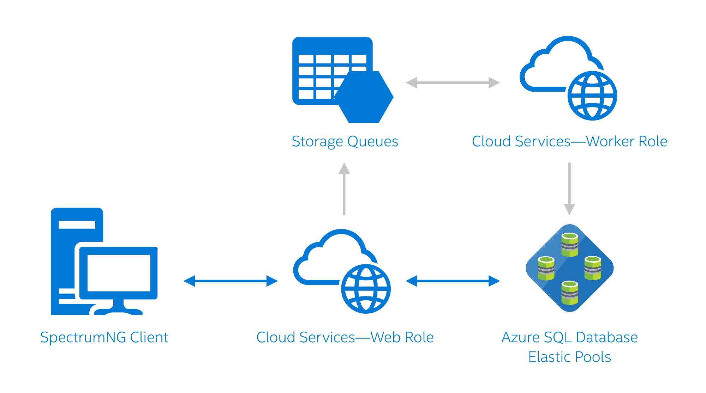

# Daxko/CSI used Azure to accelerate its development cycle and to enhance its customer services and performance

Daxko/CSI Software faced a challenge: its customer base of fitness and recreation centers was growing rapidly, thanks to the success of its comprehensive enterprise-software solution, but keeping up with the IT-infrastructure needs for that growing customer base was testing the company’s IT staff. The company was increasingly constrained by rising operations overhead, particularly for managing its growing databases. Worse, that operations overhead was cutting into development resources for new initiatives, like new mobility features for the company’s software.

According to David Molina, Director of Product Development at Daxko/CSI, Azure provided CSI Software with the platform-as-a-service (PaaS) model that it needed to simplify database management, increase scalability, and free up resources to focus on software instead of ops. “Azure SQL Database was a great option for us. Not having to worry about maintaining a SQL Server, a failover cluster, and all the other infrastructure needs was ideal for us.”

Since migrating to Azure, CSI Software needs an operations staff of only two to manage over 600 customer databases. The company uses Azure SQL Database elastic pools to move customer databases based on size and need.

Molina continues, “Our customers felt the change immediately. Before elastic pools, they occasionally had timeouts and other issues during burst periods. With Azure elastic pools, they can burst as needed and use the software without issues.”

In addition to improving performance for customers, Azure elastic pools freed up CSI Software resources to focus on developing new services and features, instead of dealing with operations and management. Those IT resources helped CSI Software improve its enterprise software offering, SpectrumNG, to help engage gym members, improve staff efficiency, and give staff and members mobile access for interactive tasks and real-time notifications.

Azure has also helped CSI Software accelerate and improve the development and quality-assurance (QA) cycle by enabling automation options. With the company’s Azure implementation, build managers can package up components with the click of a button. As Molina describes, “As part of the release cycle, QA is now able to deploy to a test environment in Azure, which closely mimics our production stack. We can deploy builds immediately to our dev environment to vet changes. That’s a big win for us, because we didn't have parity for testing before that.”

## Offloading to the cloud
Before moving to the cloud, CSI Software had successfully built up its own multitenant infrastructure in a local datacenter in Houston. As the company expanded, it faced increasing growing pains from purchasing, provisioning, and maintaining all of the hardware and software needed to support its customers. IT staffing to handle operations became another bottleneck that led to a slowdown in provisioning new resources and rolling out new services to customers.

CSI Software looked into cloud options for eliminating that overhead, so that it could focus on its code, instead of its operations. The company discovered that many of the top cloud providers only offer infrastructure-as-a-service (IaaS) solutions that still require a large IT staff to manage the IaaS stack. In the end, CSI Software determined that the Azure PaaS solution was the best fit for its needs. Molina explains, “Azure gets the hardware and system software out of the way, so we can focus on our software offerings, while reducing our IT overhead.”

## Making the transition to Azure
After selecting Azure for its PaaS solution, CSI Software began migrating its backend infrastructure and databases to the cloud. Prior to Azure, SpectrumNG customers needed to install a client application that communicated with a Windows Communication Foundation (WCF) service on the back end. According to Molina, “Although some customers hosted everything in their own datacenters, we built out the product to be multitenant. We hosted everything in a datacenter in Houston, using SQL Server as the data store.

“Our product offering also included a member-facing web portal (written in ASP.net), which was designed to be white-labeled to match the customer’s web presence, and a SOAP API to support the online pages and any third-party integration.”

The migration to the cloud did not take long for the architecture. According to Molina, “The majority of the effort dealt with modifying the way that we read config file information, a centralized connection-string modification, and automating the packaging, uploading, and deployment of our releases.”

To develop the build automation, CSI Software engineers used Azure PowerShell and REST APIs to create packages and upload them to a staging environment for release each night.
The overall transition to an Azure cloud-based deployment went quickly and smoothly for the CSI Software IT team. Molina explains, “In all, we had a beta environment in the cloud within three to four weeks of taking on the project. That was a surprising win for us.”

After configuring and testing the environment, CSI Software began migrating customers. For customers already using CSI Software hosting, the transition was nearly seamless. For customers migrating from an on-premises deployment, the migration to the cloud took some additional time, but was still primarily pain-free for both customers and CSI Software.

For new customers, CSI Software’s IT staff use the following process to on-board them to Azure:

1. Azure PowerShell scripts are used to spin up a new database for the customer; all customers start out on a premium tier to ensure enough initial throughput for the transition.
2. When possible, CSI Software uses the Azure SQL Migration Wizard to move existing data to an Azure SQL Database instance.
3. Finally, Microsoft SQL Server Integration Services (SSIS) are used to reconcile any discrepancies in the data or to perform any data cleanup as required.

Today, about 99 percent of CSI Software customers are hosted in Azure, across four regional datacenters (North Central, South Central, East, and West). By having datacenters in each customer’s geographical region, latency is kept to a minimum.

## Azure elastic pools free up IT resources
Several features of Azure have helped CSI Software shift from being infrastructure and operations focused to being feature and development focused. Perhaps the biggest benefit has been from elastic pools.

CSI Software currently provides about 550 databases for customers. Before elastic pools, it was difficult to manage that many databases within a tier structure. Ops managers had to assign performance tiers based on the burst needs of customers, which required significant IT-resource overhead. With elastic pools, managers can assign tenants a premium or standard pool, as appropriate, and then move customers based on size and need. Customers felt the effects of the elastic pools almost immediately; before elastic pools, customers had timeouts and other issues during burst-usage periods, but with elastic pools, customers can experience activity bursts as needed, and they can continue to use SpectrumNG without issues.

## Azure active geo-replication accelerates reporting
Several CSI Software customers are also taking advantage of Azure active geo-replication. With active geo-replication, up to four readable secondary databases can be configured in the same or different datacenter regions. CSI Software makes use of active geo-replication in two ways: first, the secondary databases are available in the case of a datacenter outage or the inability to connect to the primary database; and second, the secondary databases are readable and can be used to offload read-only workloads such as reporting jobs. Some CSI Software customers use this benefit to accelerate reporting workflows.

## CSI Software application logic and architecture
SpectrumNG uses web roles. Because the application is multi-tenant, a WCF service is used to handle the initial connection request from customers. As Molina states, “The request identifies each customer, which then lets us build a connection string out to their databases to do whatever we need to do.”

For the web tier of its service, CSI Software takes advantage of Azure automatic scaling, based on day and time. Available resources are automatically increased to accommodate higher usage during business hours, according to the time zone of each regional datacenter. Resources are also set to scale down on weekends, when customer needs are lower.

Figure 1. A cloud services worker role draws structured data from Azure SQL Database and semi-structured data from table storage. SpectrumNG users interact with that data through a cloud services web role.

## Using web apps and a web-plan tier for mobile apps
Using Azure SQL Database freed up resources for CSI Software to enable new initiatives, including a complete mobile platform based on a custom API hosted in Azure web apps. The platform enables gym members and staff to use mobile devices to check schedules, book classes, and receive messages.

The platform uses service-oriented architecture (SOA) to take a single component—like a point-of-sale system (POS) or a sales system—move it on the fly to another web plan, and then spin up a service to support that component, while leaving everything else on the original web plan. This ability gives CSI Software tremendous flexibility, and it helps keep costs down.

## Azure lets CSI Software developers focus on apps and services
Azure SQL Database isn’t just a boon to SpectrumNG customers, who enjoy the fast, reliable service, it’s also a big win for CSI Software’s IT staff and developers. By offloading ops to Azure in the cloud, CSI Software reduced its overhead for resources and infrastructure, greatly accelerated its development cycles, and no longer needs to micromanage databases to optimize performance for its tenants.

## More information
* To learn more about Azure elastic pools, see [elastic pools](sql-database-elastic-pool.md).
* To learn more about database tools and elastic scaling, see [elastic database tools and elastic scaling](sql-database-elastic-scale-get-started.md).
* To learn more about migrating a SQL Server database, see see [Migrate a SQL Server database to Azure](sql-database-cloud-migrate.md).
* To learn more about active geo-replication, see [active geo-replication](sql-database-geo-replication-overview.md).
* To learn more about Web roles and worker roles, see [worker roles](../fundamentals-introduction-to-azure.md#compute).    
* To learn more about Azure Service Bus,see [Azure Service Bus](https://azure.microsoft.com/services/service-bus/).
* To learn more about auto-scale, see [scaling cloud services](../cloud-services/cloud-services-how-to-scale.md).

