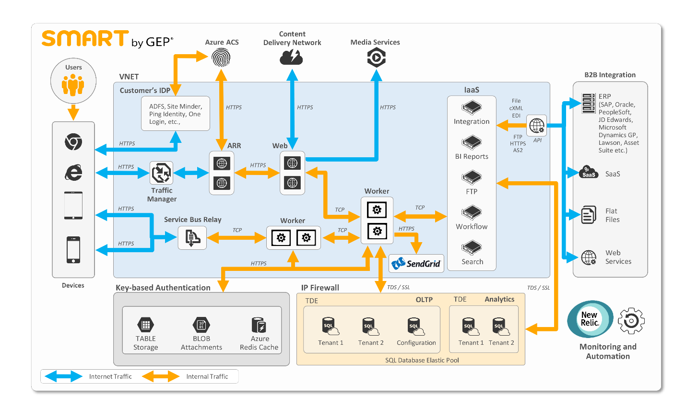

# Azure gives GEP global reach and greater efficiency

GEP delivers software and services that enable procurement leaders around the world to maximize their impact on their businesses’ operations, strategies, and financial performances. In addition to consulting and managed services, the company offers SMART by GEP®, a cloud-based, comprehensive procurement-software platform. However, GEP ran into limitations trying to support solutions like SMART by GEP with its own on-premises datacenters: the investments needed were steep and regulatory requirements in other countries would have made the necessary investments more daunting still. By moving to the cloud, GEP has freed up IT resources, allowing it to worry less about IT operations and to focus more on developing new sources of value for its customers across the globe.

## Expanding services and growth by using Azure
SMART by GEP customers love the platform’s features and ease of use; customers can manage their processes from anywhere, at any time, and on any device—laptop, tablet, or phone. By moving to Microsoft Azure, GEP has been able to accommodate its rapid growth and its potential to expand into new markets. According to GEP’s VP of Technology, Dhananjay Nagalkar, “Microsoft Azure has played a key role in GEP’s success by allowing us to rapidly scale services with agility, and by providing regional datacenters that help us meet the regulatory needs of our global customers.”

## The limitations of a do-it-yourself datacenter
In 2013, GEP leaders recognized that they needed a way to ensure scalability and performance as they grew their customer base. Nagalkar explained, “To meet that demand with our existing datacenters, we would have had to expand our infrastructure and IT resources considerably. The investment and time frame for that would have been enormous.” On-premises physical and virtual machines require extensive configuration, management, scaling, backup, and patching at a rate that would have been cost prohibitive for GEP. Cloud solutions, on the other hand, offer simplicity and convenience that enabled GEP to focus more on development instead of managing large—and growing—IT operations. Nagalkar knew that GEP could reduce its infrastructure purchasing, configuration, and management overhead by migrating to the cloud.

GEP also needed a way to overcome regulatory barriers that kept it out of some global markets. For many of GEP’s potential European customers, regulatory compliance would require having data stored in their local geographic regions. But it would not have been practical for GEP to build out multiple datacenters. “Widespread infrastructure investments and IT labor costs would bring a significant impact to margins,” according to Nagalkar. “As a result, we were actually forced to turn away potential customers who required locally stored data.”

Nagalkar knew that a cloud solution might be the answer to this dilemma. If GEP could move to a cloud provider with a global presence, it could better meet its customers’ regulatory and performance needs by storing data closer to the customers’ physical locations.

## Finding smooth skies in the cloud
Nagalkar and his team explored several cloud options, but most were infrastructure-as-a-service (IaaS)-based solutions that would have required GEP to invest heavily in IT resources to configure and manage the service. The Azure platform-as-a-service (PaaS) solution turned out to be a much better fit.

“With Azure, GEP doesn’t need to deal with database management, virtual-machine configuration, patching, or other infrastructure-management tasks,” stated Nagalkar. “Instead, we can focus our resources on what we do best: leveraging our expertise in procurement to write software that truly delivers results for our customers.” 

In fact, the move to Azure has enabled GEP to shrink its IT operations staff while simultaneously enabling greater functionality for customers.

By taking advantage of Azure datacenters across the globe, GEP can easily extend its reach across Europe and Asia. Those global datacenters enable GEP to scale with agility and to meet customer needs for locally stored data that reduces latency and meets regulatory requirements.

## SMART by GEP architecture
GEP built SMART by GEP from the ground up on Azure. A critical motivation for GEP was the greater scalability, less downtime, and reduced maintenance costs that GEP could experience with Azure SQL Database compared to what GEP could achieve on-premises. However, once moved to the cloud, GEP discovered new development opportunities in the cloud, like rapid prototyping and lean engineering to better respond to customer needs. Developing in Azure let GEP do away with the software licensing headaches that its developers could run into on-premises. The core of SMART by GEP is Azure SQL Database, though GEP uses many other Azure services to easily and rapidly continue to improve SMART by GEP.

Figure 1. SMART by GEP architecture

## Structured data
At the heart of the SMART by GEP application are the Azure SQL Database instances that power the enterprise procurement-management solution. When GEP engineered SMART by GEP, it saw Azure SQL Database as a perfect fit for its architecture, one that would enable the company to achieve the highest degree of data protection and to meet its regulatory requirements. GEP makes use of the multiple layers of data protection that Azure SQL Database offers, including:

* Encrypting data at rest through transparent data encryption.
* Securing authentication by integrating Azure SQL Database with Azure Active Directory.
* Limiting access to an appropriate subset of data with Row-Level Security.
* Masking data in real time through policies.
* Tracking database events through Azure SQL Database Auditing.

> “We can use all of these options without making any major code changes and with minimal impact on performance,” said Nagalkar.
> 
> 

By using Azure SQL Database, GEP automatically has greater disaster-recovery capabilities than it could have economically engineered on premises due to the fault-tolerance features built in to Azure SQL Database. GEP uses the active geo-replication capability in Azure SQL Database, coupled with multiple active, readable, and online secondary replicas (Always On Availability Groups) in different geographical regions, to form high-availability pairs. Replicating SMART by GEP data across regions means that, in the case of a region-wide disaster, GEP can easily recover customer data with a minimum recovery-point objective (RPO) and recovery-time objective (RTO).

Each SMART by GEP customer has two Azure SQL Database instances: one for online transaction processing (OLTP) and one for analysis (such as customer spend and report analysis). Azure SQL Database elastic pools enable GEP to easily manage thousands of databases globally to handle unpredictable database-resource demands. Elastic pools provide a means for GEP to ensure that customer databases can scale as necessary, without over-provisioning or under-provisioning, while also allowing GEP to control costs. Moreover, because this is a PaaS service, GEP gets all the new Azure SQL Database features with automatic upgrades.

## Unstructured and semi-structured data
However, some SMART by GEP customer data needs less-rigidly structured storage. For this type of data, GEP employs Azure Blob storage, Azure Table Storage, and Azure Redis Cache. Azure Blob storage houses any attachments that SMART by GEP users upload into the application. It is also where SMART by GEP stores static content, such as cascading style sheets (CSS) and JavaScript files.

GEP stores non-customer-facing data, like SMART by GEP log data, in Azure Table Storage, which gives GEP effectively unlimited cost-efficient storage and fast retrieval times without having to worry about setting up a schema for the data. GEP uses Azure Redis Cache for a master cache.

## Authentication and routing
Azure Access Control Service (ACS) provides SMART by GEP users with a wide variety of options for signing into the software. Azure ACS can federate with any identity provider that exchanges authentication data using Security Assertion Markup Language (SAML), such as Active Directory Domain Services, Ping Identity, OneLogin, or SiteMinder. This helps GEP implement single sign-on (SSO) for customers without worrying about storing user credentials and maintaining customer-password policies.

Once signed in, customers have access to the correct business resources in SMART by GEP. GEP uses Azure Traffic Manager to redirect and load-balance requests coming from customers’ mobile devices and browser sessions.

## Other Azure services
GEP employs a number of other Azure services to make SMART by GEP responsive to customer needs. GEP uses Azure cloud services (both web and worker roles) to host application-presentation and the secured business-logic services. Cloud services make it possible for developers to manage infrastructure as code (IAC) and to deploy new SMART by GEP applications in a fraction of the time that it required with on-premises datacenters—all without any involvement from IT. GEP developers can use the cloud-services staging environment to test new releases without impacting the current production deployment. Once tested, GEP uses the VIP swap features of Azure cloud services to move the staging code to the production slot within a minute, thus reducing deployment downtime.

To lower application latency, GEP uses the Azure Content Delivery Network (CDN) to put static content stored in Azure Blob storage (such as CSS and JavaScript files) on edge servers close to users. GEP uses Azure Service Bus to support application-architecture patterns ranging from publish-subscribe to partially Command Query Responsive Segregation (CQRS) and layered architecture with loose coupling and asynchronous communication. GEP uses Azure Media Services to improve its customer-support service. GEP found that it could easily post user-support videos on Azure Media Services. These videos answer common user questions, which helps improve SMART by GEP user satisfaction while taking some of the support load off of GEP’s customer-support staff.

To send the thousands of transactional emails generated on a daily basis by SMART by GEP, the firm uses the SendGrid .NET API to integrate with Azure. For GEP developers, this is easy to do—the SendGrid add-on for Azure is available right in the Azure Marketplace. GEP developers could configure SMART by GEP by using the SendGrid NuGet package right in Microsoft Visual Studio; GEP IT can monitor the software’s SendGrid email traffic directly from Azure.

Finally, SMART by GEP uses Azure Virtual Machines—the Azure IaaS service—to host applications and services that did not make sense, at the time of engineering, to replace with software-as-a-service (SaaS) or PaaS solutions. For example, GEP hosts integration API services in virtual machines for business-to-business (B2B) integration with customers’ on-premises enterprise-resource-planning (ERP) systems like SAP, Oracle, PeopleSoft, JD Edwards, Microsoft Dynamics GP, and Lawson and with customer SaaS solutions to efficiently exchange procurement documents, such as invoices.

> “Building SMART by GEP in the Microsoft Azure cloud has completely removed the need for on-premises IT, not only for GEP but also for our customers’ procurement operations.” 
> 
> — Dhananjay Nagalkar, VP of Technology Solutions
> 
> 

## Expand customer satisfaction without expanding IT
Since migrating from on-premises datacenters to Azure, and building SMART by GEP from scratch on the Azure platform, GEP has increased scalability and flexibility without having to expand its infrastructure or IT staff. In fact, the company hasn’t added IT resources in more than four years. The convenient PaaS model of Azure has enabled GEP to reduce its spending on vendor support and operations management. As a result, GEP has been able focus resources on software development; and developing in the cloud enables GEP developers to quickly test new ideas without having to spend time coordinating with IT or worrying about on-premises licensing requirements. Azure SQL Database helps GEP better ensure that its customers always have exceptional service and performance.

## More information
* GEP home page: [GEP](http://www.gep.com)
* Smart by GEP: [Smart by GEP](http://www.smartbygep.com)

## GEP contributors
* Huzaifa Matawala, Associate Director—Architect, GEP
* Sathyan Narasingh, Engineering Manager, GEP
* Deepa Velukutty, Database Architect, GEP

