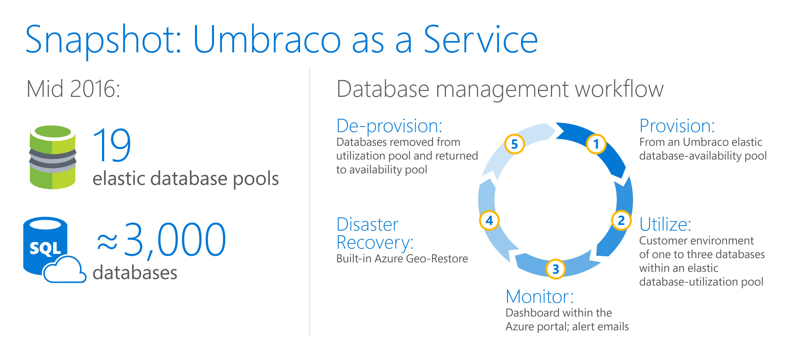
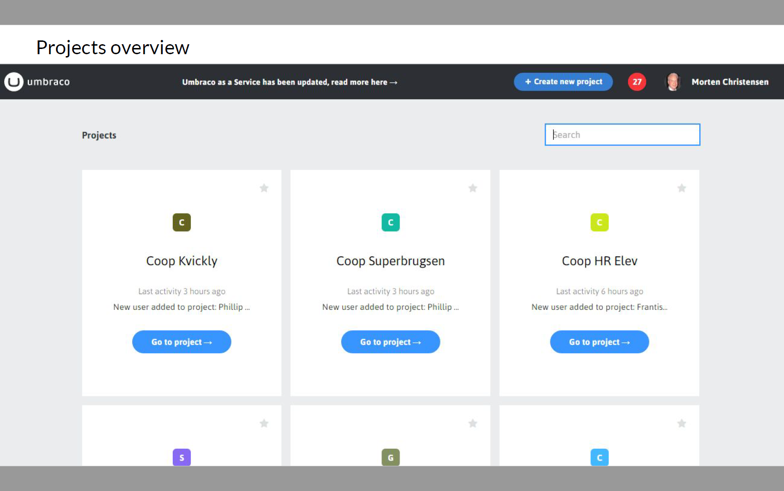
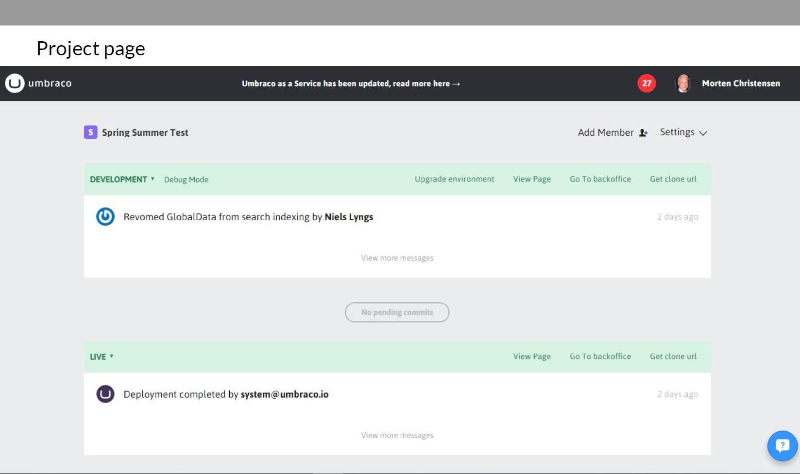
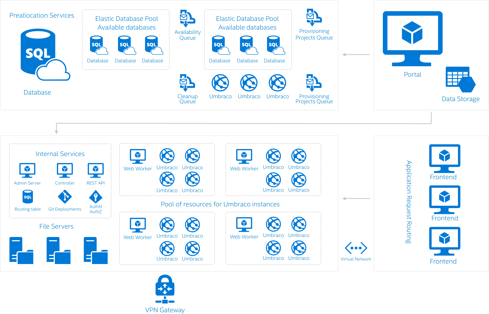

# Umbraco uses Azure SQL Database to quickly provision and scale services for thousands of tenants in the cloud

Umbraco is a popular open-source content-management system (CMS) that can run anything from small campaign or brochure sites to complex applications for Fortune 500 companies and global media websites. 

> “We have quite a large community of developers who use the system, with more than 100,000 developers on our forums and more than 350,000 sites that are live, running Umbraco.”
> 
> — Morten Christensen, Technical Lead, Umbraco
> 
> [!VIDEO https://channel9.msdn.com/Blogs/Azure/Azure-SQL-Database-Case-Study-Umbraco/player]
> 
> 

To simplify customer deployments, Umbraco added Umbraco-as-a-Service (UaaS): a software-as-a-service (SaaS) offering that eliminates the need for on-premises deployments, provides built-in scaling, and removes management overhead by enabling developers to focus on product innovation rather than solution management. Umbraco is able to provide all those benefits by relying on the flexible platform-as-a-service (PaaS) model offered by Microsoft Azure.

UaaS enables SaaS customers to use Umbraco CMS capabilities that were previously out of their reach. These customers are provisioned with a working CMS environment that includes a production database. Customers can add up to two additional databases for development and staging environments, depending on their requirements. When a new environment is requested, an automated process assigns that customer a database automatically. The new database is ready in seconds, because the database has already been pre-provisioned by Umbraco from an Azure elastic pool of available databases (see Figure 1).

Figure 1. Provisioning lifecycle for Umbraco as a Service (UaaS)

## Azure elastic pools and automation simplify deployments
With Azure SQL Database and other Azure services, Umbraco customers can self-provision their environments, and Umbraco can easily monitor and manage databases as part of an intuitive workflow:

1. Provision
   
   Umbraco maintains a capacity of 200 available pre-provisioned databases from elastic pools. When a new customer signs up for UaaS, Umbraco provides the customer with a new CMS environment in near real time by assigning them a database from the availability pool.
   
   When an availability pool reaches its threshold, a new elastic pool is created, and new databases are pre-provisioned to be assigned to customers as needed.
   
   Implementation is fully automated using C# management libraries and Azure Service Bus queues.
2. Utilize
   
   Customers use one to three environments (for production, staging, and/or development), each with its own database. Customer databases are in elastic pools, which enables Umbraco to provide efficient scaling without having to over-provision.
   
   
   
   
   
   Figure 2. Umbraco-as-a-Service (UaaS) customer website, showing project overview and details
   
   Azure SQL Database uses Database Transaction Units (DTUs) to represent the relative power required for real-world database transactions. For UaaS customers, databases typically operate at about 10 DTUs, but each has the elasticity to scale on demand. That means UaaS can ensure that customers always have necessary resources, even during peak times. For example, during a recent Sunday night sports event, one UaaS customer experienced database peaks up to 100 DTUs for the duration of the game. Azure elastic pools made it possible for Umbraco to support that high demand without performance degradation.
3. Monitor
   
   Umbraco monitors database activity using dashboards within the Azure portal, along with custom email alerts.
4. Disaster recovery
   
   Azure provides two disaster-recovery (DR) options: active geo-replication and geo-restore. The DR option that a company should select depends on its [business-continuity objectives](sql-database-business-continuity.md).
   
   active geo-replication provides the fastest level of response in the event of downtime. Using active geo-replication, you can create up to four readable secondaries on servers in different regions, and you can then initiate failover to any of the secondaries in the event of a failure.
   
   Umbraco doesn’t require geo-replication, but it does take advantage of Azure geo-restore to help ensure minimum downtime in the event of an outage. geo-restore relies on database backups in geo-redundant Azure storage. That allows users to restore from a backup copy when there is an outage in the primary region.
5. De-provision
   
   When a project environment is deleted, any associated databases (development, staging, or live) are removed during Azure Service Bus queue cleanup. This automated process restores the unused databases to Umbraco’s elastic database-availability pool, making them available for future provisioning while maintaining maximum utilization.

## Elastic pools allow UaaS to scale with ease
By taking advantage of Azure elastic pools, Umbraco can optimize performance for its customers without having to over- or under-provision. Umbraco currently has nearly 3,000 databases across 19 elastic pools, with the ability to easily scale as needed to accommodate any of their existing 325,000 customers or new customers who are ready to deploy a CMS in the cloud.

In fact, according to Morten Christensen, Technical Lead at Umbraco, “UaaS is now experiencing growth of about 30 new customers per day. Our customers are delighted with the convenience of being able to provision new projects in seconds, instantly publish updates to their live sites from a development environment using ‘one-click deployment,’ and make changes just as quickly if they find errors.”

If a customer does not require a second and/or third environment anymore, it can simply remove those environments. That frees up resources that can be used for other customers as part of the Umbraco elastic database-availability pool.

Figure 3. UaaS deployment architecture on Microsoft Azure

## The path from datacenter to cloud
When the Umbraco developers initially made the decision to move to a SaaS model, they knew that they would need a cost-effective and scalable way to build out the service.

> “elastic pools are a perfect fit for our SaaS offering because we can dial capacity up and down as needed. Provisioning is easy, and with our setup, we can keep utilization at a maximum.”
> 
> — Morten Christensen, Technical Lead, Umbraco
> 
> 

“We wanted to spend our time on solving our customers’ problems, not managing infrastructure. We wanted to make it easy for our customers to get the most value,” says Niels Hartvig, founder of Umbraco. “We initially considered hosting the servers ourselves, but capacity planning would have been a nightmare.” Coincidentally, Umbraco does not employ any database administrators, which underscores a key value proposition for using UaaS.

One important goal for the Umbraco developers was to provide a way for UaaS customers to provision environments quickly and without capacity limitations. But providing a dedicated hosted service in Umbraco datacenters would have required lots of excess capacity to handle bursts in processing. That would have meant adding considerable compute infrastructure that would have been regularly underutilized.

In addition, the Umbraco development team wanted a solution that would allow them to reuse as much of their existing code as possible. As Umbraco developer Mikkel Madsen states, “We were happy with the Microsoft development tools that we were already familiar with, like Microsoft SQL Server, Microsoft Azure SQL Database, ASP.net, and Internet Information Services (IIS). Before investing in an IaaS or a PaaS cloud solution, we wanted to make sure that it would support our Microsoft tools and platforms, so we wouldn’t have to make massive changes to our code base.”

To meet all of its criteria, Umbraco looked for a cloud partner with the following qualifications:

* Sufficient capacity and reliability
* Support for Microsoft development tools, so that Umbraco engineers would not be forced to completely reinvent their development environment
* Presence in all of the geographic markets in which UaaS competes (businesses need to ensure that they can access their data quickly and that their data is stored in a location that meets their regional regulatory requirements)

## Why Umbraco chose Azure for UaaS
According to Morten Christensen “After considering all our options, we selected Azure because it met all our criteria, from manageability and scalability to familiarity and cost-effectiveness. We set up the environments on Azure VMs, and each environment has its own Azure SQL Database instance, with all the instances in elastic pools. By separating databases between development, staging, and live environments, we can offer our customers robust performance isolation matched to scale—a huge win.”

Morten continues, “Before, we had to provision servers for web databases manually. Now, we don’t have to think about it. Everything is automated—from provisioning to cleanup.”

Morten is also happy with the scaling capabilities provided by Azure. “elastic pools are a perfect fit for our SaaS offering because we can dial capacity up and down as needed. Provisioning is easy, and with our setup, we can keep utilization at a maximum.” Morten states, “The simplicity of elastic pools, along with the assurance of service-tier-based DTUs, gives us the power to provision new resource pools on demand. Recently, one of our larger customers peaked to 100 DTUs in its live environment. Using Azure, our elastic pools provided the customer’s databases with the resources that they needed in real time without having to predict DTU requirements. Simply put, our customers get the turn-around time that they expect, and we can meet our performance service-level agreements.”

Mikkel Madsen sums it up: “We’ve embraced the powerful Azure algorithm that connects a common SaaS scenario (onboarding new customers in real time at scale) to our application pattern (pre-provisioning databases, both development and live) on top of the underlying technology (using Azure Service Bus queues in conjunction with Azure SQL Database).”

## With Azure, UaaS is exceeding customer expectations
Since choosing Azure as its cloud partner, Umbraco has been able to provide UaaS customers with optimized content-management performance, without the IT-resource investment required from a self-hosted solution. As Morten says, “We love the developer convenience and scalability that Azure gives us, and our customers are thrilled with the features and reliability. Overall, it’s been a great win for us!”

## More information
* To learn more about Azure elastic pools, see [elastic pools](sql-database-elastic-pool.md).
* To learn more about Azure Service Bus,see [Azure Service Bus](https://azure.microsoft.com/services/service-bus/).
* To learn more about Web roles and worker roles, see [worker roles](../fundamentals-introduction-to-azure.md#compute).    
* To learn more about virtual networking, see [virtual networking](https://azure.microsoft.com/documentation/services/virtual-network/).    
* To learn more about backup and recovery, see [business continuity](sql-database-business-continuity.md).    
* To learn more about monitoring ppols, see [monitoring pools](sql-database-elastic-pool-manage-portal.md).    
* To learn more about Umbraco as a Service, see [Umbraco](https://umbraco.com/cloud).

