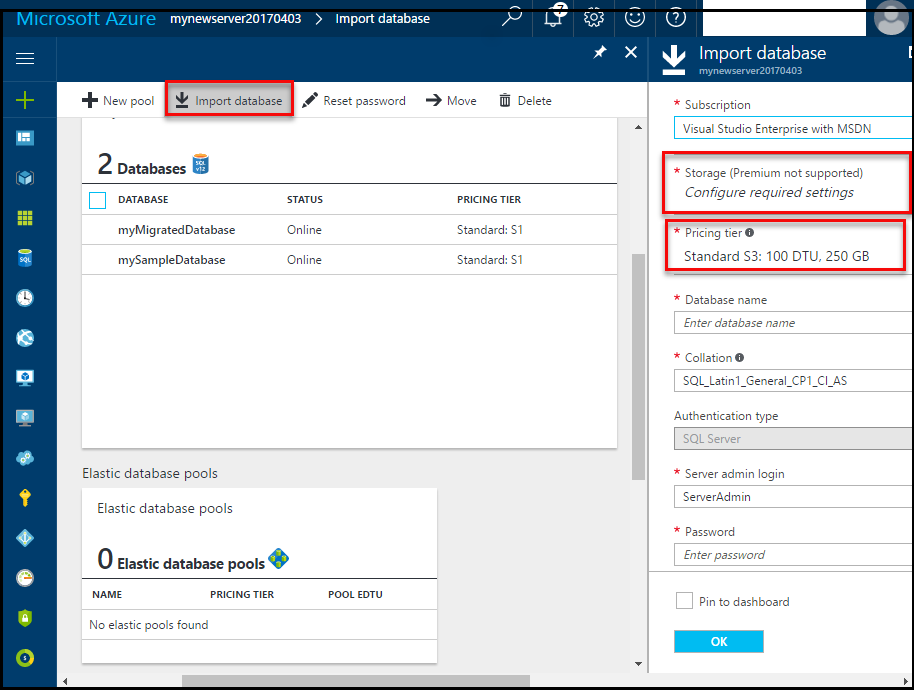
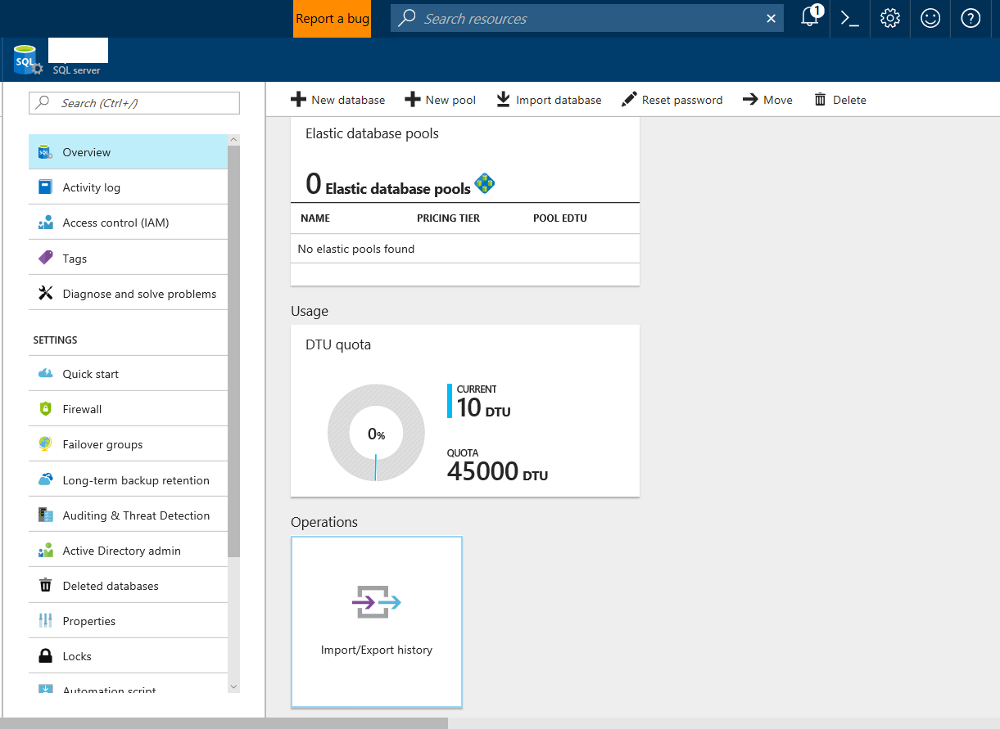
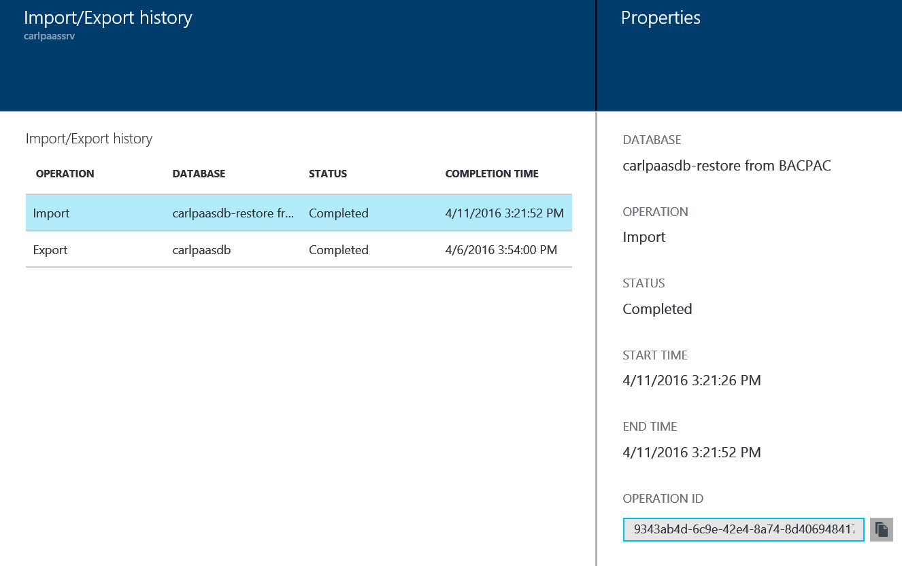
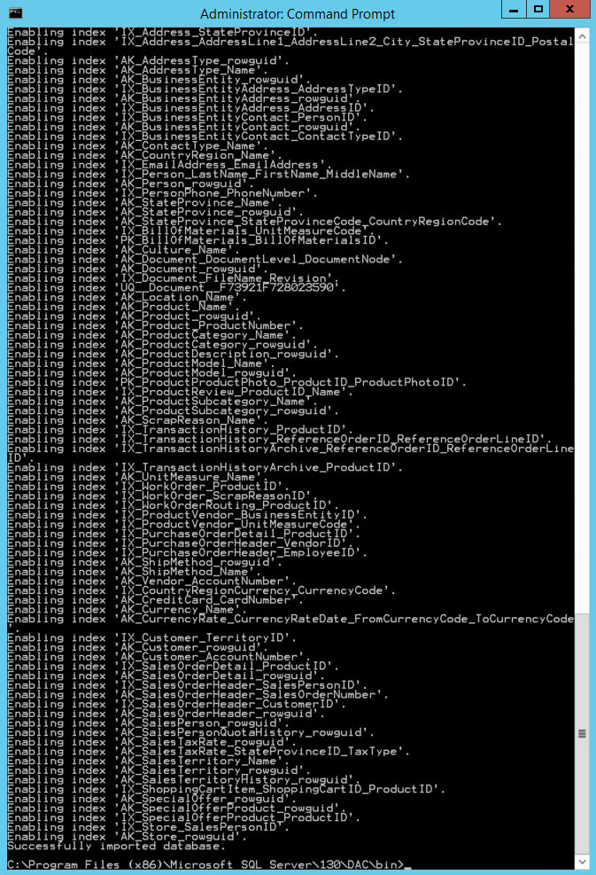

---
title: Import a BACPAC file to create an Azure SQL database | Microsoft Docs
description: Create a newAzure SQL database by importing a BACPAC file.
services: sql-database
documentationcenter: ''
author: CarlRabeler
manager: jhubbard
editor: ''

ms.assetid: cf9a9631-56aa-4985-a565-1cacc297871d
ms.service: sql-database
ms.custom: load & move data
ms.devlang: NA
ms.date: 04/07/2017
ms.author: carlrab
ms.workload: data-management
ms.topic: article
ms.tgt_pltfrm: NA

---
# Import a BACPAC file to a new Azure SQL Database

When you need to import a database from an archive or when migrating from another platform, you can import the database schema and data from a [BACPAC](https://msdn.microsoft.com/library/ee210546.aspx#Anchor_4) file. A BACPAC file is a ZIP file with an extension of BACPAC containing the metadata and data from a SQL Server database. A BACPAC file can be imported from Azure blob storage (standard storage only) or from local storage in an on-premises location. To maximize the import speed, we recommend that you specify a higher service tier and performance level, such as a P6, and then scale to down as appropriate after the import is successful. Also, the database compatibility level after the import is based on the compatibility level of the source database. 

> [!IMPORTANT] 
> After you migrate your database to Azure SQL Database, you can choose to operate the database at its current compatibility level (level 100 for the AdventureWorks2008R2 database) or at a higher level. For more information on the implications and options for operating a database at a specific compatibility level, see [ALTER DATABASE Compatibility Level](https://docs.microsoft.com/sql/t-sql/statements/alter-database-transact-sql-compatibility-level). See also [ALTER DATABASE SCOPED CONFIGURATION](https://docs.microsoft.com/sql/t-sql/statements/alter-database-scoped-configuration-transact-sql) for information about additional database-level settings related to compatibility levels.   >

> [!NOTE]
> To import a BACPAC to a new database, you must first create an Azure SQL Database logical server. For a tutorial showing you how to migrate a SQL Server database to Azure SQL Database using SQLPackage, see [Migrate a SQL Server Database](sql-database-migrate-your-sql-server-database.md)
>

## Import from a BACPAC file using Azure portal

This article provides directions for creating an Azure SQL database from a BACPAC file stored in Azure blob storage using the [Azure portal](https://portal.azure.com). Import using the Azure portal only supports importing a BACPAC file from Azure blob storage.

To import a database using the Azure portal, open the page for your database and click **Import** on the toolbar. Specify the storage account and container, and select the BACPAC file you want to import. Select the size of the new database (usually the same as origin) and provide the destination SQL Server credentials.  

   

To monitor the progress of the import operation, open the page for the logical server containing the database being imported. Scroll down to **Operations** and then click **Import/Export** history.

### Monitor the progress of an import operation

To monitor the progress of the import operation, open the page for the logical server into which the database is being imported imported. Scroll down to **Operations** and then click **Import/Export** history.
   
   
   

To verify the database is live on the server, click **SQL databases** and verify the new database is **Online**.

## Import from a BACPAC file using SQLPackage

To import a SQL database using the [SqlPackage](https://msdn.microsoft.com/library/hh550080.aspx) command-line utility, see [Import parameters and properties](https://msdn.microsoft.com/library/hh550080.aspx#Import Parameters and Properties). The SQLPackage utility ships with the latest versions of [SQL Server Management Studio](https://msdn.microsoft.com/library/mt238290.aspx) and [SQL Server Data Tools for Visual Studio](https://msdn.microsoft.com/library/mt204009.aspx), or you can download the latest version of [SqlPackage](https://www.microsoft.com/download/details.aspx?id=53876) directly from the Microsoft download center.

We recommend the use of the SQLPackage utility for scale and performance in most production environments. For a SQL Server Customer Advisory Team blog about migrating using BACPAC files, see [Migrating from SQL Server to Azure SQL Database using BACPAC Files](https://blogs.msdn.microsoft.com/sqlcat/2016/10/20/migrating-from-sql-server-to-azure-sql-database-using-bacpac-files/).

See the following SQLPackage command for a script example for how to import the **AdventureWorks2008R2** database from local storage to an Azure SQL Database logical server, called **mynewserver20170403** in this example. This script shows the creation of a new database called **myMigratedDatabase**, with a service tier of **Premium**, and a Service Objective of **P6**. Change these values as appropriate to your environment.

```cmd
SqlPackage.exe /a:import /tcs:"Data Source=mynewserver20170403.database.windows.net;Initial Catalog=myMigratedDatabase;User Id=ServerAdmin;Password=<change_to_your_password>" /sf:AdventureWorks2008R2.bacpac /p:DatabaseEdition=Premium /p:DatabaseServiceObjective=P6
```

   

> [!IMPORTANT]
> An Azure SQL Database logical server listens on port 1433. If you are attempting to connect to an Azure SQL Database logical server from within a corporate firewall, this port must be open in the corporate firewall for you to successfully connect.
>

This example shows how to import a database using SqlPackage.exe with Active Directory Universal Authentication:

```cmd
SqlPackage.exe /a:Import /sf:testExport.bacpac /tdn:NewDacFX /tsn:apptestserver.database.windows.net /ua:True /tid:"apptest.onmicrosoft.com"
```

## Import from a BACPAC file using PowerShell

Use the [New-AzureRmSqlDatabaseImport](/powershell/module/azurerm.sql/new-azurermsqldatabaseimport) cmdlet to submit an import database request to the Azure SQL Database service. Depending on the size of your database, the import operation may take some time to complete.

 ```powershell
 $importRequest = New-AzureRmSqlDatabaseImport -ResourceGroupName "myResourceGroup" `
    -ServerName $servername `
    -DatabaseName "MyImportSample" `
    -DatabaseMaxSizeBytes "262144000" `
    -StorageKeyType "StorageAccessKey" `
    -StorageKey $(Get-AzureRmStorageAccountKey -ResourceGroupName "myResourceGroup" -StorageAccountName $storageaccountname).Value[0] `
    -StorageUri "http://$storageaccountname.blob.core.windows.net/importsample/sample.bacpac" `
    -Edition "Standard" `
    -ServiceObjectiveName "P6" `
    -AdministratorLogin "ServerAdmin" `
    -AdministratorLoginPassword $(ConvertTo-SecureString -String "ASecureP@assw0rd" -AsPlainText -Force)

 ```

To check the status of the import request, use the [Get-AzureRmSqlDatabaseImportExportStatus](/powershell/module/azurerm.sql/get-azurermsqldatabaseimportexportstatus) cmdlet. Running this immediately after the request usually returns **Status: InProgress**. When you see **Status: Succeeded** the import is complete.

```powershell
$importStatus = Get-AzureRmSqlDatabaseImportExportStatus -OperationStatusLink $importRequest.OperationStatusLink
[Console]::Write("Importing")
while ($importStatus.Status -eq "InProgress")
{
    $importStatus = Get-AzureRmSqlDatabaseImportExportStatus -OperationStatusLink $importRequest.OperationStatusLink
    [Console]::Write(".")
    Start-Sleep -s 10
}
[Console]::WriteLine("")
$importStatus
```

> [!TIP]
For another script example, see [Import a database from a BACPAC file](scripts/sql-database-import-from-bacpac-powershell.md).

## Next steps
* To learn how to connect to and query an imported SQL Database, see [Connect to SQL Database with SQL Server Management Studio and perform a sample T-SQL query](sql-database-connect-query-ssms.md).
* For a SQL Server Customer Advisory Team blog about migrating using BACPAC files, see [Migrating from SQL Server to Azure SQL Database using BACPAC Files](https://blogs.msdn.microsoft.com/sqlcat/2016/10/20/migrating-from-sql-server-to-azure-sql-database-using-bacpac-files/).
* For a discussion of the entire SQL Server database migration process, including performance recommendations, see [Migrate a SQL Server database to Azure SQL Database](sql-database-cloud-migrate.md).


