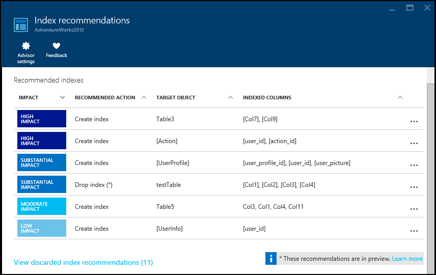
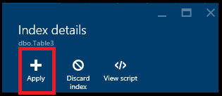
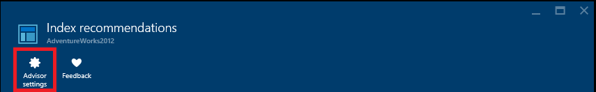
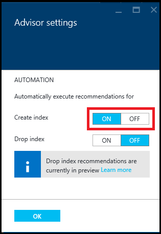
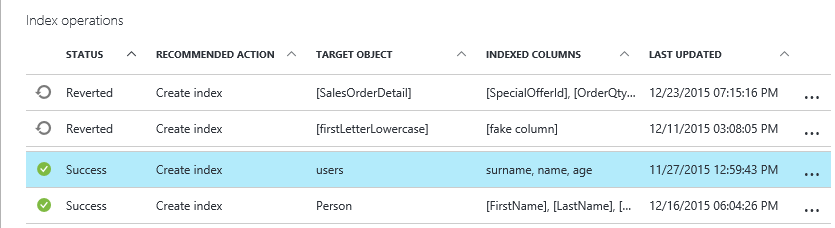
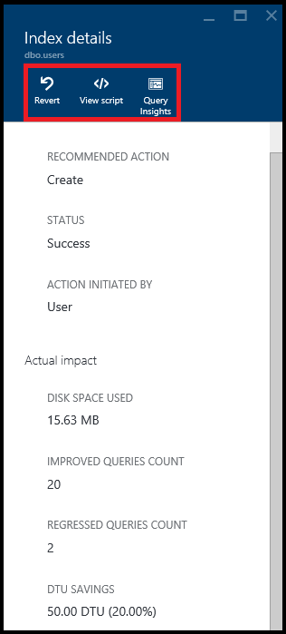

<properties 
   pageTitle="Azure SQL Database Index Advisor" 
   description="The Azure SQL Database Index Advisor recommends new indexes for your existing SQL Databases that can improve current query performance." 
   services="sql-database" 
   documentationCenter="" 
   authors="stevestein" 
   manager="jeffreyg" 
   editor="monicar"/>

<tags
   ms.service="sql-database"
   ms.devlang="na"
   ms.topic="article"
   ms.tgt_pltfrm="na"
   ms.workload="data-management" 
   ms.date="01/22/2015"
   ms.author="sstein"/>

# SQL Database Index Advisor

The Azure SQL Database Index Advisor provides index recommendations for your existing SQL databases that can improve current query performance. The SQL Database service assesses index performance by analyzing your SQL database's usage history. The indexes that are best suited for running your database’s typical workload are recommended.

Index advisor assists you in tuning your database performance by:

- providing recommendations on which indexes to create and/or drop*.
- allowing you to opt-in to apply index recommendations automatically without any user interaction. (Automated recommendations require [Query Store](https://msdn.microsoft.com/library/dn817826.aspx) is enabled and running.)
- automatically rolling back recommendations that have a negative impact on performance. 

> [AZURE.NOTE] *Drop index recommendations are in preview and currently apply to duplicate indexes only.

### Permissions

To view and create index recommendations, you need the correct [role-based access control](role-based-access-control-configure.md) permissions in Azure. 

- **Reader**, **SQL DB Contributor** permissions are required to view recommendations.
- **Owner**, **SQL DB Contributor** permissions are required to execute any actions; create or drop indexes and cancel index creation.

## Viewing index recommendations

To view index recommendations:

1. Sign in to the [Azure portal](https://portal.azure.com/).
2. Click **BROWSE** > **SQL databases**, and select your database.
5. Click **All settings** > **Index Advisor** to view available **Index recommendations** for the selected database.

> [AZURE.NOTE] To get index recommendations a database needs to have about a week of usage, and within that week there needs to be some activity. There also needs to be some consistent activity as well. The index advisor can more easily optimize for consistent query patterns than it can for random spotty bursts of activity. If recommendations are not available the **Index recommendations** page should provide a message explaining why.

Recommendations are sorted by their potential impact on performance into the following 4 categories:

| Impact | Description |
| :--- | :--- |
| High | High impact recommendations should provide the most significant performance impact. |
| Substantial | Substantial impact recommendations should improve performance noticeably. |
| Moderate | Moderate impact recommendations should improve performance, but not substantially. |
| Low | Low impact recommendations should provide better performance than without the index, but improvements might not be significant. 
Use the Impact tag to determine the best candidates for creating new indexes.

### Removing index recommendations from the list

If your list of recommended indexes contains indexes that you want to remove from the list you can discard the recommendation:

1. Select a recommendation in the list of **Recommended indexes**.
2. Click **Discard index** on the **Index details** blade.

If desired, you can add discarded indexes back to the **Recommended indexes** list:

1. On the **Index recommendations** blade click **View discarded index recommendations**.
1. Select a discarded index from the list to view its details.
1. Optionally, click **Undo Discard** to add the index back to the main list of **Index recommendations**.

## Implementing index recommendations

Index Advisor gives you full control over how index recommendations are enabled using any of the 3 options below. (Select a recommendation and click **View script** to review the exact details of how the recommendation will be created.)

- Apply individual recommendations one at a time.
- Enable Index Advisor to automatically apply index recommendations.
- Manually run the recommended T-SQL script against your database to implement a recommendation.

The database remains online while the advisor applies the recommendation -- using Index Advisor will never take a database offline.

### Apply an individual recommendation

1. On the **Index recommendations** blade click a recommendation.
2. On the **Index details** blade click **Apply**.

    

### Enable automatic index management

1. On the **Index recommendations** blade click **Advisor settings**:

    

2. Set the advisor to automatically **Create** or **Drop** indexes:

    

### Manually run the recommended T-SQL script

Select any recommendation and then click **View script**. Run this script against your database to manually apply the recommendation. Indexes that are manually created are not monitored and validated for actual performance impact so it is suggested that you monitor these indexes after creation to verify they provide performance gains and adjust or delete them if necessary. For details about creating indexes, see [CREATE INDEX (Transact-SQL)](https://msdn.microsoft.com/library/ms188783.aspx).

### Canceling index creation

Indexes that are in a **Pending** status can be canceled. Indexes that are being created (**Executing** status) cannot be canceled.

1. Select any **Pending** index in the **Index operations** area to open the **Index details** blade.
2. Click **Cancel** to abort the index creation process.

## Monitoring index operations

Applying a recommendation might not happen instantaneously. The portal provides details regarding the status of index operations. When managing indexes the following are possible states that an index can be in:

| Status | Description |
| :--- | :--- |
| Pending | Create index command has been received and the index is scheduled for creation. |
| Executing | The create index command is running and the index is currently being created. |
| Success | The index has successfully been created. |
| Failed | Index has not been created. This can be a transient issue, or possibly a schema change to the table and the script is no longer valid. |
| Reverting | The index creation process has been canceled or has been deemed non-performant and is being automatically reverted. |

Click an in-process recommendation from the list to see it's details:

### Reverting an index
You can revert indexes that have been created with the Index Advisor.

1. Select a successfully created index in the list of **Index operations**.
2. Click **Revert** on the **Index details** blade, or click **View Script** for a DROP INDEX script.

## Monitoring performance of index recommendations

After recommendations are successfully implemented you can click **Query Insights** on the Index details blade to open the [Query Performance Insights](sql-database-query-performance.md) and see the performance impact of your top queries.

## Summary

Index recommendations provide an automated experience for managing indexes for each SQL database.

## Next steps

Monitor your index recommendations and continue to apply them to refine performance. Database workloads are dynamic and change continuously. Index advisor will continue to monitor and recommend indexes that can potentially improve your database's performance. 

