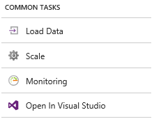
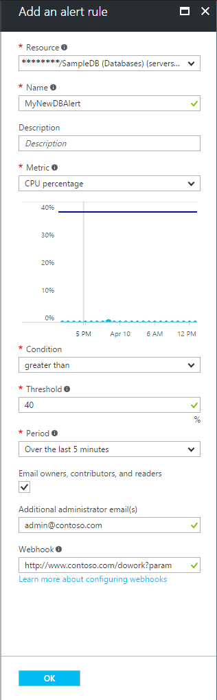

# Use Azure portal to create alerts for Azure SQL Database and Data Warehouse

## Overview
This article shows you how to set up Azure SQL Database and Data Warehouse alerts using the Azure portal. This article also provides best practices for setting alert periods.    

You can receive an alert based on monitoring metrics for, or events on, your Azure services.

* **Metric values** - The alert triggers when the value of a specified metric crosses a threshold you assign in either direction. That is, it triggers both when the condition is first met and then afterwards when that condition is no longer being met.    
* **Activity log events** - An alert can trigger on *every* event, or, only when a certain number of events occur.

You can configure an alert to do the following when it triggers:

* send email notifications to the service administrator and co-administrators
* send email to additional emails that you specify.
* call a webhook

You can configure and get information about alert rules using

* [Azure portal](../monitoring-and-diagnostics/insights-alerts-portal.md)
* [PowerShell](../monitoring-and-diagnostics/insights-alerts-powershell.md)
* [command-line interface (CLI)](../monitoring-and-diagnostics/insights-alerts-command-line-interface.md)
* [Azure Monitor REST API](https://msdn.microsoft.com/library/azure/dn931945.aspx)

## Create an alert rule on a metric with the Azure portal
1. In the [portal](https://portal.azure.com/), locate the resource you are interested in monitoring and select it.
2. This step is different for SQL DB and elastic pools versus SQL DW: 

   - **SQL DB & Elastic pools ONLY**: Select **Alerts** or **Alert rules** under the MONITORING section. The text and icon may vary slightly for different resources.  
   
     
  
   - **SQL DW ONLY**: Select **Monitoring** under the COMMON TASKS section. Click the **DWU Usage** graph.

     

3. Select the **Add alert** command and fill in the fields.
   
    
4. **Name** your alert rule, and choose a **Description**, which also shows in notification emails.
5. Select the **Metric** you want to monitor, then choose a **Condition** and **Threshold** value for the metric. Also choose the **Period** of time that the metric rule must be satisfied before the alert triggers. So for example, if you use the period "PT5M" and your alert looks for CPU above 80%, the alert triggers when the **average** CPU has been above 80% for 5 minutes. Once the first trigger occurs, it again triggers when the average CPU is below 80% over 5 minutes. The CPU measurement occurs every 1 minute. Consult the table below for supported time windows and the aggregation type that each alert uses- not all alerts use the average value.   
6. Check **Email owners...** if you want administrators and co-administrators to be emailed when the alert fires.
7. If you want additional emails to receive a notification when the alert fires, add them in the **Additional Administrator email(s)** field. Separate multiple emails with semi-colons - *email@contoso.com;email2@contoso.com*
8. Put in a valid URI in the **Webhook** field if you want it called when the alert fires.
9. Select **OK** when done to create the alert.   

Within a few minutes, the alert is active and triggers as previously described.

## Managing your alerts
Once you have created an alert, you can select it and:

* View a graph showing the metric threshold and the actual values from the previous day.
* Edit or delete it.
* **Disable** or **Enable** it if you want to temporarily stop or resume receiving notifications for that alert.

## SQL Database alert values

| Resource Type	| Metric Name | Friendly Name | Aggregation Type | Minimum alert time window|
| --- | --- | --- | --- | --- |
| SQL database | cpu_percent | CPU percentage | Average | 5 minutes |
| SQL database | physical_data_read_percent | Data IO percentage | Average | 5 minutes |
| SQL database | log_write_percent | Log IO percentage | Average | 5 minutes |
| SQL database | dtu_consumption_percent | DTU percentage | Average | 5 minutes |
| SQL database | storage | Total database size | Maximum | 30 minutes |
| SQL database | connection_successful | Successful Connections | Total | 10 minutes |
| SQL database | connection_failed | Failed Connections | Total | 10 minutes |
| SQL database | blocked_by_firewall | Blocked by Firewall | Total | 10 minutes |
| SQL database | deadlock | Deadlocks | Total | 10 minutes |
| SQL database | storage_percent | Database size percentage | Maximum | 30 minutes |
| SQL database | xtp_storage_percent | In-Memory OLTP storage percent(Preview) | Average | 5 minutes |
| SQL database | workers_percent | Workers percentage | Average | 5 minutes |
| SQL database | sessions_percent | Sessions percent | Average | 5 minutes |
| SQL database | dtu_limit | DTU limit | Average | 5 minutes |
| SQL database | dtu_used | DTU used | Average | 5 minutes |
||||||
| Elastic pool | cpu_percent | CPU percentage | Average | 10 minutes |
| Elastic pool | physical_data_read_percent | Data IO percentage | Average | 10 minutes |
| Elastic pool | log_write_percent | Log IO percentage | Average | 10 minutes |
| Elastic pool | dtu_consumption_percent | DTU percentage | Average | 10 minutes |
| Elastic pool | storage_percent | Storage percentage | Average | 10 minutes |
| Elastic pool | workers_percent | Workers percentage | Average | 10 minutes |
| Elastic pool | eDTU_limit | eDTU limit | Average | 10 minutes |
| Elastic pool | storage_limit | Storage limit | Average | 10 minutes |
| Elastic pool | eDTU_used | eDTU used | Average | 10 minutes |
| Elastic pool | storage_used | Storage used | Average | 10 minutes |
|||||| 	 	 	 	 
| SQL data warehouse | cpu_percent | CPU percentage | Average | 10 minutes |
| SQL data warehouse | physical_data_read_percent | Data IO percentage | Average | 10 minutes |
| SQL data warehouse | storage | Total database size | Maximum | 10 minutes |
| SQL data warehouse | connection_successful | Successful Connections | Total | 10 minutes |
| SQL data warehouse | connection_failed | Failed Connections | Total | 10 minutes |
| SQL data warehouse | blocked_by_firewall | Blocked by Firewall | Total | 10 minutes |
| SQL data warehouse | service_level_objective | Service tier of the database | Total | 10 minutes |
| SQL data warehouse | dwu_limit | dwu limit | Maximum | 10 minutes |
| SQL data warehouse | dwu_consumption_percent | DWU percentage | Average | 10 minutes |
| SQL data warehouse | dwu_used | DWU used | Average | 10 minutes |
||||||

## Next steps
* [Get an overview of Azure monitoring](../monitoring-and-diagnostics/monitoring-overview.md) including the types of information you can collect and monitor.
* Learn more about [configuring webhooks in alerts](../monitoring-and-diagnostics/insights-webhooks-alerts.md).
* Get an [overview of diagnostic logs](../monitoring-and-diagnostics/monitoring-overview-of-diagnostic-logs.md) and collect detailed high-frequency metrics on your service.
* Get an [overview of metrics collection](../monitoring-and-diagnostics/insights-how-to-customize-monitoring.md) to make sure your service is available and responsive.
