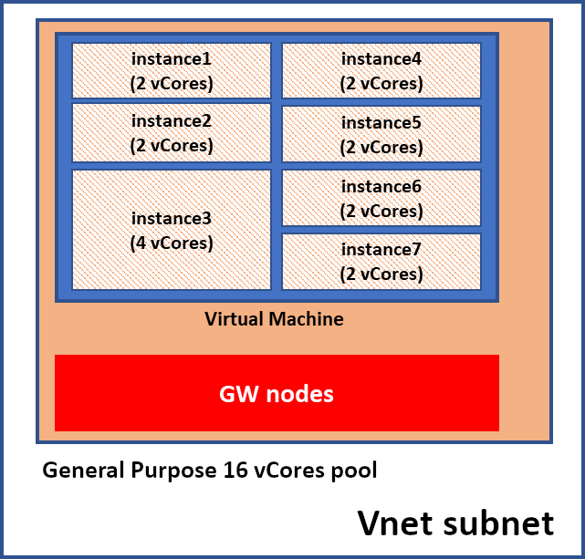

# What are SQL Database instance pools (preview)?

Instance pools are a new resource in Azure SQL Database that provides a convenient and cost-efficient way to migrate smaller SQL instances to the cloud at scale.

Instance pools allow you to pre-provision compute resources according to your total migration requirements. You can then deploy several individual managed instances up to your pre-provisioned compute level. For example, if you pre-provision 8 vCores you can deploy two 2 vCore and one 4 vCore instances, and then migrate databases into these instances. *The ability to deploy a 2 vCore managed instance is now available, but only for instances in instance pools.*

This is an advantage because previously, smaller and less compute-intensive workloads would often have to be consolidated into a larger managed instance when migrating to the cloud. If you planned to migrate a group of databases hosted on multiple small-size SQL Servers (for example 2 vCores), you would need to deploy them into a single, larger sized managed instance. The need to migrate to a large instance typically required careful capacity planning and resource governance, additional security considerations, and some extra data consolidation work at the instance level.

Additionally, instance pools support native VNet integration so you can deploy multiple instance pools and multiple single instances in the same subnet.

## Key capabilities of instance pools

Instance pools provide the following benefits:

1. Ability to host 2 vCore instances.
2. Predictable and fast instance deployment time (up to 5 minutes).
3. Minimal IP address allocation.

The following diagram illustrates an instance pool with multiple instances deployed within a VNet subnet.

Instance pools enable deployment of multiple instances on the same virtual machine where the virtual machine's compute size is based on the total number of vCores allocated for the pool. This architecture allows *partitioning* of the virtual machine into multiple instances, which can be any supported size, including 2 vCores (2 vCore instances are only available for instances in pools).

Additionally, deployment or extension of a [virtual cluster](https://sql-database-managed-instance-connectivity-architecture.md#high-level-connectivity-architecture)
(dedicated set of virtual machines) is not part of provisioning the managed instance but happens when the managed instance is provisioned. Because of this, management operations on instances in a pool are much faster once the pool is initially deployed.

Since all instances in a pool share the same virtual machine, total IP allocation does not depend on the number of instances deployed, which is convenient for deployment in subnets with a narrow IP range.

Every pool has a fixed IP allocation of only nine IP addresses (not including the five IP addresses in the subnet that are reserved for its own needs).

For details, see [subnet size requirements for single instances](sql-database-managed-instance-determine-size-vnet-subnet.md).

## Application scenarios for instance pools

These are the main use cases where instance pools should be considered:

- Migration of *a group of SQL instances* at the same time, where the majority is a smaller size (for example 2 or 4 vCores).

- Scenarios where *predictable and short instance creation or scaling* is important. For example, deployment of a new tenant in a multi-tenant SaaS application environment that requires instance-level surface area.

- Scenarios when having *fixed cost* or *spending limit* is important. For example, running shared dev-test or demo environments of a fixed (or infrequently changing) size, where you periodically deploy managed instances when needed.

- Scenarios where *minimal IP address allocation* in a VNet subnet is important. All instances in a pool are sharing a virtual machine, so the number of allocated IP addresses is lower than in the case of single instances.

## How to deploy managed instances in pools

Process of instance deployment within a pool consists of two separate steps:

1. One-off instance pool deployment. This is a long running operation, with the duration same as for [first instance creation in an empty subnet](sql-database-managed-instance.md#managed-instance-management-operations).

2. Repetitive instance deployment within the pool, created in the first step. Instance pool parameter must be explicitly specified as part of this operation. This is relatively fast operation that typically takes up to 5 minutes.

In public preview, both steps are supported through PowerShell and Resource Manager templates only. The Azure portal experience should be coming soon.

After a managed instance is deployed in a pool, you *can* use the Azure portal to change its properties on the Pricing tier page.

For detailed steps explaining how to create a pool and instances, see [SQL Database instance pools how-to guide](sql-database-instance-pools-how-to.md).

## Architecture of instance pools

Instance pools have similar architecture to regular managed instances ("single instances"). To support [deployments within Azure Virtual Networks (VNets)](../virtual-network/virtual-network-for-azure-services.md#deploy-azure-services-into-virtual-networks) and provide isolation and security for customers, instance pools also rely on [virtual
clusters](sql-database-managed-instance-connectivity-architecture.md#high-level-connectivity-architecture), which represents a dedicated set of isolated virtual machines deployed inside the customer's virtual network subnet.

The main difference between the two deployment models is that instance pools allow multiple SQL Server process deployments on the same virtual machine node, which are resource governed using [Windows Job
Objects](https://docs.microsoft.com/windows/desktop/ProcThread/job-objects), while single instances are always alone on a virtual machine node.

The following diagram shows instance pool and two individual instances deployed in the same subnet and illustrates main architectural details for both deployment models:

Every instance pool creates a separate virtual cluster underneath. Instances within a pool and single instances deployed in the same subnet do not share compute resources allocated to SQL Server processes and gateway components that ensures performance predictability.

## Instance pools resource limitations

There are several resource limitations regarding instance pools and instances inside pools:

- Instance pools are available only on Gen5 hardware.
- Instances within the pool have dedicated CPU and RAM memory so the aggregated number of vCores across all instances must be less or equal to the number of vCores allocated to the pool.
- All [instance level limits](sql-database-managed-instance-resource-limits.md#service-tier-characteristics) apply to instances created within a pool.
- In addition to instance-level limits there are also two limits imposed *at the instance pool level*:
  - Total storage size per pool (8 TB).
  - Total number of databases per pool (100).

Total storage allocation and number of databases across all instances must be lower or equal to the limits exposed by instance pools.

- Instance pools support 8, 16, 24, 32, 40, 64, and 80 vCores.
- Managed instances inside pools support 2, 4, 8, 16, 24, 32, 40, 64 and 80 vCores.
- Managed instances inside pools support storage sizes between 32 GB and 8 TB, except:
  - 2 vCore instances support sizes between 32 GB and 640 GB
  - 4 vCore instances support sizes between 32 GB and 2 TB

The [service tier property](sql-database-managed-instance-resource-limits.md#service-tier-characteristics) (General Purpose or Business Critical) is associated with the instance pool resource so all instances in a pool must be the same service tier as the service tier of the pool. At this time, only the General Purpose service tier is available (see the following section on limitations in the current preview).

## Public preview limitations

The public preview has the following limitations:

- Only the General Purpose service tier is available at this time. Business Critical service tier is planned to be added at GA time.

- Instance pools cannot be scaled during the public preview so careful capacity planning before deployment is important.

- Azure portal support for instance pool creation and configuration is not yet available. All operations on instance pools are supported through PowerShell only. Initial instance deployment in a pre-created pool is also supported through PowerShell only. Once deployed in a pool, managed instances can be update using the Azure portal.

- Managed instances created outside of the pool cannot be moved to an existing pool and vice versa, instances created inside a pool cannot be moved outside as a single instance or to another pool.
- Reserved instance price (license included or with Azure Hybrid Benefit) is not available.

## SQL features supported

Instances created in pools support the same [compatibility levels and features supported in a single instance](sql-database-managed-instance.md#sql-features-supported).

Every managed instance deployed in a pool has a separate instance of SQL Agent.

Optional features or features that require you to choose specific values (such as instance-level collation, time zone, public endpoint for data traffic, failover groups) are configured at instance level and can be different for every instance in a pool.

## Performance considerations

Although managed instances within pools do have dedicated vCore and RAM memory, they share local disk (for tempdb usage) and network resources. It's not very likely, but it is possible to experience the *noisy neighbor* effect if multiple instances in the pool have high resource consumption at the same time. If you observe this behavior, consider deploying these instances in a bigger pool or as single instances.

## Security considerations

Because instances deployed in a pool share the same virtual machine, you may want to consider disabling features that introduce higher security risks, or to firmly control access permissions to these features. For example, CLR integration, native backup and restore, database email, etc.

## Instance pool support requests

Create and manage support requests for instance pools in the [Azure portal](https://portal.azure.com).

If you are experiencing issues related to instance pool deployment (creation or deletion), make sure that you specify **Instance Pools** in the **Problem subtype** field.

If you are experiencing issues related to single instances or databases within a pool, you should create a regular support ticket for Azure SQL Database managed instances.

To create larger managed instance deployments (with or without instance pools), you may need to obtain a larger regional quota. Use the [standard managed instance procedure for requesting a larger quota](sql-database-managed-instance-resource-limits.md#obtaining-a-larger-quota-for-sql-managed-instance), but note that if you are using instance pools, the deployment logic compares total vCore consumption at the pool level against your quota to determine whether you are allowed to create new resources without further quota increase.

## Instance pool billing

Instance pools allow scaling compute and storage independently. Customers pay for compute associated with the pool resource and measured in vCores, and storage associated with every instance and measured in gigabytes (the first 32 GB are free of charge for every instance).

vCore price for a pool is charged regardless of how many instances are deployed in that pool.

For the Compute price (measured in vCores), two pricing options are available:

1. *License included*: Apply existing SQL Server licenses with Software Assurance.

2. *Azure Hybrid Benefit*: A reduced price that includes Azure Hybrid Benefit for SQL Server. Customers can opt into this price by using their existing SQL Server licenses with Software Assurance. For eligibility and other details, see [Azure Hybrid Benefit](https://azure.microsoft.com/pricing/hybrid-benefit/)

Choosing between these two pricing options is not possible at the level of individual instances. All instances in the parent pool must be either at License Included price or Azure Hybrid Benefit price. The license model for the pool can be altered after the pool is created.

> [!IMPORTANT]
> If you specify a License Model for the instance that is different than in the pool, the pool price is used and the instance level value is ignored.

If you create instance pools on [subscriptions eligible for dev-test benefit](https://azure.microsoft.com/pricing/dev-test/), you automatically receive discounted rates of up to 55 percent on Azure SQL managed instance.

For full details on instance pools pricing, refer to the *instance pools* section on the [managed instance pricing page](https://azure.microsoft.com/pricing/details/sql-database/managed/).

## Next steps

- To get started with instance pools, see [SQL Database instance pools how-to guide](sql-database-instance-pools-how-to.md).
- To learn how to create your first managed instance, see [Quickstart guide](sql-database-managed-instance-get-started.md).
- For a features and comparison list, see [SQL common features](sql-database-features.md).
- For more information about VNet configuration, see [managed instance VNet configuration](sql-database-managed-instance-connectivity-architecture.md).
- For a quickstart that creates a managed instance and restores a database from a backup file, see [create a managed instance](sql-database-managed-instance-get-started.md).
- For a tutorial using the Azure Database Migration Service (DMS) for migration, see [managed instance migration using DMS](../dms/tutorial-sql-server-to-managed-instance.md).
- For advanced monitoring of managed instance database performance with built-in troubleshooting intelligence, see [Monitor Azure SQL Database using Azure SQL Analytics](../azure-monitor/insights/azure-sql.md).
- For pricing information, see [SQL Database managed instance pricing](https://azure.microsoft.com/pricing/details/sql-database/managed/).