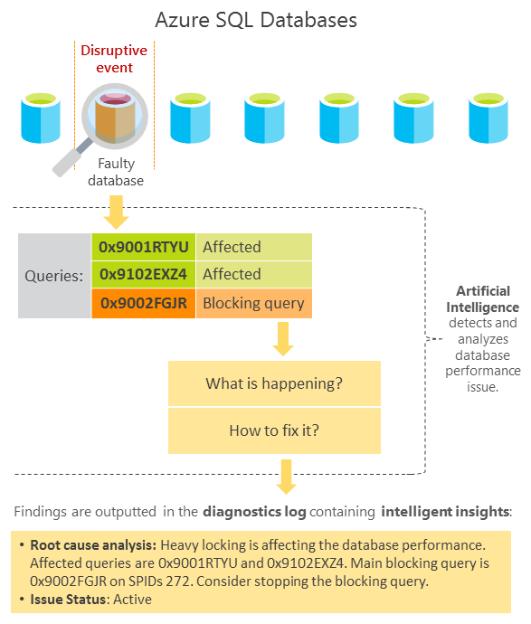
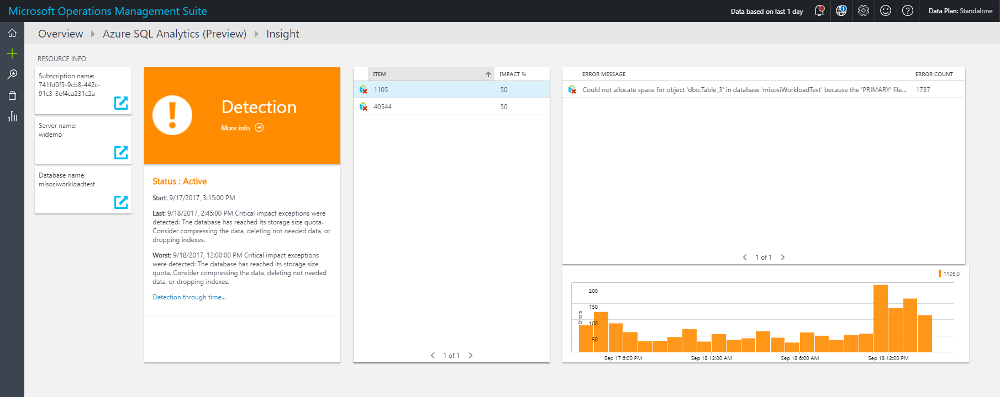

# Intelligent Insights using AI to monitor and troubleshoot database performance (Preview)

Azure SQL Database Intelligent Insights lets you know what is happening with your SQL Database and Managed Instance database performance.

Intelligent Insights uses built-in intelligence to continuously monitor database usage through artificial intelligence and detect disruptive events that cause poor performance. Once detected, a detailed analysis is performed that generates a diagnostics log with an intelligent assessment of the issue. This assessment consists of a root cause analysis of the database performance issue and, where possible, recommendations for performance improvements.

## What can Intelligent Insights do for you

Intelligent Insights is a unique capability of Azure built-in intelligence that provides the following value:

- Proactive monitoring
- Tailored performance insights
- Early detection of database performance degradation
- Root cause analysis of issues detected
- Performance improvement recommendations
- Scale out capability on hundreds of thousands of databases
- Positive impact to DevOps resources and the total cost of ownership

## How does Intelligent Insights work

Intelligent Insights analyzes database performance by comparing the database workload from the last hour with the past seven-day baseline workload. Database workload is composed of queries determined to be the most significant to the database performance, such as the most repeated and largest queries. Because each database is unique based on its structure, data, usage, and application, each workload baseline that is generated is specific and unique to an individual instance. Intelligent Insights, independent of the workload baseline, also monitors absolute operational thresholds and detects issues with excessive wait times, critical exceptions, and issues with query parameterizations that might affect performance.

After a performance degradation issue is detected from multiple observed metrics by using artificial intelligence, analysis is performed. A diagnostics log is generated with an intelligent insight on what is happening with your database. Intelligent Insights makes it easy to track the database performance issue from its first appearance until resolution. Each detected issue is tracked through its lifecycle from initial issue detection and verification of performance improvement to its completion.

The metrics used to measure and detect database performance issues are based on query duration, timeout requests, excessive wait times, and errored requests. For more information on metrics, see the [Detection metrics](sql-database-intelligent-insights.md#detection-metrics) section of this document.

Identified SQL Database performance degradations are recorded in the diagnostics log with intelligent entries that consist of the following properties:

| Property             | Details              |
| :------------------- | ------------------- |
| Database information | Metadata about a database on which an insight was detected, such as a resource URI. |
| Observed time range | Start and end time for the period of the detected insight. |
| Impacted metrics | Metrics that caused an insight to be generated: <ul><li>Query duration increase [seconds].</li><li>Excessive waiting [seconds].</li><li>Timed-out requests [percentage].</li><li>Errored-out requests [percentage].</li></ul>|
| Impact value | Value of a metric measured. |
| Impacted queries and error codes | Query hash or error code. These can be used to easily correlate to affected queries. Metrics that consist of either query duration increase, waiting time, timeout counts, or error codes are provided. |
| Detections | Detection identified at the database during the time of an event. There are 15 detection patterns. For more information, see [Troubleshoot database performance issues with Intelligent Insights](sql-database-intelligent-insights-troubleshoot-performance.md). |
| Root cause analysis | Root cause analysis of the issue identified in a human-readable format. Some insights might contain a performance improvement recommendation where possible. |
|||

For a hands-on overview on using Intelligent Insights with Azure SQL Analytics and for typical usage scenarios, see the embedded video:

> [!VIDEO https://channel9.msdn.com/Shows/Azure-Friday/Get-Intelligent-Insights-for-Improving-Azure-SQL-Database-Performance/player]
>

Intelligent Insights shines in discovering and troubleshooting SQL Database performance issues. In order to use Intelligent Insights to troubleshoot SQL Database and Managed Instance database performance issues, see [Troubleshoot Azure SQL Database performance issues with Intelligent Insights](sql-database-intelligent-insights-troubleshoot-performance.md).

## Intelligent Insights options

Intelligent Insights options available in Azure SQL Database are:

| Intelligent Insights option | Single database and pooled database support | Instance database support |
| :----------------------------- | ----- | ----- |
| **Configure Intelligent Insights** - Configure Intelligent Insights analysis for your databases. | Yes | Yes | 
| **Stream insights to Azure SQL Analytics** -- Stream insights to Azure SQL Analytics monitoring solution for Azure SQL Database. | Yes | Yes | 
| **Stream insights to Event Hub** - Stream insights to Event Hubs for further custom integrations. | Yes | Yes | 
| **Stream insights to Azure Storage** - Stream insights to Azure Storage for further analysis and long term archival. | Yes | Yes |

## Configure Intelligent Insights

Output of the Intelligent Insights is a smart performance diagnostics log. This log can be consumed in several ways - through streaming it to Azure SQL Analytics, Azure Event Hubs and Azure storage, or a third party product.

- Use the product with [Azure SQL Analytics](https://docs.microsoft.com/azure/log-analytics/log-analytics-azure-sql) to view insights through the user interface of the Azure portal. This is the integrated Azure solution, and the most typical way to view insights.
- Use the product with Azure Event Hubs for development of custom monitoring and alerting scenarios
- Use the product with Azure storage for custom application development, such are for example custom reporting, long-term data archival and so forth.

Integration of Intelligent Insights with other products Azure SQL Analytics, Azure Event Hub, Azure storage, or third party products for consumption is performed through first enabling Intelligent Insights logging (the "SQLInsights" log) in the Diagnostic settings blade of a database, and then configuring Intelligent Insights log data to be streamed into one of these products.

For more information on how to enable Intelligent Insights logging and to configure log data to be streamed to a consuming product, see [Azure SQL Database metrics and diagnostics logging](sql-database-metrics-diag-logging.md).

### Set up with Azure SQL Analytics

Azure SQL Analytics solution provides graphical user interface, reporting and alerting capabilities on database performance, along with the Intelligent Insights diagnostics log data.

> [!TIP]
> Quick getting started: The easiest way to get off the ground with using Intelligent Insights is to use it along with Azure SQL Analytics which will provide a graphical user interface to database performance issues. Add Azure SQL Analytics solution from the marketplace, create a workspace inside this solution, and then for each database you wish to enable Intelligent Insights on, configure streaming of "SQLInsights" log in the Diagnostics settings blade of a database to the workspace of Azure SQL Analytics.
>

Pre-requirement is to have Azure SQL Analytics added to your Azure portal dashboard from the marketplace and to create a workspace, see [configure Azure SQL Analytics](../azure-monitor/insights/azure-sql.md#configuration)

To use Intelligent Insights with Azure SQL Analytics, configure Intelligent Insights log data to be streamed to Azure SQL Analytics workspace you've created in the previous step, see [Azure SQL Database metrics and diagnostics logging](sql-database-metrics-diag-logging.md).

The following example shows an Intelligent Insights viewed through Azure SQL Analytics:

### Set up with Event Hubs

To use Intelligent Insights with Event Hubs, configure Intelligent Insights log data to be streamed to Event Hubs, see [Stream Azure diagnostics logs to Event Hubs](../azure-monitor/platform/resource-logs-stream-event-hubs.md).

To use Event Hubs to setup custom monitoring and alerting, see [What to do with metrics and diagnostics logs in Event Hubs](sql-database-metrics-diag-logging.md#what-to-do-with-metrics-and-diagnostics-logs-in-event-hubs).

### Set up with Azure Storage

To use Intelligent Insights with Storage, configure Intelligent Insights log data to be streamed to Storage, see [Stream into Azure Storage](sql-database-metrics-diag-logging.md#stream-into-storage).

### Custom integrations of Intelligent Insights log

To use Intelligent Insights with third party tools, or for custom alerting and monitoring development, see [Use the Intelligent Insights database performance diagnostics log](sql-database-intelligent-insights-use-diagnostics-log.md).

## Detection metrics

Metrics used for detection models that generate Intelligent Insights are based on monitoring:

- Query duration
- Timeout requests
- Excessive wait time
- Errored out requests

Query duration and timeout requests are used as primary models in detecting issues with database workload performance. They're used because they directly measure what is happening with the workload. To detect all possible cases of workload performance degradation, excessive wait time and errored-out requests are used as additional models to indicate issues that affect the workload performance.

The system automatically considers changes to the workload and changes in the number of query requests made to the database to dynamically determine normal and out-of-the-ordinary database performance thresholds.

All of the metrics are considered together in various relationships through a scientifically derived data model that categorizes each performance issue detected. Information provided through an intelligent insight includes:

- Details of the performance issue detected.
- A root cause analysis of the issue detected.
- Recommendations on how to improve the performance of the monitored SQL database, where possible.

## Query duration

The query duration degradation model analyzes individual queries and detects the increase in the time it takes to compile and execute a query compared to the performance baseline.

If SQL Database built-in intelligence detects a significant increase in query compile or query execution time that affects workload performance, these queries are flagged as query duration performance degradation issues.

The Intelligent Insights diagnostics log outputs the query hash of the query degraded in performance. The query hash indicates whether the performance degradation was related to query compile or execution time increase, which increased query duration time.

## Timeout requests

The timeout requests degradation model analyzes individual queries and detects any increase in timeouts at the query execution level and the overall request timeouts at the database level compared to the performance baseline period.

Some of the queries might time out even before they reach the execution stage. Through the means of aborted workers vs. requests made, SQL Database built-in intelligence measures and analyzes all queries that reached the database whether they got to the execution stage or not.

After the number of timeouts for executed queries or the number of aborted request workers crosses the system-managed threshold, a diagnostics log is populated with intelligent insights.

The insights generated contain the number of timed-out requests and the number of timed-out queries. Indication of the performance degradation is related to timeout increase at the execution stage, or the overall database level is provided. When the increase in timeouts is deemed significant to database performance, these queries are flagged as timeout performance degradation issues.

## Excessive wait times

The excessive wait time model monitors individual database queries. It detects unusually high query wait stats that crossed the system-managed absolute thresholds. The following query excessive wait-time metrics are observed by using the new SQL Server feature, Query Store Wait Stats (sys.query_store_wait_stats):

- Reaching resource limits
- Reaching elastic pool resource limits
- Excessive number of worker or session threads
- Excessive database locking
- Memory pressure
- Other wait stats

Reaching resource limits or elastic pool resource limits denote that consumption of available resources on a subscription or in the elastic pool crossed absolute thresholds. These stats indicate workload performance degradation. An excessive number of worker or session threads denotes a condition in which the number of worker threads or sessions initiated crossed absolute thresholds. These stats indicate workload performance degradation.

Excessive database locking denotes a condition in which the count of locks on a database has crossed absolute thresholds. This stat indicates a workload performance degradation. Memory pressure is a condition in which the number of threads requesting memory grants crossed an absolute threshold. This stat indicates a workload performance degradation.

Other wait stats detection indicates a condition in which miscellaneous metrics measured through the Query Store Wait Stats crossed an absolute threshold. These stats indicate workload performance degradation.

After excessive wait times are detected, depending on the data available, the Intelligent Insights diagnostics log outputs hashes of the affecting and affected queries degraded in performance, details of the metrics that cause queries to wait in execution, and measured wait time.

## Errored requests

The errored requests degradation model monitors individual queries and detects an increase in the number of queries that errored out compared to the baseline period. This model also monitors critical exceptions that crossed absolute thresholds managed by SQL Database built-in intelligence. The system automatically considers the number of query requests made to the database and accounts for any workload changes in the monitored period.

When the measured increase in errored requests relative to the overall number of requests made is deemed significant to workload performance, affected queries are flagged as errored requests performance degradation issues.

The Intelligent Insights log outputs the count of errored requests. It indicates whether the performance degradation was related to an increase in errored requests or to crossing a monitored critical exception threshold and measured time of the performance degradation.

If any of the monitored critical exceptions cross the absolute thresholds managed by the system, an intelligent insight is generated with critical exception details.

## Next steps

- Learn how to [troubleshoot SQL Database performance issues with Intelligent Insights](sql-database-intelligent-insights-troubleshoot-performance.md).
- Use the [Intelligent Insights SQL Database performance diagnostics log](sql-database-intelligent-insights-use-diagnostics-log.md).
- Learn how to [monitor SQL Database by using SQL Analytics](../azure-monitor/insights/azure-sql.md).
- Learn how to [collect and consume log data from your Azure resources](../azure-monitor/platform/platform-logs-overview.md).
