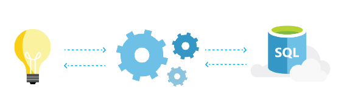

<properties
   pageTitle="Azure SQL Database Learns and Adapts"
   description="Learn how SQL Database learns and adapts"
   keywords=""
   services="sql-database"
   documentationCenter=""
   authors="CarlRabeler"
   manager="jhubbard"
   editor=""/>

<tags
   ms.service="sql-database"
   ms.devlang="NA"
   ms.topic="article"
   ms.tgt_pltfrm="NA"
   ms.workload="data-management"
   ms.date="07/19/2016"
   ms.author="carlrab"/>

# Azure SQL Database Learns &amp; Adapts

## How Azure SQL Database learns, adapts, and grows with your application

Azure SQL Database manages billions of transactions and millions of databases per day. And one of its key features is that SQL Database is always learning and adapting with your app. That way you can dynamically maximize performance, reliability, and data security&mdash;with little effort on your part.

## Threat detection and alerts  
With threat and anomaly detection, SQL Database has built-in behavioral analysis, real-time alerts, a configurable threat policy, an audit log, and intelligent ways to detect and fix unusual patterns.

[Read the documentation](sql-database-threat-detection-get-started.md)

## Automatic tuning
SQL Database is equipped to make your app run at its best performance. By continuously learning your app’s patterns, adaptively self-tuning its performance, and automatically refining without you doing anything&mdash;because we know you don’t want to anyway.

[Read the documentation](http://go.microsoft.com/fwlink/?LinkID=787566)

## Insights when you need them
SQL Database is able to track each query and its duration, frequency, and resource utilization. Based on this telemetry, automatic algorithms optimally tune your databases exactly to your queries. Additionally, SQL Database provides insights to help minimize time tuning queries and troubleshooting performance issues. That means you gain direct insight into resource consumption, top performing queries, and the ability to drill down for more details.

[Read the documentation](http://go.microsoft.com/fwlink/?LinkID=787567)

## No administration required
SQL Database provides the automatic administration and data protection your app needs so you can go back to doing what you do best&mdash;coding. You automatically get back-ups, disaster recovery failover, infrastructure maintenance, security and software patches, and feature updates. You’ll not only save money and time as SQL Database works behind the scenes, but you’ll also never have to worry about that dreaded app downtime.

[Read the documentation](http://go.microsoft.com/fwlink/?LinkID=787568)

Go to the homepage to see what else SQL Database has to offer.
[Check it out](https://azure.microsoft.com/services/sql-database/) 

## Next steps

Get a [free Azure subscription](https://azure.microsoft.com/get-started/) and [create your first Azure SQL Database](sql-database-get-started.md).

## Additional resources

Explore all the [capabilities of SQL Database](https://azure.microsoft.com/services/sql-database/).
 
Review the [technical overview of SQL Database](sql-database-technical-overview.md).
