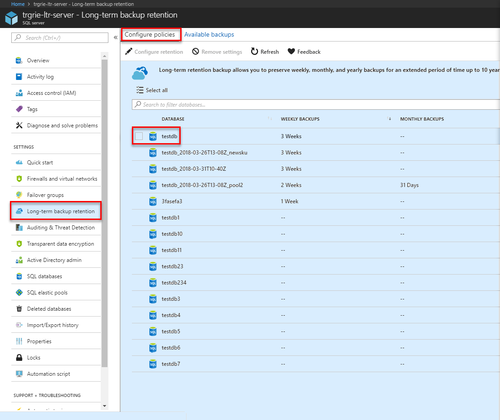

# Configure and restore from Azure SQL Database long-term backup retention

You can configure Azure SQL Database to store Azure SQL database backups in Azure SQL Storage for up to 10 years. You can then recover a database using these backups using the Azure portal or PowerShell.

> [!NOTE]
> As part of the previous preview of this feature, backups were stored in the Azure Services Recovery Service vault. This preview is over, but if you need to interact with backups in the Azure Services Recovery vault, see [Long-term backup retention using Azure Services Recovery Service vault](sql-database-long-term-backup-retention-configure-vault.md). 

## Azure portal

The following sections show you how to use the Azure portal to configure the long term retention, view backups in long term retention, and restore backup from long term retention.

### Configure the long term retention policies

You [configure SQL Database to retain automated backups](sql-database-long-term-retention.md) for a period longer than the retention period for your service tier. 

1. In the Azure portal, select your SQL server and then click **Long-term backup retention**.

   

2. On the **Configure policies** tab, select the database to set or modify long-term backup retention policies.

   

3. In the **Configure policies** pane, select the type of backups that you wish to retain for a long period and then select the period for which you want these backups to be retained. 

   

4. When complete, click **Apply**.

### View backups and restore from a backup using Azure portal

View information about your database backups in [long-term backup retention](sql-database-long-term-retention.md). 

1. In the Azure portal, select your SQL server and then click **Long-term backup retention**.

   

2. On the **Available backups** tab, select the database for which you want to see available backups.

   

3. In the **Available backups** pane, review the available backups. 

   

4. Select the backup from which you want to restore, and then specify the new database name.

   

5. Click **OK** to restore your database from the backup in the vault to the new database.

6. On the toolbar, click the notification icon to view the status of the restore job.

   

5. When the restore job is completed, open the **SQL databases** page to view the newly restored database.

> [!NOTE]
> From here, you can connect to the restored database using SQL Server Management Studio to perform needed tasks, such as to [extract a bit of data from the restored database to copy into the existing database or to delete the existing database and rename the restored database to the existing database name](sql-database-recovery-using-backups.md#point-in-time-restore).
>

## PowerShell

The following sections show you how to use PowerShell to configure the long-term backup retention, view backups in Azure SQL storage, and restore from a backup in Azure SQL storage.

```powershell

$subId = '<your sub Id>'
$serverName = '<your server name>'
$resourceGroup = '<your resource group name>'
$dbName = '<your database name>'

Login-AzureRmAccount
Select-AzureRmSubscription -SubscriptionId $subId

# get the server
$server = Get-AzureRmSqlServer -ServerName $serverName -ResourceGroupName $resourceGroup

##### example for Set-AzureRmSqlDatabaseBackupLongTermRetentionPolicy
# set policy (WeeklyRetention is 1 week, MonthlyRetention and YearlyRetetion default to 0
Set-AzureRmSqlDatabaseBackupLongTermRetentionPolicy -ServerName $serverName -DatabaseName $dbName -ResourceGroupName $resourceGroup -WeeklyRetention P1W

# set policy (WeeklyRetention is 1 week, MonthlyRetention default to 0 and YearlyRetetion set to 1 year and WeekOfYear set to 2nd week
Set-AzureRmSqlDatabaseBackupLongTermRetentionPolicy -ServerName $serverName -DatabaseName $dbName -ResourceGroupName $resourceGroup -WeeklyRetention P3W -YearlyRetention P1Y -WeekOfYear 2

# set V1 policy (This will be deprecated, when you do this, you will also update V2 policy: i.e., weeklyRetention = V1PolicyRetention and MonthlyRetention/YearlyRetention default to 0)
$recoveryServicesBackupPolicyResourceId = '' # set this to ARS recovery policy id
Set-AzureRmSqlDatabaseBackupLongTermRetentionPolicy -ServerName $serverName -DatabaseName $dbName -ResourceGroupName $resourceGroup -ResourceId $recoveryServicesBackupPolicyResourceId -State Enabled

##### example for Get-AzureRmSqlDatabaseBackupLongTermRetentionPolicy
# get V2 policy
Get-AzureRmSqlDatabaseBackupLongTermRetentionPolicy -ServerName $serverName -DatabaseName $dbName -ResourceGroupName $resourceGroup

# get V1 policy (This will be deprecated)
Get-AzureRmSqlDatabaseBackupLongTermRetentionPolicy -ServerName $serverName -DatabaseName $dbName -ResourceGroupName $resourceGroup -legacy

##### example for Get-AzureRmSqlDatabaseLongTermRetentionBackup
# get the list of long term retention backups from the location under the sub 
$ltrBackups = Get-AzureRmSqlDatabaseLongTermRetentionBackup -LocationName $server.Location 

# get the list of long term retention backups from the location under the named server under the sub 
$ltrBackups = Get-AzureRmSqlDatabaseLongTermRetentionBackup -LocationName $server.Location -ServerName $serverName

# get the long term retention backups from the location under the named database under the named server under the sub 
$ltrBackups = Get-AzureRmSqlDatabaseLongTermRetentionBackup -LocationName $server.Location -ServerName $serverName -DatabaseName $dbName

# get a specific long term retention backup
$backupName = 'ce7a35d2-cca6-4106-94c8-c4335ec13e2f;131634941160000000'  # you can get the backup name from the ltr backup object
$ltrBackups = Get-AzureRmSqlDatabaseLongTermRetentionBackup -LocationName $server.Location -ServerName $serverName -DatabaseName $dbName -BackupName $backupName

# variations
# only list long term retention backups from live databases (you have option to choose All/Live/Deleted)
$ltrBackups = Get-AzureRmSqlDatabaseLongTermRetentionBackup -LocationName $server.Location -DatabaseState Live

# only list the latest long term retention backups for each database 
$ltrBackups = Get-AzureRmSqlDatabaseLongTermRetentionBackup -LocationName $server.Location -ServerName $serverName -OnlyLatestPerDatabase

##### example for Remove-AzureRmSqlDatabaseLongTermRetentionBackup
$ltrBackup = $ltrBackups[0]
Remove-AzureRmSqlDatabaseLongTermRetentionBackup -ResourceId $ltrBackup.ResourceId

##### example for restore (this interface did't change, you can still use a V1 backup resource Id, not included and will be deprecated)
$targetDbName = '<your target db name>'
Restore-AzureRmSqlDatabase -FromLongTermRetentionBackup -ResourceId $ltrBackup.ResourceId -ServerName $serverName -ResourceGroupName $resourceGroup -TargetDatabaseName $targetDbName -ServiceObjectiveName S1

```

> [!NOTE]
> From here, you can connect to the restored database using SQL Server Management Studio to perform needed tasks, such as to extract a bit of data from the restored database to copy into the existing database or to delete the existing database and rename the restored database to the existing database name. See [point in time restore](sql-database-recovery-using-backups.md#point-in-time-restore).

## Next steps

- To learn about service-generated automatic backups, see [automatic backups](sql-database-automated-backups.md)
- To learn about long-term backup retention, see [long-term backup retention](sql-database-long-term-retention.md)
- To learn about restoring from backups, see [restore from backup](sql-database-recovery-using-backups.md)
