# Configure long-term backup retention using Azure Recovery Services Vault

You can configure the Azure Recovery Services vault to store Azure SQL database backups and then recover a database using backups retained in the vault using the Azure portal or PowerShell.

> [!NOTE]
> As part of the initial release of the preview of long-term backup retention in October 2016, backups were stored in the Azure Services Recovery Service vault. This update removes this dependency, but for backward compatibility the original API is supported until May 31, 2018. If you need to interact with backups in the Azure Services Recovery vault, see [Long-term backup retention using Azure Services Recovery Service vault](sql-database-long-term-backup-retention-configure-vault.md).

## Azure portal

The following sections show you how to use the Azure portal to configure the Azure Recovery Services vault, view backups in the vault, and restore from the vault.

### Configure the vault, register the server, and select databases

You configure an Azure Recovery Services vault to [retain automated backups](sql-database-long-term-retention.md) for a period longer than the retention period for your service tier.

1. Open the **SQL Server** page for your server.

   

2. Click **Long-term backup retention**.

   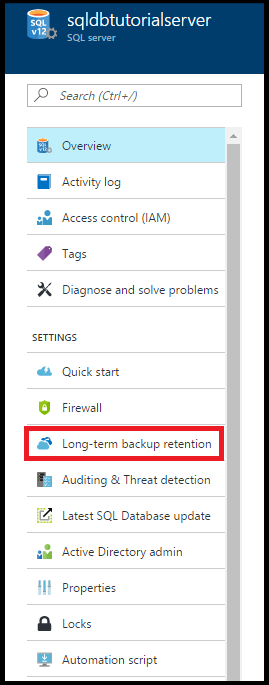

3. On the **Long-term backup retention** page for your server, review and accept the preview terms (unless you have already done so - or this feature is no longer in preview).

   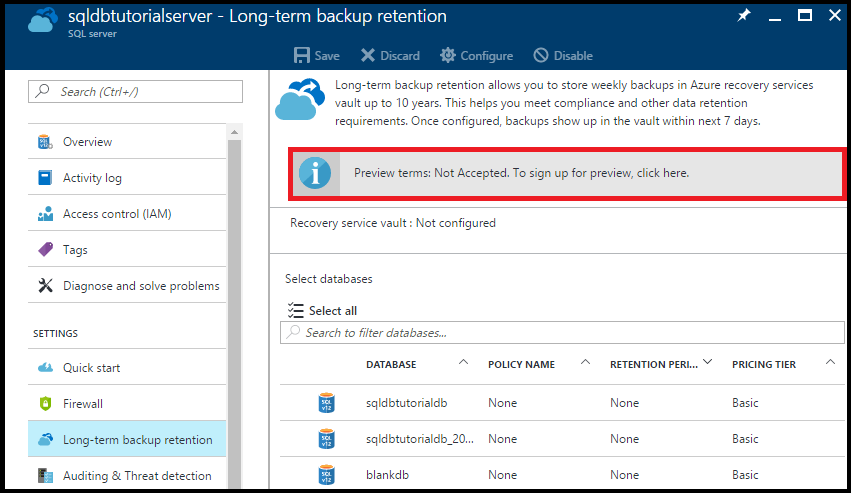

4. To configure long-term backup retention, select that database in the grid and then click **Configure** on the toolbar.

   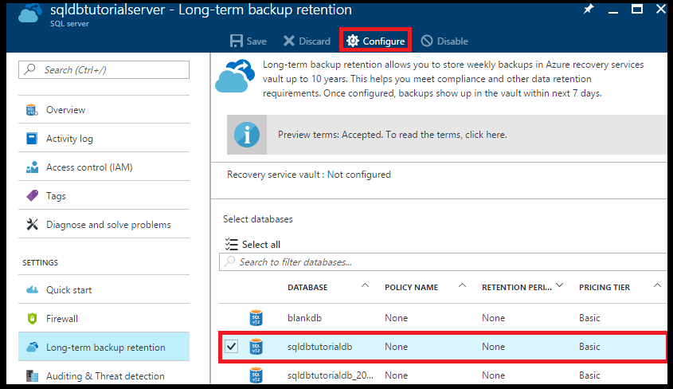

5. On the **Configure** page, click **Configure required settings** under **Recovery service vault**.

   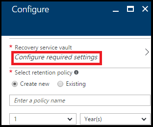

6. On the **Recovery services vault** page, select an existing vault, if any. Otherwise, if no recovery services vault found for your subscription, click to exit the flow and create a recovery services vault.

   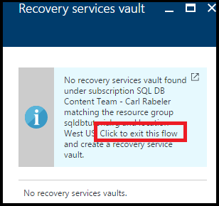

7. On the **Recovery Services vaults** page, click **Add**.

   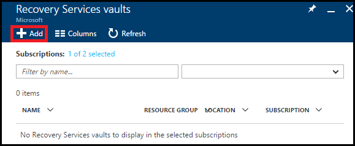

8. On the **Recovery Services vault** page, provide a valid name for the Recovery Services vault.

   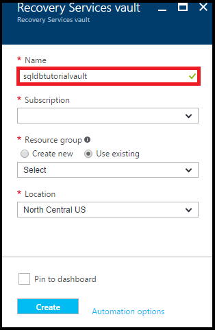

9. Select your subscription and resource group, and then select the location for the vault. When done, click **Create**.

   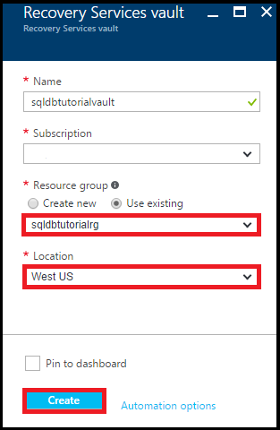

   > [!IMPORTANT]
   > The vault must be located in the same region as the Azure SQL logical server, and must use the same resource group as the logical server.

10. After the new vault is created, execute the necessary steps to return to the **Recovery services vault** page.

11. On the **Recovery services vault** page, click the vault and then click **Select**.

   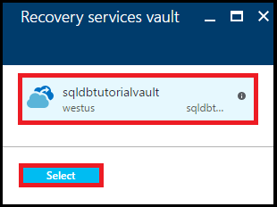

12. On the **Configure** page, provide a valid name for the new retention policy, modify the default retention policy as appropriate, and then click **OK**.

   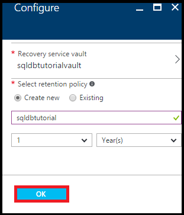

   > [!NOTE]
   > Retention policy names don't allow some characters, including spaces.

13. On the **Long-term backup retention** page for your database, click **Save** and then click **OK** to apply the long-term backup retention policy to all selected databases.

   

14. Click **Save** to enable long-term backup retention using this new policy to the Azure Recovery Services vault that you configured.

   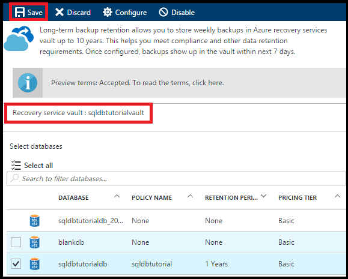

> [!IMPORTANT]
> Once configured, backups show up in the vault within next seven days. Do not continue this tutorial until backups show up in the vault.

### View backups in long-term retention using Azure portal

View information about your database backups in [long-term backup retention](sql-database-long-term-retention.md).

1. In the Azure portal, open your Azure Recovery Services vault for your database backups (go to **All resources** and select it from the list of resources for your subscription) to view the amount of storage used by your database backups in the vault.

   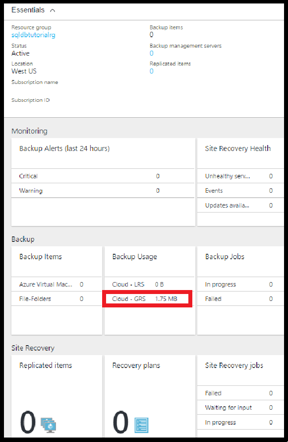

2. Open the **SQL database** page for your database.

   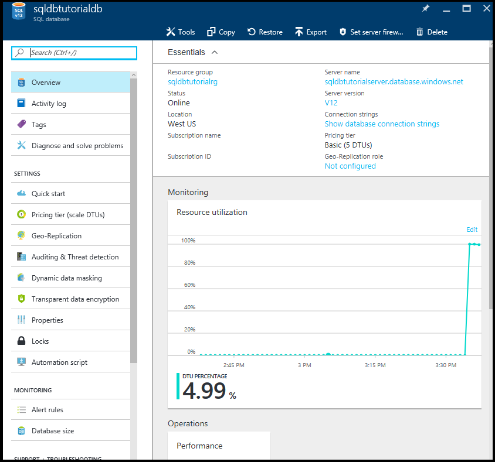

3. On the toolbar, click **Restore**.

   

4. On the Restore page, click **Long-term**.

5. Under Azure vault backups, click **Select a backup** to view the available database backups in long-term backup retention.

   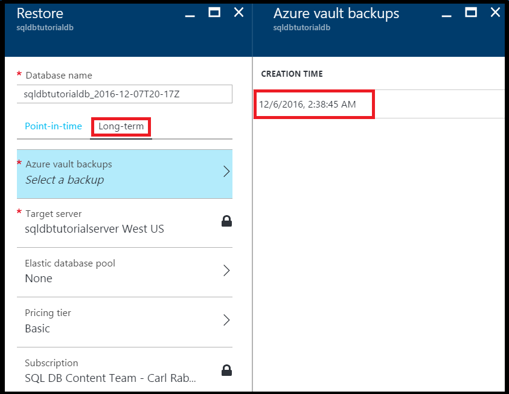

### Restore a database from a backup in long-term backup retention using the Azure portal

You restore the database to a new database from a backup in the Azure Recovery Services vault.

1. On the **Azure vault backups** page, click the backup to restore and then click **Select**.

   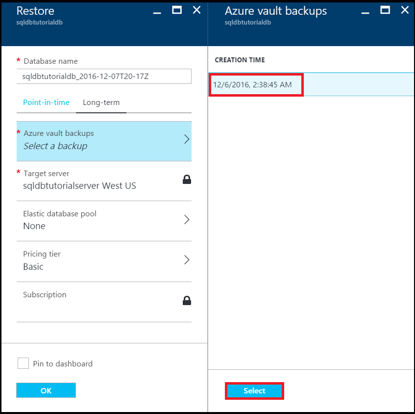

2. In the **Database name** text box, provide the name for the restored database.

   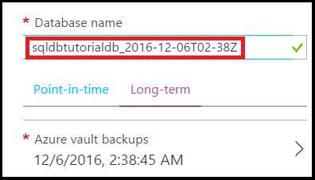

3. Click **OK** to restore your database from the backup in the vault to the new database.

4. On the toolbar, click the notification icon to view the status of the restore job.

   

5. When the restore job is completed, open the **SQL databases** page to view the newly restored database.

   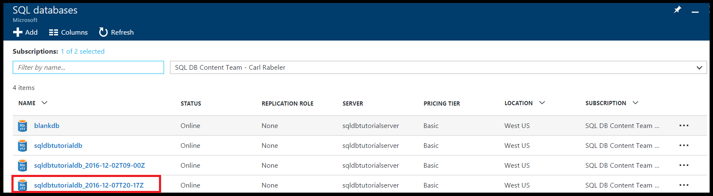

> [!NOTE]
> From here, you can connect to the restored database using SQL Server Management Studio to perform needed tasks, such as to [extract a bit of data from the restored database to copy into the existing database or to delete the existing database and rename the restored database to the existing database name](sql-database-recovery-using-backups.md#point-in-time-restore).
>

## PowerShell

The following sections show you how to use PowerShell to configure the Azure Recovery Services vault, view backups in the vault, and restore from the vault.

### Create a recovery services vault

Use the [New-AzureRmRecoveryServicesVault](/powershell/module/azurerm.recoveryservices/new-azurermrecoveryservicesvault) to create a recovery services vault.

> [!IMPORTANT]
> The vault must be located in the same region as the Azure SQL logical server, and must use the same resource group as the logical server.

```PowerShell
# Create a recovery services vault

#$resourceGroupName = "{resource-group-name}"
#$serverName = "{server-name}"
$serverLocation = (Get-AzureRmSqlServer -ServerName $serverName -ResourceGroupName $resourceGroupName).Location
$recoveryServiceVaultName = "{new-vault-name}"

$vault = New-AzureRmRecoveryServicesVault -Name $recoveryServiceVaultName -ResourceGroupName $ResourceGroupName -Location $serverLocation
Set-AzureRmRecoveryServicesBackupProperties -BackupStorageRedundancy LocallyRedundant -Vault $vault
```

### Set your server to use the recovery vault for its long-term retention backups

Use the [Set-AzureRmSqlServerBackupLongTermRetentionVault](/powershell/module/azurerm.sql/set-azurermsqlserverbackuplongtermretentionvault) cmdlet to associate a previously created recovery services vault with a specific Azure SQL server.

```PowerShell
# Set your server to use the vault to for long-term backup retention

Set-AzureRmSqlServerBackupLongTermRetentionVault -ResourceGroupName $resourceGroupName -ServerName $serverName -ResourceId $vault.Id
```

### Create a retention policy

A retention policy is where you set how long to keep a database backup. Use the [Get-AzureRmRecoveryServicesBackupRetentionPolicyObject](https://docs.microsoft.com/powershell/module/azurerm.recoveryservices.backup/get-azurermrecoveryservicesbackupretentionpolicyobject) cmdlet to get the default retention policy to use as the template for creating policies. In this template, the retention period is set for 2 years. Next, run the [New-AzureRmRecoveryServicesBackupProtectionPolicy](/powershell/module/azurerm.recoveryservices.backup/new-azurermrecoveryservicesbackupprotectionpolicy) to finally create the policy.

> [!NOTE]
> Some cmdlets require that you set the vault context before running ([Set-AzureRmRecoveryServicesVaultContext](/powershell/module/azurerm.recoveryservices/set-azurermrecoveryservicesvaultcontext)) so you see this cmdlet in a few related snippets. You set the context because the policy is part of the vault. You can create multiple retention policies for each vault and then apply the desired policy to specific databases.

```PowerShell
# Retrieve the default retention policy for the AzureSQLDatabase workload type
$retentionPolicy = Get-AzureRmRecoveryServicesBackupRetentionPolicyObject -WorkloadType AzureSQLDatabase

# Set the retention value to two years (you can set to any time between 1 week and 10 years)
$retentionPolicy.RetentionDurationType = "Years"
$retentionPolicy.RetentionCount = 2
$retentionPolicyName = "my2YearRetentionPolicy"

# Set the vault context to the vault you are creating the policy for
Set-AzureRmRecoveryServicesVaultContext -Vault $vault

# Create the new policy
$policy = New-AzureRmRecoveryServicesBackupProtectionPolicy -name $retentionPolicyName -WorkloadType AzureSQLDatabase -retentionPolicy $retentionPolicy
$policy
```

### Configure a database to use the previously defined retention policy

Use the [Set-AzureRmSqlDatabaseBackupLongTermRetentionPolicy](/powershell/module/azurerm.sql/set-azurermsqldatabasebackuplongtermretentionpolicy) cmdlet to apply the new policy to a specific database.

```PowerShell
# Enable long-term retention for a specific SQL database
$policyState = "enabled"
Set-AzureRmSqlDatabaseBackupLongTermRetentionPolicy -ResourceGroupName $resourceGroupName -ServerName $serverName -DatabaseName $databaseName -State $policyState -ResourceId $policy.Id
```

### View backup info, and backups in long-term retention

View information about your database backups in [long-term backup retention](sql-database-long-term-retention.md).

Use the following cmdlets to view backup information:

- [Get-AzureRmRecoveryServicesBackupContainer](/powershell/module/azurerm.recoveryservices.backup/get-azurermrecoveryservicesbackupcontainer)
- [Get-AzureRmRecoveryServicesBackupItem](/powershell/module/azurerm.recoveryservices.backup/get-azurermrecoveryservicesbackupitem)
- [Get-AzureRmRecoveryServicesBackupRecoveryPoint](/powershell/module/azurerm.recoveryservices.backup/get-azurermrecoveryservicesbackuprecoverypoint)

```PowerShell
#$resourceGroupName = "{resource-group-name}"
#$serverName = "{server-name}"
$databaseNeedingRestore = $databaseName

# Set the vault context to the vault we want to restore from
#$vault = Get-AzureRmRecoveryServicesVault -ResourceGroupName $resourceGroupName
Set-AzureRmRecoveryServicesVaultContext -Vault $vault

# the following commands find the container associated with the server 'myserver' under resource group 'myresourcegroup'
$container = Get-AzureRmRecoveryServicesBackupContainer -ContainerType AzureSQL -FriendlyName $vault.Name

# Get the long-term retention metadata associated with a specific database
$item = Get-AzureRmRecoveryServicesBackupItem -Container $container -WorkloadType AzureSQLDatabase -Name $databaseNeedingRestore

# Get all available backups for the previously indicated database
# Optionally, set the -StartDate and -EndDate parameters to return backups within a specific time period
$availableBackups = Get-AzureRmRecoveryServicesBackupRecoveryPoint -Item $item
$availableBackups
```

### Restore a database from a backup in long-term backup retention

Restoring from long-term backup retention uses the [Restore-AzureRmSqlDatabase](/powershell/module/azurerm.sql/restore-azurermsqldatabase) cmdlet.

```PowerShell
# Restore the most recent backup: $availableBackups[0]
#$resourceGroupName = "{resource-group-name}"
#$serverName = "{server-name}"
$restoredDatabaseName = "{new-database-name}"
$edition = "Basic"
$performanceLevel = "Basic"

$restoredDb = Restore-AzureRmSqlDatabase -FromLongTermRetentionBackup -ResourceId $availableBackups[0].Id -ResourceGroupName $resourceGroupName `
 -ServerName $serverName -TargetDatabaseName $restoredDatabaseName -Edition $edition -ServiceObjectiveName $performanceLevel
$restoredDb
```

> [!NOTE]
> From here, you can connect to the restored database using SQL Server Management Studio to perform needed tasks, such as to extract a bit of data from the restored database to copy into the existing database or to delete the existing database and rename the restored database to the existing database name. See [point in time restore](sql-database-recovery-using-backups.md#point-in-time-restore).

## How to cleanup backups in Recovery Services vault

As of July 1, 2018 the LTR V1 API has been deprecated and all your existing backups in Recovery Service vaults have been migrated to the LTR storage containers managed by SQL Database. To ensure that you are no longer charged for the original backups, they have been removed from the vaults after migration. However, if you placed a lock on your vault the backups will remain there. To avoid the unnecessary charges, you can manually remove the old backups from the Recovery Service vault using the following script.

```PowerShell
<#
.EXAMPLE
    .\Drop-LtrV1Backup.ps1 -SubscriptionId “{vault_sub_id}” -ResourceGroup “{vault_resource_group}” -VaultName “{vault_name}”
#>
[CmdletBinding()]
Param (
    [Parameter(Mandatory = $true, HelpMessage="The vault subscription ID")]
    $SubscriptionId,

    [Parameter(Mandatory = $true, HelpMessage="The vault resource group name")]
    $ResourceGroup,

    [Parameter(Mandatory = $true, HelpMessage="The vault name")]
    $VaultName
)

Login-AzureRmAccount

Select-AzureRmSubscription -SubscriptionId $SubscriptionId

$vaults = Get-AzureRmRecoveryServicesVault
$vault = $vaults | where { $_.Name -eq $VaultName }

Set-AzureRmRecoveryServicesVaultContext -Vault $vault

$containers = Get-AzureRmRecoveryServicesBackupContainer -ContainerType AzureSQL

ForEach ($container in $containers)
{
   $canDeleteContainer = $true
   $ItemCount = 0
   Write-Host "Working on container" $container.Name
   $items = Get-AzureRmRecoveryServicesBackupItem -container $container -WorkloadType AzureSQLDatabase
   ForEach ($item in $items)
   {
    write-host "Deleting item" $item.name
    Disable-AzureRmRecoveryServicesBackupProtection -RemoveRecoveryPoints -item $item -Force
   }

   Write-Host "Deleting container" $container.Name
   Unregister-AzureRmRecoveryServicesBackupContainer -Container $container
}
```

## Next steps

- To learn about service-generated automatic backups, see [automatic backups](sql-database-automated-backups.md)
- To learn about long-term backup retention, see [long-term backup retention](sql-database-long-term-retention.md)
- To learn about restoring from backups, see [restore from backup](sql-database-recovery-using-backups.md)
