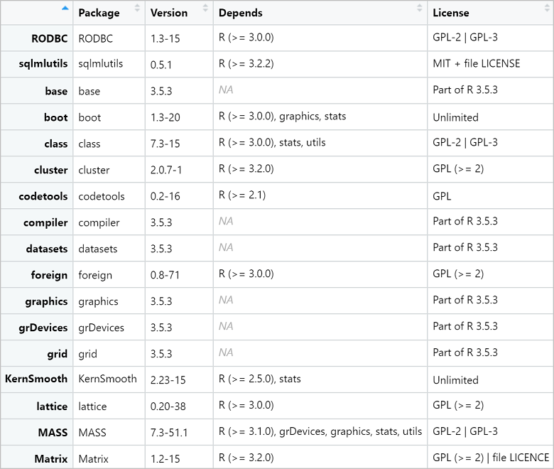
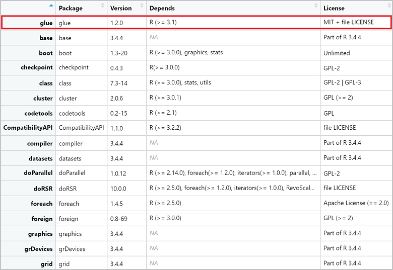

# Add an R package to Azure SQL Database Machine Learning Services (preview)

This article explains how to add an R package to Azure SQL Database Machine Learning Services (preview).

[!INCLUDE[ml-preview-note](../../includes/sql-database-ml-preview-note.md)]

## Prerequisites

- Install [R](https://www.r-project.org) and [RStudio Desktop](https://www.rstudio.com/products/rstudio/download/) on your local computer. R is available for Windows, MacOS, and Linux. This article assumes you're using Windows.

- This article includes an example of using [Azure Data Studio](https://docs.microsoft.com/sql/azure-data-studio/what-is) or [SQL Server Management Studio](https://docs.microsoft.com/sql/ssms/sql-server-management-studio-ssms) (SSMS) to run an R script in Azure SQL Database. You can run R scripts using other database management or query tools, but this example assumes Azure Data Studio or SSMS.
   
> [!NOTE]
> You can't install a package by running an R script using **sp_execute_external_script** in Azure Data Studio or SSMS. You can only install and remove packages using the R command line and RStudio as described in this article. Once the package is installed, you can access the package functions in an R script using **sp_execute_external_script**.

## List R packages

Microsoft provides a number of R packages pre-installed with Machine Learning Services in your Azure SQL database.
You can see a list of installed R packages by running the following command in Azure Data Studio or SSMS.

1. Open Azure Data Studio or SSMS and connect to your Azure SQL Database.

1. Run the following command:

```sql
EXECUTE sp_execute_external_script @language = N'R'
    , @script = N'
OutputDataSet <- data.frame(installed.packages()[,c("Package", "Version", "Depends", "License")]);'
WITH RESULT SETS((
            Package NVARCHAR(255)
            , Version NVARCHAR(100)
            , Depends NVARCHAR(4000)
            , License NVARCHAR(1000)
            ));
```

The output should look similar to the following.

**Results**



## Add a package with sqlmlutils

If you need to use a package that isn't already installed in your Azure SQL Database, you can install it using [sqlmlutils](https://github.com/Microsoft/sqlmlutils). **sqlmlutils** is a package designed to help users interact with SQL databases (SQL Server and Azure SQL Database) and execute R or Python code in SQL from an R or Python client. Currently, only the R version of **sqlmlutils** is supported in Azure SQL Database.

In the following example, you'll install the **[glue](https://cran.r-project.org/web/packages/glue/)** package that can format and interpolate strings. These steps install **sqlmlutils** and **RODBCext** (a prerequisite for **sqlmlutils**), and add the **glue** package.

### Install **sqlmlutils**

1. Download the latest **sqlmlutils** zip file from https://github.com/Microsoft/sqlmlutils/tree/master/R/dist to your local computer. You don't need to unzip the file.

1. Open a **Command Prompt** and run the following commands to install **RODBCext** and **sqlmlutils** on your local computer. Substitute the full path to the **sqlmlutils** zip file you downloaded (the example assumes the file is in your Documents folder).
    
    ```console
    R -e "install.packages('RODBCext', repos='https://cran.microsoft.com')"
    R CMD INSTALL %UserProfile%\Documents\sqlmlutils_0.5.1.zip
    ```

    The output you see should be similar to the following.

    ```text
    In R CMD INSTALL
    * installing to library 'C:/Users/<username>/Documents/R/win-library/3.5'
    package sqlmlutils successfully unpacked and MD5 sums checked
    ```

    > [!TIP]
    > If you get the error, " 'R' is not recognized as an internal or external command, operable program or batch file", it likely means that the path to R.exe is not included in your **PATH** environment variable on Windows. You can either add the path to the environment variable or navigate to the folder in the command prompt (for example `cd C:\Program Files\R\R-3.5.3\bin`) and then retry the command.

### Add the package

1. Open RStudio and create a new **R Script** file. 

1. Use the following R code to install the **glue** package using **sqlmlutils**. Substitute your own Azure SQL Database connection information.

    ```R
    library(sqlmlutils)
    connection <- connectionInfo(
    server= "yourserver.database.windows.net",
    database = "yourdatabase",
    uid = "yoursqluser",
    pwd = "yoursqlpassword")
    
    sql_install.packages(connectionString = connection, pkgs = "glue", verbose = TRUE, scope = "PUBLIC")
    ```

    > [!TIP]
    > The **scope** can be either **PUBLIC** or **PRIVATE**. Public scope is useful for the database administrator to install packages that all users can use. Private scope makes the package  available only to the user who installs it. If you don't specify the scope, the default scope is **PRIVATE**.

### Verify the package

Verify that the **glue** package has been installed by running the following R script in RStudio. Use the same **connection** you defined in the previous step.

```R
r<-sql_installed.packages(connectionString = connection, fields=c("Package", "Version", "Depends", "License"))
View(r)
```

**Results**



### Use the package

Once the package is installed, you can use it in an R script through **sp_execute_external_script**.

1. Open Azure Data Studio or SSMS and connect to your Azure SQL Database.

1. Run the following command:

    ```sql
    EXECUTE sp_execute_external_script @language = N'R'
        , @script = N'
    library(glue)
    
    name <- "Fred"
    age <- 50
    anniversary <- as.Date("2020-06-14")
    text <- glue(''My name is {name}, '',
    ''my age next year is {age + 1}, '',
    ''my anniversary is {format(anniversary, "%A, %B %d, %Y")}.'')
    
    print(text)
    ';
    ```

    You'll see the following result in the **Messages** tab.

    **Results**

    ```text
    My name is Fred, my age next year is 51, my anniversary is Sunday, June 14, 2020.
    ```

### Remove the package

If you would like to remove the package, run the following R script in RStudio. Use the same **connection** you defined earlier.

```R
sql_remove.packages(connectionString = connection, pkgs = "glue", scope = "PUBLIC")
```

> [!TIP]
> Another way to install an R package to your Azure SQL database is to upload the R package from a byte stream using the **CREATE EXTERNAL LIBRARY** T-SQL statement. See [Create a library from a byte stream](/sql/t-sql/statements/create-external-library-transact-sql#c-create-a-library-from-a-byte-stream) in the [CREATE EXTERNAL LIBRARY](https://docs.microsoft.com/sql/t-sql/statements/create-external-library-transact-sql) reference documentation.

## Next steps

For more information about Azure SQL Database Machine Learning Services with R (preview), see the following articles.

- [Azure SQL Database Machine Learning Services with R (preview)](sql-database-machine-learning-services-overview.md)
- [Write advanced R functions in Azure SQL Database using Machine Learning Services (preview)](sql-database-machine-learning-services-functions.md)
- [Work with R and SQL data in Azure SQL Database Machine Learning Services (preview)](sql-database-machine-learning-services-data-issues.md)