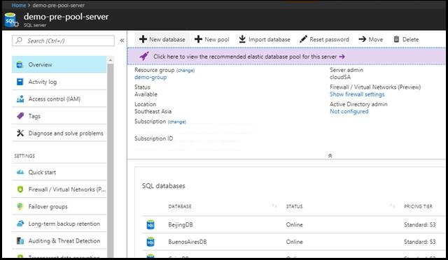
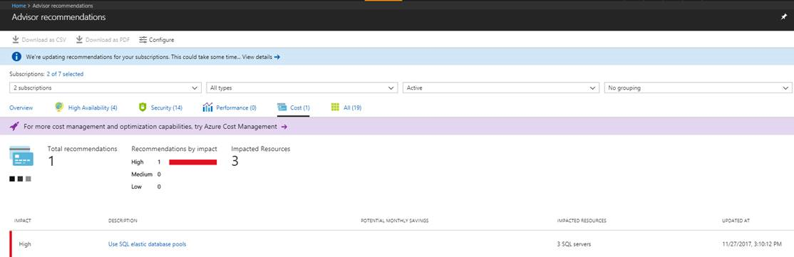
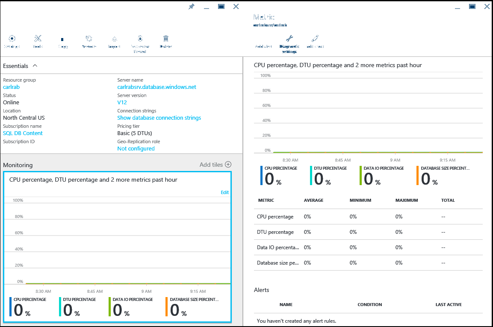
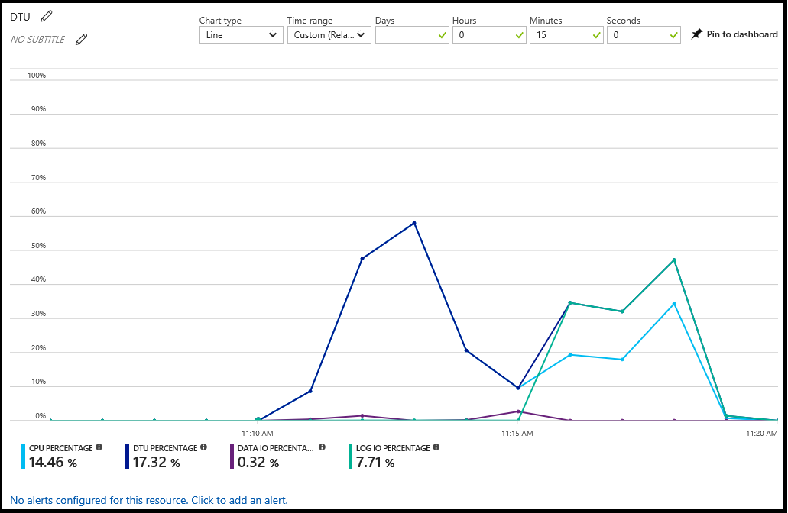
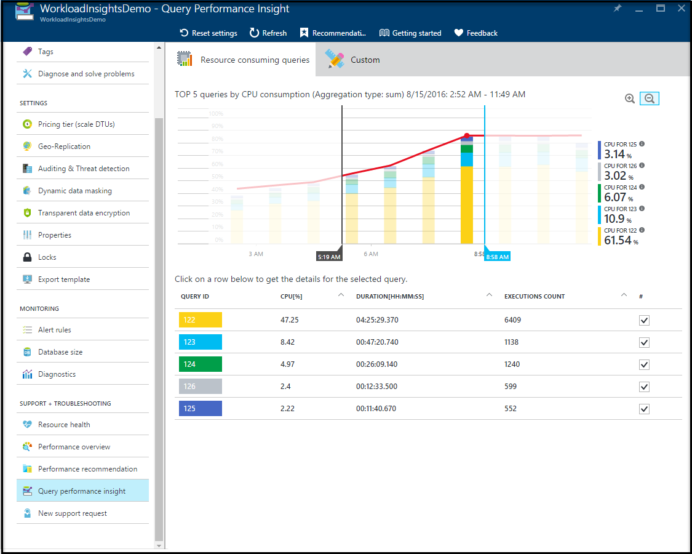
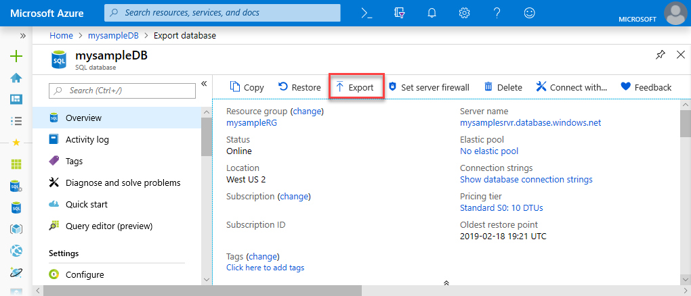
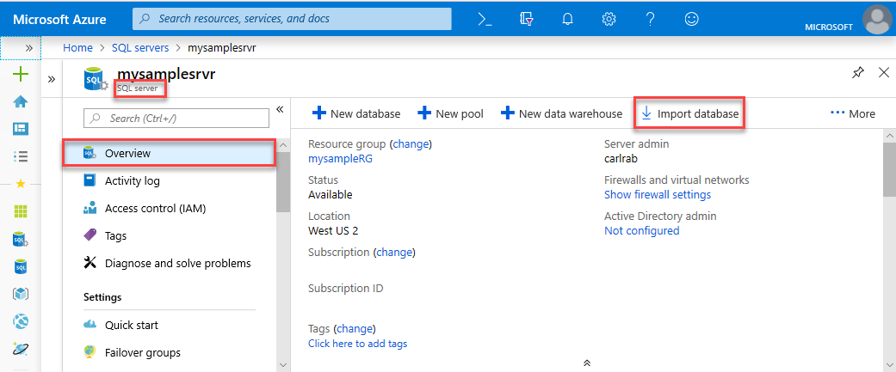

# New DBA in the cloud – Managing your single and pooled databases in Azure SQL Database

Moving from the traditional self-managed, self-controlled environment to a PaaS environment can seem a bit overwhelming at first. As an app developer or a DBA, you would want to know the core capabilities of the platform that would help you keep your application available, performant, secure and resilient - always. This article aims to do exactly that. The article succinctly organizes resources and gives you some guidance on how to best use the key capabilities of SQL Database with single and pooled databases to manage and keep your application running efficiently and achieve optimal results in the cloud. Typical audience for this article would be those who:

- Are evaluating migration of their application(s) to Azure SQL Database – Modernizing your application(s).
- Are In the process of migrating their application(s) – On-going migration scenario.
- Have recently completed the migration to Azure SQL DB – New DBA in the cloud.

This article discusses some of the core characteristics of Azure SQL Database as a platform that you can readily leverage when working with single databases and pooled databases in elastic pools. They are the following:

- Monitor database using the Azure portal
- Business continuity and disaster recovery (BCDR)
- Security and compliance
- Intelligent database monitoring and maintenance
- Data movement

> [!NOTE]
> This article applies to the following deployment options in Azure SQL Database: single databases and elastic pools. It does not apply to the managed instance deployment option in SQL Database.

## Monitor databases using the Azure portal

In the [Azure portal](https://portal.azure.com/), you can monitor an individual database’s utilization by selecting your database and clicking the **Monitoring** chart. This brings up a **Metric** window that you can change by clicking the **Edit chart** button. Add the following metrics:

- CPU percentage
- DTU percentage
- Data IO percentage
- Database size percentage

Once you've added these metrics, you can continue to view them in the **Monitoring** chart with more information on the **Metric** window. All four metrics show the average utilization percentage relative to the **DTU** of your database. See the [DTU-based purchasing model](sql-database-service-tiers-dtu.md) and [vCore-based purchasing model](sql-database-service-tiers-vcore.md) articles for more information about service tiers.  

You can also configure alerts on the performance metrics. Click the **Add alert** button in the **Metric** window. Follow the wizard to configure your alert. You have the option to alert if the metrics exceed a certain threshold or if the metric falls below a certain threshold.

For example, if you expect the workload on your database to grow, you can choose to configure an email alert whenever your database reaches 80% on any of the performance metrics. You can use this as an early warning to figure out when you might have to switch to the next highest compute size.

The performance metrics can also help you determine if you are able to downgrade to a lower compute size. Assume you are using a Standard S2 database and all performance metrics show that the database on average does not use more than 10% at any given time. It is likely that the database will work well in Standard S1. However, be aware of workloads that spike or fluctuate before making the decision to move to a lower compute size.

## Business continuity and disaster recovery (BCDR)

Business continuity and disaster recovery abilities enable you to continue your business, as usual, in case of a disaster. The disaster could be a database level event (for example, someone mistakenly drops a crucial table) or a data-center level event (regional catastrophe, for example a tsunami).

### How do I create and manage backups on SQL Database

You don’t create backups on Azure SQL DB and that is because you don’t have to. SQL Database automatically backs up databases for you, so you no longer must worry about scheduling, taking and managing backups. The platform takes a full backup every week, differential backup every few hours and a log backup every 5 minutes to ensure the disaster recovery is efficient, and the data loss minimal. The first full backup happens as soon as you create a database. These backups are available to you for a certain period called the “Retention Period” and varies according to the service tier you choose. SQL Database provides you the ability to restore to any point in time within this retention period using [Point in Time Recovery (PITR)](sql-database-recovery-using-backups.md#point-in-time-restore).

|Service tier|Retention period in days|
|---|:---:|
|Basic|7|
|Standard|35|
|Premium|35|
|||

In addition, the [Long-Term Retention (LTR)](sql-database-long-term-retention.md) feature allows you to hold onto your backup files for a much longer period specifically, for up to 10 years, and restore data from these backups at any point within that period. Furthermore, the database backups are kept in geo-replicated storage to ensure resilience from regional catastrophe. You can also restore these backups in any Azure region at any point of time within the retention period. See [Business continuity overview](sql-database-business-continuity.md).

### How do I ensure business continuity in the event of a datacenter-level disaster or regional catastrophe

Because your database backups are stored in geo-replicated storage to ensure that in case of a regional disaster, you can restore the backup to another Azure region. This is called geo-restore. The RPO (Recovery Point Objective) for this is generally < 1 hour and the ERT (Estimated Recovery Time – few minutes to hours).

For mission-critical databases, Azure SQL DB offers, active geo-replication. What this essentially does is that it creates a geo-replicated secondary copy of your original database in another region. For example, if your database is initially hosted in Azure West US region and you want regional disaster resilience. You’d create an active geo replica of the database in West US to say East US. When the calamity strikes on West US, you can fail over to the East US region. Configuring them in an auto-failover Group is even better because this ensures that the database automatically fails over to the secondary in East US in case of a disaster. The RPO for this is < 5 seconds and the ERT < 30 seconds.

If an auto-failover group is not configured, then your application needs to actively monitor for a disaster and initiate a failover to the secondary. You can create up to 4 such active geo-replicas in different Azure regions. It gets even better. You can also access these secondary active geo-replicas for read-only access. This comes in very handy to reduce latency for a geo-distributed application scenario.

### How does my disaster recovery plan change from on-premises to SQL Database

In summary, the traditional on-premises SQL Server setup required you to actively manage your Availability by using features such as Failover Clustering, Database Mirroring, Transaction Replication, or Log Shipping and maintain and manage backups to ensure Business Continuity. With SQL Database, the platform manages these for you, so you can focus on developing and optimizing your database application and not worry about disaster management as much. You can have backup and disaster recovery plans configured and working with just a few clicks on the Azure portal (or a few commands using the PowerShell APIs).

To learn more about Disaster recovery, see: [Azure SQL Db Disaster Recovery 101](https://azure.microsoft.com/blog/azure-sql-databases-disaster-recovery-101/)

## Security and compliance

SQL Database takes Security and Privacy very seriously. Security within SQL Database is available at the database level and at the platform level and is best understood when categorized into several layers. At each layer you get to control and provide optimal security for your application. The layers are:

- Identity & authentication ([Windows/SQL authentication and Azure Active Directory [AAD] authentication](sql-database-control-access.md)).
- Monitoring activity ([Auditing](sql-database-auditing.md) and [threat detection](sql-database-threat-detection.md)).
- Protecting actual data ([Transparent Data Encryption [TDE]](/sql/relational-databases/security/encryption/transparent-data-encryption-azure-sql) and [Always Encrypted [AE]](/sql/relational-databases/security/encryption/always-encrypted-database-engine)).
- Controlling Access to sensitive and privileged data ([Row Level security](/sql/relational-databases/security/row-level-security) and [Dynamic Data Masking](/sql/relational-databases/security/dynamic-data-masking)).

[Azure Security Center](https://azure.microsoft.com/services/security-center/) offers centralized security management across workloads running in Azure, on-premises, and in other clouds. You can view whether essential SQL Database protection such as [Auditing](sql-database-auditing.md) and [Transparent Data Encryption [TDE]](/sql/relational-databases/security/encryption/transparent-data-encryption-azure-sql) are configured on all resources, and create policies based on your own requirements.

### What user authentication methods are offered in SQL Database

There are [two authentication methods](sql-database-control-access.md#authentication) offered in SQL Database:

- [Azure Active Directory Authentication](sql-database-aad-authentication.md)
- SQL authentication

The traditional windows authentication is not supported. Azure Active Directory (AD) is a centralized identity and access management service. With this you can very conveniently provide a Single Sign-on Access (SSO) to all the personnel in your organization. What this means is that the credentials are shared across all Azure services for simpler authentication. AAD supports [MFA (Multi Factor Authentication)](sql-database-ssms-mfa-authentication.md) and with a [few clicks](../active-directory/hybrid/how-to-connect-install-express.md) AAD can be integrated with Windows Server Active Directory. SQL Authentication works exactly like you’ve been using it in the past. You provide a username/password and you can authenticate users to any database on a given SQL Database server. This also allows SQL Database and SQL Data Warehouse to offer multi-factor authentication and guest user accounts within an Azure AD domain. If you already have an Active Directory on-premises, you can federate the directory with Azure Active Directory to extend your directory to Azure.

|**If you...**|**SQL Database / SQL Data Warehouse**|
|---|---|
|Prefer not to use Azure Active Directory (AD) in Azure|Use [SQL authentication](sql-database-security-overview.md)|
|Used AD on SQL Server on-premises|[Federate AD with Azure AD](../active-directory/hybrid/whatis-hybrid-identity.md), and use Azure AD authentication. With this, you can use Single Sign-On.|
|Need to enforce multi-factor authentication (MFA)|Require MFA as a policy through [Microsoft Conditional Access](sql-database-conditional-access.md), and use [Azure AD Universal authentication with MFA support](sql-database-ssms-mfa-authentication.md).|
|Have guest accounts from Microsoft accounts (live.com, outlook.com) or other domains (gmail.com)|Use [Azure AD Universal authentication](sql-database-ssms-mfa-authentication.md) in SQL Database/Data Warehouse, which leverages [Azure AD B2B Collaboration](../active-directory/active-directory-b2b-what-is-azure-ad-b2b.md).|
|Are logged in to Windows using your Azure AD credentials from a federated domain|Use [Azure AD integrated authentication](sql-database-aad-authentication-configure.md).|
|Are logged in to Windows using credentials from a domain not federated with Azure|Use [Azure AD integrated authentication](sql-database-aad-authentication-configure.md).|
|Have middle-tier services which need to connect to SQL Database or SQL Data Warehouse|Use [Azure AD integrated authentication](sql-database-aad-authentication-configure.md).|
|||

### How do I limit or control connectivity access to my database

There are multiple techniques at your disposal that you could use to attain optimal connectivity organization for your application.

- Firewall Rules
- VNet Service Endpoints
- Reserved IPs

#### Firewall

A firewall prevents access to your server from an external entity by allowing only specific entities access to your SQL Database server. By default, all connections and databases inside the SQL Database server are disallowed, except connections coming in from other Azure Services. With a firewall rule you can open access to your server only to entities (for example, a developer machine) that you approve of, by allowing that computer’s IP address through the firewall. It also allows you to specify a range of IPs that you would want to allow access to the SQL Database server. For example, developer machine IP addresses in your organization can be added at once by specifying a range in the Firewall settings page.

You can create firewall rules at the server level or at the database level. Server level IP firewall rules can either be created using the Azure portal or with SSMS. For learning more about how to set a server-level and database-level firewall rule, see: [Create IP firewall rules in SQL Database](sql-database-security-tutorial.md#create-firewall-rules).

#### Service endpoints

By default, your SQL database is configured to “Allow Azure services to access server” – which means any Virtual Machine in Azure may attempt to connect to your database. These attempts still do have to get authenticated. However, if you would not like your database to be accessible by any Azure IPs, you can disable “Allow Azure services to access server”. Additionally, you can configure [VNet Service Endpoints](sql-database-vnet-service-endpoint-rule-overview.md).

Service endpoints (SE) allow you to expose your critical Azure resources only to your own private virtual network in Azure. By doing so, you essentially eliminate public access to your resources. The traffic between your virtual network to Azure stays on the Azure backbone network. Without SE you get forced-tunneling packet routing. Your virtual network forces the internet traffic to your organization and the Azure Service traffic to go over the same route. With Service Endpoints, you can optimize this since the packets flow straight from your virtual network to the service on Azure backbone network.

#### Reserved IPs

Another option is to provision [reserved IPs](../virtual-network/virtual-networks-reserved-public-ip.md) for your VMs, and whitelist those specific VM IP addresses in the server firewall settings. By assigning reserved IPs, you save the trouble of having to update the firewall rules with changing IP addresses.

### What port do I connect to SQL Database on

Port 1433. SQL Database communicates over this port. To connect from within a corporate network, you have to add an outbound rule in the firewall settings of your organization. As a guideline, avoid exposing port 1433 outside the Azure boundary.

### How can I monitor and regulate activity on my server and database in SQL Database

#### SQL Database Auditing

With SQL Database, you can turn ON Auditing to track database events. [SQL Database Auditing](sql-database-auditing.md) records database events and writes them into an audit log file in your Azure Storage Account. Auditing is especially useful if you intend to gain insight into potential security and policy violations, maintain regulatory compliance etc. It allows you to define and configure certain categories of events that you think need auditing and based on that you can get preconfigured reports and a dashboard to get an overview of events occurring on your database. You can apply these auditing policies either at the database level or at the server level. A guide on how to turn on auditing for your server/database, see: [Enable SQL Database Auditing](sql-database-security-tutorial.md#enable-security-features).

#### Threat detection

With [threat detection](sql-database-threat-detection.md), you get the ability to act upon security or policy violations discovered by Auditing very easily. You don’t need to be a security expert to address potential threats or violations in your system. Threat detection also has some built-in capabilities like SQL Injection detection. SQL Injection is an attempt to alter or compromise the data and a quite common way of attacking a database application in general. Threat detection runs multiple sets of algorithms which detect potential vulnerabilities and SQL injection attacks, as well as anomalous database access patterns (such as access from an unusual location or by an unfamiliar principal). Security officers or other designated administrators receive an email notification if a threat is detected on the database. Each notification provides details of the suspicious activity and recommendations on how to further investigate and mitigate the threat. To learn how to turn on Threat detection, see: [Enable threat detection](sql-database-security-tutorial.md#enable-security-features).

### How do I protect my data in general on SQL Database

Encryption provides a strong mechanism to protect and secure your sensitive data from intruders. Your encrypted data is of no use to the intruder without the decryption key. Thus, it adds an extra layer of protection on top of the existing layers of security built in SQL Database. There are two aspects to protecting your data in SQL Database:

- Your data that is at-rest in the data and log files
- Your data that is in-flight

In SQL Database, by default, your data at rest in the data and log files on the storage subsystem is completely and always encrypted via [Transparent Data Encryption [TDE]](/sql/relational-databases/security/encryption/transparent-data-encryption-azure-sql). Your backups are also encrypted. With TDE there are no changes required on your application side that is accessing this data. The encryption and decryption happen transparently; hence the name.
For protecting your sensitive data in-flight and at rest, SQL Database provides a feature called [Always Encrypted (AE)](/sql/relational-databases/security/encryption/always-encrypted-database-engine). AE is a form of client-side encryption which encrypts sensitive columns in your database (so they are in ciphertext to database administrators and unauthorized users). The server receives the encrypted data to begin with. The key for Always Encrypted is also stored on the client side, so only authorized clients can decrypt the sensitive columns. The server and data administrators cannot see the sensitive data since the encryption keys are stored on the client. AE encrypts sensitive columns in the table end to end, from unauthorized clients to the physical disk. AE supports equality comparisons today, so DBAs can continue to query encrypted columns as part of their SQL commands. Always Encrypted can be used with a variety of key store options, such as [Azure Key Vault](sql-database-always-encrypted-azure-key-vault.md), Windows certificate store, and local hardware security modules.

|**Characteristics**|**Always Encrypted**|**Transparent Data Encryption**|
|---|---|---|
|**Encryption span**|End-to-end|At-rest data|
|**Database server can access sensitive data**|No|Yes, since encryption is for the data at rest|
|**Allowed T-SQL operations**|Equality comparison|All T-SQL surface area is available|
|**App changes required to use the feature**|Minimal|Very Minimal|
|**Encryption granularity**|Column level|Database level|
||||

### How can I limit access to sensitive data in my database

Every application has a certain bit of sensitive data in the database that needs to be protected from being visible to everyone. Certain personnel within the organization need to view this data, however others shouldn’t be able to view this data. One example is employee wages. A manager would need access to the wage information for their direct reports however, the individual team members shouldn’t have access to the wage information of their peers. Another scenario is data developers who might be interacting with sensitive data during development stages or testing, for example, SSNs of customers. This information again doesn’t need to be exposed to the developer. In such cases, your sensitive data either needs to be masked or not be exposed at all. SQL Database offers two such approaches to prevent unauthorized users from being able to view sensitive data:

[Dynamic Data Masking](sql-database-dynamic-data-masking-get-started.md) is a data masking feature that enables you to limit sensitive data exposure by masking it to non-privileged users on the application layer. You define a masking rule that can create a masking pattern (for example, to only show last four digits of a national ID SSN: XXX-XX-0000 and mark most of it as Xs) and identify which users are to be excluded from the masking rule. The masking happens on-the-fly and there are various masking functions available for various data categories. Dynamic data masking allows you to automatically detect sensitive data in your database and apply masking to it.

[Row Level security](/sql/relational-databases/security/row-level-security) enables you to control access at the row level. Meaning, certain rows in a database table based on the user executing the query (group membership or execution context) are hidden. The access restriction is done on the database tier instead of in an application tier, to simplify your app logic. You start by creating a filter predicate, filtering out rows that are not be exposed and the security policy next defining who has access to these rows. Finally, the end user runs their query and, depending on the user’s privilege, they either view those restricted rows or are unable to see them at all.

### How do I manage encryption keys in the cloud

There are key management options for both Always Encrypted (client-side encryption) and Transparent Data Encryption (encryption at rest). It’s recommended that you regularly rotate encryption keys. The rotation frequency should align with both your internal organization regulations and compliance requirements.

#### Transparent Data Encryption (TDE)

There is a two-key hierarchy in TDE – the data in each user database is encrypted by a symmetric AES-256 database-unique database encryption key (DEK), which in turn is encrypted by a server-unique asymmetric RSA 2048 master key. The master key can be managed either:

- Automatically by the platform - SQL Database.
- Or by you using [Azure Key Vault](sql-database-always-encrypted-azure-key-vault.md) as the key store.

By default, the master key for Transparent Data Encryption is managed by the SQL Database service for convenience. If your organization would like control over the master key, there is an option to use Azure Key Vault](sql-database-always-encrypted-azure-key-vault.md) as the key store. By using Azure Key Vault, your organization assumes control over key provisioning, rotation, and permission controls. [Rotation or switching the type of a TDE master key](/sql/relational-databases/security/encryption/transparent-data-encryption-byok-azure-sql-key-rotation) is fast, as it only re-encrypts the DEK. For organizations with separation of roles between security and data management, a security admin could provision the key material for the TDE master key in Azure Key Vault and provide an Azure Key Vault key identifier to the database administrator to use for encryption at rest on a server. The Key Vault is designed such that Microsoft does not see or extract any encryption keys. You also get a centralized management of keys for your organization.

#### Always Encrypted

There is also a [two-key hierarchy](/sql/relational-databases/security/encryption/overview-of-key-management-for-always-encrypted) in Always Encrypted - a column of sensitive data is encrypted by an AES 256-column encryption key (CEK), which in turn is encrypted by a column master key (CMK). The client drivers provided for Always Encrypted have no limitations on the length of CMKs. The encrypted value of the CEK is stored on the database, and the CMK is stored in a trusted key store, such as Windows Certificate Store, Azure Key Vault, or a hardware security module.

- Both the [CEK and CMK](/sql/relational-databases/security/encryption/rotate-always-encrypted-keys-using-powershell) can be rotated.
- CEK rotation is a size of data operation and can be time-intensive depending on the size of the tables containing the encrypted columns. Hence it is prudent to plan CEK rotations accordingly.
- CMK rotation, however, does not interfere with database performance, and can be done with separated roles.

The following diagram shows the key store options for the column master keys in Always Encrypted

### How can I optimize and secure the traffic between my organization and SQL Database

The network traffic between your organization and SQL Database would generally get routed over the public network. However, if you choose to optimize this path and make it more secure, you can look into Express Route. Express route essentially lets you extend your corporate network into the Azure platform over a private connection. By doing so, you do not go over the public Internet. You also get higher security, reliability, and routing optimization that translates to lower network latencies and much faster speeds than you would normally experience going over the public internet. If you are planning on transferring a significant chunk of data between your organization and Azure, using Express Route can yield cost benefits. You can choose from three different connectivity models for the connection from your organization to Azure:

- [Cloud Exchange Co-location](../expressroute/expressroute-connectivity-models.md#CloudExchange)
- [Any-to-any](../expressroute/expressroute-connectivity-models.md#IPVPN)
- [Point-to-Point](../expressroute/expressroute-connectivity-models.md#Ethernet)

Express Route also allows you to burst up to 2x the bandwidth limit you purchase for no additional charge. It is also possible to configure cross region connectivity using Express route. To see a list of ER connectivity providers, see: [Express Route Partners and Peering Locations](../expressroute/expressroute-locations.md). The following articles describe Express Route in more detail:

- [Introduction on Express Route](../expressroute/expressroute-introduction.md)
- [Prerequisites](../expressroute/expressroute-prerequisites.md)
- [Workflows](../expressroute/expressroute-workflows.md)

### Is SQL Database compliant with any regulatory requirements, and how does that help with my own organization's compliance

SQL Database is compliant with a range of regulatory compliances. To view the latest set of compliances that have been met by SQL Database, visit the [Microsoft Trust Center](https://gallery.technet.microsoft.com/Overview-of-Azure-c1be3942) and drill down on the compliances that are important to your organization to see if SQL Database is included under the compliant Azure services. It is important to note that although SQL Database may be certified as a compliant service, it aids in the compliance of your organization’s service but does not automatically guarantee it.

## Intelligent database monitoring and maintenance after migration

Once you’ve migrated your database to SQL Database, you are going to want to monitor your database (for example, check how the resource utilization is like or DBCC checks) and perform regular maintenance (for example, rebuild or reorganize indexes, statistics etc.). Fortunately, SQL Database is Intelligent in the sense that it uses the historical trends and recorded metrics and statistics to proactively help you monitor and maintain your database, so that your application runs optimally always. In some cases, Azure SQL DB can automatically perform maintenance tasks depending on your configuration setup. There are three facets to monitoring your database in SQL Database:

- Performance monitoring and optimization.
- Security optimization.
- Cost optimization.

### Performance monitoring and optimization

With Query Performance Insights, you can get tailored recommendations for your database workload so that your applications can keep running at an optimal level - always. You can also set it up so that these recommendations get applied automatically and you do not have to bother performing maintenance tasks. With Index Advisor, you can automatically implement index recommendations based on your workload - this is called Auto-Tuning. The recommendations evolve as your application workload changes to provide you with the most relevant suggestions. You also get the option to manually review these recommendations and apply them at your discretion.  

### Security optimization

SQL Database provides actionable security recommendations to help you secure your data and threat detection for identifying and investigating suspicious database activities that may pose a potential thread to the database. [Vulnerability assessment](sql-vulnerability-assessment.md) is a database scanning and reporting service that allows you to monitor the security state of your databases at scale and identify security risks and drift from a security baseline defined by you. After every scan, a customized list of actionable steps and remediation scripts is provided, as well as an assessment report that can be used to help meet compliance requirements.

With Azure Security Center, you identify the security recommendations across the board and apply them with a single click.

### Cost optimization

Azure SQL platform analyzes the utilization history across the databases in a server to evaluate and recommend cost-optimization options for you. This analysis usually takes a fortnight to analyze and build up actionable recommendations. Elastic pool is one such option. The recommendation appears on the portal as a banner:

You can also view this analysis under the “Advisor” section:

### How do I monitor the performance and resource utilization in SQL Database

In SQL Database you can leverage the intelligent insights of the platform to monitor the performance and tune accordingly. You can monitor performance and resource utilization in SQL Database using the following methods:

#### Azure portal

The Azure portal shows a database’s utilization by selecting the database and clicking the chart in the Overview pane. You can modify the chart to show multiple metrics, including CPU percentage, DTU percentage, Data IO percentage, Sessions percentage, and Database size percentage.

From this chart, you can also configure alerts by resource. These alerts allow you to respond to resource conditions with an email, write to an HTTPS/HTTP endpoint or perform an action. For more information, see [Create alerts](sql-database-insights-alerts-portal.md).

#### Dynamic Management Views

You can query the [sys.dm_db_resource_stats](/sql/relational-databases/system-dynamic-management-views/sys-dm-db-resource-stats-azure-sql-database) dynamic management view to return resource consumption statistics history from the last hour and the [sys.resource_stats](/sql/relational-databases/system-catalog-views/sys-resource-stats-azure-sql-database) system catalog view to return history for the last 14 days.

#### Query Performance Insight

[Query Performance Insight](sql-database-query-performance.md) allows you to see a history of the top resource-consuming queries and long-running queries for a specific database. You can quickly identify TOP queries by resource utilization, duration, and frequency of execution. You can track queries and detect regression. This feature requires [Query Store](/sql/relational-databases/performance/monitoring-performance-by-using-the-query-store) to be enabled and active for the database.

#### Azure SQL Analytics (Preview) in Azure Monitor logs

[Azure Monitor logs](../azure-monitor/insights/azure-sql.md) allows you to collect and visualize key Azure SQL Azure performance metrics, supporting up to 150,000 SQL Databases and 5,000 SQL Elastic pools per workspace. You can use it to monitor and receive notifications. You can monitor SQL Database and elastic pool metrics across multiple Azure subscriptions and elastic pools and can be used to identify issues at each layer of an application stack.

### I am noticing performance issues: How does my SQL Database troubleshooting methodology differ from SQL Server

A major portion of the troubleshooting techniques you would use for diagnosing query and database performance issues remain the same. After all the same SQL Server engine powers the cloud. However, the platform - Azure SQL DB has built in ‘intelligence’. It can help you troubleshoot and diagnose performance issues even more easily. It can also perform some of these corrective actions on your behalf and in some cases, proactively fix them - automatically.

Your approach towards troubleshooting performance issues can significantly benefit by using intelligent features such as [Query Performance Insight(QPI)](sql-database-query-performance.md) and [Database Advisor](sql-database-advisor.md) in conjunction and so the difference in methodology differs in that respect – you no longer need to do the manual work of grinding out the essential details that might help you troubleshoot the issue at hand. The platform does the hard work for you. One example of that is QPI. With QPI, you can drill all the way down to the query level and look at the historical trends and figure out when exactly the query regressed. The Database Advisor gives you recommendations on things that might help you improve your overall performance in general like - missing indexes, dropping indexes, parameterizing your queries etc.

With performance troubleshooting, it is important to identify whether it is just the application or the database backing it, that’s impacting your application performance. Often the performance problem lies in the application layer. It could be the architecture or the data access pattern. For example, consider you have a chatty application that is sensitive to network latency. In this case, your application suffers because there would be many short requests going back and forth ("chatty") between the application and the server and on a congested network, these roundtrips add up fast. To improve the performance in this case, you can use [Batch Queries](sql-database-performance-guidance.md#batch-queries). Using batches helps you tremendously because now your requests get processed in a batch; thus, helping you cut down on the roundtrip latency and improve your application performance.

Additionally, if you notice a degradation in the overall performance of your database, you can monitor the [sys.dm_db_resource_stats](/sql/relational-databases/system-dynamic-management-views/sys-dm-db-resource-stats-azure-sql-database) and [sys.resource_stats](/sql/relational-databases/system-catalog-views/sys-resource-stats-azure-sql-database) dynamic management views in order to understand CPU, IO, and memory consumption. Your performance maybe impacted because your database is starved of resources. It could be that you may need to change the compute size and/or service tier based on the growing and shrinking workload demands.

For a comprehensive set of recommendations for tuning performance issues, see: [Tune your database](sql-database-performance-guidance.md#tune-your-database).

### How do I ensure I am using the appropriate service tier and compute size

SQL Database offers various service tiers Basic, Standard, and Premium. Each service tier you get a guaranteed predictable performance tied to that service tier. Depending on your workload, you may have bursts of activity where your resource utilization might hit the ceiling of the current compute size that you are in. In such cases, it is useful to first start by evaluating whether any tuning can help (for example, adding or altering an index etc.). If you still encounter limit issues, consider moving to a higher service tier or compute size.

|**Service tier**|**Common Use Case Scenarios**|
|---|---|
|**Basic**|Applications with a handful users and a database that doesn’t have high concurrency, scale, and performance requirements. |
|**Standard**|Applications with a considerable concurrency, scale, and performance requirements coupled with low to medium IO demands. |
|**Premium**|Applications with lots of concurrent users, high CPU/memory, and high IO demands. High concurrency, high throughput, and latency sensitive apps can leverage the Premium level. |
|||

For making sure you’re on the right compute size, you can monitor your query and database resource consumption through one of the above-mentioned ways in “How do I monitor the performance and resource utilization in SQL Database”. Should you find that your queries/databases are consistently running hot on CPU/Memory etc. you can consider scaling up to a higher compute size. Similarly, if you note that even during your peak hours, you don’t seem to use the resources as much; consider scaling down from the current compute size.

If you have a SaaS app pattern or a database consolidation scenario, consider using an Elastic pool for cost optimization. Elastic pool is a great way to achieve database consolidation and cost-optimization. To read more about managing multiple databases using elastic pool, see: [Manage pools and databases](sql-database-elastic-pool-manage.md#azure-portal-manage-elastic-pools-and-pooled-databases).

### How often do I need to run database integrity checks for my database

SQL Database uses some smart techniques that allow it to handle certain classes of data corruption automatically and without any data loss. These techniques are built in to the service and are leveraged by the service when need arises. On a regular basis, your database backups across the service are tested by restoring them and running DBCC CHECKDB on it. If there are issues, SQL Database proactively addresses them. [Automatic page repair](/sql/sql-server/failover-clusters/automatic-page-repair-availability-groups-database-mirroring) is leveraged for fixing pages that are corrupt or have data integrity issues. The database pages are always verified with the default CHECKSUM setting that verifies the integrity of the page. SQL Database proactively monitors and reviews the data integrity of your database and, if issues arise, addresses them with the highest priority. In addition to these, you may choose to optionally run your own integrity checks at your will.  For more information, see [Data Integrity in SQL Database](https://azure.microsoft.com/blog/data-integrity-in-azure-sql-database/)

## Data movement after migration

### How do I export and import data as BACPAC files from SQL Database

- **Export**: You can export your Azure SQL database as a BACPAC file from the Azure portal

   

- **Import**: You can also import data as a BACPAC file into the database using the Azure portal.

   

### How do I synchronize data between SQL Database and SQL Server

You have several ways to achieve this:

- **[Data Sync](sql-database-sync-data.md)** – This feature helps you synchronize data bi-directionally between multiple on-premises SQL Server databases and SQL Database. To sync with on-premises SQL Server databases, you need to install and configure sync agent on a local computer and open the outbound TCP port 1433.
- **[Transaction Replication](https://azure.microsoft.com/blog/transactional-replication-to-azure-sql-database-is-now-generally-available/)** – With transaction replication you can synchronize your data from on-premises to Azure SQL DB with the on-premises being the publisher and the Azure SQL DB being the subscriber. For now, only this setup is supported. For more information on how to migrate your data from on-premises to Azure SQL with minimal downtime, see: [Use Transaction Replication](sql-database-single-database-migrate.md#method-2-use-transactional-replication)

## Next steps

Learn about [SQL Database](sql-database-technical-overview.md).
