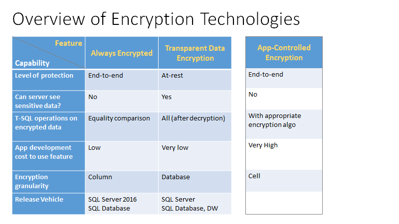
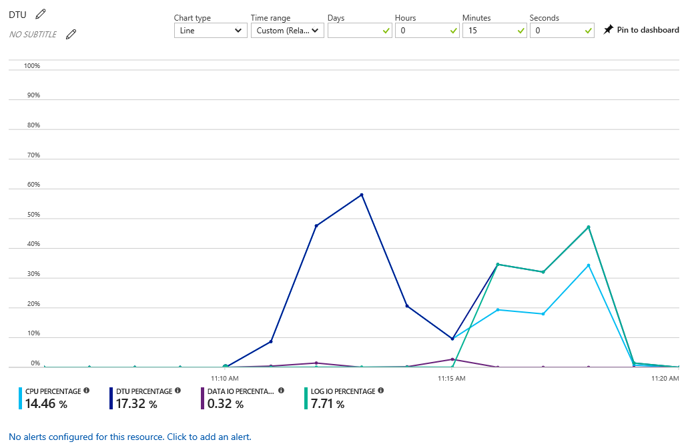

# How should I manage my Azure SQL database after migration?

*Frequently asked questions around managing your Azure SQL Database investments*

So you’ve recently moved SQL Server databases to Azure SQL Database, or perhaps you’re planning on moving very soon. Once you’ve moved, what’s next? Given that SQL Database is a *Platform as a Service*, Microsoft handles several areas on your behalf. But how exactly does this change your company’s practices around key areas such as security, business continuity, database maintenance, performance tuning, monitoring and more? 

The purpose of this article is to succinctly organize resources and guidance that you’ll need for making the shift to managing your SQL Database investments. The major areas in this article cover business continuity, security, database maintenance and monitoring, performance and data movement. We’ll cover key areas that are different between SQL Server and SQL Database, and call out operational best practices that will help you maximize benefits and minimize risk. 

## Manage business continuity after migration

### How do I create and manage backups on SQL Database? 
SQL Database automatically backs up databases for you and provides you the ability to restore to any point in time in the retention period. The retention period is 35 days for Standard and Premium databases and 7 days for Basic databases. In addition, the Long-Term Retention feature allows you to hold backup files for a longer period (up to 10 years), and restore from these backups at any point. Furthermore, the database backups are geo-replicated to ensure the ability to geo-restore in any region in the event of a disaster or regional catastrophe. See [Business continuity overview](sql-database-business-continuity.md).

### How do I ensure business continuity in the event of a datacenter-level disaster or a regional catastrophe? 

Database backups are geo-replicated to ensure the ability to geo-restore in any region in the event of a disaster or regional catastrophe. See [Business continuity overview](sql-database-business-continuity.md). In addition, SQL Database provides the capability to maintain actively geo-replicated secondary databases in another region. Configuring them in an Auto-Failover Group will ensure that the databases automatically fail over to the secondary in a disaster scenario. If an auto-failover group is not configured, then your application needs to actively monitor for a disaster and initiate a failover to the secondary. 
### SQL Server provided me Readable Secondary Replicas, can I access the secondaries on SQL Database? 

Yes, the ‘Active Geo Replication’ feature is used to create Readable Secondary Replicas. 

### How does my disaster recovery plan change from on-premise to SQL Database? 
SQL Server implementations required you to actively manage backups using features such as Failover Clustering, Database Mirroring, Replication, Log Shipping or just plain vanilla BACPAC backups. However, on SQL Database, backups are fully managed by Microsoft and you only can have backup and disaster recovery plans configured and working with just a few clicks on the Azure portal (or few commands on PowerShell). 
‌
### In the event of disaster, how do I recover my databases? 
SQL Database automatically lets you restore your databases to any point in time in the last 35 days. This is an option if you lose data or face an application-related disaster. 

In case you face a regional disaster, if the geo-replicated secondary databases are configured, you can recover from your geo-secondary databases in another region. For real-time access to your applications, you can fail over to the geo-secondary in the other region manually. Alternatively, if you have auto-failover group configured, this failover to a geo-secondary happens automatically in a disaster scenario. If you don’t have geo-replicated secondary database configured, you can still recover your databases from automatic replicated backup files (built-in functionality, configuration is not needed), with relatively longer recovery time (12 hours RTO) and up to one hour data loss. 

### Are the failovers to secondary transparent? How does my application handle database failovers? 
If you have auto-failover groups configured, then the failover to secondary is transparent. However, if you have not, then your application needs to incorporate the logic to monitor availability of the primary and then manually fail over to the secondary. 
 
## Manage security after migration

### How can I restrict access to my SQL Database? 
 
There are a few ways to lock down connectivity access to your SQL databases. 
1. Limit traffic over the Internet 
Express Route gives you dedicated fiber to the Azure network so that your data does not travel over the internet. It is also possible to configure cross region connectivity using Express route. The following links describe Express Route in more detail: 
 - [Introduction on Express Route](../expressroute/expressroute-introduction.md)
 - [Prerequisites](../expressroute/expressroute-prerequisites.md) 
 - [Workflows](../expressroute/expressroute-workflows.md) 
 
2. Select which resources connect to SQL Database: 

   By default, your SQL database is configured to “Allow all Azure services” – which means all VMs in Azure may attempt to connect to the database.  Authentication of all logins still must occur. If you would not like your database to be accessible to all Azure IPs, you can disable “Allow all Azure services” and use [VNET Service Endpoints](sql-database-vnet-service-endpoint-rule-overview.md) to restrict inbound access to the database from only Azure resources that are within a given Azure VNET subnet. 

    

   An alternative option is to provision [reserved IPs](../virtual-network/virtual-networks-reserved-public-ip.md) for your VMs, and whitelist those specific VM IP addresses in the server firewall settings. (See the screenshot below as an example in the Azure portal.) By assigning reserved IPs, you save the trouble of having to update the firewall rules with changing IP addresses. 

3. Avoid exposing port 1433 outside Azure

   Run SSMS in Azure using [Azure RemoteApp](https://www.microsoft.com/cloud-platform/azure-remoteapp-client-apps). This does not require you to open outgoing connections to port 1433, the IP is static so the DB can be open to only the RemoteApp, it supports Multi Factor Authentication (MFA) and is multi-user. 

### What authentication methods are offered in SQL Database?

The main authentication methods offered in SQL Database and SQL Data Warehouse are Azure Active Directory authentication and SQL authentication. Azure Active Directory (AD) is a centralized identity and access management service, and SQL is just one of many Azure services that are integrated with Azure AD. The benefit of a centralized managed service is that a user’s credentials is shared across all Azure services you use for simpler authentication. This also allows SQL Database and SQL Data Warehouse to offer multi-factor authentication and guest user accounts within an Azure AD domain. 

If you already have an Active Directory on-premises, you can federate the directory with Azure Active Directory to extend your directory to Azure. 

|||
|---|---|
| If you…|Azure SQL Database / Azure SQL Data Warehouse|
| Prefer not to use Azure Active Directory (AD) in Azure|Use [SQL authentication](sql-database-security-overview.md)|
| Used AD on SQL Server on-premises|[Federate AD with Azure AD](../active-directory/connect/active-directory-aadconnect.md), and use Azure AD authentication. With this, you can use Single Sign-On.|
| Need to enforce multi-factor authentication (MFA)|Require MFA as a policy through [Microsoft Conditional Access](sql-database-conditional-access.md), and use [Azure AD Universal authentication with MFA support](sql-database-ssms-mfa-authentication.md).|
| Have guest accounts from Microsoft accounts (live.com, outlook.com) or other domains (gmail.com)|Use [Azure AD Universal authentication](sql-database-ssms-mfa-authentication.md) in SQL Database/Data Warehouse, which leverages [Azure AD B2B Collaboration](../active-directory/active-directory-b2b-what-is-azure-ad-b2b.md).|
| Are logged in to Windows using your Azure AD credentials from a federated domain|Use [Azure AD integrated authentication](sql-database-aad-authentication-configure.md).|
| Are logged in to Windows using credentials from a domain not federated with Azure|Use [Azure AD password authentication](sql-database-aad-authentication-configure.md).|
| Have middle-tier services which need to connect to Azure SQL Database or Data Warehouse|Use [Azure AD token authentication](sql-database-aad-authentication-configure.md).
|||

### How can I limit access to sensitive data in my databases from the application side? 

To prevent unauthorized users from being able to view sensitive data, there are a few options available in SQL Database: 

- [Always Encrypted](/sql/relational-databases/security/encryption/always-encrypted-database-engine) is a form of client-side encryption which encrypts sensitive columns in your database (so they are in ciphertext to database administrators and unauthorized users). The key for Always Encrypted is stored on the client side, so only authorized clients can decrypt the sensitive columns. Always Encrypted supports equality comparisons today, so DBAs can continue to query encrypted columns as part of their SQL commands. Always Encrypted can be used with a variety of key store options, such as [Azure Key Vault](sql-database-always-encrypted-azure-key-vault.md), Windows certificate store, and local hardware security modules.
- [Dynamic Data Masking](sql-database-dynamic-data-masking-get-started.md) is a data masking feature which limits sensitive data exposure by masking it to non-privileged users on the application layer. You define a masking rule that can create a masking pattern (for example, to only show last 4 digits of a national ID and mark the rest as X’s) and identify which users can be excluded from the masking rule.
- [Row-Level Security](/sql/relational-databases/security/row-level-security) enables you to control access to rows in a database table based on the user executing the query (group membership or execution context). The access restriction is done on the database tier instead of in an application tier, to simplify your app logic. 

### What encryption options do I have in SQL Database, and what actors does the encryption protect from?
There are three main encryption technologies that are available in SQL Database: 
- [Always Encrypted](/sql/relational-databases/security/encryption/always-encrypted-database-engine) (which is mentioned in the above question): Encrypts sensitive columns in the table end to end, from unauthorized clients to the physical disk. The server and data administrators cannot see the sensitive data, since the encryption keys are stored on the client. 
- [Transparent Data Encryption](/sql/relational-databases/security/encryption/transparent-data-encryption-azure-sql) (TDE): Encryption at rest, which encrypts at the database level, and protects the data files, log files, and associated backups from physical media theft. TDE is enabled by default for all newly created databases.
 
  The following diagram shows an overview of the encryption technology choices.

   

### How should I manage encryption keys in the cloud? 
There are key management options for both Always Encrypted (client-side encryption) and Transparent Data Encryption (encryption at rest). It’s recommended to rotate encryption keys regularly, and at a frequency that aligns with both internal regulations and compliance requirements.

- **Always Encrypted**: There is a [two-key hierarchy](/sql/relational-databases/security/encryption/overview-of-key-management-for-always-encrypted) in Always Encrypted - a column of sensitive data is encrypted by an AES 256 column encryption key (CEK), which in turn is encrypted by a column master key (CMK). The client drivers provided for Always Encrypted have no limitations on the length of CMKs.

  The encrypted value of the CEK is stored on the database, and the CMK is stored in a trusted key store, such as Windows Certificate Store, Azure Key Vault, or a hardware security module. 
  
  Both the [CEK and CMK](/sql/relational-databases/security/encryption/rotate-always-encrypted-keys-using-powershell) can be rotated. CEK rotation can be time-intensive depending on the size of the tables containing the encrypted columns. Therefore, plan CEK rotations very carefully. CMK rotation, on the other hand, does not interfere with database performance, and can be done with separated roles.

  The following diagram shows the key store options for the column master keys in Always Encrypted 

   

- **Transparent Data Encryption (TDE)**: There is a two-key hierarchy in TDE – the data in each user database is encrypted by a symmetric AES-256 database-unique database encryption key (DEK), which in turn is encrypted by a server-unique asymmetric RSA 2048 master key. 

  By default, the master key for Transparent Data Encryption is managed by the SQL Database service for convenience. If your organization would like control over the master key, there is an option to use [Azure Key Vault](/sql/relational-databases/security/encryption/transparent-data-encryption-byok-azure-sql) as the key store. 

  By using Azure Key Vault, your organization assumes control over key provisioning, rotation, and permission controls. [Rotation or switching the type of a TDE master key](/sql/relational-databases/security/encryption/transparent-data-encryption-byok-azure-sql-key-rotation) is fast, as it only re-encrypts the DEK. 

  For organizations with separation of roles between security and data management, a security admin could provision the key material for the TDE master key in Azure Key Vault, and provide an Azure Key Vault key identifier to the database administrator to use for encryption at rest on a server. 

## Monitoring and compliance after migration

### How do I monitor database activities in SQL Database?
There are a few monitoring capabilities built into SQL Database, which track security and other events on the database:
- [SQL auditing](sql-database-auditing.md) allows you to collect audit logs of database events in your own Azure Storage account.
- [SQL Threat Detection](sql-database-threat-detection.md) allows you to detect suspicious activities indicating a possible malicious intent to access, breach or exploit data in the database. SQL Database Threat Detection runs multiple sets of algorithms which detect potential vulnerabilities and SQL injection attacks, as well as anomalous database access patterns (such as access from an unusual location or by an unfamiliar principal). Security officers or other designated administrators receive an email notification if a threat is detected on the database. Each notification provides details of the suspicious activity and recommendations on how to further investigate and mitigate the threat. 
- [SQL Vulnerability Assessment](sql-vulnerability-assessment.md) is a database scanning and reporting service that allows you to monitor the security state of your databases at scale, and identify security risks and drift from a security baseline defined by you. After every scan, a customized list of actionable steps and remediation scripts are provided, as well as an assessment report that can be used for helping to meet compliance. 
- [SQL-OMS Security Sync Application](https://github.com/Microsoft/Azure-SQL-DB-auditing-OMS-integration) utilizes Operations Management Suite (OMS) public APIs to push SQL audit logs in to OMS for log analytics and the ability to define custom detection alerts including: 
 - SQL Database Audit tile & dashboard which provide clear and coherent report of your database activities. 
 - SQL Log Analytics to analyze your database activity and investigate discrepancies and anomalies that could indicate suspected security violations.
 - Advanced alerts specific rules on observed events that trigger email, Webhook and Azure automation runbook alerts (i.e. Password changes, after-hours, specific SQL commands).
- [Azure Security Center](../security-center/security-center-intro.md) offers centralized security management across workloads running in Azure, on-premises, and in other clouds. You can view whether essential SQL Database protection such as Auditing and Transparent Data Encryption are configured on all resources, and create policies based on your own requirements. 

### Is SQL Database compliant with any regulatory requirements, and how does that help with my own organization's compliance? 
Azure SQL Database is compliant with a range of regulatory compliances. To view the latest set of compliances that have been met, visit the [Microsoft Trust Center](https://www.microsoft.com/trustcenter/compliance/complianceofferings) and drill down on the compliances that are important to your organization to see if Azure SQL Database is included under the compliant Azure services. It is important to note that although Azure SQL Database may be certified as a compliant service, it aids in the compliance of your organization’s service but does not automatically guarantee it. 

## Database maintenance and monitoring after migration

### How do I monitor growth in data size and resource utilization?

- You can view monitor metrics about your database size and resource utilization on the 'Monitoring' chart in the Azure portal. 

  

- To get deeper insight and drill down into the details of queries, you could use 'Query Performance Insight' available on the Azure portal. This will require that 'Query Store' is active on your database.

  

- Alternatively, you can view the metrics using Dynamic Management Views (DMVs) too - using [sys.dm_db_resource_stats](/sql/relational-databases/system-dynamic-management-views/sys-dm-db-resource-stats-azure-sql-database) and [sys.resource_stats](/sql/relational-databases/system-catalog-views/sys-resource-stats-azure-sql-database). 

### How often do I need to run consistency checks like DBCC_CHECKDB?
DBCC_CHECKDB checks the logical and physical integrity of all objects in the database. You no longer need to do these checks because these are managed by Microsoft on Azure. For more information, see [Data Integrity in Azure SQL Database](https://azure.microsoft.com/blog/data-integrity-in-azure-sql-database/)

## Monitor performance and resource utilization after migration

### How do I monitor performance and resource utilization in Azure SQL Database?
You can monitor performance and resource utilization in Azure SQL Database using the following methods:

- **Azure portal**: The Azure portal shows a single database’s utilization by selecting the database and clicking the chart in the Overview pane. You can modify the chart to show multiple metrics, including CPU percentage, DTU percentage, Data IO percentage, Sessions percentage, and Database size percentage. 
  

  From this chart you can also configure alerts by resource. These alerts allow you respond to resource conditions with an email, write to an HTTPS/HTTP endpoint or perform an action. See the [Monitoring database performance in Azure SQL Database](sql-database-single-database-monitor.md) for detailed instructions.

- **Views**: You can query the [sys.dm_db_resource_stats](/sql/relational-databases/system-dynamic-management-views/sys-dm-db-resource-stats-azure-sql-database) dynamic management view to return resource consumption statistics history from the last hour and the [sys.resource_stats](/sql/relational-databases/system-catalog-views/sys-resource-stats-azure-sql-database) system catalog view to return history for the last 14 days. 

- **Query Performance Insight**: [Query Performance Insight](sql-database-query-performance.md) allows you to see a history of the top resource-consuming queries and long-running queries for a specific database. This feature requires [Query Store](/sql/relational-databases/performance/monitoring-performance-by-using-the-query-store) to be enabled and active for the database.

- **Azure SQL Analytics (Preview) in Log Analytics**: [Azure Log Analytics](../log-analytics/log-analytics-azure-sql.md) allows you to collect and visualize key Azure SQL Azure performance metrics, supporting up to 150,000 Azure SQL Databases and 5,000 SQL Elastic Pools per workspace. You can use it to monitor and receive notifications. You can monitor Azure SQL Database and elastic pool metrics across multiple Azure subscriptions and elastic pools and can be used to identify issues at each layer of an application stack. 

### How do I ensure I am using the appropriate service tier and performance level?
Monitor the [sys.dm_db_resource_stats](/sql/relational-databases/system-dynamic-management-views/sys-dm-db-resource-stats-azure-sql-database) and [sys.resource_stats](/sql/relational-databases/system-catalog-views/sys-resource-stats-azure-sql-database) dynamic management views in order to understand CPU, I/O and memory consumption. You can also use SQL Database [Query Performance Insight](sql-database-query-performance.md) to see resource consumption. If you are consistently running at a high percentage of available resources, you should consider moving to a higher performance level within the existing service tier or move to a higher service tier. Conversely, if you are consistently using a low percentage of available resources, you may consider moving to a lower performance level or service tier.

### I am seeing performance issues. How does my Azure SQL Database troubleshooting methodology differ from SQL Server?
Many aspects of your performance troubleshooting methodology will remain the same in Azure SQL Database, but there will be some differences. For example, if you see a degradation in overall performance, monitor the [sys.dm_db_resource_stats](/sql/relational-databases/system-dynamic-management-views/sys-dm-db-resource-stats-azure-sql-database) and [sys.resource_stats](/sql/relational-databases/system-catalog-views/sys-resource-stats-azure-sql-database) dynamic management views in order to understand CPU, I/O and memory consumption. You may need to change the performance level and/or service tier based on workload demands.
For a comprehensive set of recommendations for tuning performance issues, see [Tuning performance in Azure SQL Database](sql-database-performance-guidance.md). 

### Do I need to maintain indexes and statistics?
Azure SQL Database does not maintain indexes and statistics automatically as part of the service. You are responsible for scheduling the maintenance of indexes and statistics. The following article, Azure Automation Methods, details several options for scheduling maintenance jobs against Azure SQL Database.

## Data movement after migration

### How do I export and import data as BACPAC files from Azure SQL Database? 

- **Export**: You can export your Azure SQL Database as a BACPAC file from the Azure portal.

  

- **Import**: You can import as BACPAC file to a database using the Azure portal.

  

### How do I synchronize data between Azure SQL Database SQL Server 2016 / 2012?
The [Data Sync](sql-database-sync-data.md) feature helps you synchronize data bi-directionally between multiple on-premises SQL Server databases and Azure SQL Database. However, since this is trigger based, eventual consistency is guaranteed (no data loss), but transaction consistency is not guaranteed. 

## Next steps
Learn about [Azure SQL Database](sql-database-technical-overview.md).
