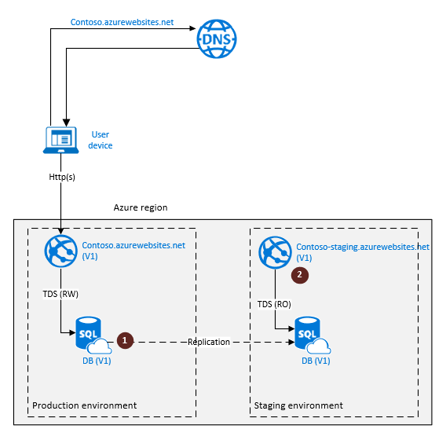
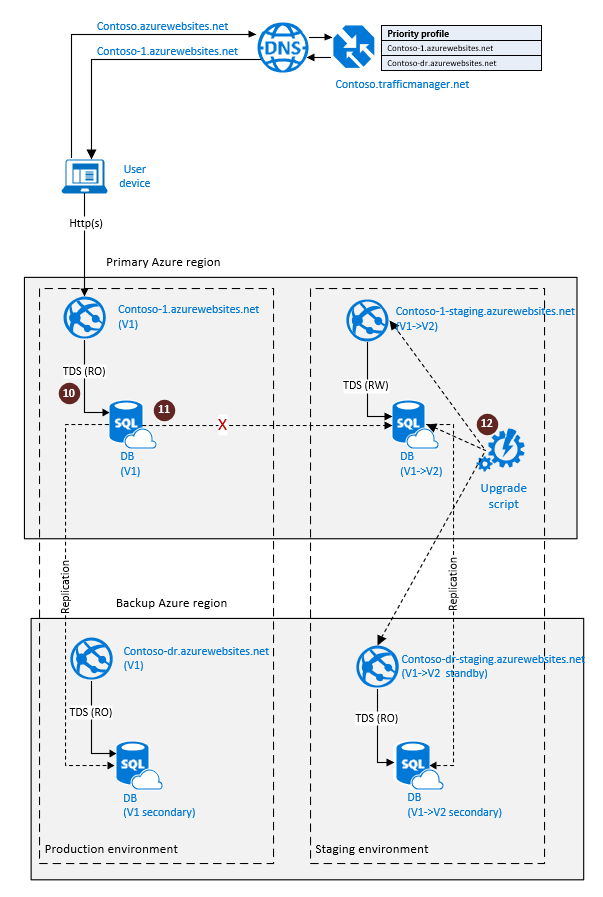

# Manage rolling upgrades of cloud applications by using SQL Database active geo-replication

Learn how to use [active geo-replication](sql-database-auto-failover-group.md) in Azure SQL Database to enable rolling upgrades of your cloud application. Because upgrades are disruptive operations, they should be part of your business-continuity planning and design. In this article, we look at two different methods of orchestrating the upgrade process and discuss the benefits and tradeoffs of each option. For the purposes of this article, we refer to an application that consists of a website that's connected to a single database as its data tier. Our goal is to upgrade version 1 (V1) of the application to version 2 (V2) without any significant impact on the user experience.

When evaluating upgrade options, consider these factors:

* Impact on application availability during upgrades, such as how long application functions might be limited or degraded.
* Ability to roll back if the upgrade fails.
* Vulnerability of the application if an unrelated, catastrophic failure occurs during the upgrade.
* Total dollar cost. This factor includes additional database redundancy and incremental costs of the temporary components used by the upgrade process.

## Upgrade applications that rely on database backups for disaster recovery

If your application relies on automatic database backups and uses geo-restore for disaster recovery, it's deployed to a single Azure region. To minimize user disruption, create a staging environment in that region with all the application components involved in the upgrade. The first diagram illustrates the operational environment before the upgrade process. The endpoint `contoso.azurewebsites.net` represents a production environment of the web app. To be able to roll back the upgrade, you must create a staging environment with a fully synchronized copy of the database. Follow these steps to create a staging environment for the upgrade:

1. Create a secondary database in the same Azure region. Monitor the secondary to see if the seeding process is complete (1).
2. Create a new environment for your web app and call it 'Staging'. It will be registered in Azure DNS with the URL `contoso-staging.azurewebsites.net` (2).

> [!NOTE]
> These preparation steps won't impact the production environment, which can function in full-access mode.



When the preparation steps are complete, the application is ready for the actual upgrade. The next diagram illustrates the steps involved in the upgrade process:

1. Set the primary database to read-only mode (3). This mode guarantees that the production environment of the web app (V1) remains read-only during the upgrade, thus preventing data divergence between the V1 and V2 database instances.
2. Disconnect the secondary database by using the planned termination mode (4). This action creates a fully synchronized, independent copy of the primary database. This database will be upgraded.
3. Turn the secondary database to read-write mode and run the upgrade script (5).


If the upgrade finishes successfully, you're now ready to switch users to the upgraded copy the application, which becomes a production environment. Switching involves a few more steps, as illustrated in the next diagram:

1. Activate a swap operation between production and staging environments of the web app (6). This operation switches the URLs of the two environments. Now `contoso.azurewebsites.net` points to the V2 version of the web site and the database (production environment). 
2. If you no longer need the V1 version, which became a staging copy after the swap, you can decommission the staging environment (7).


If the upgrade process is unsuccessful (for example, due to an error in the upgrade script), consider the staging environment to be compromised. To roll back the application to the pre-upgrade state, revert the application in the production environment to full access. The next diagram shows the reversion steps:

1. Set the database copy to read-write mode (8). This action restores the full V1 functionality of the production copy.
2. Perform the root-cause analysis and decommission the staging environment (9).

At this point, the application is fully functional, and you can repeat the upgrade steps.

> [!NOTE]
> The rollback doesn't require DNS changes because you did not yet perform a swap operation.


The key advantage of this option is that you can upgrade an application in a single region by following a set of simple steps. The dollar cost of the upgrade is relatively low. 

The main tradeoff is that, if a catastrophic failure occurs during the upgrade, the recovery to the pre-upgrade state involves redeploying the application in a different region and restoring the database from backup by using geo-restore. This process results in significant downtime.

## Upgrade applications that rely on database geo-replication for disaster recovery

If your application uses active geo-replication or auto-failover groups for business continuity, it's deployed to at least two different regions. There's an active, primary database in a primary region and a read-only, secondary database in a backup region. Along with the factors mentioned at the beginning of this article, the upgrade process must also guarantee that:

* The application remains protected from catastrophic failures at all times during the upgrade process.
* The geo-redundant components of the application are upgraded in parallel with the active components.

To achieve these goals, in addition to using the Web Apps environments, you'll take advantage of Azure Traffic Manager by using a failover profile with one active endpoint and one backup endpoint. The next diagram illustrates the operational environment prior to the upgrade process. The web sites `contoso-1.azurewebsites.net` and `contoso-dr.azurewebsites.net` represent a production environment of the application with full geographic redundancy. The production environment includes the following components:

* The production environment of the web app `contoso-1.azurewebsites.net` in the primary region (1)
* The primary database in the primary region (2)
* A standby instance of the web app in the backup region (3)
* The geo-replicated secondary database in the backup region (4)
* A Traffic Manager performance profile with an online endpoint called `contoso-1.azurewebsites.net` and an offline endpoint called `contoso-dr.azurewebsites.net`

To make it possible to roll back the upgrade, you must create a staging environment with a fully synchronized copy of the application. Because you need to ensure that the application can quickly recover in case a catastrophic failure occurs during the upgrade process, the staging environment must be geo-redundant also. The following steps are required to create a staging environment for the upgrade:

1. Deploy a staging environment of the web app in the primary region (6).
2. Create a secondary database in the primary Azure region (7). Configure the staging environment of the web app to connect to it. 
3. Create another geo-redundant, secondary database in the backup region by replicating the secondary database in the primary region. (This method is called *chained geo-replication*.) (8).
4. Deploy a staging environment of the web app instance in the backup region (9) and configure it to connect the geo-redundant secondary database created at (8).

> [!NOTE]
> These preparation steps won't impact the application in the production environment. It will remain fully functional in read-write mode.


When the preparation steps are complete, the staging environment is ready for the upgrade. The next diagram illustrates these upgrade steps:

1. Set the primary database in the production environment to read-only mode (10). This mode guarantees that the production database (V1) won't change during the upgrade, thus preventing the data divergence between the V1 and V2 database instances.

```sql
-- Set the production database to read-only mode
ALTER DATABASE <Prod_DB>
SET (ALLOW_CONNECTIONS = NO)
```

2. Terminate geo-replication by disconnecting the secondary (11). This action creates an independent but fully synchronized copy of the production database. This database will be upgraded. The following example uses Transact-SQL but [PowerShell](/powershell/module/az.sql/remove-azsqldatabasesecondary?view=azps-1.5.0) is also available. 

```sql
-- Disconnect the secondary, terminating geo-replication
ALTER DATABASE <Prod_DB>
REMOVE SECONDARY ON SERVER <Partner-Server>
```

3. Run the upgrade script against `contoso-1-staging.azurewebsites.net`, `contoso-dr-staging.azurewebsites.net`, and the staging primary database (12). The database changes will be replicated automatically to the staging secondary.



If the upgrade finishes successfully, you're now ready to switch users to the V2 version of the application. The next diagram illustrates the steps involved:

1. Activate a swap operation between production and staging environments of the web app in the primary region (13) and in the backup region (14). V2 of the application now becomes a production environment, with a redundant copy in the backup region.
2. If you no longer need the V1 application (15 and 16), you can decommission the staging environment.


If the upgrade process is unsuccessful (for example, due to an error in the upgrade script), consider the staging environment to be in an inconsistent state. To roll back the application to the pre-upgrade state, revert to using V1 of the application in the production environment. The required steps are shown on the next diagram:

1. Set the primary database copy in the production environment to read-write mode (17). This action restores full V1 functionality in the production environment.
2. Perform the root-cause analysis and repair or remove the staging environment (18 and 19).

At this point, the application is fully functional, and you can repeat the upgrade steps.

> [!NOTE]
> The rollback doesn't require DNS changes because you didn't perform a swap operation.


The key advantage of this option is that you can upgrade both the application and its geo-redundant copy in parallel without compromising your business continuity during the upgrade.

The main tradeoff is that it requires double redundancy of each application component and therefore incurs higher dollar cost. It also involves a more complicated workflow.

## Summary

The two upgrade methods described in the article differ in complexity and dollar cost, but they both focus on minimizing how long the user is limited to read-only operations. That time is directly defined by the duration of the upgrade script. It doesn't depend on the database size, the service tier you chose, the website configuration, or other factors that you can't easily control. All preparation steps are decoupled from the upgrade steps and don't impact the production application. The efficiency of the upgrade script is a key factor that determines the user experience during upgrades. So, the best way to improve that experience is to focus your efforts on making the upgrade script as efficient as possible.

## Next steps

* For a business continuity overview and scenarios, see [Business continuity overview](sql-database-business-continuity.md).
* To learn about Azure SQL Database active geo-replication, see [Create readable secondary databases using active geo-replication](sql-database-active-geo-replication.md).
* To learn about Azure SQL Database auto-failover groups, see [Use auto-failover groups to enable transparent and coordinated failover of multiple databases](sql-database-auto-failover-group.md).
* To learn about staging environments in Azure App Service, see [Set up staging environments in Azure App Service](../app-service/deploy-staging-slots.md).
* To learn about Azure Traffic Manager profiles, see [Manage an Azure Traffic Manager profile](../traffic-manager/traffic-manager-manage-profiles.md).
