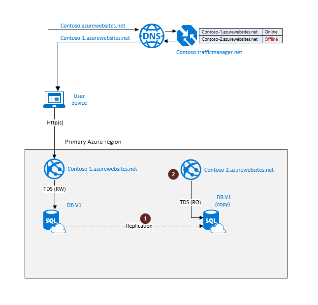
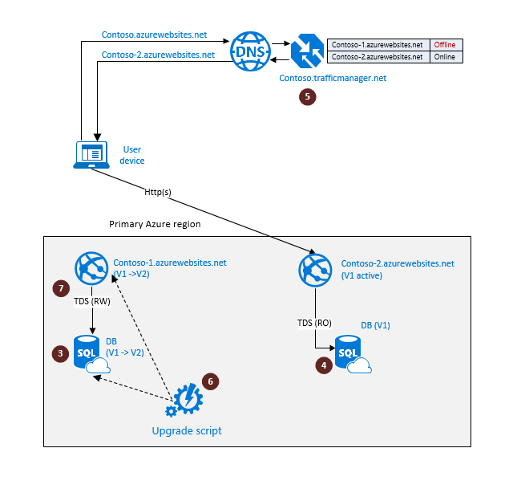
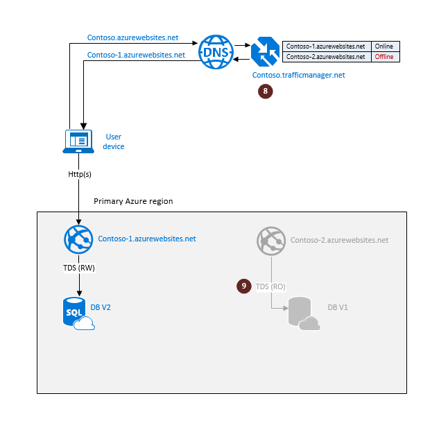
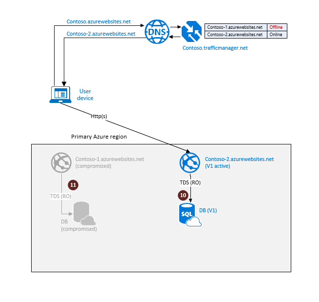
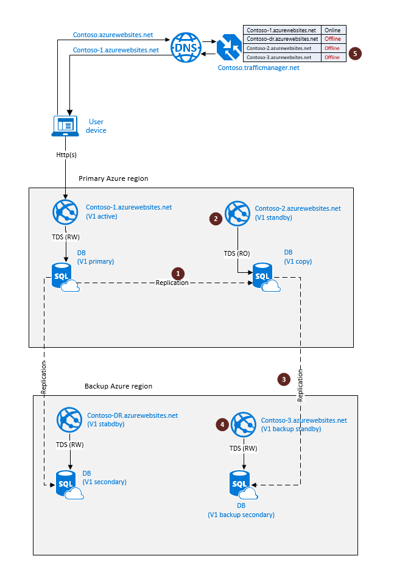
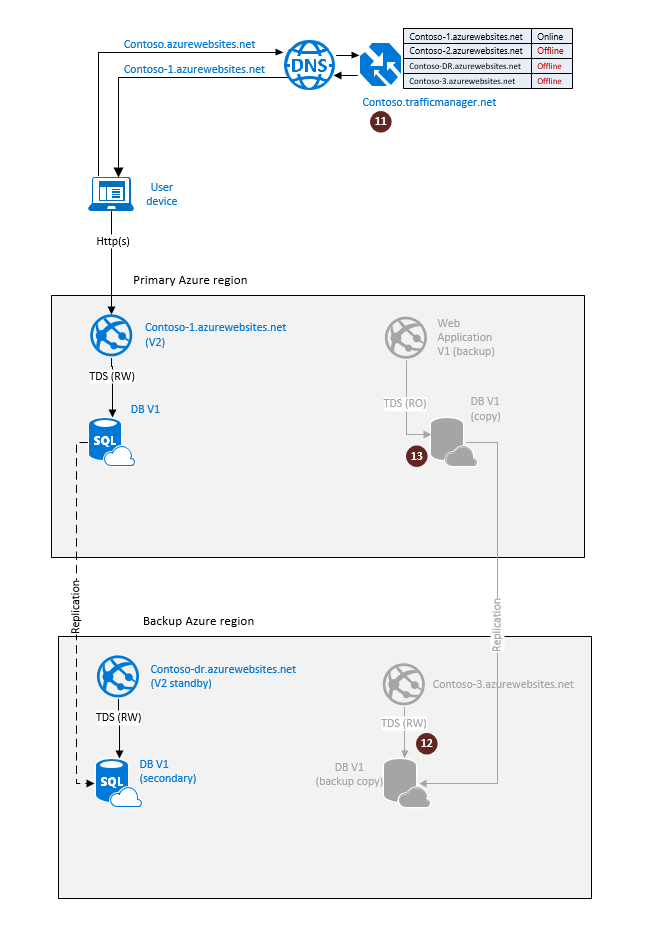
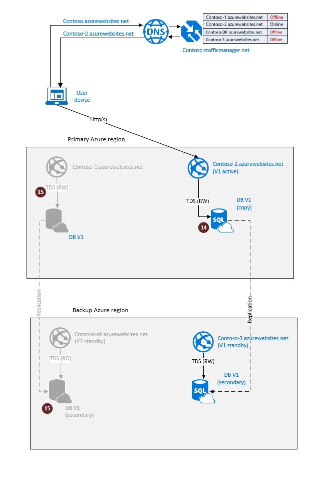

<properties
   pageTitle="Cloud disaster recovery solutions - SQL Database Active Geo-Replication | Microsoft Azure"
   description="Learn how to use Azure SQL Database geo-replication to support online upgrades of your cloud application."
   services="sql-database"
   documentationCenter=""
   authors="anosov1960"
   manager="jhubbard"
   editor="monicar"/>

<tags
   ms.service="sql-database"
   ms.devlang="NA"
   ms.topic="article"
   ms.tgt_pltfrm="NA"
   ms.workload="sqldb-bcdr"
   ms.date="06/16/2016"
   ms.author="sashan"/>

# Managing rolling upgrades of cloud applications using SQL Database Active Geo-Replication

> [AZURE.NOTE] [Active Geo-Replication](sql-database-geo-replication-overview.md) is now available for all databases in all tiers.

Learn how to use [Geo-Replication](sql-database-geo-replication-overview.md) in SQL Database to enable rolling upgrades of your cloud application. Because upgrade is a disruptive operation, it should be part of your business continuity planning and design. In this article we look at two different methods of orchestrating the upgrade process, and discuss the benefits and trade-offs of each option. For the purposes of this article we will use a simple application that consists of a web site connected to a single database as its data tier. Our goal is to upgrade version 1 of the application to version 2 without any significant impact on the end user experience. 

When evaluating the upgrade options you should consider the following factors:

+ Impact on application availability during upgrades. How long the application function may be limited or degraded.
+ Ability to roll back in case of an upgrade failure.
+ Vulnerability of the application if an unrelated catastrophic failure occurs during the upgrade.
+ Total dollar cost.  This includes additional redundancy and incremental costs of the temporary components  used by the upgrade process. 

## Upgrading applications that rely on database backups for disaster recovery 

If your application relies on automatic database backups and uses geo-restore for disaster recovery, it is usually deployed to a single Azure region. In this case the upgrade process involves creating a backup deployment of all application components involved in the upgrade. To minimize the end-user disruption you will leverage Azure Traffic Manager (WATM) with the failover profile.  The following diagram illustrates the operational environment prior to the upgrade process. The endpoint <i>contoso-1.azurewebsites.net</i> represents a production slot of the application that needs to be upgraded. To enable the ability to rollback the upgrade, you need create a stage slot with a fully synchronized copy of the application. The following steps are required to prepare the application for the upgrade:

1.  Create a stage slot for the upgrade. To do that create a secondary database (1) and deploy a identical web site in the same Azure region. Monitor the secondary to see if the seeding process is completed.
3.  Create a failover profile in WATM with <i>contoso-1.azurewebsites.net</i> as online endpoint and <i>contoso-2.azurewebsites.net</i> as offline. 

> [AZURE.NOTE] Note the preparation steps will not impact the application in the production slot and it can function in full access mode.

Once the preparation steps are completed the application is ready for the actual upgrade. The following diagram illustrates the steps involved in the upgrade process. 

1. Set the primary database in the production slot to read-only mode (3). This will guarantee that the production instance of the application (V1) will remain read-only during the upgrade thus preventing the data divergence between the V1 and V2 database instances.  
2. Disconnect the secondary database using the planned termination mode (4). It will create a fully synchronized independent copy of the primary database. This database will be upgraded.
3. Turn the primary database to read-write mode and run the upgrade script in the stage slot  (5).     

If the upgrade completed successfully you are now ready to switch the end users to the staged copy the application. It will now become the production slot of the application.  This involves a few more steps as illustrated on the following diagram.

1. Switch the online endpoint in the WATM profile to <i>contoso-2.azurewebsites.net</i>, which points to the V2 version of the web site (6). It now becomes the production slot with the V2 application and the end user traffic is directed to it.  
2. If you no longer need the V1 application components so you can safely remove them (7).   

If the upgrade process is unsuccessful, for example due to an error in the upgrade script, the stage slot should be considered compromised. To rollback the application to the pre-upgrade state you simply revert the application in the production slot to full access. The steps involved are shown on the next diagram.    

1. Set the database copy to read-write mode (8). This will restore the full V1 functionally in the production slot.
2. Perform the root cause analysis and remove the compromised components in the stage slot (9). 

At this point the application is fully functional and the upgrade steps can be repeated.

> [AZURE.NOTE] The rollback does not require changes in WATM profile as it already points to <i>contoso-1.azurewebsites.net</i> as the active endpoint.

The key **advantage** of this option is that you can upgrade a application in a single region using a set of simple steps. The dollar cost of the upgrade is relatively low. The main **tradeoff** is that if a catastrophic failure occurs during the upgrade the recovery to the pre-upgrade state will involve re-deployment of the application in a different region and restoring the database from backup using geo-restore. This process will result in significant downtime.   

## Upgrading applications that rely on database Geo-Replication for disaster recovery

If your application leverages Geo-Replication for business continuity, it is deployed  to at least two different regions with an active deployment in Primary region and a standby deployment in Backup region. In addition to the factors mentioned earlier, the upgrade process must guarantee that:

+ The application remains protected from catastrophic failures at all times during the upgrade process
+ The geo-redundant components of the application are upgraded in parallel with the active components

To achieve these goals you will leverage Azure Traffic Manager (WATM) using the failover profile with one active and three backup endpoints.  The following diagram illustrates the operational environment prior to the upgrade process. The web sites <i>contoso-1.azurewebsites.net</i> and <i>contoso-dr.azurewebsites.net</i> represent a production slot of the application with full geographic redundancy. To enable the ability to rollback the upgrade, you need create a stage slot with a fully synchronized copy of the application. Because you you need to ensure that the application can quickly recover in case a catastrophic failure occurs during the upgrade process the stage slot needs to be geo-redundant as well. The following steps are required to prepare the application for the upgrade:

1.  Create a stage slot for the upgrade. To do that create a secondary database (1) and deploy a identical copy of the web site in the same Azure region . Monitor the secondary to see if the seeding process is completed.
2.  Create a geo-redundant secondary database in the stage slot by geo-replicating the secondary database to the backup region (this is called "chained geo-replication"). Monitor the backup secondary to see if the seeding process is completed (3).
3.  Create a standby copy of the web site in the backup region and link it to the geo-redundant secondary (4).  
4.  Add the additional endpoints <i>contoso-2.azurewebsites.net</i> and <i>contoso-3.azurewebsites.net</i> to the failover profile in WATM as offline endpoints (5). 

> [AZURE.NOTE] Note the preparation steps will not impact the application in the production slot and it can function in full access mode.

Once the preparation steps are completed, the stage slot is ready for the upgrade. The following diagram illustrates the upgrade steps.

1. Set the primary database in the production slot to read-only mode (6). This will guarantee that the production instance of the application (V1) will remain read-only during the upgrade thus preventing the data divergence between the V1 and V2 database instances.  
2. Disconnect the secondary database in the same region using the planned termination mode (7). It will create a fully synchronized independent copy of the primary database, which will automatically become a primary after the termination. This database will be upgraded.
3. Turn the primary database in the stage slot to read-write mode and run the upgrade script (8).    

If the upgrade completed successfully you are now ready to switch the end users to the V2 version of the application. The following diagram illustrates the steps involved.

1. Switch the active endpoint in the WATM profile to <i>contoso-2.azurewebsites.net</i>, which now points to the V2 version of the web site (9). It now becomes a production slot with the V2 application and end user traffic is directed to it. 
2. If you no longer need the V1 application so you can safely remove it (10 and 11).  

If the upgrade process is unsuccessful, for example due to an error in the upgrade script, the stage slot should be considered compromised. To rollback the application to the pre-upgrade state you simply revert to using the application in the production slot with full access. The steps involved are shown on the next diagram.    

1. Set the primary database copy in the production slot to read-write mode (12). This will restore the full V1 functionally in the production slot.
2. Perform the root cause analysis and remove the compromised components in the stage slot (13 and 14). 

At this point the application is fully functional and the upgrade steps can be repeated.

> [AZURE.NOTE] The rollback does not require changes in WATM profile as it already points to  <i>contoso-1.azurewebsites.net</i> as the active endpoint.

The key **advantage** of this option is that you can upgrade both the application and its geo-redundant copy in parallel without compromising your business continuity during the upgrade. The main **tradeoff** is that it requires double redundancy of each application component and therefore incurs higher dollar cost. It also involves a more complicated workflow. 

## Summary

The two upgrade methods described in the article differ in complexity and the dollar cost but they both focus on minimizing the time when the end user is limited to read-only operations. That time is directly defined by the duration of the upgrade script. It does not depend on the database size, the service tier you chose, the web site configuration and other factors that you cannot easily control. This is because all the preparation steps are decoupled from the upgrade steps and can be done without impacting the production application. The efficiency of the upgrade script is the key factor that determines the end-user experience during upgrades. So the best way you can improve it is by focusing your efforts on making the upgrade script as efficient as possible.  

## Next steps

- To learn about Azure SQL Database automated backups, see [SQL Database automated backups](sql-database-automated-backups.md)
- To learn about business continuity design and recovery scenarios, see [Continuity scenarios](sql-database-business-continuity-scenarios.md)
- To learn about using automated backups for recovery, see [restore a database from the service-initiated backups](sql-database-recovery-using-backups.md)
- To learn about faster recovery options, see [Active-Geo-Replication](sql-database-geo-replication-overview.md)  
- To learn about using automated backups for archiving, see [database copy](sql-database-copy.md)

## Additionale Resources

The following pages will help you learn about the specific operations required to implement the upgrade workflow:

- [Add secondary database](https://msdn.microsoft.com/library/azure/mt603689.aspx) 
- [Failover database to secondary](https://msdn.microsoft.com/library/azure/mt619393.aspx)
- [Disconnect Geo-Replication secondary](https://msdn.microsoft.com/library/azure/mt603457.aspx)
- [Geo-restore database](https://msdn.microsoft.com/library/azure/mt693390.aspx) 
- [Drop database](https://msdn.microsoft.com/library/azure/mt619368.aspx)
- [Copy database](https://msdn.microsoft.com/library/azure/mt603644.aspx)
- [Set database to read-only or read-write mode](https://msdn.microsoft.com/library/bb522682.aspx)

