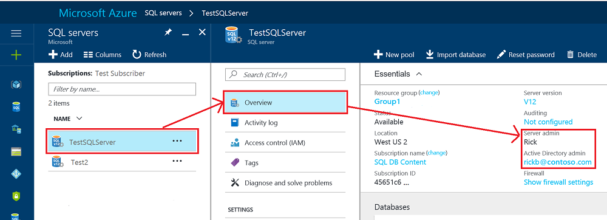
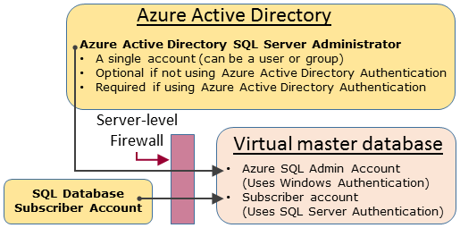
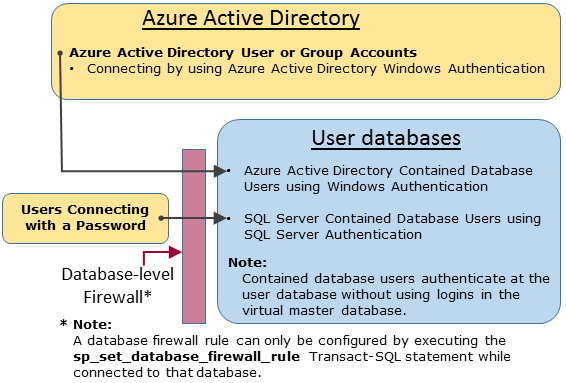

# Controlling and granting database access to SQL Database and SQL Data Warehouse

After firewall rules configuration, you can connect to Azure [SQL Database](sql-database-technical-overview.md) and [SQL Data Warehouse](../sql-data-warehouse/sql-data-warehouse-overview-what-is.md) as one of the administrator accounts, as the database owner, or as a database user in the database.  

>  [!NOTE]  
>  This topic applies to Azure SQL server, and to SQL Database and SQL Data Warehouse databases created on the Azure SQL server. For simplicity, SQL Database is used when referring to both SQL Database and SQL Data Warehouse. 

> [!TIP]
> For a tutorial, see [Secure your Azure SQL Database](sql-database-security-tutorial.md).

## Unrestricted administrative accounts
There are two administrative accounts (**Server admin** and **Active Directory admin**) that act as administrators. To identify these administrator accounts for your SQL server, open the Azure portal, and navigate to the properties of your SQL server.



- **Server admin**   
When you create an Azure SQL server, you must designate a **Server admin login**. SQL server creates that account as a login in the master database. This account connects using SQL Server authentication (user name and password). Only one of these accounts can exist.   
- **Azure Active Directory admin**   
One Azure Active Directory account, either an individual or security group account, can also be configured as an administrator. It is optional to configure an Azure AD administrator, but an Azure AD administrator **must** be configured if you want to use Azure AD accounts to connect to SQL Database. For more information about configuring Azure Active Directory access, see [Connecting to SQL Database or SQL Data Warehouse By Using Azure Active Directory Authentication](sql-database-aad-authentication.md) and [SSMS support for Azure AD MFA with SQL Database and SQL Data Warehouse](sql-database-ssms-mfa-authentication.md).
 

The **Server admin** and **Azure AD admin** accounts has the following characteristics:
- Are the only accounts that can automatically connect to any SQL Database on the server. (To connect to a user database, other accounts must either be the owner of the database, or have a user account in the user database.)
- These accounts enter user databases as the `dbo` user and they have all the permissions in the user databases. (The owner of a user database also enters the database as the `dbo` user.) 
- Do not enter the `master` database as the `dbo` user, and have limited permissions in master. 
- Are **not** members of the standard SQL Server `sysadmin` fixed server role, which is not available in SQL database.  
- Can create, alter, and drop databases, logins, users in master, and server-level firewall rules.
- Can add and remove members to the `dbmanager` and `loginmanager` roles.
- Can view the `sys.sql_logins` system table.

### Configuring the firewall
When the server-level firewall is configured for an individual IP address or range, the **SQL server admin** and the **Azure Active Directory admin** can connect to the master database and all the user databases. The initial server-level firewall can be configured through the [Azure portal](sql-database-get-started-portal.md), using [PowerShell](sql-database-powershell-samples.md) or using the [REST API](https://msdn.microsoft.com/library/azure/dn505712.aspx). Once a connection is made, additional server-level firewall rules can also be configured by using [Transact-SQL](sql-database-configure-firewall-settings.md).

### Administrator access path
When the server-level firewall is properly configured, the **SQL server admin** and the **Azure Active Directory admin** can connect using client tools such as SQL Server Management Studio or SQL Server Data Tools. Only the latest tools provide all the features and capabilities. The following diagram shows a typical configuration for the two administrator accounts.



When using an open port in the server-level firewall, administrators can connect to any SQL Database.

### Connecting to a database by using SQL Server Management Studio
For a walk-through of creating a server, a database, server-level firewall rules, and using SQL Server Management Studio to query a database, see [Get started with Azure SQL Database servers, databases, and firewall rules by using the Azure portal and SQL Server Management Studio](sql-database-get-started-portal.md).

> [!IMPORTANT]
> It is recommended that you always use the latest version of Management Studio to remain synchronized with updates to Microsoft Azure and SQL Database. [Update SQL Server Management Studio](https://msdn.microsoft.com/library/mt238290.aspx).


## Additional server-level administrative roles
In addition to the server-level administrative roles discussed previously, SQL Database provides two restricted administrative roles in the master database to which user accounts can be added that grant permissions to either create databases or manage logins.

### Database creators
One of these administrative roles is the **dbmanager** role. Members of this role can create new databases. To use this role, you create a user in the `master` database and then add the user to the **dbmanager** database role. To create a database, the user must be a user based on a SQL Server login in the master database or contained database user based on an Azure Active Directory user.

1. Using an administrator account, connect to the master database.
2. Optional step: Create a SQL Server authentication login, using the [CREATE LOGIN](https://msdn.microsoft.com/library/ms189751.aspx) statement. Sample statement:
   
   ```sql
   CREATE LOGIN Mary WITH PASSWORD = '<strong_password>';
   ```
   
   > [!NOTE]
   > Use a strong password when creating a login or contained database user. For more information, see [Strong Passwords](https://msdn.microsoft.com/library/ms161962.aspx).
    
   To improve performance, logins (server-level principals) are temporarily cached at the database level. To refresh the authentication cache, see [DBCC FLUSHAUTHCACHE](https://msdn.microsoft.com/library/mt627793.aspx).

3. In the master database, create a user by using the [CREATE USER](https://msdn.microsoft.com/library/ms173463.aspx) statement. The user can be an Azure Active Directory authentication contained database user (if you have configured your environment for Azure AD authentication), or a SQL Server authentication contained database user, or a SQL Server authentication user based on a SQL Server authentication login (created in the previous step.) Sample statements:
   
   ```sql
   CREATE USER [mike@contoso.com] FROM EXTERNAL PROVIDER; -- To create a user with Azure Active Directory
   CREATE USER Ann WITH PASSWORD = '<strong_password>'; -- To create a SQL Database contained database user
   CREATE USER Mary FROM LOGIN Mary;  -- To create a SQL Server user based on a SQL Server authentication login
   ```

4. Add the new user, to the **dbmanager** database role by using the [ALTER ROLE](https://msdn.microsoft.com/library/ms189775.aspx) statement. Sample statements:
   
   ```sql
   ALTER ROLE dbmanager ADD MEMBER Mary; 
   ALTER ROLE dbmanager ADD MEMBER [mike@contoso.com];
   ```
   
   > [!NOTE]
   > The dbmanager is a database role in master database so you can only add a database user to the dbmanager role. You cannot add a server-level login to database-level role.
    
5. If necessary, configure a firewall rule to allow the new user to connect. (The new user might be covered by an existing firewall rule.)

Now the user can connect to the master database and can create new databases. The account creating the database becomes the owner of the database.

### Login managers
The other administrative role is the login manager role. Members of this role can create new logins in the master database. If you wish, you can complete the same steps (create a login and user, and add a user to the **loginmanager** role) to enable a user to create new logins in the master. Usually logins are not necessary as Microsoft recommends using contained database users, which authenticate at the database-level instead of using users based on logins. For more information, see [Contained Database Users - Making Your Database Portable](https://msdn.microsoft.com/library/ff929188.aspx).

## Non-administrator users
Generally, non-administrator accounts do not need access to the master database. Create contained database users at the database level using the [CREATE USER (Transact-SQL)](https://msdn.microsoft.com/library/ms173463.aspx) statement. The user can be an Azure Active Directory authentication contained database user (if you have configured your environment for Azure AD authentication), or a SQL Server authentication contained database user, or a SQL Server authentication user based on a SQL Server authentication login (created in the previous step.) For more information, see [Contained Database Users - Making Your Database Portable](https://msdn.microsoft.com/library/ff929188.aspx). 

To create users, connect to the database, and execute statements similar to the following examples:

```sql
CREATE USER Mary FROM LOGIN Mary; 
CREATE USER [mike@contoso.com] FROM EXTERNAL PROVIDER;
```

Initially, only one of the administrators or the owner of the database can create users. To authorize additional users to create new users, grant that selected user the `ALTER ANY USER` permission, by using a statement such as:

```sql
GRANT ALTER ANY USER TO Mary;
```

To give additional users full control of the database, make them a member of the **db_owner** fixed database role using the `ALTER ROLE` statement.

```sql
ALTER ROLE db_owner ADD MEMBER Mary; 
```

> [!NOTE]
> One common reason to create a database user based on a logical server login is for users that need access to multiple databases. Since contained database users are individual entities, each database maintains its own user and its own password. This can cause overhead as the user must then remember each password for each database, and it can become untenable when having to change multiple passwords for many databases. However, when using SQL Server Logins and high availability (active geo-replication and failover groups), the SQL Server logins must be set manually at each server. Otherwise, the database user will no longer be mapped to the server login after a failover occurs, and will not be able to access the database post failover. For more information on configuring logins for geo-replication, please see  [Configure and manage Azure SQL Database security for geo-restore or failover](sql-database-geo-replication-security-config.md).

### Configuring the database-level firewall
As a best practice, non-administrator users should only have access through the firewall to the databases that they use. Instead of authorizing their IP addresses through the server-level firewall and giving them access to all databases, use the [sp_set_database_firewall_rule](https://msdn.microsoft.com/library/dn270010.aspx) statement to configure the database-level firewall. The database-level firewall cannot be configured by using the portal.

### Non-administrator access path
When the database-level firewall is properly configured, the database users can connect using client tools such as SQL Server Management Studio or SQL Server Data Tools. Only the latest tools provide all the features and capabilities. The following diagram shows a typical non-administrator access path.



## Groups and roles
Efficient access management uses permissions assigned to groups and roles instead of individual users. 

- When using Azure Active Directory authentication, put Azure Active Directory users into an Azure Active Directory group. Create a contained database user for the group. Place one or more database users into a [database role](https://msdn.microsoft.com/library/ms189121) and then assign [permissions](https://msdn.microsoft.com/library/ms191291.aspx) to the database role.

- When using SQL Server authentication, create contained database users in the database. Place one or more database users into a [database role](https://msdn.microsoft.com/library/ms189121) and then assign [permissions](https://msdn.microsoft.com/library/ms191291.aspx) to the database role.

The database roles can be the built-in roles such as **db_owner**, **db_ddladmin**, **db_datawriter**, **db_datareader**, **db_denydatawriter**, and **db_denydatareader**. **db_owner** is commonly used to grant full permission to only a few users. The other fixed database roles are useful for getting a simple database in development quickly, but are not recommended for most production databases. For example, the **db_datareader** fixed database role grants read access to every table in the database, which is usually more than is strictly necessary. It is far better to use the [CREATE ROLE](https://msdn.microsoft.com/library/ms187936.aspx) statement to create your own user-defined database roles and carefully grant each role the least permissions necessary for the business need. When a user is a member of multiple roles, they aggregate the permissions of them all.

## Permissions
There are over 100 permissions that can be individually granted or denied in SQL Database. Many of these permissions are nested. For example, the `UPDATE` permission on a schema includes the `UPDATE` permission on each table within that schema. As in most permission systems, the denial of a permission overrides a grant. Because of the nested nature and the number of permissions, it can take careful study to design an appropriate permission system to properly protect your database. Start with the list of permissions at [Permissions (Database Engine)](https://docs.microsoft.com/sql/relational-databases/security/permissions-database-engine) and review the [poster size graphic](https://docs.microsoft.com/sql/relational-databases/security/media/database-engine-permissions.png) of the permissions.


### Considerations and restrictions
When managing logins and users in SQL Database, consider the following:

* You must be connected to the **master** database when executing the `CREATE/ALTER/DROP DATABASE` statements.   
* The database user corresponding to the **Server admin** login cannot be altered or dropped. 
* US-English is the default language of the **Server admin** login.
* Only the administrators (**Server admin** login or Azure AD administrator) and the members of the **dbmanager** database role in the **master** database have permission to execute the `CREATE DATABASE` and `DROP DATABASE` statements.
* You must be connected to the master database when executing the `CREATE/ALTER/DROP LOGIN` statements. However using logins is discouraged. Use contained database users instead.
* To connect to a user database, you must provide the name of the database in the connection string.
* Only the server-level principal login and the members of the **loginmanager** database role in the **master** database have permission to execute the `CREATE LOGIN`, `ALTER LOGIN`, and `DROP LOGIN` statements.
* When executing the `CREATE/ALTER/DROP LOGIN` and `CREATE/ALTER/DROP DATABASE` statements in an ADO.NET application, using parameterized commands is not allowed. For more information, see [Commands and Parameters](https://msdn.microsoft.com/library/ms254953.aspx).
* When executing the `CREATE/ALTER/DROP DATABASE` and `CREATE/ALTER/DROP LOGIN` statements, each of these statements must be the only statement in a Transact-SQL batch. Otherwise, an error occurs. For example, the following Transact-SQL checks whether the database exists. If it exists, a `DROP DATABASE` statement is called to remove the database. Because the `DROP DATABASE` statement is not the only statement in the batch, executing the following Transact-SQL statement results in an error.

  ```sql
  IF EXISTS (SELECT [name]
           FROM   [sys].[databases]
           WHERE  [name] = N'database_name')
  DROP DATABASE [database_name];
  GO
  ```

* When executing the `CREATE USER` statement with the `FOR/FROM LOGIN` option, it must be the only statement in a Transact-SQL batch.
* When executing the `ALTER USER` statement with the `WITH LOGIN` option, it must be the only statement in a Transact-SQL batch.
* To `CREATE/ALTER/DROP` a user requires the `ALTER ANY USER` permission on the database.
* When the owner of a database role tries to add or remove another database user to or from that database role, the following error may occur: **User or role 'Name' does not exist in this database.** This error occurs because the user is not visible to the owner. To resolve this issue, grant the role owner the `VIEW DEFINITION` permission on the user. 


## Next steps

- To learn more about firewall rules, see [Azure SQL Database Firewall](sql-database-firewall-configure.md).
- For an overview of all the SQL Database security features, see [SQL security overview](sql-database-security-overview.md).
- For a tutorial, see [Secure your Azure SQL Database](sql-database-security-tutorial.md).
- For information about views and stored procedures, see [Creating views and stored procedures](https://msdn.microsoft.com/library/ms365311.aspx)
- For information about granting access to a database object, see [Granting Access to a Database Object](https://msdn.microsoft.com/library/ms365327.aspx)
